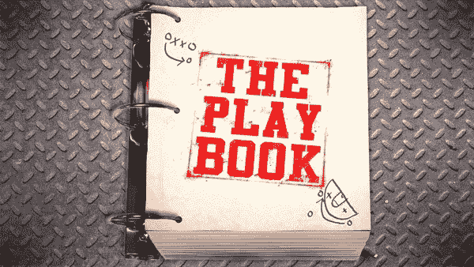

# 后区块链时代的融资最佳实践剧本

> 原文：<https://medium.com/hackernoon/the-best-practices-playbook-for-fundraising-in-a-post-blockchain-world-8398548f27be>

当我第一次写《掌握风险投资游戏》的时候，中本聪刚刚发布了他开创性的比特币白皮书。当时，没有人能想象到比特币和 T2 区块链 T3 的发明会给风险投资行业带来的变革性影响。

随着以太坊和支持智能合约的图灵完备平台的发明，创业公司可以在交付产品之前突然从一群投资者那里筹集资金，而不仅仅是几百个风险资本家。去年夏天，我写了关于[首次公开募股](/startup-grind/the-summer-of-icos-vc-implications-ead720e8efdd) (ICOs)对风险投资行业的影响。今年夏天，基于代币的融资科学发展如此之快，风险投资和众筹最佳实践的结合已经出现，这让我感到惊讶。

去年夏天，我投资的一家公司, [Enigma](https://enigma.co/) 只用三名员工和一份(写得非常好的)白皮书就完成了一个 4500 万美元的 ICO。像当时的许多公司一样，他们在之前的种子期只筹集了 100 万美元，还没有向市场推出任何软件。当时，他们并不孤单——初创公司在 ico 中筹集的资金比去年夏天的风险投资轮次还要多。在撰写本文时，自 2016 年发明以来，ico 已经筹集了超过 100 亿美元的资金。这笔钱似乎来得如此容易，以至于激进的企业家抓住了时机。

那些日子已经过去了。正如威廉·穆加耶(William Mougayar)正确观察到的，“唯一重要的令牌是实际使用的令牌。”美国证券交易委员会已经介入，提供了一些强有力的、谨慎的指导，尽管专业投资者和散户投资者仍然对区块链和 crypto 充满热情，但他们表现出了更多的谨慎。

如今，对于希望在后区块链时代遵循最佳融资实践的初创公司来说，一种新的剧本正在出现。要理解与区块链之前的对比，您首先必须理解以前的最佳实践行动手册是什么样的:

**融资剧本，前区块链**

*   种子轮:100 万至 200 万美元。从聪明、增值的天使或种子基金中筹集资金。产品上市前的适应性。建立团队并交付 MVP，以便进行一些实验来测试客户价值主张。进行一些走向市场的实验，也许是商业模式/定价实验。达到一些重要的创造价值的里程碑，如早期客户收入或至少参与度。
*   **首轮融资**:500 万至 1000 万美元。从专业公司募集资金。完成产品，与一些商业主管(第一个销售人员、第一个营销人员)一起完善团队，并使产品适应市场。开始开发可重复、可扩展的业务模型。站起来一个成长团队。
*   **B 系列**:1000 万到 3000 万美元。从专业的 B 轮/成长期公司融资。在您可重复、可扩展的业务模式上执行。超越最初的产品，在邻近地区提供多种产品。国际扩张。建立一个包括财务主管和客户服务/运营主管的高级管理团队。
*   C 系列:3000 万至 6000 万美元。从一家拥有良好、可信品牌的专业上市前公司募集资金，以协助上市过程。努力建立一个有利可图、可扩展的商业模式。跨多种产品、多渠道、多地域出色执行。完成一些并购以扩大你的产品覆盖范围。建立一个强大、独立的董事会，为 IPO 做准备。

在后区块链时代，剧本与区块链时代之前的世界相比发生了巨大的变化，也与去年夏天的活跃时期有所不同。如今，市场变得更具歧视性，迫使企业变得更加审慎和专业。最佳实践行动手册现在是这样的:

**融资剧本，后区块链**

*   **种子轮**。100 万至 200 万美元。从增值天使和专业种子基金中筹集资金，特别是那些在加密社区中具有强大声誉和信誉的基金。在种子期条款中包括代币转换选项，如果公司的商业模式更注重代币价值创造(公用事业、证券)而不是股权价值创造(收入模式、现金流)，则允许股权持有人根据自己的选择转换为代币(按照授权时间表)。这种选择倾向于以股权的比例所有权份额为基础。换句话说，如果投资者拥有 10%的完全稀释股票，他们将拥有 10%的股票转换期权，这些股票是该公司在财政部后 ICO 中持有的。建立团队并以技术白皮书的形式阐明产品路线图。专注于编写代码和构建测试网(即公测版)。理想情况下，利用现有平台(如 Ethereum、Cardano、NEO)将所需的新代码量降至最低。将你的愿景与该领域的长期趋势联系起来，争取思想领袖在 Twitter、Reddit、Medium 和会议上公开支持你。
*   **SAFT 或者外管局-T 或者 SAFTE** 。300 万至 600 万美元，带有预定义的“启动估价率”(即，美元转换为代币的加密估价上限)和折扣。不同律师可能使用的标签在某种程度上是可以互换的，但这种投资协议通常是以期权的形式与专业投资者购买未来代币或股权，这些投资者是传统风投和加密基金的混合。这份协议现在看起来非常像一份发行文件(由于最近的 SEC 指导)，有许多你可能在 IPO 样板文件中找到的条款，但显然不是注册证券，而是一份措辞谨慎的购买非注册投资证券的协议。企业家试图从精明的资金(最好是有助于 ICO 的好品牌)中筹集足够的资金，以超越技术团队，增加一名社区高管和投资者关系/业务发展。发布测试网，甚至可能在 mainnet 上发布代码的初始组件(也称为实时区块链)——不是整个产品路线图，但足以让开发人员社区有所收获并为之兴奋。建立你的社区基础设施(Telegram，Slack，Reddit，Twitter ),让你的社区经理招募并接触两类成员:开发者(最重要的)和投资者(次要但仍然重要的)。扩展并公开发布多年产品路线图和愿景。准备 ICO。
*   **ICO。2000 万至 2 亿美元。范围很广，但大多数顶级 ico 的目标是 1 亿至 3 亿美元的加密市值，这将使他们处于 50 至 150 个顶级令牌的范围内(根据 CoinMarketCap 的数据，在撰写本文时，#50 的交易金额超过 3 亿美元，#150 的交易金额为 7000 万美元)。因此，如果他们出售 50%的代币，他们可能会筹集 5000 万到 1 亿美元。在这个阶段，需要决定该项目是否满足 Howey 测试，从而旨在成为一个实用工具，或者应该是一个注册证券。由于美国证券交易委员会(SEC)最近的指导，越来越多的区块链项目倾向于与安全令牌发行(称为 STO)一致的完整发行和注册要求。也就是说，SEC 最近得出结论[以太坊是一个实用令牌](https://www.bloomberg.com/news/articles/2018-06-14/ether-surges-after-top-sec-official-says-it-s-not-a-security)，因此许多其他项目将在以太坊上模拟他们的设计，以避免被贴上安全令牌的标签。该团队需要是一个更加完整的团队——不像 IPO 团队那样成熟(例如，不需要 CFO ),但准备好处理开发人员招聘和支持，对商业模式有自己的观点，全面的财务和财务职能(你会用这些钱做什么？你将如何维护安全？你们的财政政策是什么？我们要为 ICO 收益缴纳多少税，何时缴纳？)和一个协助遵守的新兴法律职能。而一个真正的产品需要交付或者非常接近交付，客户和开发人员可以实际评估代码的质量(毕竟都是开源的)。**

这些进化点是一件好事。他们正在让初创公司放慢脚步，变得更加专业和负责，并交付具有一些实际效用的真正代码——而不仅仅是一份写得很好的白皮书和一个活跃的 Twitter 账户。一些公司可能会跳过 SAFT 这一步，直接从种子阶段进入 ICO 阶段(例如，我们的投资组合公司 [NEX](https://neonexchange.org/) 正在这样做)，但这需要一个非常特殊的团队来以如此快的速度实现足够多的里程碑。大多数公司将需要 2-4 年的时间做好充分准备，从开始到 ICO/STO 之旅。考虑到在过去的 15 年里，IPO 公司的平均年龄是 11 岁(我们的公司， [MongoDB](https://www.google.com/search?rlz=1C1CHZL_enUS738US738&q=NASDAQ:MDB&stick=H4sIAAAAAAAAAONgecRowS3w8sc9YSn9SWtOXmPU5OIKzsgvd80rySypFJLmYoOyBKX4uXj10_UNDdMMU1IK0_IMeQBn1xk6PQAAAA&sa=X&ved=0ahUKEwjpoIm8xsnbAhVHs1QKHbGwB7sQsRUIggIwGg&biw=1330&bih=628) ，只用了 10 年就完成了，这看起来非常危险！)，这次压缩对于创新的未来来说，仍然是一个惊人的发展。

许多悬而未决的问题依然存在，企业家和投资者还有更多的工作要做。例如，最棘手的问题之一是激励性薪酬。我们在向员工授予股票期权方面有数十年的经验，包括授予时间表、加速条款和各种行使价格流程和机制。代币式创业公司合适的激励薪酬结构是怎样的？是否有授权时间表，如果有，授权时间有多长？有什么税收影响？如果代币是记名证券，如何处理发行证券作为员工补偿？

对于后区块链时代的企业家和投资者来说，这是一个激动人心的时刻。我怀疑下一年将会带来类似的快速和意想不到的发展和演变！