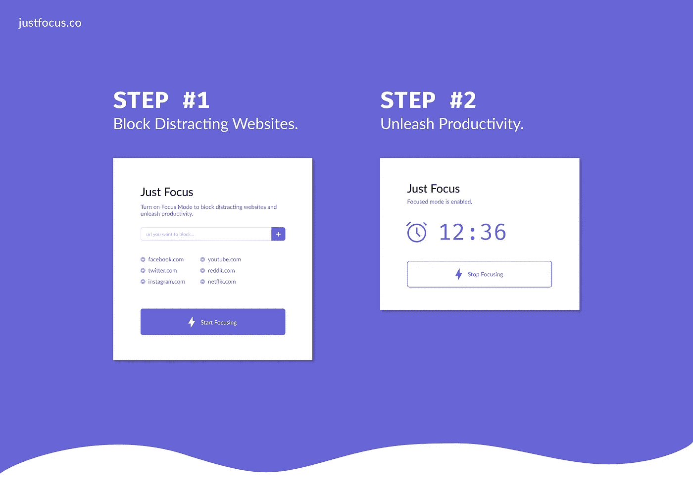

# 埃隆·马斯克、萨姆·奥特曼和马克·安德森的最佳生产力建议

> 原文：<https://medium.com/hackernoon/the-best-productivity-advice-from-elon-musk-sam-altman-and-marc-andreessen-a49f475222bf>

## 推出了[Just Focus](https://www.justfocus.co/)——一个阻止分散注意力的网站的扩展

时间是一种矛盾的宝贵资源。“我们剩下的时间”可以被描述为在性质上是有限的，但在范围上是无限的。我们无法理解生命的重要性。然而，我们都知道我们的日子有限。那么，我们如何真正充分利用我们的生命呢？

我已经尝试了几十种不同的策略来最大化生产力和最小化浪费。有些卓有成效，有些则彻底失败。

我认为，最重要的是，生产力是关于在你特定的目标和背景下，找到什么*适合你*。

最近，我真的对理解如何更好地专注于当下感兴趣——完全专注于手头的任务。这对我来说显然很简单，但却是非常有影响力的优先事项。事实证明 a)多任务几乎是不可能的；b)一次只做一件事实际上更有效率。

“一次专注于一件事”最难的一点是，互联网是一个无限的游乐场，有几十个游戏和东西可以浏览。虽然有时候…我只是想集中注意力！

## *所以我和几个朋友建了一个 chrome 扩展，对我来说非常有帮助…它叫做* [*只需关注*](https://www.justfocus.co/) *。*

## *它可以让你屏蔽掉令人分心的网站，这样你就可以* [*专注于自己的工作。*](https://www.justfocus.co/)

听着我的好奇心，我也花了一些时间去学习更多关于高产出的人如何安排他们的日子。虽然没有什么是规定的或保证有效的，但收集一些随机的提示和观点是非常有价值的。

# 以下是我从马克·安德森、埃隆·马斯克和萨姆·奥特曼那里学到的一些最喜欢的经验:

# [马克·安德森](https://medium.com/u/fa65e64cf273?source=post_page-----a49f475222bf--------------------------------)

马克·安德森在他的《个人生产力指南》中分享了许多关于生产力的想法。”

这是我最喜欢的摘录，围绕着“结构性拖延症”这个话题

> *这一个是* [***直接从斯坦福大学哲学教授约翰·佩里***](http://www.structuredprocrastination.com/) *的天才头脑中搬出来的。*
> 
> *读他的* [***原文描述***](http://www.structuredprocrastination.com/) *，无所不用其极。你甚至可以看到他在沙滩上用海藻练习跳绳的照片，而工作还在等着你。非常好。阅读约翰的文章是我一生中最深刻的时刻之一。*
> 
> 结构化拖延的要点是，你永远不应该与拖延的倾向作斗争——相反，你应该利用它来完成其他事情。
> 
> 一般来说，在一天当中，有一些你必须做的事情你没有做，因为你在拖延。
> 
> 当你拖延的时候，就去做许多其他的事情。
> 
> 正如约翰所说，“一个人头脑中的任务清单将按照重要性排序。看起来最紧急和最重要的任务在最上面。但是也有一些值得去做的事情。做这些任务变成了一种不去做清单上更重要的事情的方式。有了这种适当的任务结构，拖延者就成了有用的公民。事实上，拖延者甚至可以像我一样，获得一个完成很多事情的名声。”

# 埃隆·马斯克

埃隆·马斯克在给特斯拉员工的一封电子邮件中分享了他对“如何提高效率”的许多想法。

> 过多的会议是大公司的软肋，而且随着时间的推移，情况几乎总是会变得更糟。请取消所有大型会议，除非你确定这些会议对所有观众都有价值，在这种情况下，会议应该非常简短。”
> 
> *“也要改掉频繁开会的习惯，除非你在处理一件极其紧急的事情。一旦紧急事件得到解决，会面频率应该会迅速下降。”*
> 
> 一旦很明显你没有增加价值，就退出会议或挂断电话。离开不是无礼，让某人留下来浪费时间才是无礼。”
> 
> 沟通应该通过完成工作所需的最短路径，而不是通过“指挥链”。任何试图加强指挥链沟通的经理很快就会发现自己在别处工作。

# [山姆·奥特曼](https://medium.com/u/22acd7905c72?source=post_page-----a49f475222bf--------------------------------)

山姆·奥特曼有一篇关于他创造的更有效率的结构化文章。

> *我确保在我的时间表中留出足够的时间来思考该做些什么。对我来说，做到这一点的最好方法是阅读书籍，和有趣的人在一起，在大自然中度过时光。*
> 
> *顺便说一句，这是关于授权的重要一课:记住，当其他人做他们喜欢的事情，做你希望别人为你做的事情时，他们也是最有效率的——试着找出谁喜欢(并且擅长)做什么，并以这种方式授权。*
> 
> 我不为分类或试图确定任务大小之类的事情费心(我最多是在真正重要的项目旁边打个星号)。
> 
> 我试图以一种能产生动力的方式来区分轻重缓急。我做得越多，我感觉越好，然后我做得越多。我喜欢以我能真正取得进步的事情开始和结束每一天。
> 
> 另外，不要陷入生产力色情的陷阱——为了追求生产力而追求生产力是没有帮助的。许多人花了太多的时间去思考如何完美地优化他们的系统，而没有足够的时间去问他们是否在解决正确的问题。不管你使用什么系统，也不管你是否在做错误的事情时挤出了每一秒。
> 
> 正确的目标是优化分配你的一年，而不是一天。

感谢阅读！

## 查看[Just Focus](https://www.justfocus.co/)——一个免费的 chrome 扩展，用于阻止分散注意力的网站。

