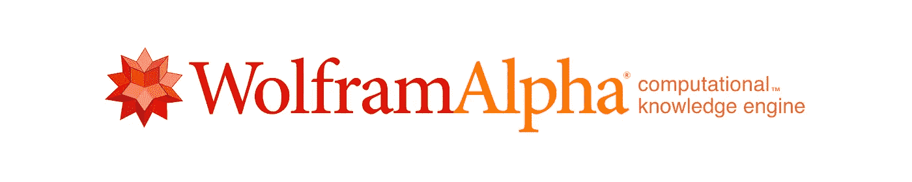

# 互联网上最好的搜索引擎

> 原文：<https://medium.com/hackernoon/the-best-search-engines-on-the-internet-9c0314250601>

这些是互联网上最流行的搜索引擎。它们的工作方式几乎完全相同:只需输入你的搜索，然后按回车键。但是它们都提供了稍微不同的结果和特性。大多数互联网浏览会话都是从搜索引擎开始的，试试这些搜索引擎，看看你是否能发现新的东西！

# 谷歌

谷歌是世界上[使用最多的搜索引擎](https://www.alexa.com/topsites/category/Computers/Internet/Searching/Search_Engines)。它每天处理数十亿次搜索。[谷歌的搜索引擎](https://en.wikipedia.org/wiki/Google_Search)有 123 种语言版本。这个搜索引擎[从用户那里收集大量信息，并利用这些信息向搜索引擎结果页面(SERP)添加功能。](https://hackernoon.com/tagged/engine)

谷歌控制着全球搜索引擎市场大约 90%的份额，这使得它比其最接近的竞争对手大很多倍。

# 堆

必应是微软的搜索引擎。它起源于早期的搜索引擎 MSN Search、Windows Live Search 和 Live Search。Bing 是美国市场第二大搜索引擎，占查询量的 20%,相比之下，Google 和 Yahoo！百分之十二。

# 雅虎！

雅虎！是互联网行业早期最大的参与者之一。它是美国第三大搜索引擎，仅次于谷歌和必应。

# 搜索加密

Search Encrypt 是一个关注隐私的搜索引擎，它不会跟踪用户的搜索。[私人搜索引擎](https://choosetoencrypt.com/search-engines/private-search-engines-a-complete-guide/)，就像这个，最小化来自个性化搜索结果的‘过滤气泡’的影响。

搜索加密的关键特性之一是完美的前向保密性，这意味着当你完成搜索时，没有人能看到你在搜索什么。

# 达克达克戈

[DuckDuckGo](https://duckduckgo.com) 是*私有*搜索引擎的行业领导者。该公司现任首席执行官加布里埃尔·温伯格在 2008 年推出了这个搜索引擎。DuckDuckGo 决定在 2009 年初停止追踪用户的搜索历史。

它让用户不用分享他们的搜索词，也不用有针对性的广告就可以搜索。由于它没有为每个用户定制搜索结果，DuckDuckGo 限制了其他搜索引擎创建的“[过滤气泡效果](https://choosetoencrypt.com/news/filter-bubbles-searchencrypt-com-avoids/)”。

# 百度(全球最大的中文搜索引擎)

[百度](http://baidu.com)是仅次于谷歌[的全球第二大搜索引擎](https://netmarketshare.com/search-engine-market-share.aspx?options=%7B%22filter%22%3A%7B%22%24and%22%3A%5B%7B%22deviceType%22%3A%7B%22%24in%22%3A%5B%22Desktop%2Flaptop%22%5D%7D%7D%5D%7D%2C%22dateLabel%22%3A%22Trend%22%2C%22attributes%22%3A%22share%22%2C%22group%22%3A%22searchEngine%22%2C%22sort%22%3A%7B%22share%22%3A-1%7D%2C%22id%22%3A%22searchEnginesDesktop%22%2C%22dateInterval%22%3A%22Monthly%22%2C%22dateStart%22%3A%222017-05%22%2C%22dateEnd%22%3A%222018-04%22%2C%22segments%22%3A%22-1000%22%7D)。它也是中国市场上最大的搜索引擎，拥有超过 75%的市场份额。

自 2000 年成立以来，百度已拥有超过 20 亿活跃用户。

# Ask.com

Ask.com 于 1996 年创办 Ask Jeeves。这家搜索引擎一直使用自己的搜索算法，直到 2010 年，它决定无法与谷歌等大型搜索引擎竞争。它现在将搜索结果外包给第三方提供商。

Ask 的工具栏浏览器扩展被指责为恶意软件，因为它与合法的程序安装捆绑在一起，很难删除。然而，Ask.com 每月仍有大约 1 亿全球用户。

# 起始页

[StartPage](https://www.startpage.com) 是另一个私人搜索引擎。它在 1998 年以 Ixquick 开始，但后来被重新命名为 StartPage，一个更容易拼写也更容易记忆的名字。随着名称的改变，谷歌搜索引擎的搜索结果也发生了变化。

对于喜欢谷歌搜索结果而不担心隐私和跟踪的人来说，StartPage 是一个很好的私人选择。它包括一个代理服务，隐私友好的定制，和全面的 HTTPS 支持。

# Yandex

[Yandex](https://yandex.ru/) 是一个俄罗斯搜索引擎，最初于 1997 年推出。2017 年，公司营收超过 15 亿美元。它提供来自其主要网络索引和“[专业信息资源](https://en.wikipedia.org/wiki/Yandex_Search)的搜索结果，包括新闻、购物、博客、图片和视频

2010 年 5 月，Yandex 推出了[Yandex.com](http://yandex.com)，用于测试和改进其非俄语搜索。

# 信息空间

Infospace 为在线搜索解决方案提供元搜索和私有标签互联网搜索服务。它的主要元搜索网站是 Dogpile，其他品牌有 [WebCrawler](https://www.webcrawler.com/) 和 MetaCrawler。

## 狗桩

[Dogpile](http://www.dogpile.com/) 是一个元搜索引擎，从谷歌、雅虎，还有 Yandex。它是最早的搜索引擎之一——始于 1995 年 11 月。目前，该网站的月访问量约为 750 万次。

## 网络爬虫

WebCraweler 是第一个提供全文搜索的搜索引擎。它于 1995 年 6 月被美国在线收购。它仍然每月接待超过 600 万的游客。

# WolframAlpha

[WolframAlpha](http://www.wolframalpha.com/) 自称是“[计算知识引擎](https://www.theguardian.com/technology/2009/may/21/1)”。WolframAlpha 不是用一系列链接来回答用户的问题，而是为他们的问题提供数学和科学的答案。

WolframAlpha 对于学术和研究目的来说是一个有价值的工具，因为它为用户查询提供了统计数据和定义。

# Ecosia

[Ecosia](http://ecosia.com) 自称“种树的搜索引擎”。它用广告收入赚来的钱来种树。它目前有超过 700 万活跃用户，并种植了超过 2800 万棵树。

# Qwant

Qwant 是一家总部位于法国的私人搜索引擎，它“[从不试图猜测](https://about.qwant.com/)你是谁或者你在做什么。”Qwant 不会跟踪您的搜索，也不会将您的个人数据用于广告或其他目的。Qwant 有一个类似 [DuckDuckGo 的功能！bangs](/digiprivacy/why-does-duckduckgo-offer-a-google-bang-ba75a98d382d) 它称之为 [Qwick 搜索快捷键](https://help.qwant.com/help/qwant-search/searching/how-use-qwick/#help_details)。

就搜索引擎而言，Qwant 的功能非常丰富。它有预期的网页，新闻，图像和视频搜索。Qwant 也有社交、购物和音乐搜索。它有一个名为“ [Boards](https://boards.qwant.com/?l=en) ”的功能，让用户将自己感兴趣的内容保存到一种情绪板上。

# 更多可供选择的搜索引擎

 [## 最佳私人搜索引擎——谷歌的替代品

### 私人搜索引擎在过去的几年里有了巨大的增长。直到最近，还不可想象有人…

hackernoon.com](https://hackernoon.com/untraceable-search-engines-alternatives-to-google-811b09d5a873) 

***感谢阅读！***