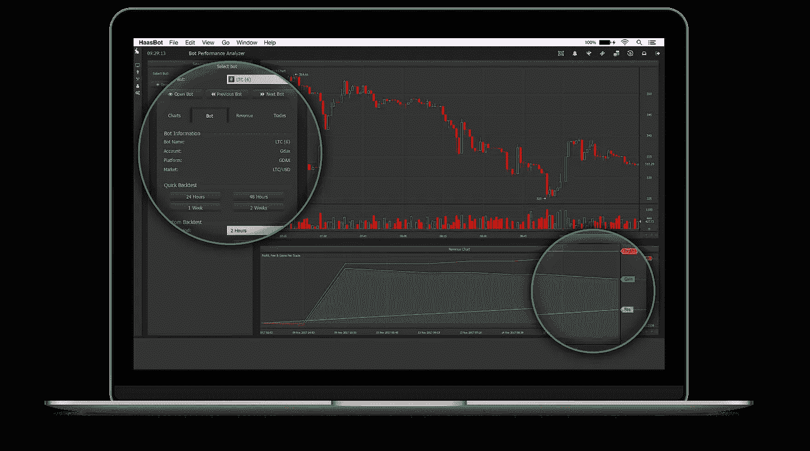

# 实现加密货币交易自动化的最佳工具

> 原文：<https://medium.com/hackernoon/the-best-tools-to-automate-your-cryptocurrency-trading-5594f7111e1f>

当操作正确时，自动化你的交易策略是最大限度降低风险和增加底线的好方法。作为一个初学者，充分理解你正在使用的工具是很重要的，这样你就可以配置它，按照你想要的方式交易，并把风险降到最低。我们为您提供了最可靠、最强大的自动加密交易工具的快速概览。

# 哈斯博特

[**哈斯博特**](https://www.haasonline.com/features/?ref=2148) 是最强大、最成熟的自动化[加密](https://hackernoon.com/tagged/crypto)交易工具之一，仍在积极开发中。默认情况下，HaasBot 提供了 15 种预置策略，并支持 50 多种技术指标，供您根据历史市场数据进行定制和回溯测试。这些策略中的每一个还允许你定义多个安全触发，以保护你免受意外市场条件的影响。

# 哈斯博特的优点:

*   20 个支持的交换
*   51 个可定制的技术指标
*   19 个支持的交易所
*   频繁更新
*   优秀的支持团队

# 哈斯博特的缺点:

*   需要桌面(或 VPS)安装

# **隐漏斗**

[**Cryptohopper**](https://www.cryptohopper.com/?atid=1178) 是首批完全基于云端的加密交易机器人之一，这意味着不需要处理任何安装过程，也不用担心连接问题。这个工具是建立在多种自动交易策略，详细的报告，和一个完整的回溯测试，以帮助您优化您的策略，以产生最大的利润。

# Cryptohopper 优点:

*   基于云(100%正常运行时间)
*   优秀的学习资源
*   详细的损益报告
*   简单的策略配置
*   频繁的开发更新

# 隐漏斗缺点:

*   缺乏关于回溯测试的详细报告

# 枪机

[**Gunbot**](https://thecryptobot.com/?gun=2930#whyus) 是目前市场上另一款成熟知名的自动化交易工具。它提供了 30 多种自动化交易策略，可以定制并在多个交易所运行。Gunbot 还有一个先进的图表工具，可以与 TradingView 集成，为您提供实时利润更新。

# 枪机优点:

*   超过 20 种预设的交易策略
*   交易视图集成
*   实时损益报告
*   简单策略配置
*   频繁更新

# 枪机缺点:

*   需要桌面(或 VPS)安装

如果你刚刚开始自动化交易，使用开源交易机器人是熟悉回溯测试和学习机器人如何在真实交易条件下工作的好方法。查看我们对三个最受欢迎的[开源加密交易机器人](https://www.cryptotrader.tax/blog/the-best-open-source-and-free-crypto-trading-bots)的评论。

*最初发表于*[*www . cryptotrader . tax*](https://www.cryptotrader.tax/blog/best-crypto-trading-bots)*。*