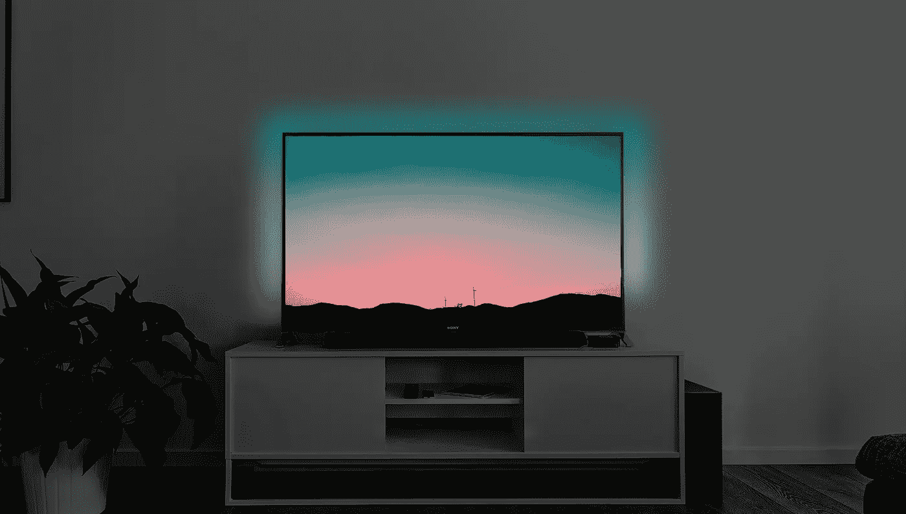
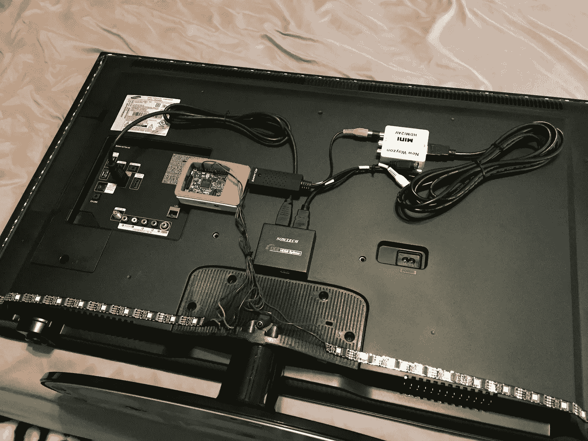
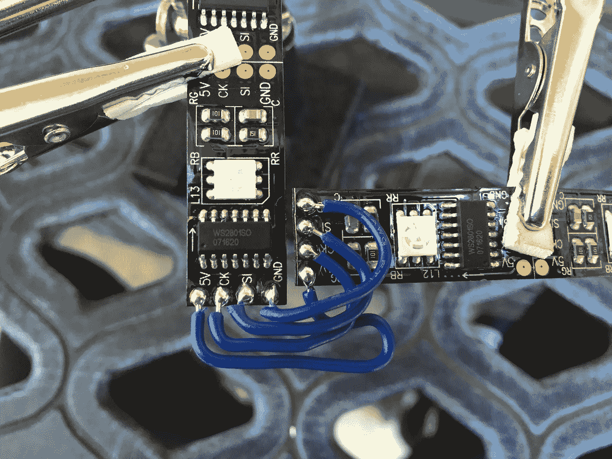
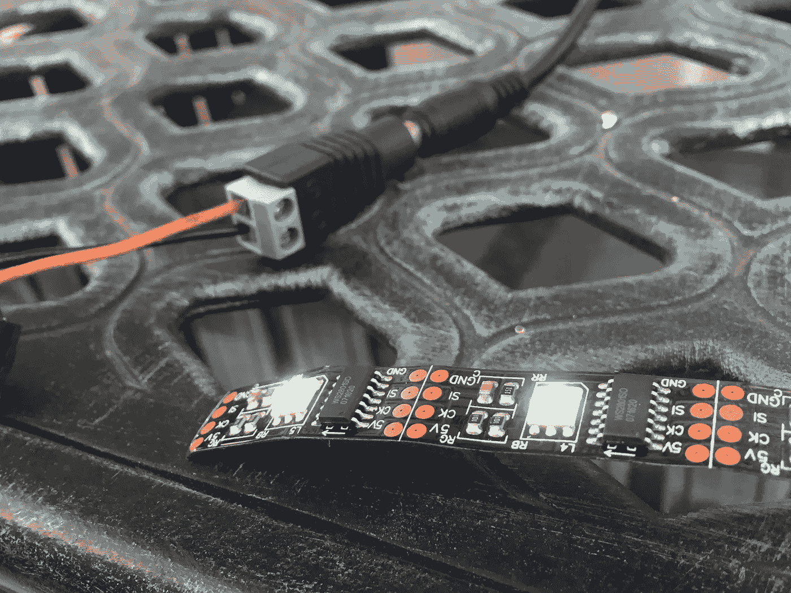
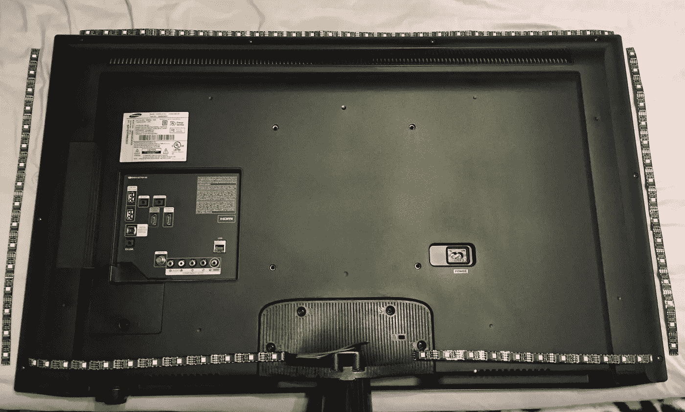
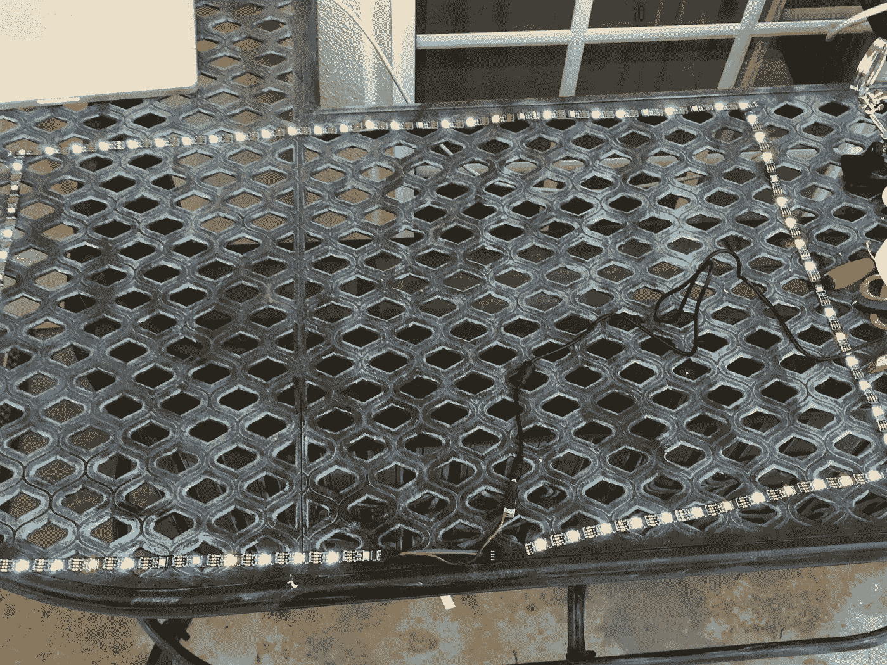
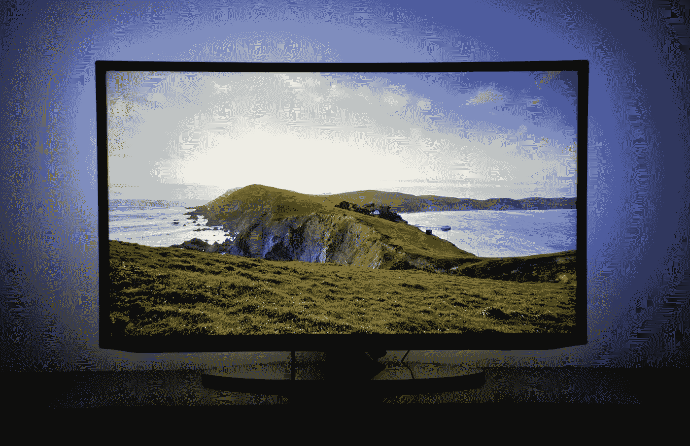

# 最佳电视体验:DIY 飞利浦流光溢彩

> 原文：<https://medium.com/hackernoon/the-best-tv-experience-philips-ambilight-clone-f164e392266a>

Ambilight 是一种沉浸式照明系统，内置于某些型号的飞利浦电视中。电视周围有 led，可以实时将屏幕上的颜色投射到电视后面的墙上。这种效果创造了一个非常迷人的观看体验。

问题是，这种产品并不是在所有国家都能买到，即使能买到，价格也会很贵。谢天谢地，有一个负担得起的 DIY 版本。

介绍流光溢彩克隆。这个效果是通过使用一个树莓派，一些发光二极管和这个[免费软件的力量实现的。](https://hyperion-project.org/wiki/2-Installation)

# 零件(约 150 美元)

这里使用的器件使系统能够使用任何 HDMI 信号源。如果你只想把灯光同步到树莓派显示的效果，那么成本就稍微便宜一点:~$110。

I used [3m double-sided adhesive](https://www.aliexpress.com/item/New-Multifunction-Strong-1cm-Thin-3M-Double-Sided-Super-Sticky-Adhesive-Tape-Roll-Auto-Truck-Essential/32627226696.html?spm=a2g0s.9042311.0.0.VzpcBv) from AliExpress to secure all of these parts to the tv. This makes it easy to remove if I decide to get a new TV.

*   [树莓 Pi 2/3](https://www.amazon.com/CanaKit-Raspberry-Clear-Power-Supply/dp/B01C6EQNNK/ref=sr_1_5?s=electronics&ie=UTF8&qid=1513840240&sr=1-5&keywords=raspberry+pi+3+kit) 以及一个至少 8GB 大小的微型 SD 卡和一个 2.5 A 电源。~$45.00

*   [WS2801 LED 灯带](https://www.aliexpress.com/item/DC5V-5M-WS2801-32leds-m-5050-RGB-Addressable-LED-Strip-Arduino-development-ambilight-TV-12mm-led/32595888388.html?spm=2114.search0104.3.57.1HhU4C&ws_ab_test=searchweb0_0,searchweb201602_3_10152_10065_5000015_10151_10344_10068_10130_10345_10324_10342_10547_10325_10343_51102_10546_10340_10341_10548_10545_5130015_10609_10541_10084_10083_10307_10610_5690015_5870020_5080015_10312_10059_10313_10314_10534_100031_10604_10603_10103_10605_10594_5060015_10142_10107,searchweb201603_25,ppcSwitch_3&algo_expid=8d74e095-d612-4879-876e-622cbc18b932-8&algo_pvid=8d74e095-d612-4879-876e-622cbc18b932&transAbTest=ae803_4&rmStoreLevelAB=5)。我从全球速卖通购买了 5m 32LED 黑色 IP30 套装。(如果您使用全球速卖通手机应用程序结账，您购买的任何商品都可以享受折扣。)40 寸电视买了 5 米，还有很多剩余。~$30.00

*   一个 5V 10A (6A，用于长达 4m 的 LED 灯条)[LED 的电源](https://www.amazon.com/BTF-LIGHTING-Plastic-Adapter-Transformer-WS2812B/dp/B01D8FM71S/ref=sr_1_2_sspa?ie=UTF8&qid=1514939385&sr=8-2-spons&keywords=led+ws2801&psc=1)。你还需要购买一个[适配器](https://www.aliexpress.com/item/10pcs-CCTV-Camera-5-5mm-x-2-1mm-DC-Power-Cable-Female-Plug-Connector-Adapter-Jack/32822006069.html?spm=2114.search0104.3.29.Mf312g&ws_ab_test=searchweb0_0,searchweb201602_3_10152_10151_10065_10344_10130_10068_10324_10342_10547_10325_10343_10546_10340_10548_10341_10545_10084_10083_10307_5920011_10059_10314_10534_5790011_100031_10604_10103_10142,searchweb201603_6,ppcSwitch_3&algo_expid=116cecec-6cc1-4fad-bfac-6799c228f7e2-4&algo_pvid=116cecec-6cc1-4fad-bfac-6799c228f7e2&transAbTest=ae803_4&priceBeautifyAB=0)用于连接 LED 灯条。~$22.00
*   [母对母跳线](https://www.aliexpress.com/item/Free-Shipping-80pcs-dupont-cable-jumper-wire-dupont-line-female-to-female-dupont-line-20cm-1P/701588771.html?spm=2114.search0104.3.29.QIReqR&ws_ab_test=searchweb0_0,searchweb201602_3_10152_10065_5000015_10151_10344_10068_10130_10345_10324_10342_10547_10325_10343_51102_10546_10340_10341_10548_10545_5130015_10609_10541_10084_10083_10307_10610_5690015_5870020_5080015_10312_10059_10313_10314_10534_100031_10604_10603_10103_10605_10594_5060015_10142_10107,searchweb201603_25,ppcSwitch_3&algo_expid=ce2c5184-6e64-41cd-a5e2-fb7306cc6d4a-4&algo_pvid=ce2c5184-6e64-41cd-a5e2-fb7306cc6d4a&transAbTest=ae803_4&rmStoreLevelAB=5)。~$0.90
*   [HDMI 分路器](https://www.aliexpress.com/item/HDCP-HDMI-Splitter-Full-HD-1080p-Video-HDMI-Switch-Switcher-1X2-Split-1-in-2-Out/32677761901.html?spm=2114.search0104.3.311.PyX9le&ws_ab_test=searchweb0_0,searchweb201602_3_10152_10065_5000015_10151_10344_10068_10130_10345_10324_10342_10547_10325_10343_51102_10546_10340_10341_10548_10545_5130015_10609_10541_10084_10083_10307_10610_5690015_5870020_5080015_10312_10059_10313_10314_10534_100031_10604_10603_10103_10605_10594_5060015_10142_10107,searchweb201603_25,ppcSwitch_3&algo_expid=938473de-fc2d-4dac-9454-75386980183e-45&algo_pvid=938473de-fc2d-4dac-9454-75386980183e&transAbTest=ae803_4&rmStoreLevelAB=5) ~$9
*   [HDMI 转 AV](https://www.aliexpress.com/item/HDMI-TO-AV-Scaler-Adapter-HDMI-to-RCA-AV-CVSB-L-R-Video-1080P-HDMI2AV-Mini/32839234443.html?spm=2114.search0104.3.23.KdiUNl&ws_ab_test=searchweb0_0,searchweb201602_3_10152_10065_5000015_10151_10344_10068_10130_10345_10324_10342_10547_10325_10343_51102_10546_10340_10341_10548_10545_5130015_10609_10541_10084_10083_10307_10610_5690015_5870020_5080015_10312_10059_10313_10314_10534_100031_10604_10603_10103_10605_10594_5060015_10142_10107,searchweb201603_25,ppcSwitch_3&algo_expid=9ed9e0fe-0989-43b6-a491-c62508d42518-2&algo_pvid=9ed9e0fe-0989-43b6-a491-c62508d42518&transAbTest=ae803_4&rmStoreLevelAB=5) 适配器~$7
*   [视频采集卡](https://www.amazon.com/gp/product/B0019SSSMY/ref=as_li_ss_tl?ie=UTF8&linkCode=sl1&tag=awes0ae-20&linkId=d1cc5482434b878e3261a287be678d6c) ~$10
*   [2 根 HDMI 线](https://www.amazon.com/gp/product/B014I8SIJY/ref=as_li_qf_sp_asin_il_tl?ie=UTF8&camp=1789&creative=9325&creativeASIN=B014I8SSD0&linkCode=as2&tag=awes0ae-20&linkId=63XT6W6T5E32BMHZ&th=1)～10 美元
*   [烙铁。](https://www.amazon.com/Meterk-Adjustable-Temperature-Desoldering-Anti-static/dp/B076HK3QTB/ref=sr_1_27_sspa?s=electronics&ie=UTF8&qid=1513840845&sr=1-27-spons&keywords=soldering+iron+kit&psc=1) ~$15 - $25

# 它是如何组合在一起的

第一步是测量出你打算使用的电视周围的 LED 灯带布局。

I decided to include the lights along the bottom of the TV as well, but It still looks great without them if you run short.

将它们切割到合适的尺寸后，小心地将它们焊接在一起，确保它们以正确的方向相互连接(有一个箭头沿着带的侧面，确保它们以相同的方向连接)。当您为没有任何软件控制的 [LED](https://hackernoon.com/tagged/led) 灯条供电时，一些 LED 可能不会亮起。这并不一定意味着它们不起作用。等到软件安装好了，再下结论说它们被终结了。

接下来要做的就是设置 raspberry pi，安装 OpenELEC 操作系统。此时，是时候在你的电脑上安装 Hyperion 应用程序，并在你的 raspberry pi 中安装 ssh 来安装控制灯光的软件了。

# 教程链接

这些链接详细解释了安装软件和连接所有部件的过程。好的一面是，这个项目周围有一个非常棒的社区，你可以在很多地方找到你可能遇到的任何问题的答案。

*   [http://awesomepi . com/DIY-breath-taking-ambi light-for-your-own-TV-raspberry-pi-2-tutorial-part-1/](http://awesomepi.com/diy-breath-taking-ambilight-for-your-own-tv-raspberry-pi-2-tutorial-part-1/)
*   【https://www.youtube.com/watch?v=tRDAzJrfZiM 号
*   [https://Hyperion-project . org/threads/raspberry-pi-3-media center-Hyperion-ambilight-no-soldering . 77/](https://hyperion-project.org/threads/raspberry-pi-3-mediacenter-hyperion-ambilight-no-soldering.77/)

# 技巧

*   您为 Hyperion 应用程序选择的设置会根据您的电视而有所不同。遵循其他人的设置可能并不总能在您的设置中产生好的结果。有一个方便的手机应用程序 [Hyperion Remote app](https://itunes.apple.com/us/app/hyperion-remote/id943635503?mt=8) 可以让你轻松连接到你的系统，根据你的喜好微调灯光效果，并使用预设的灯光模式。
*   当更改桌面 Hyperion 应用程序的设置时，您可以轻松地对视频采集卡在应用程序中看到的内容进行截图，以帮助您找出哪些颜色没有正确转换，或者屏幕的哪些部分被剪掉。