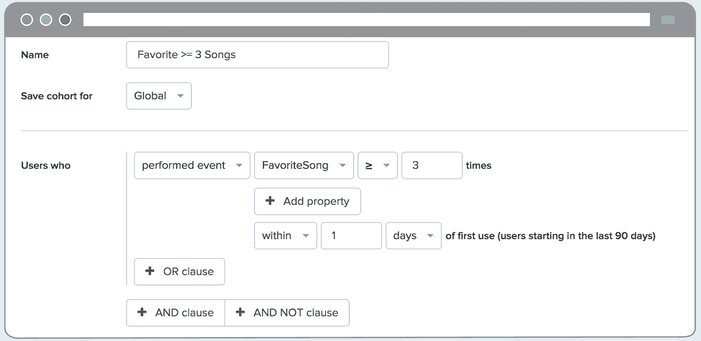
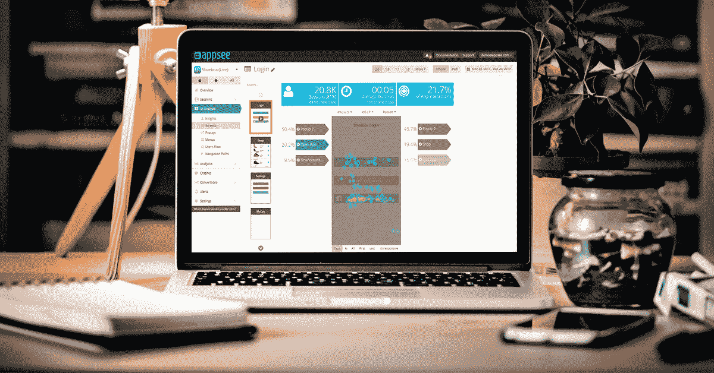
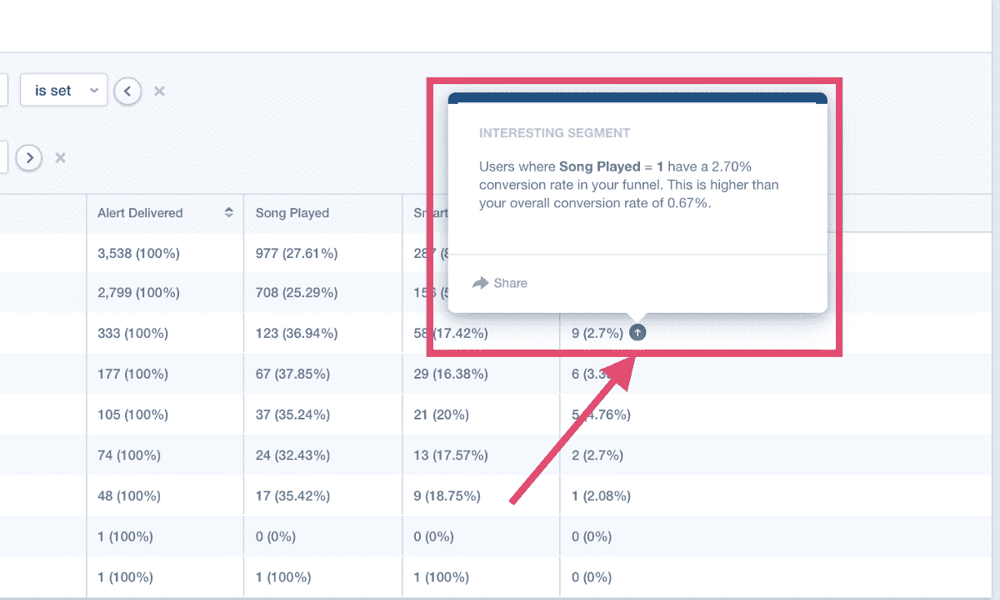
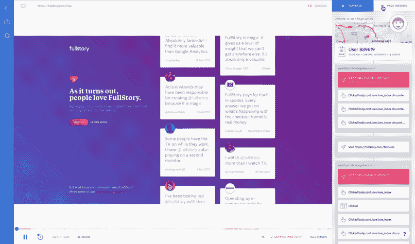
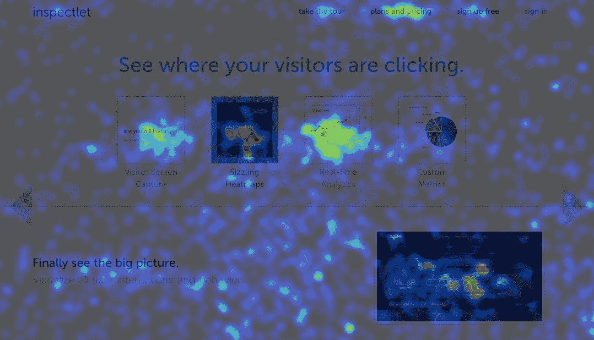
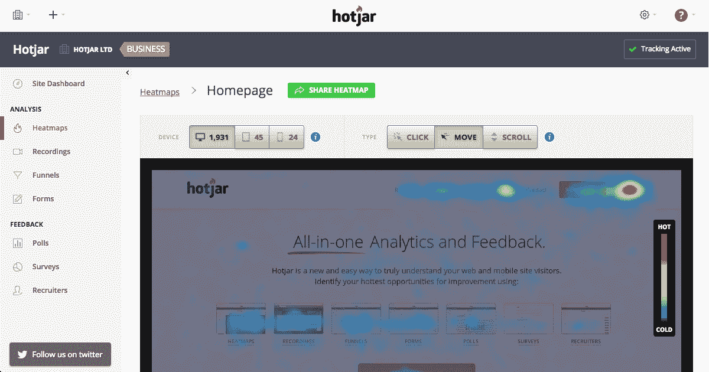
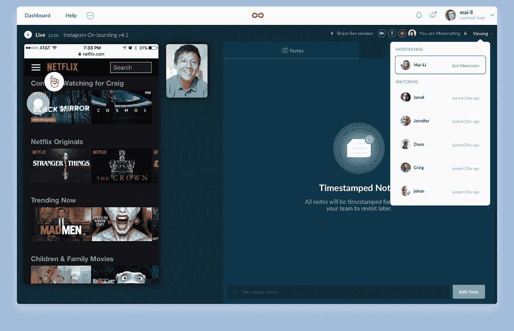

# 为您的网络或移动产品提供最佳的用户行为分析

> 原文：<https://medium.com/hackernoon/the-best-user-behavior-analytics-for-your-web-or-mobile-product-ed304f4826e0>

用户行为是一个棘手的问题。[用户是复杂的、意想不到的、没有耐心的](https://uxplanet.org/why-todays-app-users-are-the-most-complicated-ever-4bd18186147)。随着移动技术的进步，用户变得越来越熟练，越来越了解他们的设备以及他们想从中获得什么。这是一个好消息，但它实际上让移动应用程序开发者的工作变得更加困难，因为它让理解用户想要什么，以及他们为什么以这种方式与应用程序交互变得更加困难。用户行为现在如此微妙，我们需要更多的量化数据来理解它，而不仅仅是图形和数字指标，如 MAU/DAU、会话长度和保留率。用户行为分析必须为更深层次的问题提供答案:不仅仅是“什么”和“多少”，还包括“为什么”和“如何”。

移动应用程序分析平台正在适应这种需求，并为应用程序创建者提供创新的方法来跟踪和了解用户行为。从[定量](https://www.nngroup.com/articles/quantitative-user-research-methods/)到[定性](https://blog.appsee.com/quantitative-vs-qualitative-analytics-everything-you-need-to-know/)聚焦平台，以下是顶级用户行为分析工具(针对移动和网络)，可以帮助你度过 beta 测试阶段及以后:

# 用户行为分析工具#1: [振幅](https://amplitude.com/) (Web、Android、iOS)

Amplitude 利用这些用户数据，让应用程序专业人员对他们的数据进行切片和切块，并找到他们关于用户行为的问题的答案。借助 Amplitude，您可以利用行为协同的力量来了解应用程序中的用户行为趋势。Amplitude 让您可以放大不同的用户群组:例如，在过去 30 天内执行了某个操作并且也在使用某个设备的用户。这有助于你决定采取哪些行动来提高你的保留率和转换率。您还可以获得定制的警报，观察用户通过漏斗的过程，并在振幅仪表盘上与团队成员协作。

# 用户行为分析工具#2: [Appsee](https://www.appsee.com/?utm_source=medium&utm_medium=link&utm_campaign=best_user_behavior_analytics_web_mobile&utm_content=appsee_homepage_link&cpnid=701b0000000Wd7c) (安卓、iOS)

Appsee 独特的用户行为分析方法在于它的两个主要功能:[触摸热图](https://www.appsee.com/features/touch-heatmaps?utm_source=medium&utm_medium=link&utm_campaign=best_user_behavior_analytics_web_mobile&utm_content=touch_heatmaps_feature&cpnid=701b0000000Wd7c)和[用户会话记录](https://www.appsee.com/features/user-recordings?utm_source=medium&utm_medium=link&utm_campaign=best_user_behavior_analytics_web_mobile&utm_content=user_recording_feature&cpnid=701b0000000Wd7c)。有了这两个工具，Appsee 提供了单用户级别的用户体验记录，准确地显示了用户如何与应用程序交互，还提供了每个屏幕上用户手势的汇总视图。这意味着你不需要仅仅依靠用户访谈、反馈和测试。相反，你可以在应用程序生命周期的任何阶段观察和分析用户在应用程序中的行为，并了解真实的用户行为，而没有偏见的风险。这种独特的能力只需扫一眼就能获得深刻的、可操作的见解。如果用户的行为与你预期的不同，你将能够很快理解原因，*因为你将亲眼看到这一点。不用再猜测了！*

# 用户行为分析工具#3: [Mixpanel](https://mixpanel.com/) (iOS、Android、移动网络、网络应用)

Mixpanel 使用机器学习来深入研究您的数据，并立即生成关于您的用户的洞察。从在应用程序、网站或移动网站上标记您想要跟踪的事件开始，Mixpanel 将为您提供自动化、ML 生成的可操作见解。这是一种有效的定量用户行为分析方法，因为 Mixpanel 在其分析中使用了数万亿个数据点。Mixpanel 还可以根据用户过去的行为来预测他们的行为。

# 用户行为分析工具#4: [全文](https://www.fullstory.com/)(网络)

FullStory 希望通过为您的网站提供会话回放，为您提供关于用户行为的“完整故事”，并提供基于机器学习的后端来帮助您导航该工具。这使得网络用户行为分析变得轻而易举:你可以观察用户与你的网站的互动，并在出现可用性问题时及时发现需要解决的问题。FullStory 的搜索引擎可以很容易地找到与你最相关的会话，向你展示引起用户沮丧和“愤怒点击”的会话集合。FullStory 还创建了“点击地图”——交互式地图，显示用户点击最多的网站上的确切元素。

# 用户行为分析工具#5: [Inspectlet](https://www.inspectlet.com/) (web)

Inspectlet 通过会话记录、每次鼠标移动、点击和滚动来记录访问者与站点的交互。Inspectlet 还提供了详细的转换渠道，甚至允许您标记单个用户和事件。Inspectlet 工具的真正魔力在于展示了*没有*发生的点击:眼球追踪热图，这是在用户移动鼠标阅读和寻找某些功能时通过跟随鼠标生成的。这增加了一种独特的能力，可以揭示用户行为背后的许多想法。

# 用户行为分析工具#6: [Hotjar](https://www.hotjar.com/) (网络，移动网络)

Hotjar 提供跟踪网站访问者活动的热图，以及真实显示访问者在网站上行为的用户会话记录。结合表单分析和转换漏斗，你就有了一个真正全面的网站用户行为分析工具。如果这些工具仍然让你对你的用户和他们的行为有一些没有答案的问题，Hotjar 提供了一种直接与他们交流的方法:通过反馈投票，客户调查，甚至是一个寻找用户测试者的工具。这种会话记录和热图的强大组合使得在试图了解用户行为时不遗余力成为可能。

# 用户行为分析工具#7: [回看](https://lookback.io/) (iOS、Android、web、移动 web)

回顾使得与测试人员和用户的交流变得容易。Lookback 不仅可以录制他们的屏幕，还可以让您与您的研究参与者进行视频通话，向他们提问，并实时查看他们对您产品的反应。Lookback 甚至会记录会话，并将它们上传到基于云的数据库中。你也可以使用回看功能，让你的参与者只需要一个简单的链接就可以自己测试网站或应用。Lookback 不需要任何特殊的设备来设置，并指导您的用户通过安装和测试过程，而您不必动一根手指。

# 摘要

随着技术越来越好，用户行为越来越难理解。幸运的是，正如您所看到的这些顶级工具，分析市场正在崛起，以满足不断增长的新需求。从用户会话记录到触摸热图，再到行动队列，有许多工具可以帮助您了解这些复杂的用户，并为他们提供满足他们所有期望的数字体验。

