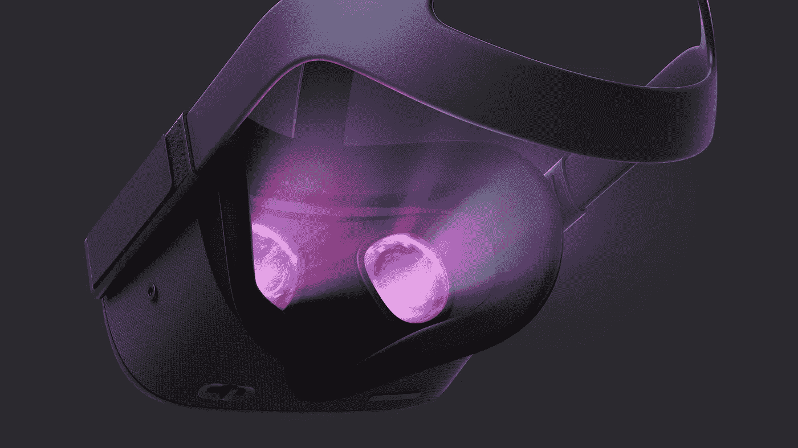
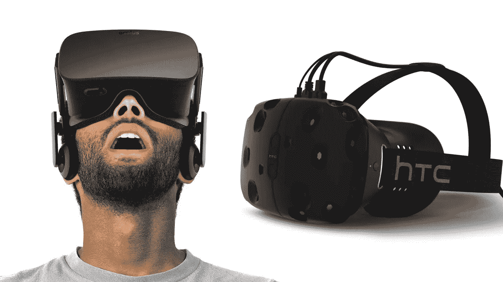
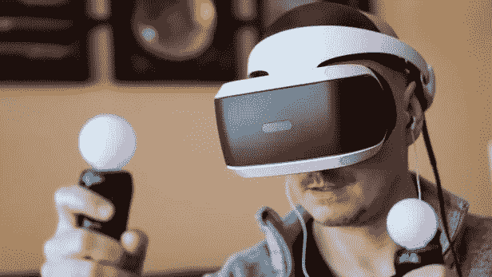
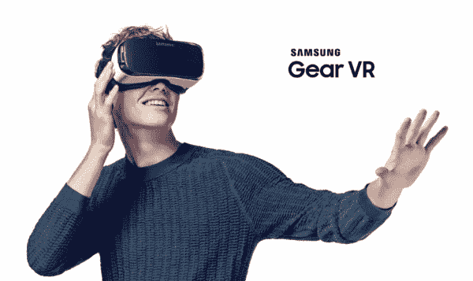
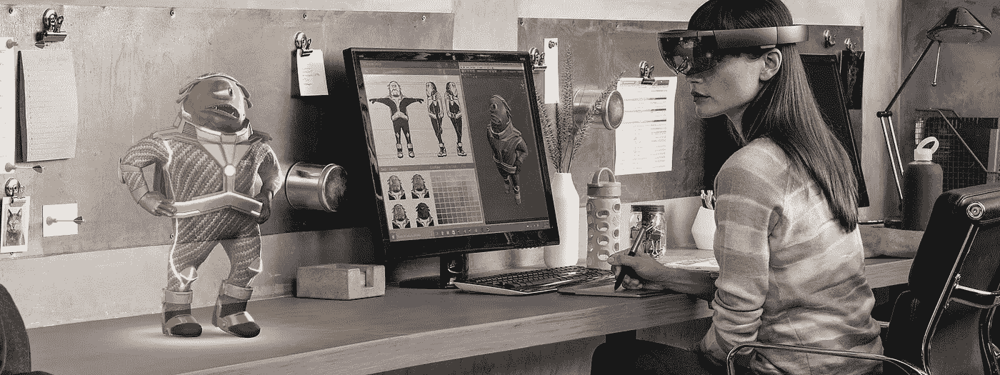

# 2018 年最佳虚拟现实耳机

> 原文：<https://medium.com/hackernoon/the-best-vr-headsets-of-2018-57106b7ee59f>

VR 头戴设备已经进入了消费市场。App Store 和 Google Play 正在为用户推出新的 VR 应用。因此，企业正在提出新的虚拟现实解决方案，它具有沉浸式的力量来吸引用户。带有运动跟踪的 VR 头戴式耳机让用户可以使用这些 VR 解决方案。它让用户在虚拟空间中四处移动，就像在现实世界中一样。

VR 是一项很有前途的技术，它正在通过 VR 解决方案改变市场趋势。智能手机硬件和显示器的使用有助于 VR 头戴设备利用 VR 技术的力量吸引用户。VR 头戴设备由估价过高的镜头外壳组装而成，通常带有一些额外的功能来描绘虚拟世界。

研究表明，98%的 VR 头戴设备是针对 Android 和 iPhone 设备用户的。VR 头戴式耳机创造了一个市场，在这个市场中，制造商以低廉的价格创建他们自己版本的头戴式耳机。

**Oculus Rift—**

它是一个基于计算机的系统，在当前的 VR 浪潮中拥有第一个大名。Oculus 仍然被认为是虚拟现实的主要参与者。Oculus VR 在推出时推出了一个成功的 Kickstarter 活动。

[Oculus Rift](http://www.quytech.com/blog/facebooks-new-oculus-quest-vr-headset-best-vr-experience-for-users/) 拥有触摸控制器，让用户在定位技术的帮助下在 3D 空间中进行物理移动。它还包括出色的 Oculus Touch 运动控制器，可以支持大面积。它主要是创造 3D 游戏环境。

从技术角度来看，Oculus Rift 耳机与 Vive 几乎相同，比开发人员套件更贵。

**HTC Vive—**

这款 VR 耳机以其强大的性能而闻名，可以帮助用户更真实地体验游戏。HTC Vive 包括一个耳机、两个运动控制器和两个基站。

我们可以说体验虚拟现实空间是一个[大范围。它可以通过一套比 PlayStation 更先进的运动控制器来跟踪你的运动。](http://www.quytech.com/blog/business-opportunity-in-virtual-reality/)

双基站允许用户通过更高分辨率的显示屏、面向外的摄像头和一些其他增强功能自由移动。

**索尼 PlayStation VR -**

索尼的 PlayStation VR 提供了最完美、最易用的虚拟现实体验。它包含了对完整功能的额外投资。耳机的 PlayStation 摄像头和运动控制的 PlayStation Move 控制器捆绑包属于额外投资。

这是一个完善的分销平台。这是一个为了用户的利益而精心制作这些虚拟现实体验和质量控制的解决方案。

因此，我们可以说，索尼 PlayStation VR 是一个更加无忧的解决方案，可以解决基于 PC 的虚拟世界的潜在困惑。

**三星 Gear VR—**

三星的 Gear VR 适用于与 Oculus VR 合作开发的高端三星 Galaxy 型号。三星 Gear VR 通过使用最新的 Gear VR 转变了虚拟现实。

这是最容易访问的虚拟现实系统之一，具有新的手持控制器，可以无缝响应虚拟体验中的有机人体运动。一举一动都很自然的从物理连接到虚拟世界。由于这个原因，它使用户体验比以往任何时候都更加直观和迷人。

凭借其潜力，它通过配备触摸板和动作感应的蓝牙控制器吸引用户。除此之外，它与触摸板一起组装到耳机本身上。三星 Gear VR 通过多种方式将用户体验提升到一个新的水平，以 360 度视频与应用程序和游戏相结合。

**微软的 holo lens—**

微软的 Hololens 是一款独立的 VR 头戴设备，让用户可以在一个环境中看到、听到全息图并与之互动。

它具有 3D 空间化声音、Wi-Fi、类似 Kinect 的摄像头和 120 度空间传感系统。为了创造这种身临其境的交互式全息体验，为每只眼睛提供了一系列陀螺仪、加速度计和透明屏幕。

HoloLens 本质上是一个全息耳机，不需要无线连接到 PC。这意味着它将把尖端图像投射到每个人都能看到的房间里。

**底线**

虚拟现实耳机正在成为一种享受虚拟世界的流行方式，因为它可以充当手机的浏览器。智能手机的屏幕分辨率和传感器越好，与虚拟现实体验成正比。

基本上，这些耳机依赖于智能手机本身的屏幕、处理器和运动传感器。

虚拟现实本身就是一个大行业，因此，虚拟现实已经有很长一段时间了。因为在家里使用虚拟现实耳机比以往任何时候都更容易获得身临其境的体验。虚拟现实开发公司正在为企业提供创新的虚拟现实解决方案，以提高用户参与度和投资回报率。