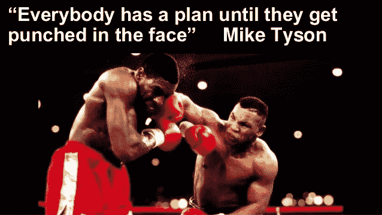

# 好的，坏的，有偏见的密码交易员

> 原文：<https://medium.com/hackernoon/the-biased-crypto-investor-42afac5035b7>

你的贪婪是显而易见的，你的缺乏经验是令人烦恼的，而不是做些什么，你已经决定把你的头埋在沙子里，直到危险退去。

很抱歉 Noob 的伪装。就当是塞翁失马焉知非福吧，因为我接下来要说的话会让你重新思考你的投资策略。

苦涩的事实是，我们的主观感知充斥着偏见，促使我们得出充满错误的结论。

令人惊讶的是，这些认知偏见是为了保护我们的大脑。

在一个信息爆炸的世界里，这些思维模式提供了便利。它们让我们节省时间和精力。

那么它们是如何影响你的日常投资行为的呢？

# 让我们从后见之明偏差开始

Hindsight Bias Makes Surprises Vanish

现在[比特币](https://hackernoon.com/tagged/bitcoin)已经反弹，我们都认为我们对 Hodl 和感知者是正确的。这被称为后见之明偏差，我们这样做是作为一种应对机制；否则，我们不得不承认自己错了，并应对一种完全不同的精神状态，称为认知失调(我稍后会谈到)。

## 我一直都知道。我不是……

后见之明偏差是我们用一种“明显的”倾向来解释过去事件的方式。我们归因于积极的解释，因为它让我们觉得我们总是在控制我们的投资(又名命运)。然而，事实完全不同。

没有人知道为什么 BTC 的价值会下降，也没有人知道为什么或者什么时候会回升。我们只是听天由命。然而，现在它正在反弹，我们想拍拍自己的背，说我们“知道”它会反弹，并提供蹩脚的理由来解释它为什么会反弹。

不要这样玩自己。你不知道，你越快尊重这个观念，你就会过得越好。

**亲提示**

回顾过去，过去就像一条通向今天的单线。向前看，我们看到许多不同的道路可以搭顺风车。想想过去也有同样多的道路，试着找出其他可能的结果。

更好的办法是，记下你的想法，并不时重温它们。我用谷歌保持这个。你可以用笔和纸。什么都行。

# 确认偏差

如果我给你一个象征性的提示，告诉你它的价格将在下周上涨三倍，你们大多数人会去谷歌/推特/Reddit 上找到与我的建议一致的东西。这是自然的，这种形式的偏见是欺骗性的。

确认偏差是指将新证据解释为对现有信念或理论的确认的倾向。

CB 是让我们保持在安全空间的东西。看看你的 facebook 或 twitter 订阅。你会发现你追随的大多数人和事都在不断地确认你的客观现实是真实的。

这在 [crypto](https://hackernoon.com/tagged/crypto) 社区中没什么不同。我们分成部落，这种行为降低了我们处理多种想法的能力(甚至那些与我们的叙述相冲突的想法)。

**亲提示**

如果你想在下一次交易中保持客观，避免确认偏差，只需把你的“为什么我应该投资这个代币”改成“为什么我不应该投资这个代币”

这将有助于你在确认自己的立场之前识别负面因素，并允许你权衡不同的观点。

# 牧民是放羊的

我们都是社会动物，倾向于从我们“信任”的人那里寻找共识。我们应该加入电报小组/微博和其他社交平台的回音室，因为这是很自然的事情。

这些小组是一个很好的工具，有助于你讨论和加深对主题的理解，但是有一个警告。

团体的目标可能与你自己的冲突。

你的目标是什么？你要投资多少钱？你的时间范围是什么，最后你愿意损失多少？这些事情应该在你参与集体思考并决定你的目标与小组中的目标相匹配之前解决。

最后，有一个你应该考虑的规则。

90–9–1 法则是当一个群体中 90%的人都在潜伏(只查看内容)，9%的成员在原有内容上添加，1%的成员创造新内容。

也就是说，要明白你对任何团体的兴趣都应该基于加深你对某个行业/话题的理解。你应该利用小组中的情绪来帮助你合理化你的投资论点。

**亲提示**

你们小组中谁在创造大部分的讨论话题？帮自己一个忙，看看他/她讨论的历史话题，看看你是否能得出一些推论。它也将很好地为你服务，看看这个原始海报是否有一个议程，或者是这个令牌或那个令牌的托词。我知道的最好的方法就是问他们对什么感兴趣。

# 最后，最糟糕的偏见陷阱——认知失调

认知失调是一种不愉快的情绪，由同时相信两种矛盾的事情而产生。

这可能违背了加密最大化主义者的初衷，但对于普通投资者来说，我能想到的关于认知失调的最好例子之一是“霍丁现象”。

想想吧。我们这么做是因为我们认为密码(在很多情况下是 BTC)的价格将会持续上涨。我们最初是通过查看历史价格图表并了解它们在过去 5 年中是如何上涨的(尽管沿途有一些高峰和低谷)得出这个结论的。然而，对我们许多人来说，这个故事更加黯淡。

2017 年的牛市让许多人在市场刚刚开始转向的时候参与进来，除了 Hodl，他们几乎没有别的选择。

我们最初的目标是基于我们的信念，即加密是未来，对于我们中更贪婪的人来说，我们相信它会增值。

这种想法的问题是，霍德林并不总是正确的行动路线，可能会阻止你看到替代信号。

重申一下，认知失调是一个陷阱，让我们困在自己的精神监狱里。

**亲提示**

历史不会重复，它会进化。仅仅因为你在过去经历过类似的情况下认为某事将会发生，并不意味着它将会发生。在你寻找积极的肯定之前，先寻找反驳你观点的东西，并承担相反的角色，然后权衡双方。

我爱你，

免疫球蛋白超基因族

在推特上用 [@iggsloop](https://twitter.com/IggsLoop) 找到我

伊戈尔是一个情人，也是一个斗士。他碰巧喜欢在加密推特上发帖，和朋友喝啤酒。他的最新项目旨在通过一个名为 [KryptoLoop](http://www.kryptoLoop.com) 的群体驱动价格预测平台，帮助交易者提高投资回报率。他们使用的群体智慧模型减轻了大多数交易者的偏见，并把他们的集体知识浓缩成一个单一的价格预测。这是加密交易者能找到的最好的情绪指标，他们的预测与实际价格相差很小。

[#LeverageTheFuture](http://www.kryptoloop.com)