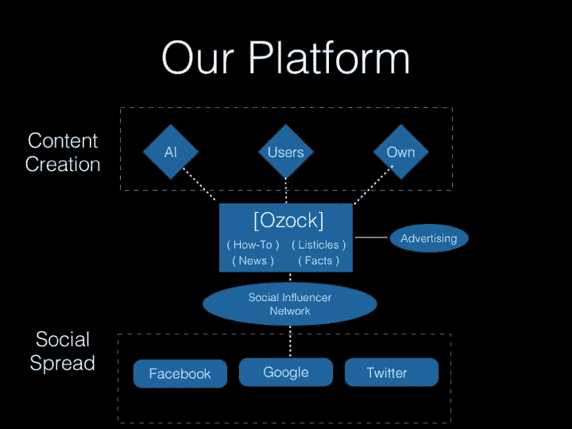
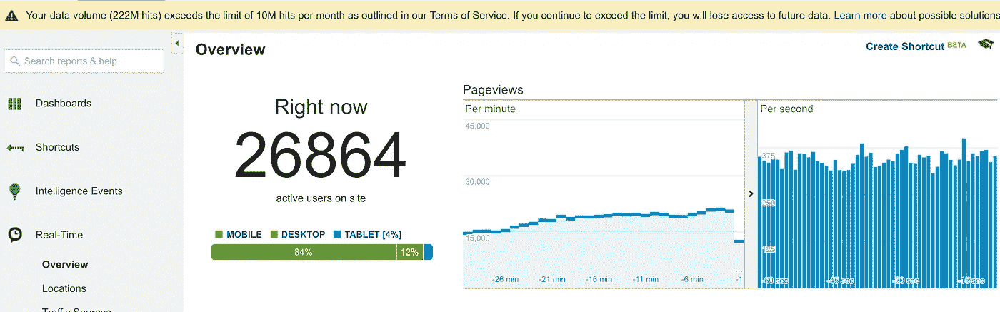
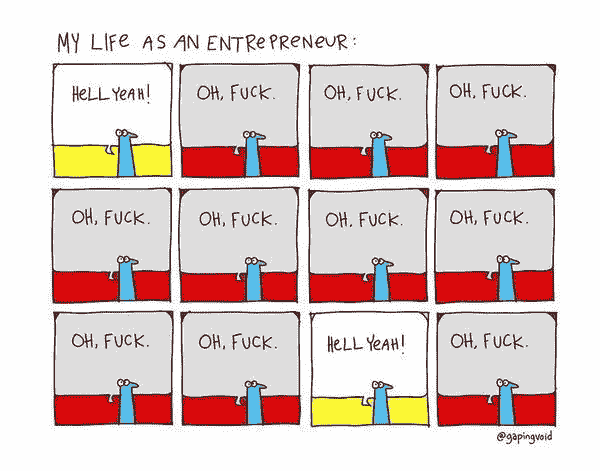

# 你从未听说过的最大内容网站:原因如下

> 原文：<https://medium.com/hackernoon/the-biggest-content-website-you-never-heard-of-and-heres-why-790d7e33229c>

那是 2015 年，我们在内容领域看到了一个机会——与几十年前相比，内容消费的过程发生了翻天覆地的变化。

当时，少数传统新闻媒体主导着媒体行业，人们知道在互联网上哪里可以找到最新的独家新闻。像 CNN、BBC、Guardian 这样的大公司手中有巨大的权力，可以以任何他们想要的方式制造或破坏某一特定新闻的传播。

# 内容去中心化和“可备份”格式的时代

快进到脸书的十年——内容不再保持集中化。权力掌握在人们手中——我们。任何人都可以在他们的新闻订阅上发布任何东西，它可能会像野火一样蔓延。此外，与你没有直接关系的第三方渠道相比，人们更有可能阅读你朋友圈里某个人推荐的文章。此外，脸书开始整合整个行业，让人们在它的平台上花更多的时间，并致力于为每个用户提供一流的个性化新闻推送体验。因此，随着人们更加依赖他们的脸书新闻订阅来消费新内容，从前的顶级媒体出版物的直接流量受到了巨大的打击。

当像 Buzzfeed 这样的网站出现并以一种全新的格式——listicles——吸引读者时，内容行业发生了另一个范式转变。列表条旨在将一篇否则会很长的文章浓缩成一系列的要点，目的是让用户更容易阅读故事。这也产生了诸如“10 件事……”、“你不会相信……”和“这发生了……”等标题，以吸引用户点击他们的新闻提要中的这些可抓取的内容。正如你所注意到的，这些标题当然是点击诱饵，但它们在当年的脸书随处可见。当你写这些标题的时候，你能引起的好奇心越多，你的点击率就越高。

品牌内容的时代开始消失，人们开始忽视内容来源本身。焦点完全转移到了内容质量和分发上。

这是我们看到的机会。我们直接跳了进去。

# Ozock.com 模式

我们有一个简单的执行计划:

1.  首先破解内容分发——确保我们有办法让一篇文章像病毒一样传播。
2.  写内容——当然，这就是它的全部。但这里要注意的是，这是第二位的。
3.  获得广告客户——就像互联网上的每个网站为了收入都会做的那样。

# 内容分发:社交明星的诞生

根据我们的战略，我们首先建立了一个后来成为最大的社交影响力网络[围绕](https://hackernoon.com/tagged/networks)[脸书](https://hackernoon.com/tagged/facebook)的网络，叫做 SocialStar。我们花了前几个月的时间与脸书一些最有影响力的人和页面达成交易，以确保我们准备好发行。这确实是我们商业模式中最艰难的部分，因为在过去的 5 年里，我们已经有很多竞争对手在这个领域开展业务。我们成功获得大部分市场的原因之一是——我们对客户要求的敏捷反应。有时候，我们只是渴望睡上一夜，但失去客户的噩梦不会让我们如愿以偿。它确实得到了丰厚的回报。

> 给你一个建议:你的客户是你生意中最重要的部分。像家人一样对待他们。这就像你们在一起，一种双向关系，不仅仅是服务和/或金钱的给予和索取。它也涉及到情感。这是你需要理解的最难的部分。越快越好。

经过几个月的努力，我们成功地在 SocialStar 平台上聚集了一大批有影响力的人。该平台为他们提供了数以千计的文章，他们可以与观众分享，并在此过程中获得以下收益:

1.  **观众参与度:**有影响力的人需要每天与他们的用户群分享大量优质内容，以保持他们的参与度。
2.  **受众增长:**当我们专注于有可能迅速传播的可分享内容时——分享数量越多，影响范围就越广，因此影响者的粉丝群也就越大。
3.  **金钱**(当然):我们致力于按点击付费的模式，根据有影响力的人给我们带来的每一次点击付费。

我们将整个 SocialStar 平台游戏化，让有影响力的人分享比平时更多的内容。虽然它对我们有利，但它也有缺点，包括但不限于垃圾邮件。

# 最后，事情是这样的:

Average live user count on Ozock.com

*   Ozock.com[在**美国**网站**排名**](http://alexa.com)，在**世界**网站**排名**前 300。鉴于目前有超过[个 1B 网站](http://www.internetlivestats.com/total-number-of-websites/)存在，我们跻身于前 0.000026%。
*   每个月，美国的每一个眼球都会至少阅读一次我们的文章。
*   在相对较短的时间内，我们在收视率和排名方面超过了互联网上大多数受欢迎的新闻媒体。
*   每月在 **1B 提供+印象**。
*   向**冲刺，年收入 800 万美元** (2016 年)。

> 成功就像怀孕，每个人都祝贺你，但是没人知道在你怀孕之前你被操了多少次。

# 听说过不快乐的结局吗？这就是它破产的原因。

在整个过程中，包括我们的商业模式的战略和执行，我们没有意识到一个关键的缺点:这一切都依赖于一个我们不拥有的平台，一个强大到不能让任何东西免费在其上茁壮成长的平台——Facebook.com。

由于直接与脸书有影响力的人/页面打交道，我们基本上把平台本身从等式中剔除了。从本质上说，如果脸书是一个私人足球场，我们，也就是一群外来者，在不付租金或未经事先许可的情况下在上面踢球。脸书没有让我们繁荣的动机。事实上，如果让像我们这样的企业蓬勃发展，它可能会损失数百万美元的广告机会成本。

此外，在 2016 年美国总统大选后，脸书因多起法律索赔而受到关注，这成为迄今为止最大的问题——[假新闻](https://www.thetimes.co.uk/article/are-twitter-facebook-and-google-responsible-for-the-rise-of-fake-news-ngs6grckg)。内容分发的分散化完全助长了这个问题的恶化，因为任何人都可以在没有任何真实性检查的情况下传播假新闻。

最后，可能是下意识的反应，脸书在 2016 年 11 月左右拔掉了插头，我们在几秒钟内就倒闭了。当然，我们并不孤单。那一刻完全莫名其妙。

> 但这不是你打得有多狠的问题。而是你能承受多大的打击，然后继续前进。

我们最终继续前进。向上。以下是我们学到的内容:

1.  永远不要在你不拥有的平台上发展你的业务，尤其是如果你和它没有股份或合作关系的话。
2.  企业是由客户或用户组成的——让他们相信你的产品，最终相信你。
3.  跟上你所在行业的趋势，并不断发展。进化是这里的关键。
4.  帕累托法则实际上是正确的，但不是在你的成长阶段。所以，平等地对待你的客户或用户。
5.  利用*网络效应—* 永远不要根据客户对你收入的贡献来判断他。而是看他能给你带来的人脉。

Life of an Entrepreneur

一切都是为了找到那个“耶！”在这一切结束的时候，让它持续下去。

谢谢你过来。我希望你能从我们所犯的错误中吸取教训，并在你的事业和/或生活中避免犯同样的错误！