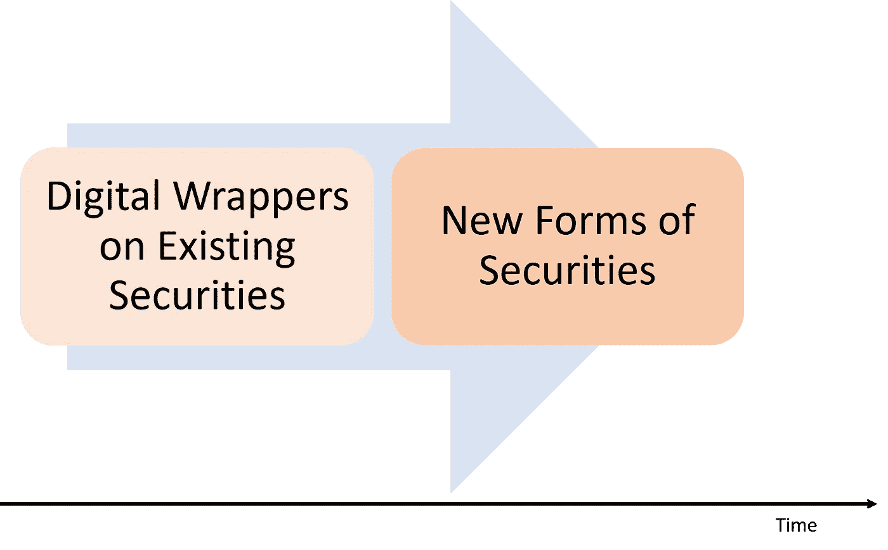
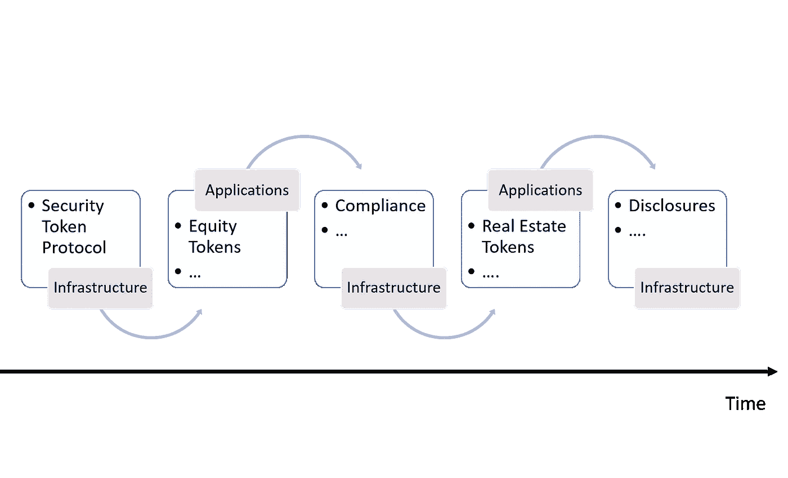
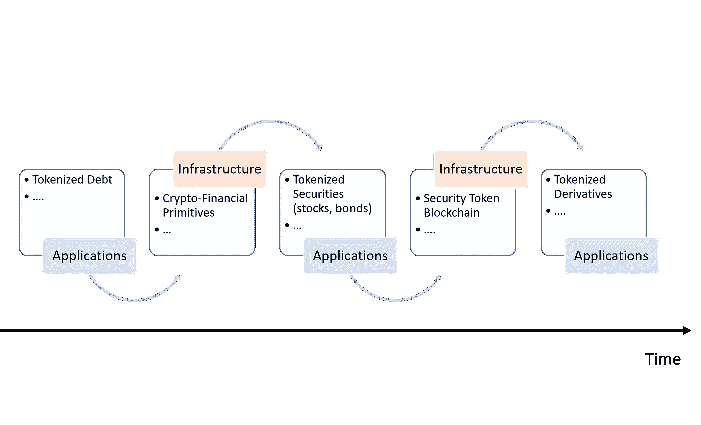
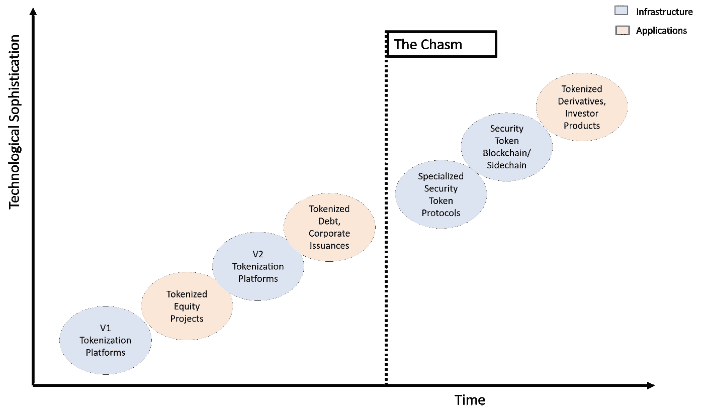

# 安全令牌的最大困境:基础设施与应用程序

> 原文：<https://medium.com/hackernoon/the-biggest-dilemma-in-security-tokens-infrastructure-vs-applications-2a9a6a54a10b>

最近，加密社区[对联合广场风险投资(USV)的一篇博客文章做出了回应，这篇文章揭穿了技术领域基础设施优先的神话](https://www.usv.com/blog/the-myth-of-the-infrastructure-phase)。在他们的论文中，USV 解释说，基础设施中的许多突破都是由应用程序的发展推动的，并将其中一些想法推广到 Web 3.0/区块链空间。我发现 USV 的一些想法非常有思想，但也过于简单，以至于在密码领域的许多方面都不切实际。今天，我想深入探讨一下安全令牌在基础架构和应用程序之间的困境。

基础设施与应用程序之间的冲突是安全令牌行业中最重要的争论之一。加密安全领域的一些最聪明的人，如[的首席执行官](https://twitter.com/carlosdomingo)[的首席执行官](https://securitize.io/)Carlos Domingo，同意复杂的安全令牌将成为该领域基础设施的主要驱动力的观点。卡洛斯的理念反映了 Securitize 对构建组件的外科手术式关注，如与交易所的整合，这使他们能够比竞争对手更快地推出几个安全令牌。SpiceVC 的 Ami Ben-David 等人支持的另一个思想流派认为，安全令牌需要某些基础设施构建模块来实现任何级别的相关性。其他人，如来自[liquidity](https://www.fluidity.io/)的 [Michael Oved](https://twitter.com/ovedm606?lang=en) 展示了令人难以置信的实用主义水平，他们建造了关键的基础设施模块，如 [AirSwap](https://www.airswap.io/) 或[双令牌瀑布协议](https://tokenwaterfall.io/)，同时还专注于[对曼哈顿的一座公寓楼进行令牌化](https://www.forbes.com/sites/rachelwolfson/2018/10/03/a-first-for-manhattan-30m-real-estate-property-tokenized-with-blockchain/#304bc3a04895)。谈到安全令牌，确定应用程序和基础架构之间的正确优先级远非易事，我认为这在很大程度上取决于我们希望通过加密安全实现的特定功能。

# 安全令牌中的基础设施应用周期

从概念的角度来看，整个安全令牌空间可以抽象为两个主要组:

I .作为现有证券或其他资产的数字包装的安全令牌。

二。代表当前市场上不存在的新证券形式的证券代币。

从进化的角度来看，你可以认为第一组是现有证券的加密数字化的结果，而第二组是重新想象新形式的证券的结果，这些证券在当前的基础设施下是不可能构建的。

以这两组为基线，我们可以解释加密证券中基础设施和应用之间的关系，结果非常有趣。鉴于组 I 中的安全令牌是现有证券的令牌化表示，它们还需要现有基础架构构建块的可编程表示才能运行。法规遵从性和信息披露是这类基础架构构建块的主要示例。为了使安全令牌符合某些规定，需要在令牌智能合约中以某种链上形式(即使只是与链外数据交互的 Oracle)来表达该规定。类似地，受特定公开要求约束的安全令牌需要公开基础设施来发布可能影响令牌行为的公开、重要信息。为了使组 I 中的安全令牌变得相关，它们需要一些基本的基础设施协议，然后这些协议可以产生更复杂的安全令牌，而这些安全令牌又会产生更好的基础设施。

第二组中的安全令牌代表了新形式的证券，其唯一可能是因为加密证券的可编程能力。传统证券是现金流和投票权的结合。有了证券代币，我们可以想象新形式的证券，也代表投票权或现金流。传统金融工具无法创造的新形式的衍生工具也可能出现在证券代币领域。我们不知道这种类型的安全令牌需要什么类型的基础设施。因此，我认为第二组安全令牌的基础设施将主要由该领域的新应用程序驱动。

# 跨越鸿沟

在《跨越鸿沟》一书中，[【杰弗里·摩尔】](https://en.wikipedia.org/wiki/Geoffrey_Moore)提出了一个框架，这个框架已经成为分析技术市场演变的黄金标准之一(如果我们被允许在加密领域使用这个短语的话)。在许多其他事情中，跨越鸿沟框架限定了基础设施和应用程序之间的关系，允许我们确定技术空间何时已经为应用程序的起飞构建了足够的基础设施。在我最近在瑞士苏黎世举行的加密峰会上的演讲中，我展示了一个图表，它可以帮助我们思考不同的基础设施和应用构建模块，它们将帮助安全令牌行业跨越鸿沟。

应用程序和基础设施之间的摩擦是安全令牌领域中最重要的难题。为了像现有证券一样有效，安全令牌需要新形式的基础设施。同样的基础设施将会产生今天难以想象的新形式的安全令牌。