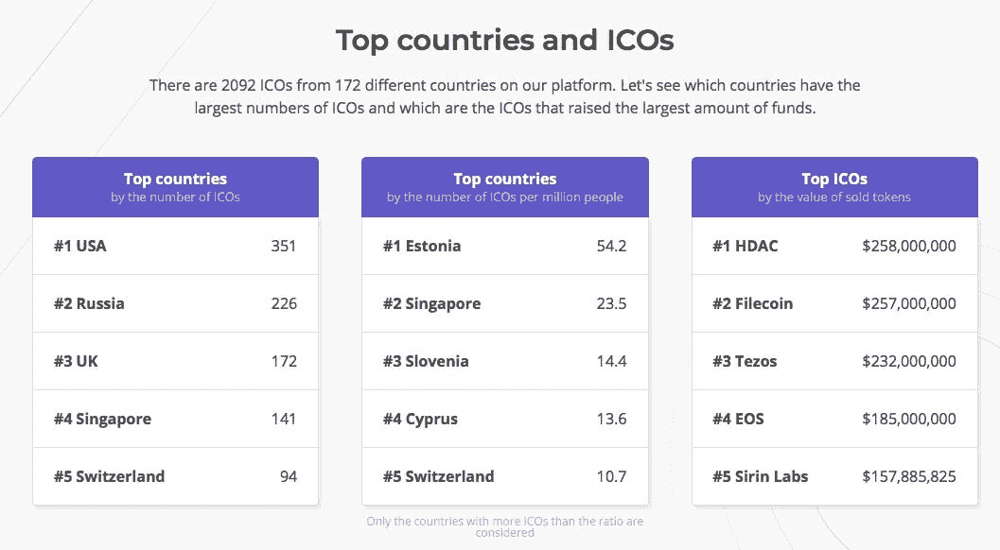

# 大多数 ico 犯的最大的错误(并且没有意识到)

> 原文：<https://medium.com/hackernoon/the-biggest-mistake-most-icos-do-and-dont-see-it-6529d7ef8024>

浏览新闻，与业内专家和成功完成 ico 的首席执行官交谈，让我思考为什么人们不信任位于 T2 区块链 T3 的创业公司，他们使用众筹为他们的项目赚钱。答案很简单——很多区块链初创公司**关注的是 ICO，而不是产品**。

首次公开募股现象困扰着世界各地的投资者。我们都知道去年对于 ICOs 来说是极好的一年。根据 ICO Bazaar 的统计，520 多场 ICO 活动的总收入为 1716092898 美元，其中 90 多场是在上个月举行的。 [ICOBench](https://icobench.com/stats) 数据显示，网站上已经有超过 2000 个 ico 上市，所以这个数字还会更高。其中一些在短时间内获得了很多关注，比如 CryptoKitties 在第一个月销售额达到 1200 万美元，成为区块链的轰动。Filecoin 和 Tezos 等一些项目筹集了异常多的资金，仅在一轮融资中就筹集了超过[2 亿美元。](https://www.coinist.io/top-10-icos-of-2017/)

这幅画是从 ICOBench.com 取回的

过去，许多 ico 召开时都只有十页纸的白皮书和改变世界的伟大想法以及一个开发团队。许多 ICO 团队专注于众筹活动，忘记了更重要的部分——产品本身。如果没有产品开发，大量出版物(价值数千美元)和 Youtube 评论(你可能知道价格)将无助于获得经验丰富的投资者的信任。

今年，这些投资者参与了这种新的融资方式。他们将要求进一步的业务验证和透明度，使 ICO 流程更接近传统的风险融资，并使仅仅从白皮书中获得信任和资金变得越来越困难。ICO 平台的发展将支持这一趋势，如 [CoinList](/@coinlist/introducing-coinlist-16253eb5cdc3) ，它在接受公司进入其平台之前进行尽职调查，或[balance 3](https://media.consensys.net/announcing-balanc3-quickbooks-for-token-sales-9e54cb00df66)，它为加密初创公司提供会计工具。这就是为什么创业公司不仅要展示意图，还要展示开发过程是至关重要的。

2017 年将加密货币带到了聚光灯下。随着价格涨到惊人的高度，投机者成群结队地涌入市场，将价格推得更高。据《T4》报道，2018 年很容易成为加密货币嵌入传统金融系统的一年。

2018 年，新的货币和平台出现，经验丰富的投资者和金融机构进入市场，监管机构采取立场。ICO 团队必须比以往更加努力地工作，向潜在投资者展示 a)他们是真实的人，而不是骗子 b)他们创造了一个独特的平台，可以处理选定行业中的当前问题。

我写这篇文章不是为了吹牛或羞辱任何人；我只是想分享我在每周团队会议上的想法。毕竟，加密货币市场必须获得人们的信任，只有这样我们才能共赢。

让我知道你在开发新产品方面对 ICO 炒作的看法。那些读到这里的人——谢谢你们，伙计们！