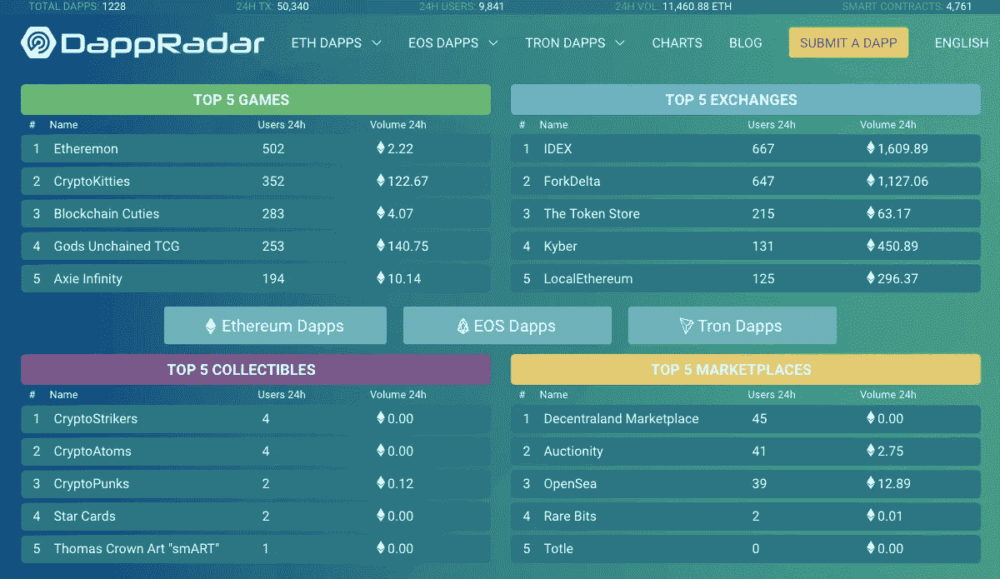

# 区块链最大的神话:每秒交易量

> 原文：<https://medium.com/hackernoon/the-biggest-myth-in-blockchain-transactions-per-second-c300ca16d802>

## 以及为什么您应该忽略它

每秒事务数。网速。缩放。无论伪装成什么样子，加密社区似乎都痴迷于交易速度——尤其是在以太坊方面。*以至于有些人认为以太最近的熊市应该归咎于规模“问题”。

> 全球巨头 PayPal 每天处理数百万笔交易，但平均每秒处理 193 笔交易

但是我们对交易速度的痴迷是短视的吗？当然，除了最专业的项目，快速稳定的交易对所有项目的未来都至关重要。然而，在更广阔的金融科技世界里，却没有这种困扰。全球巨头 PayPal 每天处理数百万笔交易，但平均每秒处理 193 笔。这离区块链的“圣杯”[每秒一百万笔交易](https://toshitimes.com/will-dexon-be-the-first-network-to-reach-1-million-transactions-per-second/)还有很长的路要走，然而没有人质疑贝宝*的整个*未来。

我最近和伊恩·沃拉尔讨论过这个问题，他是区块链一家非盈利创业公司 MyBit 的首席执行官和创始人。由于该项目依赖以太网，你会认为他会对每秒的交易量感到非常困扰。他没有。

他对这个问题的想法归结为一件高于一切的事情:安全。当然，快速扩展以太坊网络将是美妙的——没有人对此有争议——但是把它作为目标似乎是被误导了。这只是一种障眼法，分散注意力。原因如下。

> *“当然，快速扩展以太坊网络将是美妙的——没有人对此有争议——但是把它作为***的目标似乎被误导了。”**

*首先，以太坊网络的实际使用比你想象的要低。快速浏览一下 [DappRadar](https://dappradar.com) 可以看到整个*以太坊网络的日均用户数以百计，交易数以千计。如果我们回到 PayPal 的例子，这个平台每天处理大约 500 万笔交易，平均每秒 193 笔，它真的把 100 万的“圣杯”放在了正确的位置。整个以太坊网络不需要那种速度——更不用说单个项目或 dApp 了。然而，至少。**

**

*Actual dApp usage is much lower than you might think (source: DappRadar)*

*但这并不是每秒交易量神话有问题的唯一原因。*

*至关重要的是，以太坊上运行的大多数项目都是*金融*平台。在这里，安全和稳定是最大的问题。这就是为什么金融行业中如此多的人迟迟没有采用区块链。虽然许多平台——比如游戏或社交媒体应用——需要速度，但即使在这里，安全性也是最重要的。*

*不管我们喜不喜欢，安全(或安全的*想法*)是主流采用的主要障碍。然而，矛盾的是，是安全——而不是速度——拥有区块链技术更广泛的前景。人们很容易忘记这一点。虽然以太坊还需要一段时间才能赶上贝宝的速度，但在安全方面就不是这样了。*

> **“矛盾的是，是安全——而不是速度——给区块链技术带来了更大的希望。”**

*这在理论上是有道理的，对吧，但在实践中呢？*

*我们已经看到开发人员在努力解决速度和安全之间的矛盾——实际上，他们倾向于优先考虑后者。*

*目前正在开发的一个更引人注目的解决方案是[“等离子链”](/@argongroup/ethereum-plasma-explained-608720d3c60e)。尽管血浆链不能存储智能合同，但它们可以快速、廉价地发送简单的交易。这是一种扩展网络的方式，同时保持以太坊“主链”提供的安全性。那就是双赢了。*

*但是，至关重要的是，等离子体项目表明，归根结底，速度不需要以安全为代价。那还是真金。*

*这也是为什么将安全性放在首要位置，而不是每秒一百万次交易的“圣杯”只能是一件好事。否则，我们就太超前了——忘记了最初是什么让区块链科技如此吸引人。*

***值得注意的是，本文主要关注以太坊，但我相信提出的观点可以应用于更广泛的区块链空间。**

***请在下面的评论中分享你的想法，如果你喜欢这篇文章，请点击拍手按钮帮助其他人找到它。***