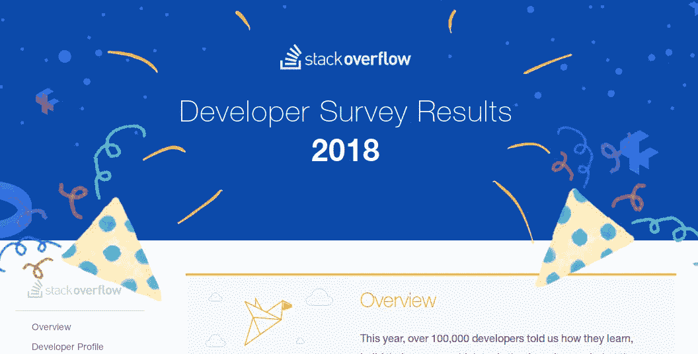
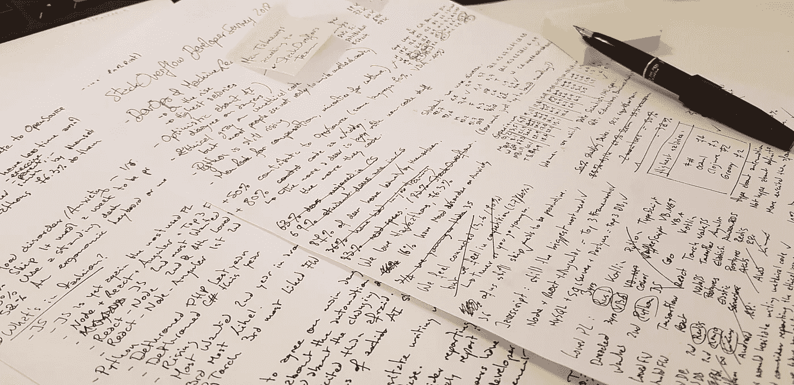

# stack overflow 2018 年开发者调查的最大收获

> 原文：<https://medium.com/hackernoon/the-biggest-takeaways-from-stackoverflows-developer-survey-2018-9dc703e22fff>

## 人工智能、伦理、编程语言、健康、多样性和薪酬

昨天 [StackOverflow](https://hackernoon.com/tagged/stackoverflow) 发布了[今年的数据](https://insights.stackoverflow.com/survey/2018/)来自他们的年度开发者调查。

他们的回顾总是很有趣，充满了趋势和有用的数据，但也很长。不是所有人都有时间去筛选 60 多页的条形图和百分比。

幸运的是，**我有。**

I know I’m a dev and should go digital, but I still do love to just use a pen & some paper

仔细阅读了几遍之后，以下是今年统计数据中的主要内容。

让我们从确认一个直觉上已知的事实开始:

# 代码——开发者喜欢它。

这一条很有道理，但提醒一下也无妨。开发人员不仅仅是为了谋生，他们似乎真的很喜欢编程，因为超过 80%的开发人员将编程作为一种爱好，不管他们的工作状态如何。

实际上，**投入时间**较少的开发人员(因为他们每天锻炼，花更多的时间在户外或者有照顾他人的责任)似乎是编码最多的人。

除此之外**，所有其他开发者也为开源软件**(OSS)**做出贡献，尽管一些语言似乎特别受到 OSS 贡献者的青睐，如 Rust 或 Clojure，其 70%的开发者都是 OSS 贡献者。**

**为了进一步证实这一趋势，**超过四分之三的开发人员说他们去参加黑客马拉松仅仅是因为他们喜欢它们**，一半的人说他们去参加黑客马拉松是为了提高他们的编程技能。这与 87%的开发人员已经自学了一门技术或编程语言的事实是一致的。**

**要点是，**我们热爱编码，而且我们编码很多。****

# **健康——坏习惯，好家具。**

**然而，我们对代码的热爱可能会对我们的健康产生影响，因为三分之一的开发人员会为了更有效率而每周至少少吃一顿饭。**

**但是尽管我们有坏习惯，2 个开发人员中有 1 个使用立式办公桌，同样多的人使用符合人体工程学的椅子和鼠标。**

# **科技——什么是时尚？**

**这毕竟是钱的所在(尽管你可能会说这更适用于即将到来的*薪水*部分)。所以让我们开始吧。**

## **荣誉奖**

*   ****Rust 连续第三年成为最受欢迎的编程语言****
*   **在最可怕的编程语言中，Visual Basic 6 (VB6)走过了第三个年头**

## **JavaScript 将会继续存在——我们对此似乎很高兴。**

****JavaScript 再次成为最常用的编程语言**，也是开发者最想尝试的**第二语言**。**

****NodeJS、React 和 Angular(所有语言中使用最多的 3 个框架)分别作为开发人员最想尝试的框架排名第一、第二和第四**，人们似乎有理由这样想，因为**他们在最受欢迎的框架列表中排名第二、第四和第七。****

****MongoDB，**大多数 JS 栈的常规部分，是**大多数开发人员想要尝试的数据库。****

## **Redis 和 PostgreSQL 是数据库世界的宠儿。**

**MySQL 和 SQL Server 是使用最多的数据库，PostgreSQL 位居第三。但是 **PostgreSQL 在最受欢迎的数据库技术**中排名第二，在最想尝试的数据库技术**中排名第三。****

**这是一个很好的公司**，**因为**雷迪斯连续第二年在最受欢迎的公司**中排名第一，**在最想尝试的公司**中排名第四。**

## **Python 依然崛起**

**Python 似乎是发展最快的主要编程语言。继去年将 PHP 挤下第八名之后， **Python 现在取代 C#成为第七大最常用语言。****

**连续第二年， **Python 是大多数开发人员想要尝试的语言**。也是第三大最爱。**

**它的机器- [学习](https://hackernoon.com/tagged/learning)框架， **PyTorch，是第 3 个最受喜爱的框架。****

## **TensorFlow 主宰了机器学习世界**

**TensorFlow 是大多数开发人员想尝试的第三个框架。这不是没有原因的，因为**它是回答者最喜欢的框架**。**

# **总的来说，我们很兴奋。**

**关于人工智能，作为开发者，我们似乎更兴奋而不是害怕。**

**这项调查研究了人工智能的四个方面:**

*   **工作的自动化**
*   **人工智能变得比人更聪明(奇点)**
*   **“公平”的定义在人类/算法决策中不断演变**
*   **做出重要决策的算法**

**事实证明**,我们似乎没有发现一种前景比其他前景更可怕。**但是正如自动化大师们所期待的那样**我们主要对工作的自动化感到兴奋(40%的开发人员认为这很令人兴奋)。****

**我们也大多倾向于认为，研究人工智能的含义及其衍生是应该落在设计和建造它的人身上的任务。只有 1/4 的开发商认为这应该是政府/监管机构的责任。**

# **道德——我们有道德准则，但它仍然取决于。**

****95%的开发人员在编写明显不道德的代码之前会犹豫不决。
58%的人会断然拒绝。****

****95%的开发者会视情况举报。13%的人会公开这样做。****

**这对我们的道德操守来说是一个好消息，20 个开发人员中只有 1 个准备好违背他们认为的道德规范，但是在剩下的 95%中，大约 35%的开发人员会根据情况调整他们的行为。**

**然而，最终，我们大多数人(57%)认为管理层应该对他们负责。**

# **多元化—即将推出！**

**下一代开发人员仍然不会是一个大熔炉，但是我们已经越来越接近了。**

**3 个编程学生中就有 1 个是有色人种，而职业开发人员中只有 1 个是有色人种。**

**这种增长对于来自中东(148%的增长)和东亚(145%的增长)的学生来说尤其明显。**

**当观察缺乏经验的学生和开发人员时，性取向和性别也出现了一些多样化:**

**6.6%的开发人员认为自己是职业界的同性恋、双性恋或酷儿，而 8.3%的学生开发人员这样认为。**

**女性在专业开发人员和学生开发人员中的比例也从 6.6%上升到 7.4%。**

**从学生群体来看，社区中跨性别和非二元性别的人数也在上升。有趣的是，这些人对开源软件的贡献是同性同龄人的 1.5 到 2 倍。**

## **建设多元化的公司**

**男性似乎把薪酬和福利作为选择工作的主要标准，而少数族裔似乎首先重视公司文化。**

**更具体地说:**

*   ****女性对公司文化、个人发展机会和所用技术的重视程度大致相同(分别为 16.9%、16.8%和 16.4%)****
*   ****跨性别和非二元性别的人比其他任何标准都更看重公司文化(比第二重要的标准高出 5-6 个百分点)****
*   **在评估一份潜在的工作时，性别开发人员认为公司的多样性是最不重要的(在七种可能性中),而对于非二元和跨性别的人来说，它是第四重要的。**

# **薪水——跟着钱走**

**我们都看到了很多关于“如果你想赚大钱，X 是 2018 年要学习的**语言**”的文章。让我们看看这些数据是如何支持的:**

**今年工资中位数最高的五种[编程](https://hackernoon.com/tagged/programming)语言是:(以美元计)**

*   ****F# — 74K****
*   ****OCaml — 73K****
*   ****Clojure — 72K****
*   ****Groovy — 72K****
*   ****Perl — 69K****
*   ****Rust — 69K****

**工资中位数最高的前 5 个职位是:(单位:美元)**

*   ****工程经理— 89K****
*   ****DevOps — 72K****
*   ****数据科学家— 60K****
*   ****业务/数据分析师— 59K****
*   ****全栈开发者— 59K****

**数据科学家的职位引人注目，因为它是工资中位数最高的职位之一，但平均工作年限最低的职位之一。 **(6 年以下经验平均一点 60K)。
开发人员比非开发人员更有经验，但平均薪酬仍高于非开发人员(平均 8 年工作经验为 72K)。****

**这些是我从今年的报告中发现的最有趣的统计数据和要点。我毫不怀疑我决定不包括在这里的一些其他事实和统计数据可能对你很重要，我强烈建议你在有时间的时候通读原始报告。**

**我希望我的摘要足以让你对截至 2018 年的行业现状有一个全面的了解。**

**如果你是一个数据点，我建议你等待几个星期，直到 StackOverflow 发布整个数据集，我毫不怀疑更多详细的文章将会蓬勃发展。**