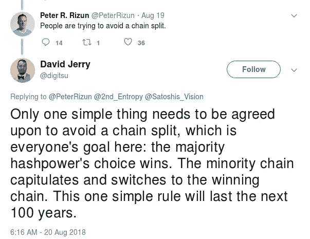

# 比特币现金意识形态

> 原文：<https://medium.com/hackernoon/the-bitcoin-cash-ideology-and-the-incoming-schism-c5c3f11f9413>

[https://hacker noon . com/the-bit coin-cash-ideology-and-the-incoming-schism-C5 c3f 11 f 9413](https://hackernoon.com/the-bitcoin-cash-ideology-and-the-incoming-schism-c5c3f11f9413)

比特币现金正面临分裂。比特币 ABC 的开发者似乎完全无视这一威胁，因此他们提议在 11 月 15 日就非关键问题向 hardfork 提出建议。目前还不清楚 BCH 的其他实现，如比特币无限和新的克雷格·赖特项目比特币 SV 打算在 11 月 15 日做什么。有一点是清楚的，那就是存在大量的敌意([开发者被禁止进入通信渠道](https://www.reddit.com/r/btc/comments/959tbe/amaury_creator_of_bitcoin_cash_has_been_banned/)、 [Faketoshi 故作姿态](https://nchain.com/en/blog/bitcoin-sv-launch/))，比特币现金很有可能分裂成多个链。各种秃鹫链已经开始出现，像[比特币眼镜蛇](https://twitter.com/CobraBitcoin/status/1032955956408274944)和[比特币藏匿点](https://twitter.com/BitcoinStash)试图利用这种情况。

比特币现金建立在一个意识形态原则上，即一个硬分叉的少数链可以成为原始链的合法继承者。“比特币现金就是比特币”是罗杰·弗基于这一宗旨发明的模因。任何人都不应感到惊讶的是，比特币现金社区内部的分歧将通过分裂成多个分支的链条来解决，并将宗旨作为理由。请允许我“展开”这份声明:

任何一大群人的核心基础都依赖于意识形态。没有意识形态，国家、宗教和政治运动就无法存在，加密货币也是如此。稳定的意识形态让社区繁荣。宗教中一个简单的例子是基督教的信条“只有一个真神”。这种信仰加强了宗教，因为它削弱了竞争宗教的成员。意识形态不稳定的社区最终会崩溃。想想 Shakers，一个 18 世纪的基督教教派，支持独身主义作为一个核心原则。摇动者现在灭绝了，这并不奇怪，因为其成员没有孩子可以继续这种宗教的实践。

为比特币现金的存在提供正当理由的意识形态，也为使用链分裂来解决社区内的任何分歧提供了正当理由。很容易看出，这种意识形态，即一个硬分叉的少数链可以成为原始链的合法继承者，是完全不稳定的。专业人士 BCash shill David Jerry 发表了这一令人深感困惑的声明。他提出，为了解决链分裂，少数链投降并切换到获胜链，而没有意识到比特币现金本身是比特币的少数链。

虽然大卫·杰里的解决方案在比特币中是明智的，但它与比特币现金意识形态完全不兼容。因此，有理由得出结论，比特币现金将面临永无止境的威胁，其社区成员可能会永久脱离主链。我预测 1 年之内，会有多个互相竞争的硬分叉出来比特币现金。最终，这个链条将被分割多次，以至于它将成为加密货币历史上一个被遗忘的脚注。

现在让我们回到最初创造比特币现金的争论，即区块大小的争论。比特币最大化主义者经常说，块大小的辩论根本不是关于块大小的。这是真的，街区大小的争论是关于保持一个稳定的意识形态。maximalists 想要在块大小的争论中袖手旁观的最重要的信念是向后兼容性永远不会被破坏(或者我们永远不会硬分叉)。这种思想是稳定的，因为它保证未能升级软件的成员永远不会从网络中掉线。这听起来像是一个软件项目的硬性要求，但比特币不仅仅是一个软件项目。对于一大群面临极端敌对和强大对手的人来说，这是一种协调的方法。了解了这一事实，就很清楚软件升级可能是一个很大的攻击媒介，并且当对手全力以赴时可能不可行。

批评家们说的很对，目前，州级对手还没有完全参与进来，而硬分叉在实践中是完全可能的。他们不明白的是意识形态的本质。意识形态只能通过严格坚持来加强。当对手突然介入时，加密货币项目将无法轻松地切换到没有硬分叉的策略。像比特币现金这样的项目，已经在一年内两次硬分叉来解决问题，用户已经习惯于相信硬分叉是安全的。因此，当一个恶意的国家赞助的硬叉子来了，他们将坐以待毙。比特币用户已经习惯于相信所有的硬分叉都是不安全的，当这样的攻击到来时，他们将会免疫。

稳定可持续的意识形态必须是所有加密货币的基础。再多的密码术、共识协议开发和技术优化也无法帮助一种意识形态不稳定和破产的加密货币。