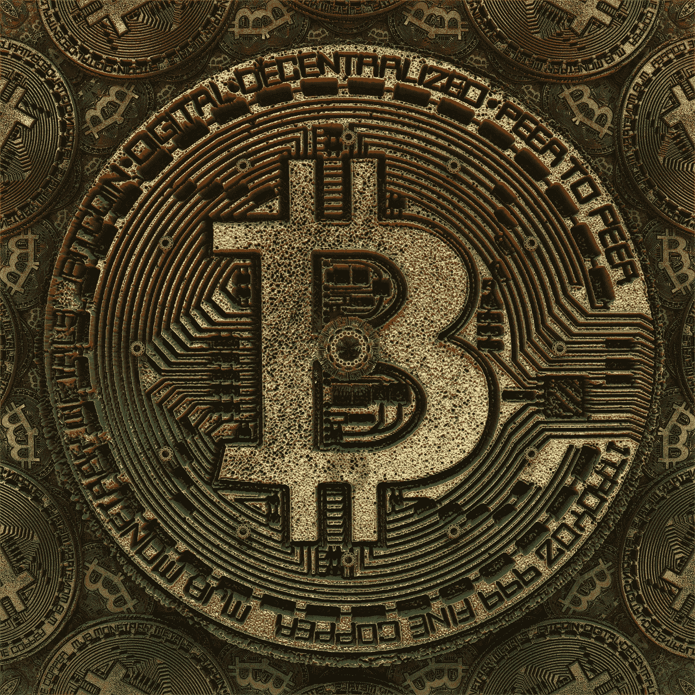
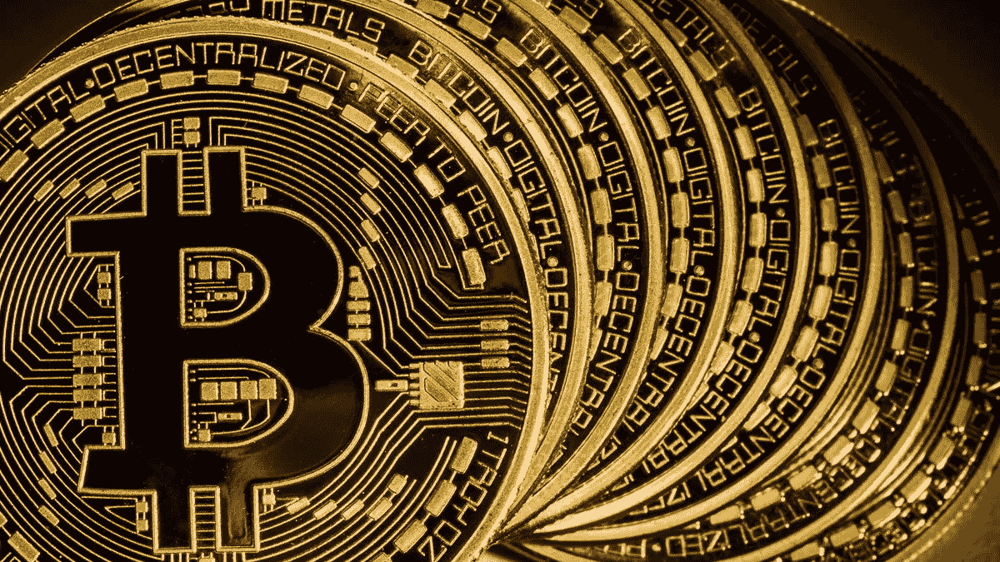
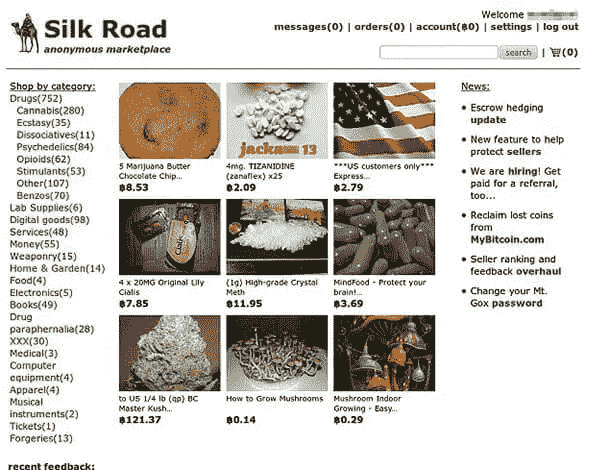
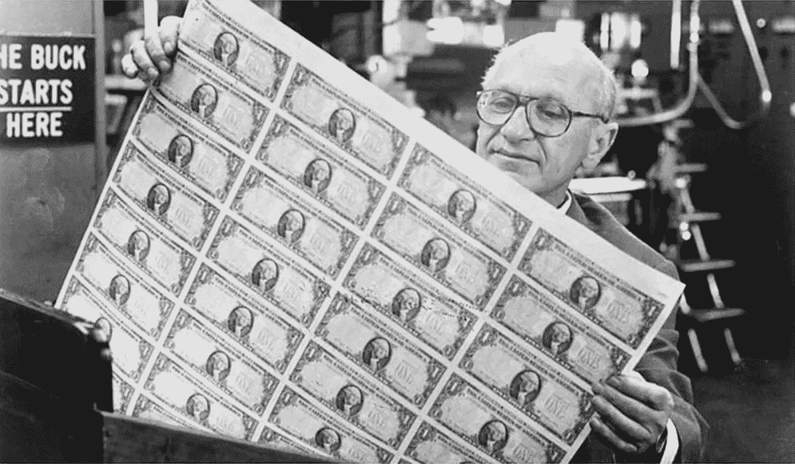

# 比特币时代在 18 年前就被预言了

> 原文：<https://medium.com/hackernoon/the-bitcoin-era-was-predicted-18-years-ago-9e0276ed1148>

## 比特币和加密货币的时代是如何被预见的，这对我们可能意味着什么。

17 年前，美国经济学家米尔顿弗里德曼(Milton Friedman)预测到了数字货币时代，他因在消费分析、货币历史和理论以及稳定政策的复杂性方面的研究，获得了 1976 年诺贝尔经济学奖。

**在 1999 年全国纳税人联盟进行的一次** [**采访中，**](https://www.youtube.com/watch?v=6MnQJFEVY7s) **弗里德曼说:**

> “我认为互联网将是削弱政府作用的主要力量之一。有一样东西不见了，但很快就会被开发出来，那就是可靠的电子现金。一种方法，你可以在互联网上把资金从 A 转移到 B，而 A 不知道 B 或 B 不知道 A。我可以把一张 20 美元的钞票交给你，但没有记录它来自哪里，你可能不知道我是谁。那种东西会在互联网上发展。”

这几乎是对比特币等加密货币工作方式的准确描述，你只需要接收者的公共地址，你甚至不知道对方的身份就可以向他们发送比特币。

例如，如果我想在一个在线论坛上给一个朋友发送比特币，他们可以简单地发布他们的比特币地址，我会复制并使用我的比特币钱包将比特币存入其中。比特币地址可以匿名，或者你可以像维基百科联合创始人吉米·多纳尔·威尔士那样，把你的名字和你的地址联系起来。

**弗里德曼也担心数字货币的犯罪用途**

“当然，这也有其消极的一面，这意味着从事非法交易的歹徒会有更容易的方法来做生意”

**丝绸之路丑闻**

丝绸之路是一个地下市场，用于网上毒品销售和其他非法物资及服务，包括雇佣职业杀手和购买枪支。这是通过使用 Tor 网络浏览器访问暗网和比特币来促进交易而实现的。

这又回到了弗里德曼的担忧，即犯罪分子能够从谨慎的数字现金的使用中获利。

全球货币的未来
去中央化的加密货币会取代旧的中央化法定货币吗？我将把它留到另一篇文章中。

**“如果你让联邦政府负责撒哈拉沙漠，5 年后沙子就会短缺。”——米尔顿·弗里德曼**

## **全程面试**

你可以观看上面的完整采访，弗里德曼从 14:32 开始谈论数字货币。

## **我希望你喜欢我的故事，请随意查看下面这些有用的资源:**

你可以用一个 [**账本 Nano S 硬件钱包**](https://www.ledgerwallet.com/r/4c54) **来保证你的加密货币安全无虞。**

您可以使用 [**CEX**](https://cex.io/r/0/up106280379/0/) 在世界任何地方购买比特币、以太坊、Ripple、比特币现金、Dash、比特币黄金、恒星流明等等

你可以在欧洲任何地方使用 [**BitPanda**](https://www.bitpanda.com/?ref=3127933809251797450) 购买比特币、以太坊、IOTA、OmiseGo、EOS、比特币现金、莱特币等等。

也可以在 [**推特**](https://twitter.com/CryptoniteTweet) **上关注我。**