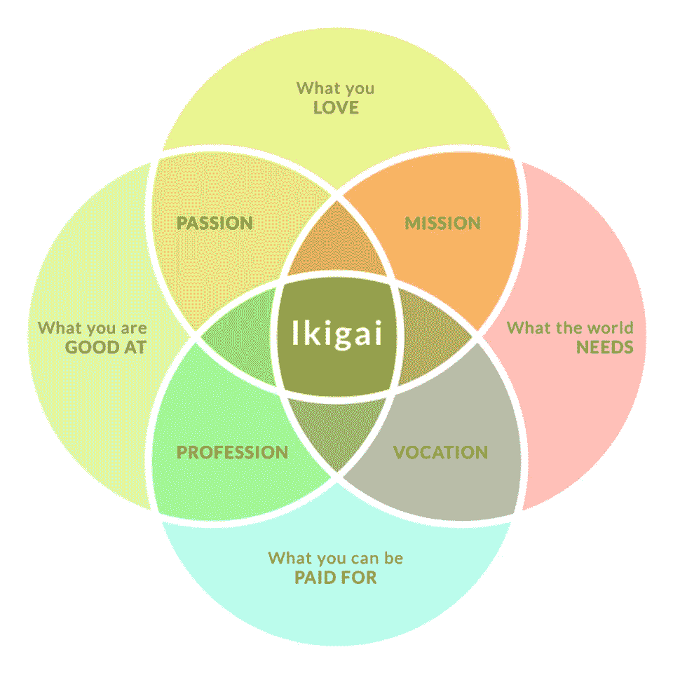

# 比特币 Ikigai

> 原文：<https://medium.com/hackernoon/the-bitcoin-ikigai-72f13bfd957f>

“Ikigai”是一种日本文氏图，其目的是指导你的选择，并帮助你找到人生的出路。它由四个圆圈组成，每个圆圈代表以下内容之一:

*你所爱*

*你擅长什么*

*你能得到什么报酬*

*世界需要什么*

你应该在中间，被四个圆圈包围着。至少花一些时间在比特币上做点什么是一个好的开始。如果你是一个霍德勒，这是你找到你的 ikigai 的机会。

如果你是霍德勒，你要么喜欢比特币，要么在未来某个时候会喜欢。你可能仍处于好奇阶段，尤其是如果你最近买了你的第一枚比特币，但如果你保留着它们，并抑制住恐慌抛售的冲动，你很快就会对它们产生好感。再者，你可以通过比特币找到你爱的东西*。直到找到合适的题材，我才知道自己喜欢写作。我知道我有创造性的一面，我知道我喜欢不时地培养它，远离现实，屈服于我大脑中想出来的任何东西，无论是一篇文章、一首歌还是一幅画。不管你有什么样的激情，将比特币融入其中不会对你有任何伤害。相反，它可能会给你的作品注入新的生命，吸引不同的观众。*

找到你擅长的事情可能很难。尤其是如果你考虑到催款-克鲁格效应。这个效果描述了无能的人无法了解自己的无能。知道自己是否擅长某件事需要与擅长这件事同等水平的技能。正如你最近可能注意到的那样，即使是总统也不能幸免。你做任何事情的经验法则是，如果人们欣赏它，你可能擅长它。无论如何，多了解一些任何学科都不会是坏事。此外，你并不真的需要擅长编程或写作或数学才能为比特币的成功做出贡献。稍微擅长说服人就够了。

你能得到的报酬不仅仅包括你的日常工作。如果你是霍德勒，比特币的采用会让你间接赚钱，因为更多的采用和更多的霍德勒意味着更高的比特币价格。然而，在绝对最好的情况下，你可以直接获得比特币支付。在小范围内，这可能比你想象的要容易。卖东西！互联网是一个金矿，你只需要找到一种方法来提取黄金。不要随大流，要努力找到自己的定位。从长远来看，这样做是值得的。

世界*需要*比特币。它需要好奇心，也需要知识。它还需要一个新的、全球性的、公平的价值转移体系，因为我们现在的体系糟透了。大时代。世界上目前的货币政策已经在很短的时间内将世界上一半的资源集中到了少数人的手中。他们让数十亿人没有银行账户，并要求我们几乎所有人都借出巨额贷款，才能够住在我们父辈和祖辈建造的房子里。我们越快更换旧系统越好。知识是红色药丸，需要开给每个人。做医生！

为比特币做点什么起初可能不会让你有饭吃，但将来可能会，帮助实现这个预言是非常值得的。可能是你的 Ikigai。