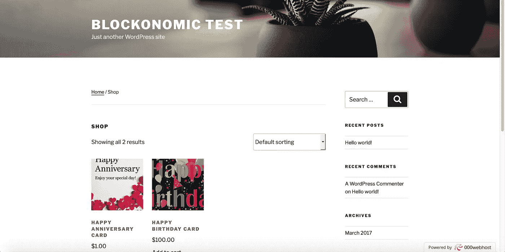

# 比特币革命

> 原文：<https://medium.com/hackernoon/the-bitcoin-revolution-42d7846b17a9>

当讨论“革命”一词时，脑海中浮现的画面通常是 1789 年的法国或 1775 年的美国的暴力(除非你是研究冷战历史的学生)。但是，有一种不同的革命可以引起同样的剧变，但往往会给社会带来巨大的好处。新石器革命是导致农业的技术变革，让第一个伟大的文明得以成长。工业革命创造了推动现代世界的伟大产业。绿色革命允许发展中国家种植足够的粮食来养活他们饥饿的人们。这些革命改变了社会和经济的运作方式。最近的革命是互联网革命，它改变了世界的大部分，但现在我们正处于一场与互联网携手并进的新革命之中:比特币革命(或者区块链，取决于你的观点)。当着眼于电子商务时，这两种革命的相互联系是最容易理解的，这也是本文要努力去做的。在我继续之前，我想指出，我不会看这两项发明的技术方面。其他文章和人比我更有资格做这件事，相反，我将纯粹着眼于用户方面。

Not that kind of revolution!

当审视互联网和比特币革命时，需要理解的重要一点是，两者都促进了去中心化、企业家和消费者更容易进入经济市场以及全球化。比特币和互联网都通过提供从任何有互联网连接的点访问商品和服务来提供去中心化。如果你愿意的话，你再也不用去银行或杂货店了。这使得崭露头角的企业家更容易进入市场，现在他们可以更容易地销售商品，更多的人可以购买产品。这反过来又促进了全球化。尽管权力下放，但也出现了全球化，因为现在跨国界的通信和经济交流变得更加容易。这看似矛盾，但可以通过理解今天的全球化在很大程度上是基于个人，如政府或大公司来解释。比特币和互联网革命的所有这三个方面都可以通过电子商务来看待，特别是 WordPress 以及它如何能够并且已经与比特币结合，以促进这三个方面并创造新的经济增长。

Decentralized yet also globalized

小企业是政客们的热门话题，正如最近约翰·奥利弗小品的开篇所表达的。然而，正如在同一视频中后来指出的那样，他们经常把它们扔到公共汽车底下。比特币和互联网为促进小企业发展提供了另一种选择。互联网为小企业主打开了一个巨大的市场。到 2021 年，估计将有 21.4 亿人成为数字买家。那是一大堆人。

Cue Carl Sagan voice here.

这提供了一个巨大的机会，这是企业家们正在响应的号召。越来越多的销售在网上进行。

There’s that Carl Sagan voice again.

但是企业家需要一个可以用来开店的软件。答案越来越多地出现在 Wordpress 及其电子商务平台 Woocommerce 上。在斯堪的纳维亚，Wordpress 如此普遍，以至于它的竞争对手基本上不存在。它提供了一个易于使用的系统和高度定制。人们可以很容易地设置他们商店的设计，并可以使用由其他用户制作的大量插件来增加功能。这为普通人打开了电子商务的大门。人们不再需要租用店面，每天去店面，希望有人会停下来，支付租金和空调等费用。现在，一个人需要的只是互联网、一台电脑和一个存放商品的地方。这促进了权力下放，许多经济机构不再需要，取而代之的是人们在自己的房子外经营企业。

WordPress offers high customization, so you can make your site as nice…or ugly…as you like!

随着互联网的发展，全球化也在增长，因为任何人都可以访问 WordPress，企业家可以在世界范围内销售他们的商品，只要他们可以被运送。这就是比特币革命的由来。除了支付系统之外，比特币提供了一个机会来实现 WordPress 在建立小企业方面的相同目标。即使有了互联网，处理国际贸易的问题也会很困难。货币是第一个问题。信用卡和 PayPal 有所帮助，但两者都有自己的问题，主要是需要与金融机构联系或支付大笔费用。比特币提供了另一种选择:一种去中心化但也全球化的货币。不需要担心银行或大笔费用，也不需要为国际贸易兑换货币。有些人已经在研究如何更大规模地采用这种技术，你可以在 [Blockonomics 是一家提供快速简单的比特币支付解决方案的初创公司](/p/b12ac9eb306f#/page1)，他们已经通过包括 PrestaShop 和 Magento 在内的许多商店迅速传播开来。然而，焦点是 Woocommerce，因为它的基础和目标是如此的相似。比特币和电子商务合在一起，可以启动一场新的经济革命。

技术变革推动经济增长。最近的技术变革也是如此。互联网和比特币革命将在未来几年对经济产生巨大影响。它既分散了市场，也促进了全球化。这使得许多新人作为生产者和消费者参与到市场中来。如果政客们真的像他们声称的那样喜欢小企业，他们就会支持这两次革命。我们将看看他们是否会。