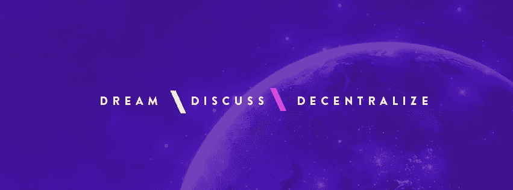
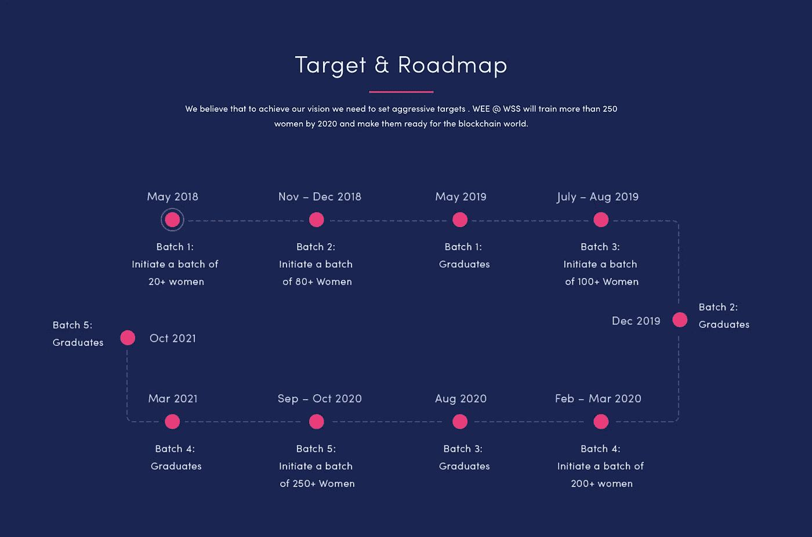

# 区块链将成为新德里的热门话题

> 原文：<https://medium.com/hackernoon/the-blockchain-is-set-to-become-the-talk-of-new-delhi-1731a97213a9>

## 黑客正午+世界 Satoshi 峰会

Hacker Noon 将作为东南亚最大的区块链会议[世界智慧峰会](https://goo.gl/yWRkmg)的媒体合作伙伴。它将于 5 月 12 日和 13 日在新德里 JW 万豪酒店举行。预计将有 3500 多人参加。会议的三大主题是:**梦想**、**共商**、&放权。和黑客正午的语言一样。

会议旨在“促进一个世界的愿景，在这个世界上，每个社区、经济、组织和国家都以不信任的方式工作，没有因人类的贪婪和错误而导致的腐败和低效，我们发起了一场运动，让每个人都聚集在一个屋檐下，围绕区块链和加密货币进行思考、讨论和创新。”

[您可以在此处](https://goo.gl/yWRkmg)购买折扣代码为“WSSHKN”的机票，享受七五折优惠。会议还为初创企业提供团体价格折扣，以及女性与会者的折扣。

世界智慧峰会汇集了众多演讲嘉宾:

[Full List.](https://worldsatoshisummit.com/#section-speakers)

两名顶级黑客正午投稿人将报道这一事件:

*   [Oak Elevate](http://www.oakelevate.com/)CEO&Hacker Noon 撰稿人 [Ankit Kumar](https://medium.com/u/df6cc92ec6ec?source=post_page-----1731a97213a9--------------------------------) 。他还将在一个关于代币经济的小组讨论会上发言。如果您想向他简要介绍您的区块链计划，请发邮件给他。
*   [Authorito Capital](https://authorito.com/)CEO&Hacker Noon 投稿人 [Mohit Mamoria](https://medium.com/u/24f7fbc09357?source=post_page-----1731a97213a9--------------------------------) 。如果你想向他简要介绍你的区块链计划，请给他发短信。

世界 Satoshi 峰会还将推出[女性经济赋权倡议](https://worldsatoshisummit.com/wee)和 [Nova-Stride 鲨鱼坦克风格 ICO 推介。](https://worldsatoshisummit.com/nova)

许多伟大的初创公司都是在推介活动中获得早期资金的，从这一点来看，区块链和加密货币初创公司与其他初创公司没有什么不同。随着许多区块链顶级投资者的出席，我预计有几家公司将通过 Nova-Stride 起步。你可以在这里看到被选中的[家公司](https://worldsatoshisummit.com/ico)。

峰会的妇女经济赋权倡议是一项雄心勃勃的计划，旨在将会议收入的一部分重新投资于资助区块链妇女教育——以下是其路线图:

More info @ [https://worldsatoshisummit.com/wee](https://worldsatoshisummit.com/wee)

在像今天这样的日子里，有来自世界各地的贡献者是非常令人兴奋的。情报的传播不考虑国家或民族的边界。这一活动将汇集一些世界上最伟大的区块链思想，你可以在 hackernoon.com/world-satoshi-summit 的[阅读我们即将到来的故事。](https://hackernoon.com/world-satoshi-summit/home)

> [您可以在此处](https://goo.gl/yWRkmg)购买折扣代码为“WSSHKN”的世界智慧峰会门票，享受七五折优惠。**梦**，**议**，& **放权。**
> 
> 如果你想让《黑客正午》报道你的科技活动，请[给我们](mailto:partners@amipublications.com)发消息。