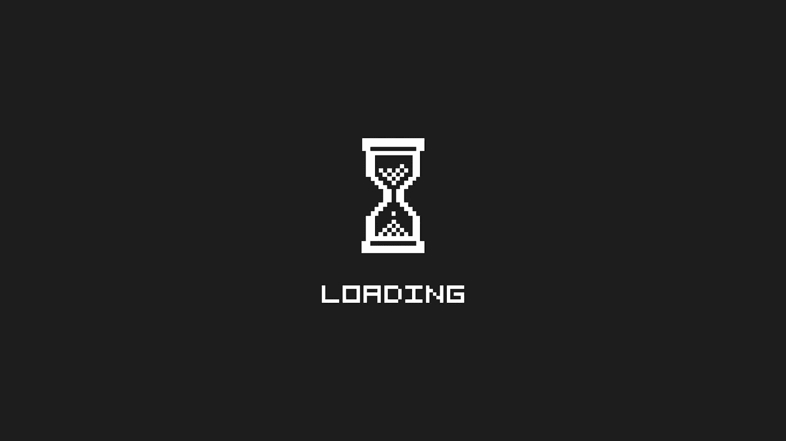

# 区块链技术将改变一切…我们仍在等待

> 原文：<https://medium.com/hackernoon/the-blockchain-technology-will-change-everything-and-we-are-still-waiting-f4270bf525cd>

> 改变的秘密是集中你所有的精力，不是与旧的斗争，而是建设新的。

我们已经读到了很多关于[【区块链】](https://hackernoon.com/tagged/blockchain) [技术](https://hackernoon.com/tagged/technology)将如何在各个领域改变我们的世界，智能合同是一场革命，以及去中心化将如何帮助我们获得令人难以置信的服务并夺走大型社交网络公司的权力。

但对任何人来说都很清楚的是，在这个问题上，事实上并没有太多变化，我并不是说技术没有能力改变和增强行业，而是我们有一个焦点问题。

我们不能忘记，每个创业公司都必须创造人们想要并愿意使用的创新产品和服务。作为开发者和设计者，区块链技术给了我们大量的应用可能性。然而，实际情况有所不同，区块链生态系统已经成为一个投机行业，一种基于不太可能的想法产生资金的过度狂热，以及少数人通过投资成为百万富翁的希望。

就我个人而言，我试图将技术视为一种为人们创造不可思议的东西的工具，确实有许多人因 ICO 热而赚了数百万美元，但我们可以选择创造有助于让我们的世界变得更美好的技术，或者只是利用这个时机。最终，我们可以自由选择我们想做什么，我们是什么样的专业人士，我们想通过我们的工作给世界带来什么。

这项技术并没有一个内在的意图，是由我们把它变成一场造福大众的革命，还是继续玩投机游戏。

新的一年开始了，我真的很渴望看到所有新项目浮出水面，我真的希望 2018 年是区块链技术改变一切的一年。

现在，我没有什么可以祝福他们有一个伟大的一年，他们所有的目标都实现了，他们建造了令人难以置信的项目。

编码快乐，新年快乐！