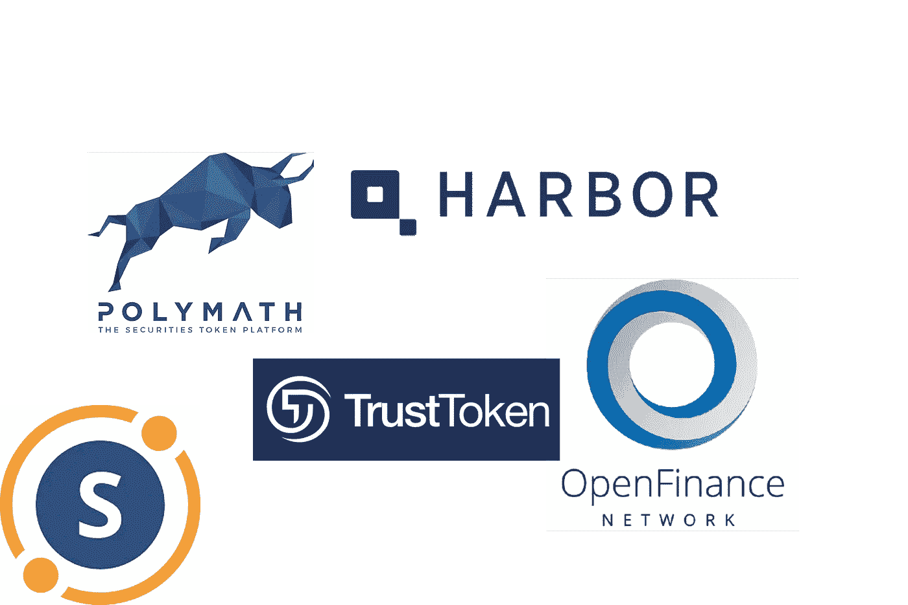
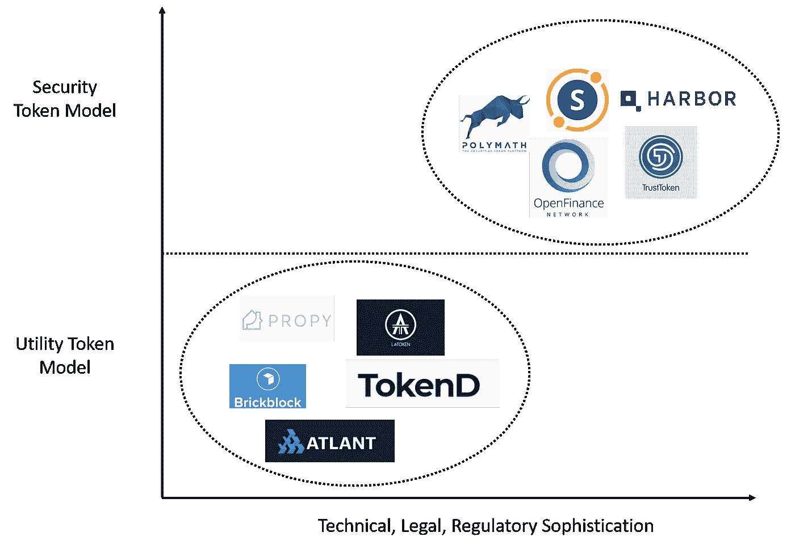
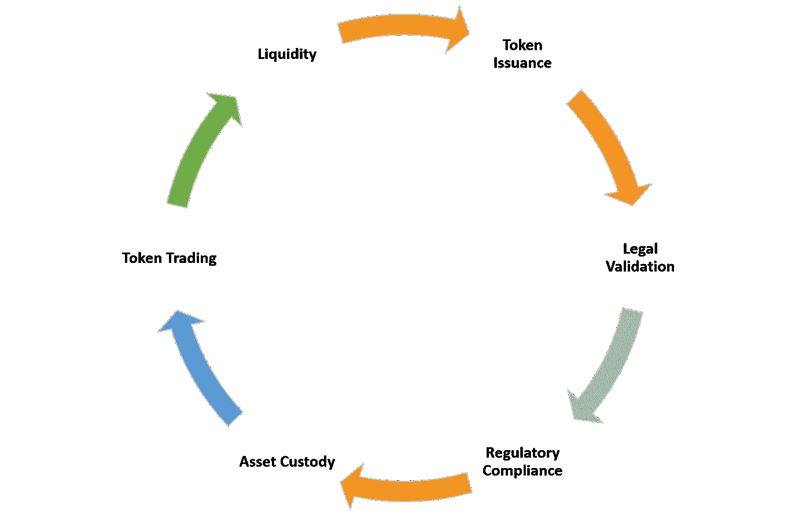
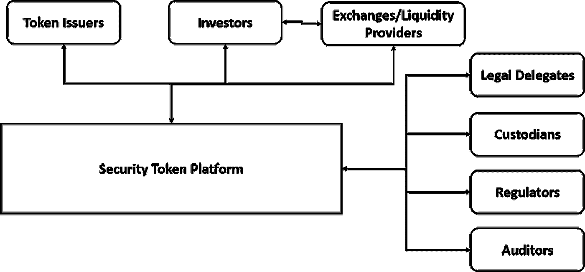

# 安全令牌平台的模块

> 原文：<https://medium.com/hackernoon/the-blocks-of-a-security-token-platform-cd8aada4af43>

在我上一篇关于安全令牌的文章中，我们讨论了围绕新的资产类别构建一个健壮的生态系统所必需的一些关键组件。在这些组件中，安全令牌平台是将安全令牌引入更广泛的加密货币市场的关键组成部分。为了理解安全令牌平台，我们应该看一看它的一些基本构件。

第一代安全令牌平台刚刚出现，如[证券化](https://www.securitize.io/)、[信任令牌](https://www.trusttoken.com/)、[港湾](https://harbor.com/)和[学者](https://polymath.network/)等技术领先。从市场发展的角度来看，这一组技术可以被视为早期一组技术的演变，早期一组技术试图使用传统的公用事业代币来对区块链的房地产、艺术品或钻石等替代资产类别进行代币化。在我看来，第一代资产令牌化平台的绝大多数产品尚未被主流采用，因为它们缺乏法律、技术和监管元素来实现关键功能，如法定部分所有权、股息发放、治理等。然而，第一组技术为第一代安全令牌平台铺平了道路。

# 什么是安全令牌平台？

安全令牌平台的目标是管理安全令牌从创建到交易的自动化生命周期。更具体地说，受监管加密资产的生命周期中有几个要素应该成为安全令牌平台不可或缺的一部分:

如果您阅读 Polymath、Securitize 或 Harbor 等安全令牌平台的白皮书，您会发现它们的架构模型和协议有许多共性。这些通用组件有效地代表了安全令牌平台的一些基本构件。如果我们将这些构建块组合成一个安全令牌平台的抽象体系结构，我们将得到如下图所示的内容:

安全令牌平台组件的具体角色是什么？让我们回顾一下上图中的几个例子:

a) **基础令牌:**该组件表示安全令牌标准，它是在平台中创建的所有安全令牌的基础。诸如 [Harbor 的 R-Token](https://harbor.com/rtokenwhitepaper.pdf) 、 [Polymath ST20](https://polymath.network/st20.html) 或 [ERC-884](/coinmonks/ tokenising-shares-introducing-erc-884-cc491258e413, 2018) 提案等标准为这种令牌模型提供了基础。

b) **效用令牌:**许多安全令牌平台使用效用令牌来补偿网络中的一些内部参与者。 [Polymath 的 POLY](https://token.polymath.network/) 就是这种模式最好的例子之一。

c) **令牌发放者:**这个角色代表了将在平台上被令牌化的替代资产的所有者。

d) **投资者:**这些是个人购买者和交易者或证券代币。

e) **法律代表:**通常，安全令牌需要真实世界中发生的链外法律过程。因此，安全令牌平台应该提供智能合约，概述律师事务所或公证人等实体在替代资产令牌化中的角色。

f) **托管人:**安全令牌通常由现实世界中的资产抵押，如房地产租赁或私人公司的股票。在令牌化过程中，这些资产应使用信托公司或特殊目的载体(SPV)等机制由第三方保管。这些参与者的角色也应该通过智能合约来抽象，我喜欢称之为托管人。

g) **监管机构:**安全令牌的发行和交易受制于监管模式，如 KYC、反洗钱和许多其他特定于国家或行业的合规机制。任何可行的安全令牌平台都应该提供与几个监管服务的交互，这些服务也是通过智能契约抽象的。

h) **检查员:**我们如何证明安全令牌背后的替代资产的价值？检查员负责定期审计和认证与安全令牌相关的资产的价值，并向网络发布相应的报告。

i) **流动性提供者:**流动性提供者的作用是确保证券代币可行的可交易性。从安全令牌交换到 Bancor 等替代工具，流动性提供商是安全令牌平台的重要组成部分。

还有许多其他相关的安全令牌平台构建模块，但上述列表代表了理解这种新型加密资产 DNA 的良好开端。随着安全令牌的增长，我们可以看到安全令牌平台的几个基础模块演变成独立的生态系统，专注于实现安全令牌生命周期的特定方面。