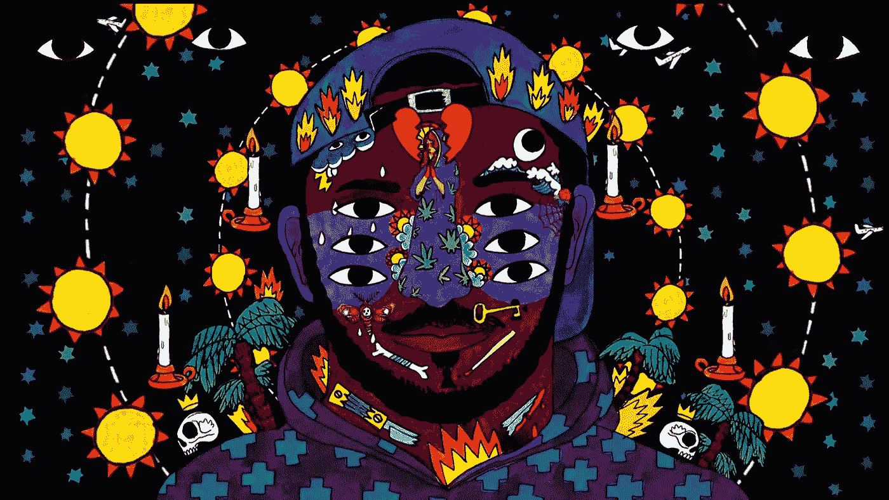

# 身体是一种算法:构建健壮人工智能的 3 课

> 原文：<https://medium.com/hackernoon/the-body-is-an-algorithm-3-lessons-for-building-robust-ai-8a7afd388bbe>

## 你从出生起就生活在一个算法中——人体。

[Ricardo Cavolo](http://ricardocavolo.com/art/) reminds us to use all our eyes.

身体在存在的每一刻都在处理高维数据模拟。你和我都生活在现实的模拟中，一个由我们的大脑创造的模拟。大脑从我们的五种感官获得输入，[预测世界将会是什么样子](http://slatestarcodex.com/2017/09/05/book-review-surfing-uncertainty/)，然后将预测与实际发生的事情进行比较。它会记录错误并不断改进算法。对于如何构建健壮的人工智能系统，这是一个极好的模板。

## 1.不要忽视疼痛。

大脑尽最大努力防止身体受到伤害。如果你的大脑在预测算法中出现了错误，这个错误最终可能会对你的身体造成伤害。例如，如果您错误地模拟了楼梯的宽度，您可能会从楼梯上摔下来，摔伤膝盖。

疼痛的存在是为了向大脑发出信号，需要对算法进行更新。大脑以更高的保真度保存事件发生前和发生过程中发生的感知数据，以便可以用来更新世界模型。这就是为什么在诸如车祸这样的创伤性事件中，时间似乎变慢了。[时间实际上并没有变慢，只是我们记住了更多的数据。](https://www.youtube.com/watch?v=zESOKXasIcI)

在人体中，我们有疼痛信号来告诉我们算法的错误在哪里。在业务上，我们有客户支持部门。如果您未能捕捉到错误，它会在客户的支持请求中显示出来。他们会告诉你什么时候算法在伤害他们。

如果你公司的高管忽视这些信号，伤害肯定会发生。我们看到，由于高管们生活在自己的泡沫中，用手指捂着耳朵唱着“啦-啦-啦-啦”，FaceGoog 继续对世界造成损害。

Dreamlands imagined by [Ricardo Cavolo](http://ricardocavolo.com/art/)

## 2.保证充足的睡眠。

和我们一样，我们的算法也必须休眠。算法的休眠是以修正模型的形式出现的。毕竟，这是睡眠对人体的重要作用之一。

如果你今天走下楼梯，没有什么不寻常的事情发生，你今晚会睡觉，你的楼梯预测模型不会有新的更新，因为那天没有收集到新的信息。然而，如果你摔倒了，你的大脑会保留所有相关感官数据的丰富记忆——摔倒时你的胳膊和腿在空间的位置，你看到的，听到的和触摸到的一切。当你在新的预测模型中睡觉时，所有新的数据都将被压缩，下次你走下楼梯时，将使用新的预测模型，这样你就不太可能再次损坏身体。

睡眠是删除不包含新信息的记忆，并在有新信息的地方更新预测模型的过程。健康的电子人将与他们的算法有关系，他们每天都审计和纠正错误。

**随时更新。**算法永远不会 100%准确。即使它们是，世界也不是静态的，所以我们的算法也不可能是静态的。没有健康的算法，就没有用疼痛信号引起我们注意的信息来更新算法的健康过程。

世界每天都在变化，我们作为算法制作者必须跟上。当更大的环境改变时，人类仍然需要评估输出和返工。算法制作者的手艺更像牧羊人或园丁，而不是分析师或程序员。

## 3.相信你的五官。

品尝、触摸、闻到、看到和听到你周围的真实世界中发生的事情，也就是说，在发布之前与你的真实客户一起测试。你可以通过尝试你对算法的调整来避免或减少痛苦，通过获得所有…那个词怎么说来着——主动。在发布之前，确保你的算法运行良好，从而避免伤害。

亲自测试，和真正的客户一起。无论你在建造什么，看看他们的身体和情绪反应。倾听他们的情绪反应，而不是他们的话语。在你发布你的算法之前，一定要用真人*来测试你的算法*，看看这些数据是否和你，人类，在你和你的客户 1:1 互动时所看到的一样。

> 故事是有灵魂的数据。
> –布伦·布朗，[勇闯荒野](https://www.amazon.com/Braving-Wilderness-Quest-Belonging-Courage-ebook/dp/B06XFLFSRY/ref=la_B001JP45BA_1_3?s=books&ie=UTF8&qid=1528758795&sr=1-3)

我们不能忽视来自与其他人类直接互动的丰富数据。故事杂乱、矛盾，而且没有任何令人放心的小数点或有效数字。我们不能让数字的便利和整洁分散我们与我们的算法所影响的人进行真实对话的注意力。

# 我们最大的希望是成为健康的电子人。

> **参与式人工智能**是 [Joy Buolamwini](https://www.npr.org/2018/01/26/580619086/joy-buolamwini-how-does-facial-recognition-software-see-skin-color) 对我们应该努力实现的目标的优雅描述:不是只存在于电影描述中的有抱负的人工智能，而是与人类智能完全共生的人工智能。一个执行繁重的数据处理任务的人工智能——由人类纠正、调整、重新定向。作为人工智能实际工作方式的一个更加准确的模型(至少在中短期内)，参与式人工智能也破坏了天网的幻想和末日景象，或者自动化导致的大规模失业——相反，它帮助我们想象一个更美好的未来**。
> –**[**琥珀案例**，如何设计更好的互联网](/@caseorganic/how-to-design-a-better-internet-calming-technology-humanizing-the-algorithm-and-a-new-xerox-parc-e4d702be8787)

人类的下一次进化依赖于我们创造良好的环境，让我们的算法能够成长。就像一个依赖父母的孩子一样，没有我们，算法什么也做不了。我们今天的算法真的很原始。也许他们会超过我们，但那是在离今天很远很远的某一天的另一篇媒体文章。

现在，我们有一个巨大的机会成为健康的电子人，与算法合作，使我们成为最大，最大胆，最善良，最有能力的版本。

## 更多来自我的信息:鼓掌，加入我的列表或者查看我的播客，关于技术、爱和创造力的。我们采访了每一个人，从天体物理学家和谷歌的创始人，到耶鲁大学毕业的律师，他在中国建立了一个佛教尼姑团，到虚拟现实游戏的创造者，以诱导恍惚状态。

❤危机

 [## 3 个迹象表明你是人工智能数据崇拜者

### 相信自己的眼睛，不要只看小数点。我在一个邪教中长大。自从 12 年前离开后，我一直在研究…

hackernoon.com](https://hackernoon.com/3-signs-youre-in-the-ai-cult-of-data-c429327cf577)  [## 有证据表明我们生活在模拟环境中

### 你感知为现在的时刻已经过去了。好消息是——我们可以黑掉模拟系统。

hackernoon.com](https://hackernoon.com/evidence-were-living-in-a-simulation-yanny-laurel-audio-illusion-79ebf0461b9c)