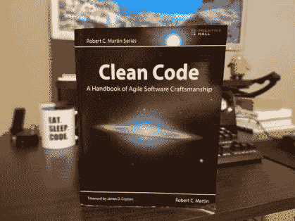
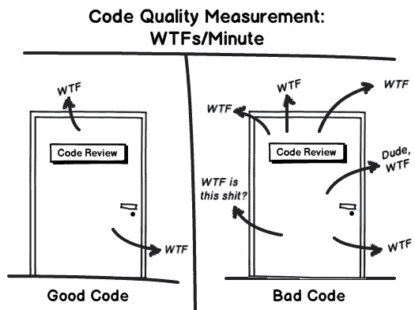

# 每个程序员都应该读的书

> 原文：<https://medium.com/hackernoon/the-book-every-programmer-should-read-33b5ef2e532a>

编写任何一个会阅读的程序员都能理解的代码，是软件开发人员的**必备技能**。事实是:只有 20%的程序员有这个能力。

> “任何傻瓜都能写出计算机能理解的代码。优秀的程序员会写出人类能理解的代码。”—马丁·福勒


Photo by [Fabian Grohs](https://unsplash.com/@grohsfabian?utm_source=medium&utm_medium=referral) on [Unsplash](https://unsplash.com?utm_source=medium&utm_medium=referral)

当我开始关心代码的可读性时，我注意到我的代码开始变得:

*   更易于维护
*   更容易重构
*   可重复使用的
*   一致的

# [书](https://amzn.to/2MF8ES7)



[罗伯特“鲍勃叔叔”马丁的《干净的代码:敏捷软件工艺手册》](https://amzn.to/2MF8ES7)是干净的程序员圣经。这本书谈到了代码、行为、自动化测试等等。

## 来点实际的吧！写有意义的名字。

其中一章讲述了有意义的命名。在这个故事中，你将是代码阅读器。看看这个函数:

```
def calc(n1, n2)
  return n1 / n2
end
```

你认为“calc”是这个函数的好名字吗？鲍勃叔叔会说:不！为什么？

1.  “calc”是**的缩写**:不要！
2.  函数做一些事情。必须用一个**动词**命名。
3.  即使我把“calc”改名为“calculate ”,它仍然是模糊的。我们需要通过赋予函数名更多的含义来改进**语义**。

这个函数将两个数相除。“分”是一个很好的名字。

```
def divide(n1, n2)
  return n1 / n2
endresult = divide(1, 2)
```

我们仍然有问题。参数“n1”和“n2”没有语义。如果我们称它们为“被除数”和“除数”呢？“结果”变量也是如此。应该叫“商”之类的东西。

```
def divide(dividend, divisor)
  return dividend / divisor
endquotient = divide(1, 2)
```

更多的语义！

[如果你还不确信要读这本书，看看这幅图，买下这本必读的书吧！](https://amzn.to/2MF8ES7)



> 感谢您的阅读！别忘了在 [Medium](/@vnbrs) 、 [Instagram](http://instagram.com/vnbrs/) 和 [LinkedIn](http://linkedin.com/in/vinicius-brasil/) 上关注我。