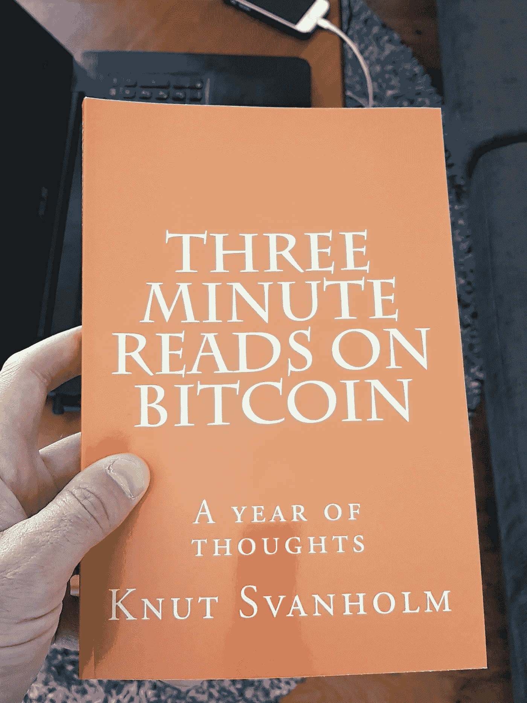

# 这本书

> 原文：<https://medium.com/hackernoon/the-book-f5da183ec50c>

自从我开始写关于比特币的文章，一年已经过去了。Hacker Noon 很快就找到了我，多亏了他们，我才能够在相对较短的时间内聚集了相当多的追随者。当我不久前浏览这些文章时，我意识到它们很好地总结了比特币在这一年中发生的事件，由此产生了一个想法。我要把它们编成一本书！现在，几个星期后，我在手机上看到一个通知，说有一个包裹已经到了我当地的取件点。这个包裹可能包含以下物品之一:Saifedean Ammous 的书《比特币的标准》(The Bitcoin Standard)，两件通过闪电网络(Lightning Network)从 Blockstream 商店购买的“不要相信，验证”(Don't trust，verify)t 恤，或者我自己的书《比特币三分钟阅读——一年的思考》(Three Minute Reads on bit coin——A year of thinks)。我现在就不写了，去当地加油站取包裹。

又回到房子里了。我的书到了。四份校对稿将送给选定的朋友和家庭成员。希望我能在一周左右的时间里发布最终产品。之后呢，谁知道呢？我真的很喜欢这样做，我肯定会写更多的东西。也许我会以其他方式为比特币社区做贡献。我不知道何时或如何，但我会产生*的东西。*我开始喜欢不知道。对于创意企业来说，一年似乎是一个很好的时间框架。

最后，我要感谢[黑客正午](http://hackernoon.com)发布了我的东西，为我提供了源源不断的读者。加入比特币社区是我强烈推荐的事情。我与之交谈过的人都非常友好，但也非常坦诚地表达自己的观点。我喜欢这样。我坚信，在我们这个时代，诚实的辩论是非常被低估的，我向那些为自由思想者提供诸如 Hacker Noon 平台的人致敬。我会尽快发布这本书的链接！谢谢大家！