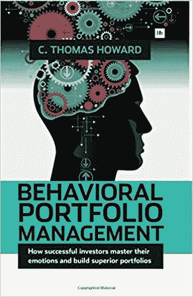

# 这本书改变了我管理加密组合的方式

> 原文：<https://medium.com/hackernoon/the-book-that-changed-how-i-manage-my-crypto-portfolio-dc41471d29d1>

*免责声明:本文分享的点数是基于我个人对* [*加密货币*](https://hackernoon.com/tagged/cryptocurrency) *空间的理解。它们不是财务建议，也不应被视为当前市场环境的具体证据。一如既往，请自行研究。*

# [行为投资组合管理](https://www.amazon.com/Behavioral-Portfolio-Management-Thomas-Howard/dp/0857193570)

托马斯·霍华德著

自 2008 年金融危机以来，人们开始关注行为金融学和经济学。为了跟上不断发展的金融世界，托马斯·霍华德在投资组合管理中开发了一种传统的现代投资组合理论的过渡方法。

这本书教授如何围绕行为和情绪开发投资组合。

**书中讨论的三个原则:**

1.  情绪人群主导着定价和波动
2.  行为数据投资者赚取高额回报
3.  投资风险是表现不佳的可能性

这本书关注的是整个传统市场，但没有提到加密货币市场。然而，讨论的原则可以应用于管理你的加密投资组合。

主要话题围绕投资中的情绪。加密货币市场是情绪化投资者的缩影，这使得这本书成为制定投资策略的完美指南。

**实施行为组合管理**

三个关键点:

1.  重新引导你的情绪
2.  利用市场情绪
3.  减轻你的情绪对投资组合的伤害

波动性是衡量情绪的标准，这本书讨论了如何解决投资组合波动性的问题。就加密货币市场而言，逆向投资方法可能是最好的方法——在繁荣时卖出，在绝望和愤怒时买入。与大众背道而驰可能是一种令人生畏的经历，但在情绪驱动的市场中，这可能是你的救赎之恩。耐心是对抗波动的重要特质。

# 个人观点

这本书完美地描述了加密货币市场上发生的事情，在这个市场上，白皮书中的一个承诺就可以决定将要获得的改变生活的金额。有例子表明，这本书违背了传统的投资哲学，比如 100%投资于股票市场比分散投资于其他资产类别更好。这本书也违背了多样化的理念。我相信这对没有受过教育和不理智的投资者来说是非常危险的。

进一步考虑后，他的想法完全有道理。如果投资者希望实现回报最大化，他应该选择波动性最大的资产类别，但要接受足够的教育，在合适的时机进入和/或退出市场——这是一种情绪化的反向投资。多样化只是被视为防止任何情绪化倾向的缓冲。过度多元化绝对会损害业绩。

我强烈推荐所有加密投资者看看这本书。它提供了一个非常有趣的视角，改变了我管理自己的加密组合的方式。

让我知道你对这本书或加密货币市场的总体想法！

— — — — — — — — — — — — — — — — — — — — — — — — — — — — — — —

在 [Medium](/@iliyazaki) 上关注我，以获得我即将发表的文章的即时更新，在这些文章中，我讨论了围绕加密货币、一般投资和技术分析的主题。

 [## 加密货币:散户投资者应该知道的(第一部分)

### 声明:本文中分享的观点是基于我个人对加密货币领域的理解…

hackernoon.com](https://hackernoon.com/cryptocurrencies-what-retail-investors-should-know-part-1-f81738d5b8) 

也请在其他社交媒体平台关注我:
[推特](https://twitter.com/IZCrypto)
[Youtube](https://www.youtube.com/channel/UCrq04Mv5pAhKCilZROQ2jjg?)

— — — — — — — — — — — — — — — — — — — — — — — — — — — — — — —

Iliya Zaki 是 Moonwhale Ventures 的营销和社区经理。

Moonwhale Ventures 是一家咨询公司，为公司、中小企业或上市公司的[区块链](https://hackernoon.com/tagged/blockchain)应用提供咨询，以提高价值链的效率，并通过 ICCO STO(令牌化)为业务扩张提供新的创新融资方式。

*   更多信息请访问我们的网站—[http://moonwhale.io/](http://moonwhale.io/)
*   在我们的各种社交媒体平台上关注我们。—
    [insta gram](https://www.instagram.com/moonwhalebv/)
    [Twitter](https://twitter.com/MoonwhaleBV)
    [LinkedIn](https://www.linkedin.com/company/moonwhalebv)
*   加入我们的电报全球集团—【https://t.me/moonwhaler】