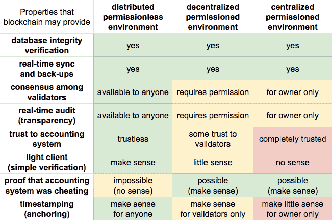
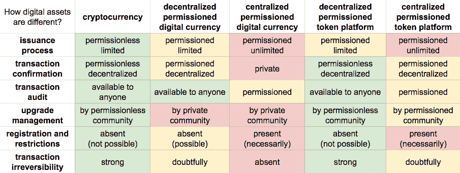
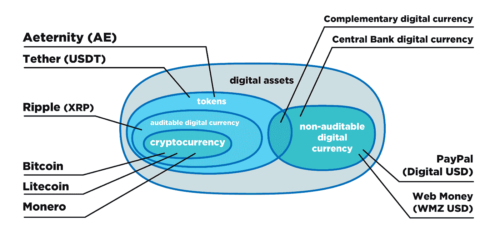
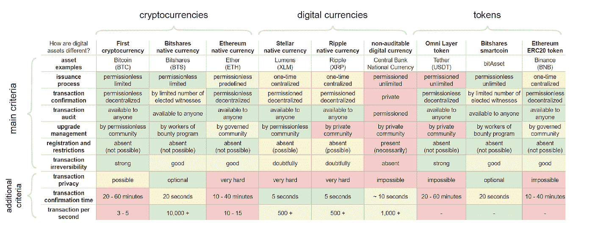

# 数字资产的广泛分类

> 原文：<https://medium.com/hackernoon/the-broad-classification-of-digital-assets-4d6ad6a6a067>

我们已经生活在大多数资产都被数字化的时代。基本上，我们正稳步走向任何价值的数字化。最重要的是，区块链科技的发展趋势表明，我们将逐渐放弃中介，转向个人控制和管理我们的资产。为了理解如何与它们一起工作，我们应该知道它们应该如何分类。这篇文章也将对那些对金融科技感兴趣的人有所帮助。

# 什么是什么

数字资产是任何价值的数字化所有权。这是最精确的定义，虽然它没有说很多，所以我们深入研究一下。通常，数字资产可以分为两个基本类别:

1.  有限审计的数字货币(PayPal 的数字美元或央行数字货币)。事实上，它们几乎是不可审计的，这意味着你不能保证过程的真实性，而只能相信那些管理它们的人。
2.  令牌，其核算更加透明，因为某些流程可以审计。

*密码令牌是一种记账单位，用于表示某个值的数字余额，而令牌的所有权则通过某种密码机制来证明，例如数字签名。*

# 区块链和这有什么关系？

在上述信息的背后，你可以得出一个意想不到的结论——数字资产基本上是由它们“存在”的会计系统定义的。因为会计系统的属性决定了你管理资产的方式以及它们之间的区别。

区块链是赋予会计系统某些属性的技术。让我们检查一下。

如您所见，区块链提供的属性根据其应用的环境而有所不同。*无权限—普遍可访问(不需要权限就可以在帐户中交互)有权限—要参与帐户，权限是必不可少的。*

显然，高度分散的环境与区块链技术相结合，允许会计系统最终实现最大限度的功能。尤其是在这种情况下，你几乎可以肯定地保证验证者(那些相互参与系统决策的人)的合谋是不可能的。令人愉快的是，您不需要信任验证器。

尽管如此，即使在集中许可的环境中，交易由一方确认，区块链仍能带来某些好处:

*   如果出现这种情况，普通用户可以得到他们被欺骗的证据。即使是数据库的唯一持有者也无法将形势变得对自己有利。
*   你可以保证数据的完整性。
*   在不限数量的服务器之间实时同步数据(这排除了整个系统的单点故障，增加了正常运行时间)。

# 数字资产的分类标准

为了了解各种数字资产之间的差异，人们应该了解其会计系统中的某些流程是如何提供的。这就产生了对资产进行分类的标准。这些标准的各种状态的组合区分了它们的会计系统。

该图表很详细，可能看起来很费力，但是如果只比较两种最有特色的资产，您会得到主要的想法:

*   **加密货币**。去中心化的最终水平，信任因素最终被消除。会计系统的管理是相互完成的。
*   **集中许可的数字货币。所有的过程都依赖于一个私有社区，因此，用户没有其他选择，只能盲目地信任验证者。中央银行数字货币就是一个例子。**

# 分类

现在，根据上图的标准，我们将考虑特定种类的资产，并将所有东西放置到位(欧拉图)。

因此，有两大类:代币和经许可审计的数字货币。

# 不可审计的数字货币

除了 Paypal 的数字美元，这一组还包括国家数字货币，其中所有的会计流程都由中央银行管理。然而，价格总是与国家货币的价格相联系。

# 代币

Token 本身只是某个数字记账系统中的一个内部单元。不过，有趣的是，根据不同的情况，token 可以有不同的属性(由以下各项支持):

*   股票
*   数字义务
*   某种货币
*   所有权
*   获得任何服务的权利

令牌可以以两种方式发布:集中式(在某个组织的控制下)和分散式(根据预定义的算法)。在这种情况下，token 是一个非常抽象的数字资产类别，它根据上下文获得特定的功能。

# 商品支持的代币

显然，这些是由任何商品支持的代币:)记账(管理、存储、发行等)是由服务提供商或保存实际商品的组织在集中的基础上完成的。

一个代币由固定数量的商品支持。它将由托管人担保。参考图表(区块链可能给出的属性)，这可能是分散或集中许可环境的情况。*如果其中的代币是由某个组织的商品支持的，则原则上不可能使会计无权限。否则就不是一个组织了。*

# 股票代币

在这种情况下，股权是在企业或任何资金流动中的份额。会计工作通常由一个集中的机构进行。一个代币代表特定数量的股份或任意百分比的现金流。这种核算的处理可以有两种方式:集中(由保存人)或分散(由独立验证人团体)。道是(或曾经是:)一个股权分散会计的好例子。

# 数字收藏品

一个数字收藏家的项目。*注:未数字化，但初始数字化*。所以，这不是关于实物收藏家物品的数字化所有权。这在数字领域是独一无二的。与其他类型的令牌的主要区别在于，它们永远不可互换。这种想法在 CryptoKitties 项目中得以实现。

# 会计凭证

这种类型的令牌是合理的，当你需要保持计数的东西，在这一点上，没有必要转移它。例如，数字身份——它是唯一的，永远不会被转移，因为它属于每个人，如身份或名誉。最常见的是，会计过程是集中的:管理，发行，存储和审计。

# 可审计的数字货币

这些也是加密令牌，但它们与我们刚刚讨论过的令牌的区别在于，它们具有货币属性。除此之外，它们可以很容易地被审计。这一类的代表之一就是加密货币。

# 加密货币

加密货币是一种*独立的数字货币*。独立性是这里的要点，通过分散以下流程来实现:

*   **发行**。系统中的新硬币将根据算法发行，该算法基于预先确定的货币政策。
*   **交易验证**。任何人都可以参与交易验证过程。
*   **可用性**。该系统是开放给所有人使用(它没有注册或许可)。
*   **数据存储。**每个人都可以获得数据，也就是说，每个人都可以存储和验证数据，这使得交易不可逆转。当你在公众面前时，你无法愚弄任何人。
*   **审计。**每个人都可以和其他节点同步，验证交易历史的准确性。
*   **治理。没有人拥有最终的决策权，相反，它们是通过论坛上的讨论共同做出的。**

不用说，加密货币的初始代码和规范应该是开源的。最终，我们刚刚考虑的所有属性只有在一个足够大和开放的社区的情况下才有可能。

即使你复制了比特币的初始代码，这是一种为去中心化数字货币设计的代码，并创建了一个只有你才能控制的分叉——它也不会是加密货币。

# 其他可审计的数字货币

这是关于还不是加密货币的数字货币，因为一些过程不是分散的，尽管数据库可以由任何或一些外部方审计(这与不可审计的数字货币有显著区别，在不可审计的数字货币中，它都是基于信任和信心的)。这是许多人经常感到困惑的地方，因为他们认为这是一种加密货币，但实际上不是。

涟漪和恒星就是很好的例子。硬币的发行和分配是集中的，尽管每个人都可以审计整个数据库并验证交易历史的准确性。

# 各种会计制度及其特性

最后，我们想分享一下我们制作的对比图。它展示了各种会计系统所具有的特性。它实际上相当庞大，需要一篇单独的文章来全面回顾它。另一方面，它在这里也不会不合适，因为对它进行分析，你将能够根据它们给出的实际属性，对特定的会计系统有一个客观的看法。

# 结论

数字资产只是一条漫长而先进的道路的开端。然而，很难对各种各样的人进行统一的分类。在这里，我们试图提出一些基本标准，这些标准可能有助于人们理解数字资产之间的差异，并且不会陷入“购买新的改进加密货币”的陷阱。