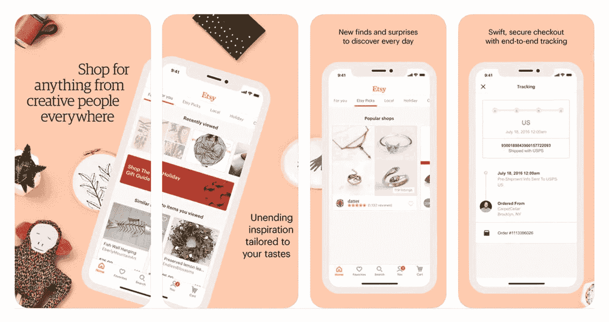
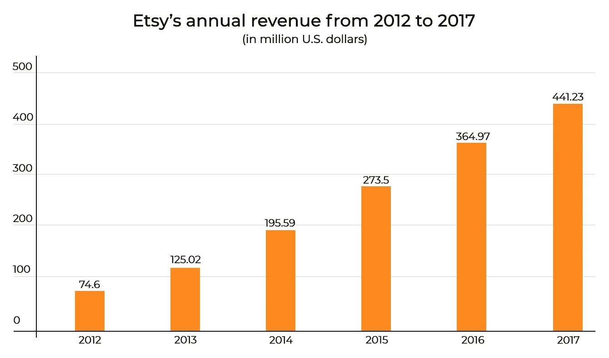
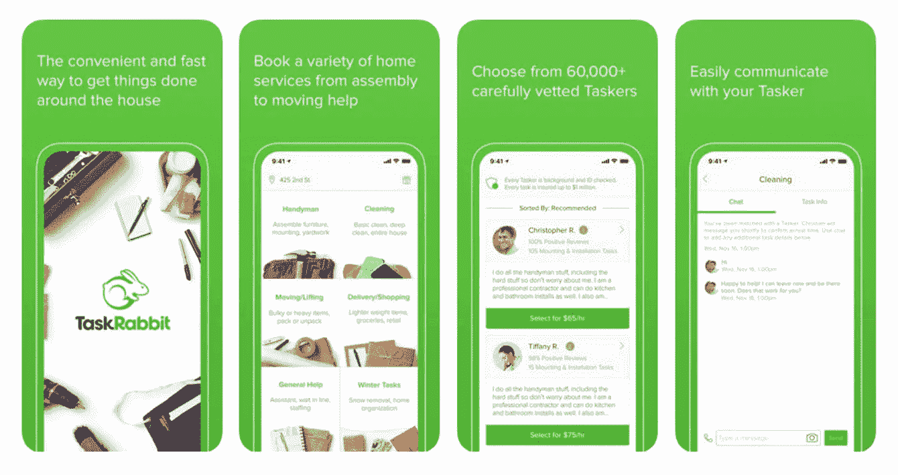
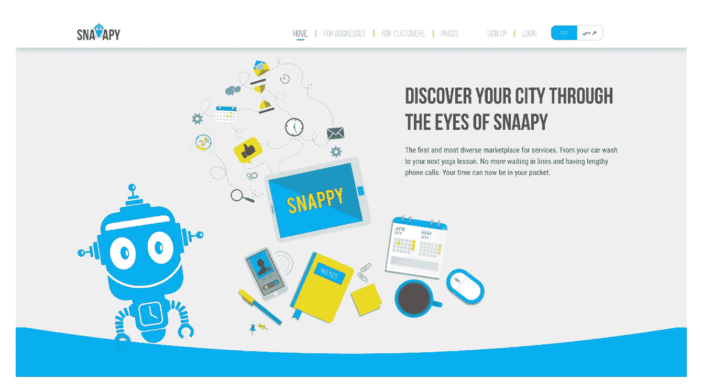
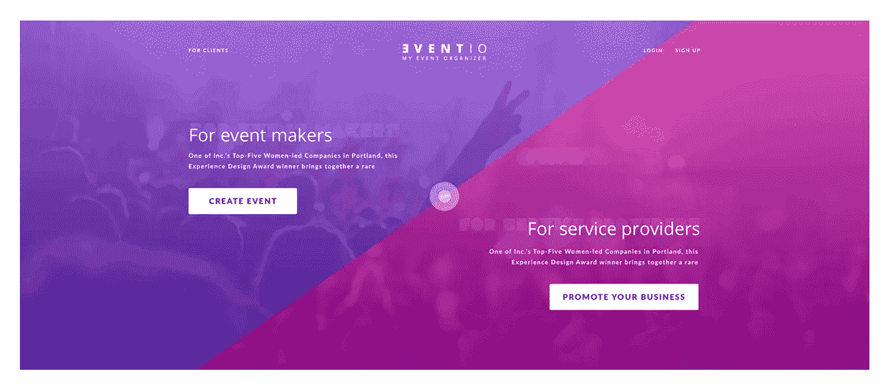
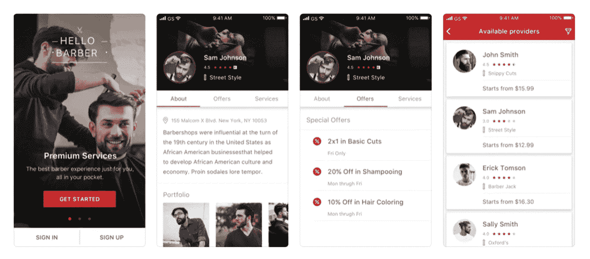

# “在线 P2P 市场的基石”

> 原文：<https://medium.com/hackernoon/the-building-blocks-of-online-p2p-marketplaces-307144ba0e7f>

市场商业模式被证明是成功的，并获得了很大的吸引力。对等市场平台的想法已经被应用到大量可行的用例中。例如，仅在 AngelList 上就有 1239 个市场平台。企业家看到了点对点电子商务的价值，因为它让他们能够在全球范围内团结用户，实现高效交易。根据普华永道的数据，到 2025 年，这个市场的价值将达到 3550 亿美元。

在这篇文章中，我们将告诉你如何开始一个在线市场，并提供一些点对点市场的例子。

# 什么是点对点市场？

点对点市场平台是一种在线商业模式，买家和卖家在这里交换产品和服务。例如，Etsy 允许卖家向消费者出售他们的手工制品。优步让你可以叫一辆车去任何地方。买家和卖家通常可以在 P2P 平台上转换角色，因为他们之间没有明显的区别。今天你可以成为优步的骑手，而明天你就可以轻松地成为一名车手。换句话说，两个用户组都可以在对等市场上交换商品或服务。

P2P 市场平台消除了连接消费者和产品或服务提供商的中介。这有助于降低商品和服务的成本，实现更快的交易时间，并使双方的购买过程更加方便。

例如，假设你是一名手工艺者，你想卖串珠首饰。建立一个商店是耗时的，并且需要你的大量投资。然而，你可以使用一个类似 Etsy 的平台来托管你的串珠首饰。平台有活跃的用户群，可以成为自己的网店。或者想象你要搬到一个不同的城市。你可能会决定在 Airbnb 或 HomeAway 上出租你目前的公寓，而不是卖掉它。你不必在报纸上登广告。您只需将在线服务与库存管理系统、实时分析引擎和自动定价工具结合使用。

让我们看看一些行业参与者是如何通过他们的市场解决方案获得成功的。

# 点对点电子商务的著名玩家

## 爱彼迎（美国短租平台）

Airbnb 的故事挺有意思的。早在 2007 年，它被称为充气床垫和早餐。创始人 Joe Gebbia、Brian Chesky 和 Nathan Blecharczyk 发现没有适合旅行者的酒店房间，于是决定创建一个市场网站。

2007 年，美国工业设计协会(IDSA)召开了一次会议。因为这是业内最大的活动之一，所有的酒店都超额预订了。乔、布莱恩和内森决定解决这个问题。他们在客厅里放了床垫，并创建了一个网站，为这个周末的房间做广告。结果，三个客人付钱让他们在他们家过夜。

Airbnb 现在在全球 81，000 个城市拥有超过 450 万处房产。10 年来，他们接待了超过 3 亿人次的客人入住。他们的东道主赚了超过 410 亿美元。

Airbnb 一直专注于加强核心体验，例如为用户提供住宿。他们没有在应用程序中添加不必要的功能，而是坚持解决让人们出租房屋的核心问题。

如今，该平台允许用户过滤搜索结果，预订共享空间、私人房间、整栋房屋、度假屋、独特空间、住宿和早餐以及精品店。

## 布拉卡尔

BlaBlaCar 是一家法国拼车初创公司，它成功开发了一款市场应用，为人们节省了金钱和时间。该公司有三位联合创始人:首席执行官弗雷德里克·马泽拉、首席运营官·尼古拉斯·布鲁森和首席技术官弗朗西斯·纳佩兹。

早在 2003 年，弗雷德买不到回家的火车票，就让他姐姐载他一程。这是一次相当长的旅程。在坐他姐姐的车旅行时，弗雷德看到了他本可以乘坐的那列火车，以及许多向他要去的方向行驶的汽车。那些车厢里有很多空座位。弗雷德突然意识到，这些座位也可能被其他旅行者占用。这就是建立市场的想法诞生的时候。后来，Fred 与 Nicolas 和 Frances 合作，将人们与同样长途旅行的司机联系起来。

BlaBlaCar 吸引了游客和司机。汽油很贵，BlaBlaCar 让司机和别人分担费用。另一方面，想在昂贵的车票上省钱的旅行者可以和不介意同伴的司机一起乘车。

虽然 BlaBlaCar 只是一个在线市场软件，但人们信任它。如果他们没有，为什么他们会愿意上一个完全陌生人的车？在要求搭车之前，用户会表明自己的基本信息，如姓名、偏好和乘车期间的交谈意愿。这有助于建立信任。此外，旅行者提前付款，所以没有欺诈的机会。

BlaBlaCar 的想法已经起飞。现在，该公司从乘客支付给司机的费用中抽取一定比例。BlaBlaCar 上有 3500 万会员，该公司声称是最大的人力运输社区，在 22 个国家提供服务。

## Etsy

喜欢手工和复古的东西？如果是这样，Etsy 是第一个要去的地方。罗布·卡琳、克里斯·马奎尔和海姆·斯科皮克创建了 Etsy，让人们出售他们制作的商品。这发生在 2005 年，当时联合创始人之一想要找到一把制作精良的吉他，于是在网上搜索。这促使他认为许多手工艺者会喜欢一个能让他们聚在一起提供产品的地方。Etsy 允许数以千计的手工艺者在一个在线目的地出售他们的商品。

Etsy 的增长很大程度上归功于买家和卖家的热情。Etsy 发言人亚当·布朗说:“我们与其他电子商务网站的真正区别在于你获得的真实的个人联系和感受。”。“你又不是在买东西。这就像你在和这个人交流。”

Etsy 成功填补了一个空白，让供应商创建个性化的在线空间，向数百万购物者推广他们的手工制品和复古用品。该公司靠上市费和每笔销售额的提成为生。

我们只选择了一些受欢迎的市场平台，但还有很多其他平台，如 Ebay、TaskRabbit、Craigslist、DriveNow 和 GoFundMe。

# 如何建立一个市场网站:基本构件

是时候创建一个在线市场了。在这一部分，我们将列出推动点对点市场发展的主要概念。

# 点对点商业模式

我们都想得到最好的交易。传统上，如果你想购买某样东西或预订某项服务，会有人来促成这种互动。在物流领域，它是一个经纪人；在房地产领域，它是一个代理人；有了出租车，就是调度员。换句话说，通常有一个中间人。在在线解决方案的情况下，平台本身成为这个中介，允许买家和卖家相互联系。

让我们看看 Etsy 的商业模式是如何运作的。Etsy 向卖家收取商品上市费。每件物品的刊登费为 0.20 元。然后平台从网站上完成的销售中抽取 3.5%的费用。Statista 显示，该公司的年收入有所增长。2016 年，Etsy 赚了超过 3.64 亿美元。2017 年，其营收增长至 4.41 亿美元。

市场应用为共享经济开了一个好头，因为它们去掉了中介。人们在平台上运营，它向他们收取费用或百分比。这个费用比你以传统方式购买商品或服务要低得多，所以如果你在一个平台上购买商品或服务，你实际上可以省钱。

# 聚焦生态位

当开始一个网上市场时，你应该明白问题在哪里，并用技术解决它。BlaBlaCar 和 Airbnb 非常善于发现问题并锁定一个利基市场。Airbnb 发现人们想要出租他们的公寓。BlaBlaCar 专注于那些想分担长途旅行费用的司机和乘客。

我们的一个美国客户曾经是法律行业的中介。因为他们非常了解这个利基市场，所以他们决定创建一个市场平台，将法庭记录员、翻译、摄像师和其他法律服务专业人员与法庭联系起来。我们为我们的客户开发的这个[按需法庭报告平台](https://steelkiwi.com/projects/uber-for-court-reporters-making-court-staff-available/)叫做 NexDep，它让我们很容易找到适合法庭听证的人。客户可以张贴听证会的详细说明，法律服务提供商可以回应这些要求。

如果你想开发一个市场，你应该做同样的事情——发现一个问题并使用市场商业模式解决它。创建一个平台可以归结为帮助两个市场连接起来，并消除对中介的需求。

# 便利性和灵活性

点对点市场平台很方便。它让顾客快速找到商品或服务。Airbnb 允许人们方便地浏览出租的房产。你需要做的就是去网站或者手机 app，找到一个带图片的住宿选项列表。您可以根据客人数量、住宿类型、价格、旅行类型等进行筛选。然后，您可以在平台上查看带有评论和评级的房源详情，并直接预订。

如果你去 Etsy，你会发现各种各样的卖家提供他们的手工制品和古董。这些卖家不必创建单独的网站或建立实体店。该平台可以展示他们所有的商品，成为卖家的网上商店。

TaskRabbit 是一个协作性的点对点空间，可以让你找到经过验证的任务执行者，他们可以到你家为你完成任务。也许你不知道如何修理你的破椅子，或者你的水管堵塞了。该应用程序具有不同的任务和与您的查询匹配的任务者数据库。

换句话说，这个不断增长的市场，一种服务和商品的易贝，允许用户通过每个平台提供的功能轻松地进行交互和交易。

# 信任

如果你想你的网上生意成功，你应该与你的用户建立信任。如果你设法在你的平台上建立信任，你就能越来越快地扩张。

建立信任意味着您应该:

*   应用可操作的评级系统
*   管理你的内容
*   把你的重点放在供应上
*   给你的服务一点人情味
*   建立验证策略

让我们分别谈谈这几点。

可操作的评级系统。大多数服务都有星级评定系统，帮助交易双方对用户进行评定。例如，优步和 Lyft 要求司机和乘客对他们的体验进行评分。这些评级让公司过滤掉不良用户，并随着每次互动而改进。优步的司机被允许拥有不低于三星级的评级。因此，骑行者不必担心体验不佳。

用户期望你已经从系统中清除了糟糕的服务提供商。实施一个可行的评级和审查系统会让你更好地了解谁是你的用户。它还可以通过禁止用户来帮助您停止滥用和欺诈行为。

**策划内容。**有了这么多选择，客户没有时间去质疑你平台上的内容。作为一名策展人，你应该雇佣那些会发现和展示最好内容的人，并降级或删除不合适的内容。

Airbnb 列出了可疑的公寓，但是很难找到。一般来说，Airbnb 的最佳房源是人工和算法监管的结果。也就是说，你应该获得一个手册或编辑许可证来留住用户。因此，您可以确保您的用户找到他们想要的东西。

**关注供给。**你需要专注于支持你的供应商——在你的平台上下单的卖家和服务提供商。虽然许多人习惯于在网上购物和订购服务，但很少有人习惯于运送产品或出租房屋。为供应商创造一个简单且有指导意义的体验至关重要。例如，你可以为你的供应商提供免费的装运箱，或者给他们展示服装的人体模型。有了 Lyft，司机们可以得到手机充电器和一本关于如何成为一名礼貌司机的[手册](https://www.lyft.com/drive/help/article/1229200)。

您还可以为您的供应商建立论坛或社区空间，供他们讨论挑战和最佳实践。在 Airbnb 上，主持人可以谈论什么最适合房源，以及如何成为最好的主持人。

**人情味。用户希望你的软件快速、完美，但他们希望人类支持你的品牌。人们喜欢被关心的感觉。为了确保期望得到满足，买家收到订单，卖家得到报酬，公司应该建立客户服务策略。这种策略可以依靠电话和个人通信。例如，Homejoy 会打电话给顾客，如果他们报告糟糕的体验，会给他们折扣。**

**验证政策。**如果用户熟悉您的验证政策，他们进行交易的信心会增加一倍。您需要验证您的提供商和卖家，以提供高水平的服务。验证可以自动执行，或者管理员可以手动检查提供商和卖家的合法性。

在注册期间，想要为优步工作的司机需要上传一系列文件。这些文档包括驾驶员个人资料照片、驾驶执照、车辆保险、车辆许可证、车辆登记和其他文档。

为了增加透明度并在全球社区中建立信任，Airbnb 宣布了 Verified ID。验证 ID 匹配用户的在线和离线 ID。Airbnb 用户可以前往验证页面，确认他们在脸书或 LinkedIn 上的现有在线身份，并提供他们的个人信息或扫描照片 ID。为了验证他们的身份，用户提供的在线和离线名称必须匹配。

简而言之，你的平台应该是一个仲裁者和主要的验证中心，以帮助用户连接，或者更好地给他们更多的理由来连接。

# 如何建立一个市场

既然我们已经明确了是哪种理念让双边市场平台发挥作用，我们将告诉你如何构建一个平台。

您可以从头开始构建市场，也可以使用现有的解决方案或开源市场平台。您的选择将取决于您的预算和要求。

有很多平台，包括 Magento、Sharetribe、Drupal 和 Spree Commerce。现成的解决方案可能是一个良好的开端，但独特的功能需要定制实施。并非所有这些软件即服务(SaaS)平台都适合您的项目，因为其中一些是为电子商务目的而不是专门的市场而创建的。

例如，Sharetribe 适合市场项目，并根据你网站的用户数量收费。对于其他解决方案，如 Magento 或 Drupal，您必须购买 marketplace 扩展来管理您平台上的内容。你通常需要向 SaaS 市场的供应商支付托管、支持和各种更新的费用。

在 SteelKiwi，我们从零开始构建我们的项目。这使我们能够创建具有独特架构和设计的解决方案。

# 从零开始建立市场还是使用现成的解决方案？

从头开始建造。如果你有一个独特的想法，那么你需要一个定制开发的产品。定制产品可以在特性、用户界面和用户体验方面为您提供很大的灵活性。你可以选择任何你想要的技术。此外，使用定制解决方案，您将不必担心平台的速度。

从头开始构建时，您总是有机会扩展您的功能，因为您的解决方案将是可扩展的且易于支持。此外，您可以拥有独特的税务逻辑以及特殊的促销类型和购买奖励，并且可以轻松集成第三方服务来满足您的需求。但是你需要[雇佣一个开发者来建立一个定制市场](https://steelkiwi.com/blog/how-to-find-and-hire-a-python-django-development-company/)。

使用现成的解决方案。如果您时间紧迫，并且希望尽快启动，那么您可以使用现成的解决方案。你不需要花时间在线框、设计或测试上。现成的解决方案提供基本功能和免费支持。在某些情况下，您可以更改网站的 HTML 布局，给它一种新鲜感。您将为托管您的平台支付固定费用，另外，如果您想要小的定制，您可以随时支付额外的费用来实现这些。然而，用现成的平台建立一个市场并不容易。如果你没有编程技能，你仍然需要雇佣一个软件开发人员。

# 在线 P2P 空间的典型特征

双边市场平台的优势在于它具有无价的特性。当构建点对点市场软件时，你要为用户提供一套基本的功能。这样你就可以让你的参与者轻松地浏览你的平台。

**简介。**市场有两个用户角色:买家和卖家。每个用户角色的用户界面都不同。

**上市。**物品是你在平台上提供的服务或产品。您需要正确地实现这个特性，因为它对供应商和消费者来说是不同的。就供应商而言，他们应该能够添加、删除、修改、发布和取消发布列表。客户应该能够过滤，搜索和查看这些详细描述的清单。

**预订。在线市场的优势在于顾客可以在平台上预订服务。顾客可以查看预订详情。**

**付款。顾客应该能够通过你的在线平台支付。为用户提供多种支付方式，如信用卡、借记卡和 PayPal。有许多支付网关可以用来接受付款。最受欢迎的包括 Stripe、Omise 和 Braintree。**

**评论和评分。**您的平台应该为用户提供留下评论和评价产品或服务提供商的可能性。这使得消费者在购买服务或产品时能够做出明智的决定。更重要的是，留下评级和反馈会产生信任感和责任感。它还将帮助您进行管理，让您更好地了解您的用户群。

**通知。**因为服务和订单对消费者来说很重要，你的用户会喜欢[通知系统](https://steelkiwi.com/blog/push-notifications-services-how-to-choose/)。通知允许用户随时了解关键事件。例如，一个应用程序可以通知用户卖家正在处理他们的订单，或者显示订单已经交付。

# 建立在线市场的成本

既然你知道了建立双边在线市场的基本技巧，你可能会问:建立一个在线市场需要多长时间？没有放之四海而皆准的数字，因为每个解决方案都是独一无二的。

我们已经为点对点电子商务建立了相当多的解决方案。我们将采用我们建立的四个市场来说明大致的时间框架，这样您就可以计算成本。一旦你知道了大概需要多少小时，你就可以用这个数字乘以你雇佣的[开发人员的时薪。](https://steelkiwi.com/blog/top-7-compelling-reasons-to-hire-ukrainian-developers/)

Snaapy 是一个用于按需服务的空间，花了我们将近两年的时间来开发。这是一个相当长的项目，背后有一个伟大的想法。有许多用户角色:产品所有者、业务管理员、接待员、服务提供者和最终用户。我们从零开始构建 Snaapy，提供我们的[最佳全栈开发服务](https://steelkiwi.com/services/)。SteelKiwi 团队创建了项目的后端和前端。除了 UX/UI，我们还开发了原生的 iOS 和 Android 应用。我们发现实现 [Knet](http://knet.dralyd.org/Default.aspx?pageId=19) 支付网关是最复杂的，它只在科威特有效。

我们还从零开始建立了 Eventio，这是一个为娱乐和活动行业打造的[平台。Eventio 联合了与会者、活动策划人和供应商。我们花了大约 1200 个小时来建造 Eventio。我们从了解项目背后的想法开始，以便理解业务逻辑。然后我们创建了](https://steelkiwi.com/blog/how-to-create-the-best-local-event-app/)[项目需求](https://steelkiwi.com/blog/requirements-why-it-important/)并提供了 UX/UI，接着是开发。

NexDep 是一个[点播法庭报告平台](https://steelkiwi.com/projects/uber-for-court-reporters-making-court-staff-available/)，花了我们大约 500 个小时。我们需要了解如何将客户的线下业务转移到线上。我们花了时间进行冗长的访谈，将客户的需求转化为面向开发人员的技术文档。我们还从头开始构建这个项目，给它一个正式的外观和感觉。

我们建立的另一个市场空间提供按需理发服务。你好理发师的主要想法是让人们在任何他们想去的地方按需理发或修剪，无论是在家里还是在沙龙里。这个平台花了 800 个小时来开发。Hello Barber 是一家总部位于美国的初创公司，所以我们必须在四个时区工作。用户可能在一个时区，但他们需要适应另一个时区的理发店的时间表。使用不同的时区使得这个项目花费的时间有点长。

# 寻找市场软件开发公司？

如果你想用你的数字解决方案打入共享经济，你需要注意你试图用你的产品解决的问题。确定你的平台可以解决的问题是至关重要的，这样它才能为你的消费者带来价值。此外，您需要创建一个值得信赖的在线环境来促进安全的用户交互。从头开始构建你的市场平台将允许你把你的想法转化为智能代码，而使用开源市场平台可以节省你的时间和金钱。

我们建议浏览一下[我们的作品集](https://steelkiwi.com/projects/)，看看我们在这篇文章中提到的项目。如果你对如何建立自己的在线市场有任何问题或需要建议，请随时[联系我们](https://steelkiwi.com/contacts/)！