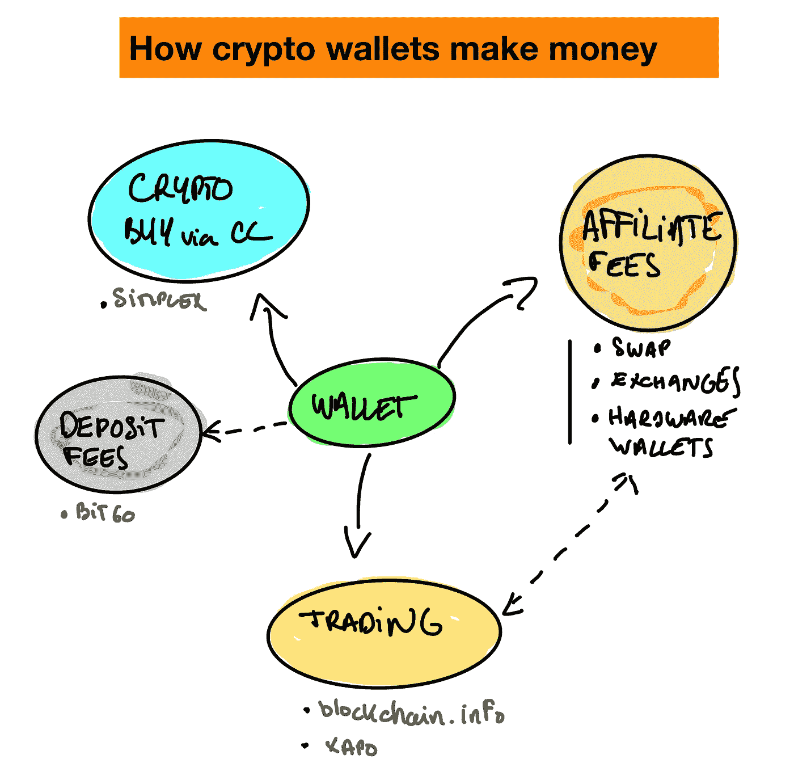
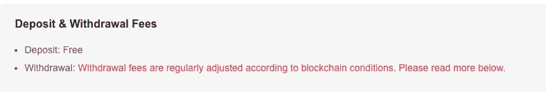
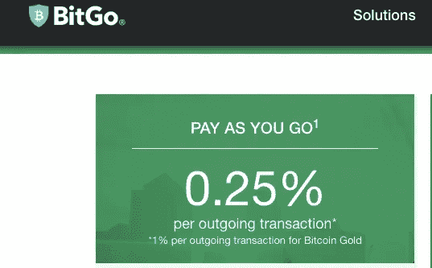
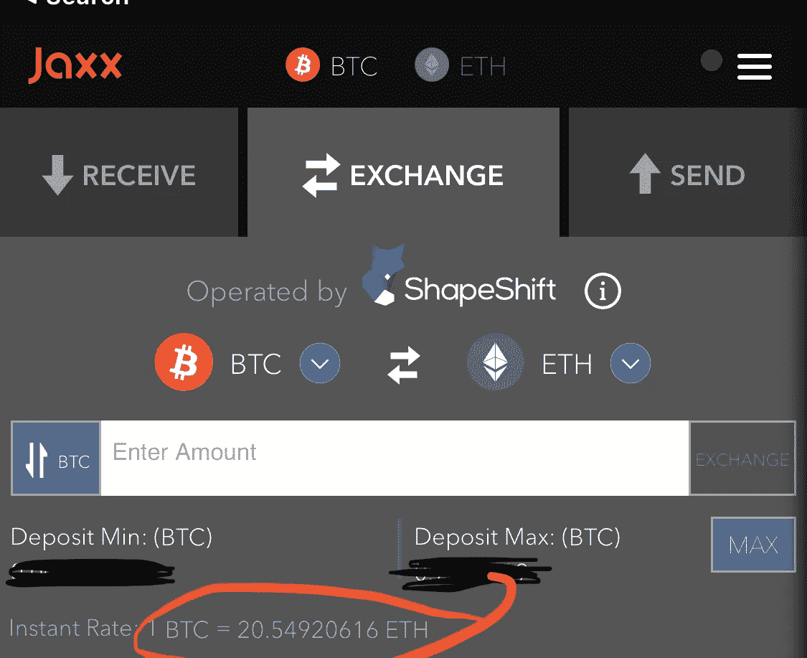
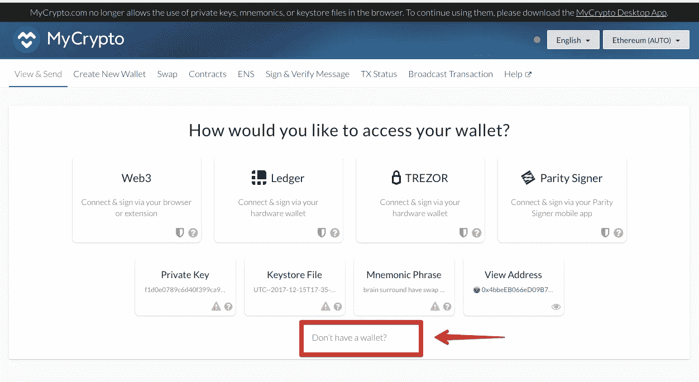
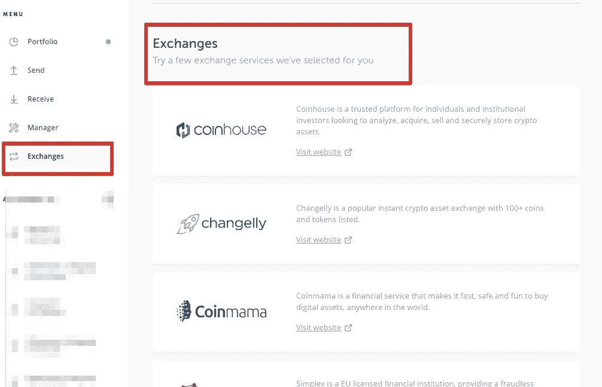
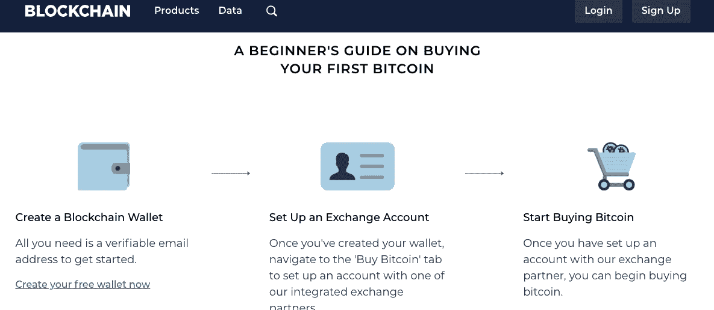

# 加密钱包的商业模式

> 原文：<https://medium.com/hackernoon/the-business-model-of-crypto-wallets-89aeed8322dc>

钱包一直让我着迷。但自从我进入加密领域以来，加密钱包一直让我特别着迷，因为它们是任何新领域旅行的起点和终点:中间没有银行。我一直很好奇的一件事是他们的商业模式，因为大多数都是免费下载的。所以我开始了解他们，了解他们是如何(或不)赚钱的。

在我们开始之前:加密钱包通常是免费软件或移动应用程序，使您能够管理您的加密资金:主机，发送，接收和公共/私人密钥管理。如果你问我，他们看起来都像传真机，但有些很受欢迎，甚至赚了大钱。这怎么可能呢？

# 钱包不从交易中赚钱

有一种误解，认为加密钱包通过在交易时降低费用来赚钱。这是被错误地安装的，因为一些交易所(通常被错误地认为是钱包)的做法，他们向用户收取高昂的资金转出(有时是资金转入)费用，还因为，尽管我们在菲亚特世界受过教育，我们相信任何参与货币交易的中间人都要收取费用。

钱包将向你收取的费用实际上是网络费用，旨在奖励那些参与确保交易安全并在账本上登记的矿工。钱包不是挖掘你的交易的人(虽然他们也可以操作一个独立的完整节点参与交易)

> 一般来说，比特币基地不收取使用我们托管的数字货币钱包服务的费用。将虚拟货币转移到比特币基地平台以外的地址可能会产生网络交易费用，如比特币矿工费用，比特币基地可能会将这些费用转嫁给你。任何此类转让费将在交易时向您披露。

From Binance

有一个例外: **Bitgo** 一个多签名钱包，它将对任何进出交易收取大约 0.25%的费用，以换取代表你的公司安全保管你的资金。Bitgo 的目标不是消费者，而是需要第三方托管的公司。

# 大多数钱包靠代销费生存

是的。那个模型。至少今天是。钱包，因为它们吸引了大量的用户和使用，能够挤进各种各样的好东西和明显的本地功能，这只不过是从第三方服务产生附属佣金的一种方式

最受欢迎的是通过 **Shapeshift** 或**changely**即时交换硬币的能力，他们有非常慷慨的合作伙伴计划，因为他们的价格通常远远高于平均市场价格。您为简单性付费，钱包会因此从服务提供商那里得到回报。

Jaxx allowing you to swap coins at a hefty rate with Shapeshift

最后，你会在一些钱包中发现一种直接用你的信用卡购买加密资产的服务。这些服务不是由钱包运营，而是与像 Simplex 这样的公司合作，这些公司将在交易中向钱包支付一定的费用。同样，用户为简单付费，钱包也因此得到服务提供商的回报

You can buy crypto from you wallet with Changelly or Simplex

钱包赚钱的另一种方式是为交易所创造流量，这些交易所准备为新客户支付高额费用。他们都有一个联盟计划。甚至硬件钱包(不是免费钱包的人)也展示它们

最后，一些软件钱包如 **mycrypto** 通过让你购买硬件钱包来赚钱(见下文)

Buying a 3rd party hardware wallet generate revenues for Mycrypto

我没有这些钱包公司的内部数据，但我准备好了，他们 90%以上的收入是基于这些收入线中的一个或多个。

# 硬件钱包有收入，但也有问题

硬件钱包(也称为冷钱包或热钱包)通常有一个更简单的收入模式。他们已经付钱了。价格从 50 美元到 300 美元不等。他们的硬件制造成本可能要低得多(不到 20 美元)，他们的利润非常丰厚，这使得他们能够提供[慷慨的](https://doc.satoshilabs.com/trezor-faq/affiliate.html)会员计划作为回报【例如，Trezor 有 10%的返现】

这种模式只有一个问题:普通客户的终身价值非常有限。你没有令人信服的理由(不像手机)每年购买一个新的硬件钱包。你买一个(也许两个备用)，就这样。理论上，这些公司没有更多的东西可以卖给你。

他们知道这一点，这就是为什么他们用附属链接来增强他们的软件，或者扩展到有前途的新领域(著名的“机构托管”)

Ledger hardware wallet inviting you to the affiliate program of some exchanges

# 混合型钱包/交易所

一些钱包允许你购买加密货币，但与第三方整合不同的是，它们直接操作交易。以 Xapo 或 Blockchain.info 为例，可以说是最大的加密钱包(也是最古老的钱包之一)允许你购买 BTC 和 ETH。他们将收取交易费，但有时也会在外汇兑换上赚钱

# 有些钱包不需要赚钱

许多加密钱包只是开源项目，并不打算赚钱。但是作为一个用户，你很快就感觉到了极限……免费是有代价的。

其他一些项目(例如, **Ethos** )不需要赚钱，因为他们从 ICO 中筹集了太多资金，收入绝对是他们日程表上的当务之急

最后，一些钱包甚至不需要赚钱，因为它们属于一个在其他产品线赚钱的实体，钱包对它们来说只是一个运营成本。Trust Wallet 就是这种情况，该产品在被币安收购之前没有任何收入，这种情况不太可能改变。

# 新边疆

所以总的来说，钱包要么依靠他们无法控制的收入生存，要么依靠生存时间短的收入生存。代销费从来都不是一项巨大的可持续收入:你永远不知道管道什么时候会干涸或关闭。

那么，加密钱包有没有一条可持续发展的道路呢？现阶段很难说。

最终，几年后，每个人都将拥有一个加密钱包，就像每个人都有一部手机和一部相机一样。加密钱包将会占据这个行业的大部分市场份额。如果你愿意的话，它们是网络的新浏览器或电子邮件客户端。而代销商收入甚至交易都不太可能成为维持运营成本(并不便宜)的方式。

我预计新的本土收入将出现，并将支持这一类别。现在看到他们出现还为时过早，但他们将与共识协议的运作方式紧密相连，并激励他们的利益相关者。

我还预计，用户将愿意直接(或间接)付费的额外收入会增加。因为，突发新闻:人们也为软件和服务付费。数十亿非游戏移动应用商店收入中的很大一部分表明了这一点。N26 或 Revolut 等新的银行模式证明，人们会为物有所值的服务付费。人们会为与钱包相关的服务付费。这是毫无疑问的。人们喜欢好东西。他们不会为坏东西付钱。这使我不同意下面的辩论

现在，如果感觉整个行业都在等待更好的时机。硬件钱包附属交易所与软件钱包合作，后者推荐交易所和硬件钱包。多好的旋转木马啊。当然，该行业需要扩张，而这只有在新的资金流入、新的监管规定出台、新的本土加密经济发展起来之后才会发生。钱包还在年轻时代。但是他们是这个秘密经济的基本组成部分[。](/lightspeed-venture-partners/fat-protocols-vs-fat-dapps-vs-fat-wallets-4d33ead29130?source=linkShare-454d729d5955-1534086778)

ps:这解决了非机构钱包的问题。机构市场(目前是试验性的和保密的)是非常不同的，会以非常不同的形式向客户收费。