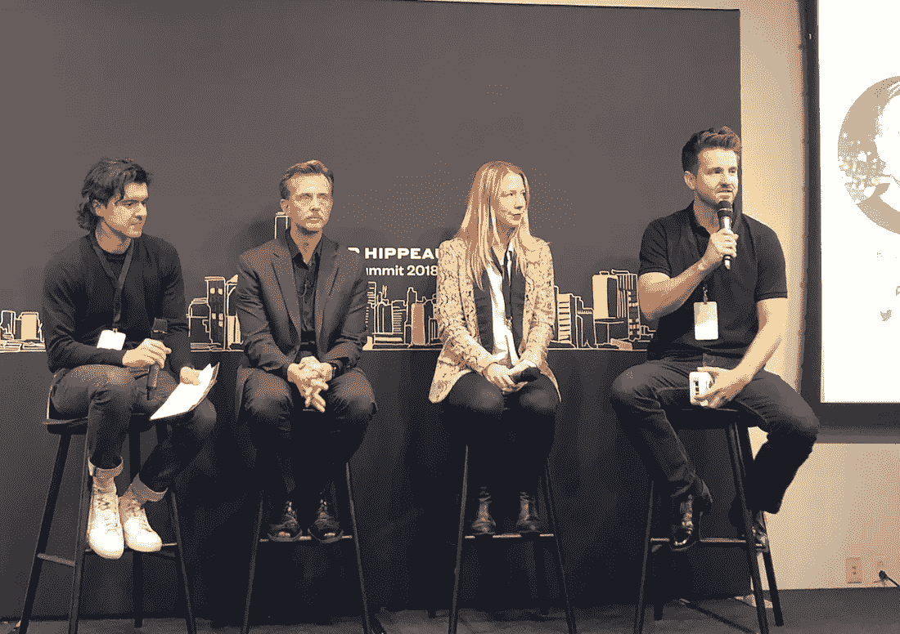

# 区块链应用的商业:来自凯西和 Casa 领导人的 4 个教训

> 原文：<https://medium.com/hackernoon/the-business-of-blockchain-applications-4-lessons-from-the-leaders-of-abra-and-casa-ed3d9c57eaf9>

Left to right: Julian Moncada, Senior Associate at Lerer Hippeau, Bill Barhydt, Founder of Abra, Carolyn Reckow, Head of Operations at Casa, and Jeremy Welch, Founder of Casa.

主持人:[朱利安·蒙卡达](https://medium.com/u/fac67804e1ee?source=post_page-----ed3d9c57eaf9--------------------------------)，高级助理

在最近的 2018 年 Lerer Hippeau 峰会上，我与来自 [Casa](https://keys.casa/) 的[凯西](https://www.abra.com/)创始人比尔·巴海德、杰里米·韦尔奇和卡洛琳·雷克肖进行了一次关于区块链空间的对话。比尔、杰瑞米和卡洛琳已经在区块链宇宙中运作了多年。他们经历了突破和失望。总的来说，作为经营者，他们通过将不懈的热情与无情的实用主义相结合而蓬勃发展。

以下是我们讨论的一些要点，crypto 内部和外部的创始人可以用来评估区块链的机会，并随着这项新技术的起伏而成长。

# **1。区块链并不是每个业务用例的正确解决方案**

不信任和去中心化的好处是有代价的，最明显的是速度和规模。虽然看到各种各样的应用程序旨在利用区块链理工大学令人兴奋，但事实仍然是，用户和企业都需要看到使用基于区块链的应用程序的投资回报率。对于某些用例，即存储和转移价值，投资回报率是存在的，而对于其他用例，不信任和去中心化的好处实际上很少。

# **2。不管市场有多热，永远不要认为你的下一轮融资是理所当然的**

2018 年夏天，美国股市仍处于 10 年牛市。公共和私人市场的许多投资者都指出了即将到来的衰退，但他们的声明却被预示着“历史新高”的头条新闻所掩盖。然而，事实仍然是，很少有创业公司经历或度过了他们的第一个真正的市场周期。与此同时，密码市场仅在六个月内就从其“历史高点”下跌了约 50%。

在这一点上，企业需要在牛市中保持一种保守的意识。陷入积极消息的浪潮中很容易让企业家认为融资是理所当然的。没有什么比在市场膨胀的假设基础上制定计划更让你陷入困境的了，结果却发现自己被拉下了地毯。

# **3。文化在上升和下降时期拯救公司**

在市场低迷时期，企业担心的不仅仅是资产负债表。下滑是对企业内部和外部利益相关者信任的真正考验。在市场低迷时期，雇佣合适的人并建立有弹性的文化可以从内部拯救公司和项目。仅仅因为这个原因，让团队成员真正相信你的使命是至关重要的。在上升期，招聘不一定会变得更容易，因为对候选人的竞争不可避免，但在吸引潜在雇员时，保持对核心原则的关注是消除噪音的最佳方式。

# **4。客户对品牌的信任至关重要**

对外，建立一个顾客信任的品牌是关键。即使在建立在不可信计算概念上的空间，赢得个人、用户和客户的信任也是至关重要的。因此，值得信赖的品牌是企业和项目的关键资产，因为它们的市场或行业会经历外部波动。信任来自透明度和在每项决策中坚持公司和利益相关者价值观的奉献精神。这一实践不仅应该应用于产品和文化，还应该应用于合作、沟通甚至融资决策。

我对那些在加密领域开发技术的公司感到兴奋，但我对其中的运营商也感同身受。我发现，成为一个高效经营者的首要原则仍然适用于区块链支持的企业和项目。对我来说，这意味着各行各业的创始人应该在这个领域做笔记，而秘密创始人应该继续向他们的同行和前辈学习。

## 跟上我们的社区。订阅[每日综合报道](http://lererventures.us6.list-manage.com/subscribe?u=d34b43a395d6f0cc105a42bf1&id=68fc2c8f4e)，在[推特](https://twitter.com/LererHippeau)和 [Instagram](https://www.instagram.com/lererhippeau/) 上关注我们。