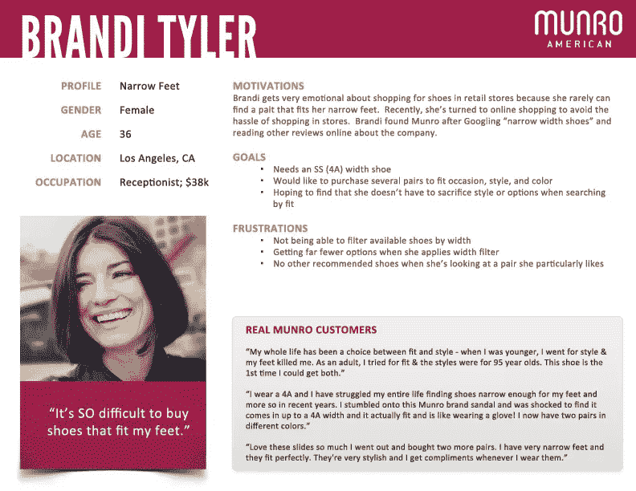
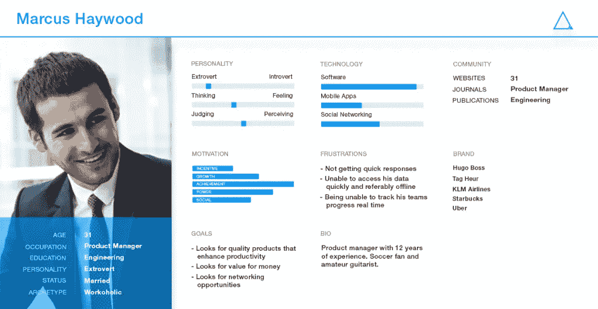

# 买家角色——销售经理为什么以及如何使用它

> 原文：<https://medium.com/hackernoon/the-buyer-persona-why-and-how-sales-managers-must-use-it-2a8ac60f207f>

定义你的理想客户是获得客户的第一步。掌握这些知识对于你的所有活动都是至关重要的，比如产品开发、商业策略、销售跟进、内容创作、收购甚至保留。dddd 请丢掉“这只是为了[设计](https://hackernoon.com/tagged/design)人或者是为了社交媒体[营销](https://hackernoon.com/tagged/marketing)”的误解

在我以前的风投角色和现在的企业家角色中，我看到销售团队清楚地了解他们想要锁定的每个买家角色，这是皮条客和流浪者之间的主要区别因素。

你是什么？

让我告诉你更多为什么我认为买家角色在销售和营销中是至关重要的。

**什么是买家角色？**

要了解你的买家，你需要研究和观察你的目标受众。在最初的头脑风暴和研究的基础上，一个虚构的人被创造出来，这个人模糊地拥有你的观众的最普通的品质。那是你的买家角色。

你是时装鞋专卖店的老板。31 岁的 Gabriela 在埃森哲工作，喜欢为你的工作打扮，她可能是你的买家角色之一。你可以据此设计你的内容营销或电子邮件营销活动。

Image credit- Neilpatel.com

有时你的产品有不止一个买家角色。当你的产品非常适合多种类型的客户时，就会出现这种情况。因此，在这里，我们需要为每个组创建买家角色。

**买家角色与移情图有何不同？**

移情映射从目标受众的感官信息中挖掘并发挥作用。他们看到的、听到的、感觉到的、想到的、做的等等。你可以在这里详细阅读所有关于共情地图的[。](https://blog.alore.io/empathy-mapping/)

另一方面，购买者角色是购买者的想象画面，详细描述了目标受众的可感知特征，例如生活方式选择、教育、人口统计等。

这样，当你写博客、电子邮件、销售沟通时，你会确切地知道你在和谁说话，这将有助于提高转化率，因为传达的信息更加具体和个性化。买家角色为您的外向营销和内向营销提供指导。

我们现在知道买家角色对业务非常重要。但是，我们如何制造一个呢？？

**基本买家角色模板**

理想情况下，三到五个人物角色更适合代表你的理想客户。该模板将包含基本信息，如该人是谁，他们重视什么，以及如何与他们交谈。对此的简要概述如下:

**1。职位:**公司详情，职位

**2。人口统计数据**:年龄、性别、家庭收入、城市/农村、教育、宗教、社会地位

**3。目标和挑战:**主要和次要目标，我们的产品如何实现这些目标，面临的挑战，我们的公司能否解决这些挑战

**4。价值/恐惧:**价值体系，在推销过程中指定的常见异议和恐惧

这里有一个我们在 [Alore](https://crm.alore.io/#/) 使用的模板的虚拟样本:

**如何创建买家角色？**

塑造买家角色的第一步是与你的现有客户广泛交谈，因为他们是使用你产品的人。与相当多的人交谈(至少 50 多人)。你需要一年至少努力做一次，最好是两次。如果你是新玩家，试着跟你最近的竞争对手的社交媒体追随者交流，试着跟他们联系。

理想的情况是与您的客户预约 10-15 分钟的电话/会议，以便更好地了解他们或让他们填写电子调查。万一没有现有客户，可以看看竞争对手的客户。

顾客通常喜欢被倾听，采访他们给了他们一个机会给你一个关于你产品的真实意见。

此外，当你面试他们时，他们往往会觉得自己的意见受到重视，往往会对你的公司更加忠诚。

**给受访者的提示**

*   尽可能使用激励手段来吸引你的客户和潜在客户与你交谈。例如免费调查结果，免费电子书，免费模板，优惠券等。
*   当你与你的非客户打交道时，一开始就明确这不是一次销售拜访是非常重要的。你需要具体说明你正在做的研究是为了更好地为他们服务。

**如何使用数据**

一旦你完成了你的研究，你就会有很多关于你的潜在客户和现有客户的数据。下一个重要步骤是识别这些客户数据的共性和模式。为角色命名。类似地，创建 2-3 个人物角色，并与您的团队分享，以便有效地使用它。

总之，我想重复一下我早些时候提出的问题。至少花一天时间来练习识别你的买家角色，然后努力解决他们的问题并满足他们的需求。你必须在 30 秒内找出你的三大买家群体，并按照他们的相关性排序。这时候你就有大发现了。

希望这有所帮助！！请分享你对创建买家角色的想法，以及它的用处。我很想听听。

*原载于 2018 年 3 月 7 日*[*blog . alore . io*](https://blog.alore.io/buyer-persona/)*。*