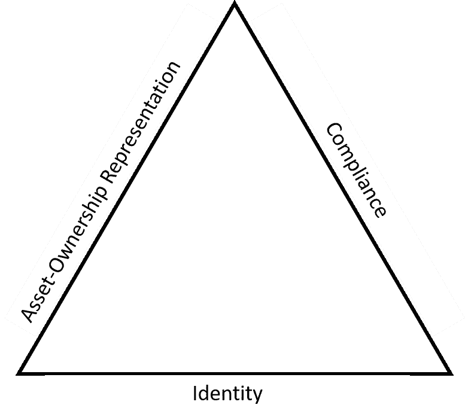
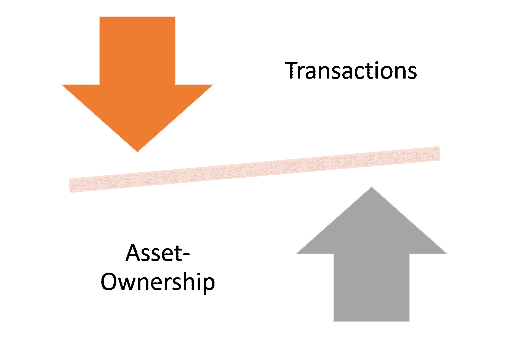
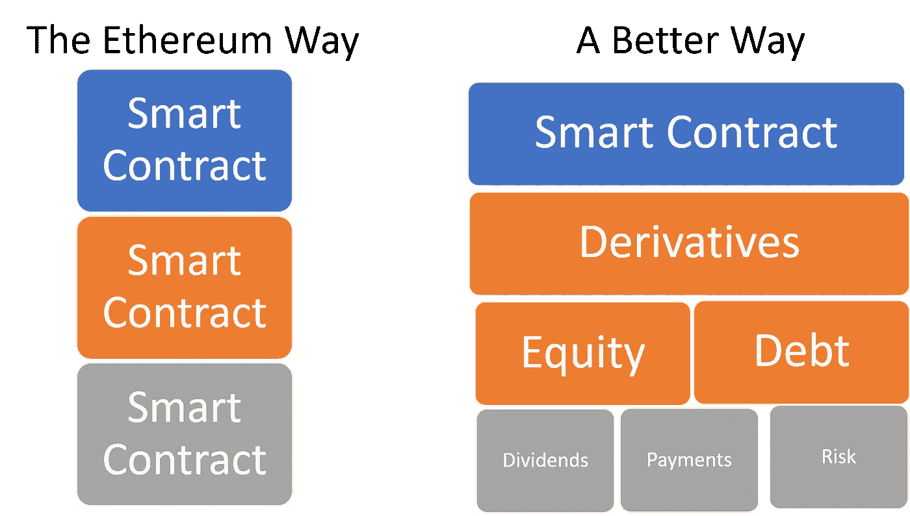

# 以太坊安全令牌案

> 原文：<https://medium.com/hackernoon/the-case-against-security-tokens-in-ethereum-cc08e0b00c2f>

在我关于安全令牌有争议的观点的文章中([第一部分](https://hackernoon.com/20-ideas-about-security-tokens-that-most-people-disagree-with-part-i-df86650fe55b)，[第二部分](https://hackernoon.com/20-ideas-about-security-tokens-that-most-people-disagree-with-part-ii-44dbc44ea456))我提到，从长远来看，以太坊很可能不是实现安全令牌的平台选择。在以太坊几乎是加密证券生态系统中唯一活跃的运行时的时代，这个想法可能看起来很可笑。然而，一旦您在安全令牌的未来架构的背景下平衡了以太坊的局限性，推理就开始有意义了。

无论是作为一个平台还是作为一种加密资产，我都是以太坊的忠实粉丝。作为一名技术专家，我经常使用技术栈，我相信这个平台可能会作为计算机科学第一个世纪最伟大的技术贡献之一而载入史册。然而，当我想到安全令牌时，有许多元素让我质疑以太坊的长期可行性。这些方面都与以太坊在可伸缩性或交易成本方面众所周知的局限性无关。我坚信以太坊背后有足够的人才来解决这些问题。我的前提来自于加密证券的本质和以太坊架构之间的基本冲突。为了进一步探讨这个想法，让我们从讨论在安全令牌平台中应该寻找什么开始。

# 什么是安全令牌的好平台？

当构建令牌化证券的架构时，需要放置三个基本构件:身份、资产所有权表示和遵从模型。世界各地的安全令牌法都要求交易中涉及的各方的身份必须是已知的和经过验证的。资产所有权表示是安全令牌 DNA 的一个关键元素，而治理和法规遵从性则控制着跨不同管辖区和行业的安全交易。从这个角度来看，身份-资产所有权-合规性三位一体是任何安全令牌平台的基石。

如果我们同意身份、资产所有权表示和法规遵从性是安全令牌模型的三个主要支柱，我们可能已经开始对以太坊产生问题，因为该平台并不真正支持(在某种程度上否定)这些元素中的任何一个。

除了关键的三大支柱之外，还有一些次要功能在安全令牌模型中变得非常有用:

**基于身份的简单共识模型:**安全令牌模型不需要计算量大的共识协议，如工作证明或利益证明。利用已知身份进行操作极大地简化了安全令牌交易中的共识机制。我最近写了关于安全令牌的新共识协议的需求。

**加密金融原语:**任何安全令牌都是基本金融原语的组合，如债务、权益、风险、股息等。如果生活在这样一个世界里，使用这些原语不需要使用互不互操作的开放协议，那就好了。

**更简单的 Oracle:**安全令牌经常需要与链外数据源进行交互。虽然这可以在以太坊上通过实现 Oracles 来完成，但是这个模型对于建模大多数与加密证券相关的场景来说确实是受限且复杂的。

# 交易与所有权

使以太坊成为安全令牌的痛苦选择的基本限制可以表示为交易和资产所有权之间的摩擦。以太坊是一个非常强大的平台，它从根本上针对一个用例进行了优化:将加密资产从 A 点转移到 b 点。另一方面，安全令牌的行为从根本上取决于与资产所有权相关的动态，而与交易机制几乎没有关系。您能在以太坊中对资产所有权建模吗？是的，但感觉像是永无止境的黑客练习。

# 智能合约与加密金融原语

像 ERC-20 标准这样的智能合约是当今安全令牌的基石。现在，如果你问这个领域的任何技术专家，为什么我们要使用智能合约来实现安全令牌，答案很可能是这是以太坊上唯一可用的机制。事实证明，智能合约是一种非常痛苦的安全令牌建模方式。智能合约在代码语义方面太受限制，每一个金融模型都是一个巨大的编码工作，它们在大小和可移植性方面有一些非常明显的限制，以及一百万个其他限制，这使得表达复杂的加密安全模型成为一场噩梦。

让我们用金融证券来打个比方。像抵押贷款支持证券这样的证券化产品实际上是一种合同。它只是一份由真正复杂的金融基础设施支持的合同，而不是基于合同的。类似地，智能合约可能是安全令牌的最终表现形式，但是底层基础设施可能基于更复杂的组件。

相反，或者更确切地说，除了智能合约之外，安全令牌可以受益于编程模型，该编程模型包括诸如债务、股权、支付、股息、风险、违约等加密金融原语作为可以组合成复杂金融产品的一级构造。模拟一个相对简单的安全令牌衍生产品的例子，比如以太坊中的债务抵押债券，需要组装一些开放的协议，比如 Dharma、{Set}、0x，使它们能够在不违反以太坊中的任何智能契约约束的情况下实现互操作。我们需要更简单的方法。

# 5 区块链为安全令牌提供了有趣的想法

区块链生态系统正随着创新而爆炸式增长，其中一些创新可以渗透到安全令牌领域。如果我们考虑我们希望在安全令牌平台中拥有的一些关键功能，新一代区块链平台中有一些有趣的想法可能会与 crypt-securities 相关。

**[**DFINITY**](https://dfinity.org/)**:**DFINITY 的区块链神经系统包含了很多有趣的安全令牌的治理原理。类似地，DFINITY 的可伸缩架构可能是一个可靠的运行时，用于实现和托管与安全令牌模型相关的构件，如 Oracles 或数据提供者。**

****[**Tezos**](https://tezos.com/)**:**Tezos 中包含的许多治理协议都与安全令牌架构相关。我特别喜欢 Tezos 的经济协议和验证系统背后的许多想法****

****[**谜**](https://enigma.co/) **:** 我相信安全多方计算是安全令牌交易最可行的隐私技术之一。Enigma 对 sMPC 的实现是我见过的最好的实现之一。****

******[**hash graph**](https://www.hedera.com/)**:**hash graph 有一个独特的优势，它支持以可靠性编写的智能合约，考虑到几乎所有的安全令牌都是基于 ERC 20 的，这是一个不小的优势。超级可扩展的基础设施显然是一个强大的优势。******

******[**Stellar**](https://www.stellar.org/)**:**Stellar 的架构包括了许多安全令牌架构所需的构建块，如合规检查点。不幸的是，Stellar 平台在智能合约等方面仍有一些工作要做，以成为安全令牌的可行选择。******

# ****安全令牌的以太坊可能不是以太坊****

****以太坊已经赢得了公用令牌竞赛。当谈到安全令牌时，以太坊的立场并不那么明确。从市场动态的角度来看，安全令牌有机会成为市场中的一个修正者，为许多新兴的区块链参与者创造公平的竞争环境。****

****在我看来，我们很可能会看到针对安全令牌用例优化的新区块链架构和协议，谁知道呢？安全令牌的以太坊可能不是以太坊。****