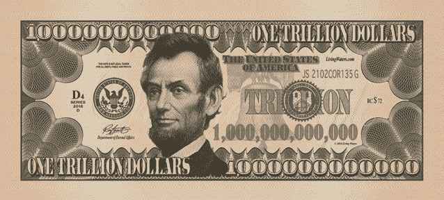
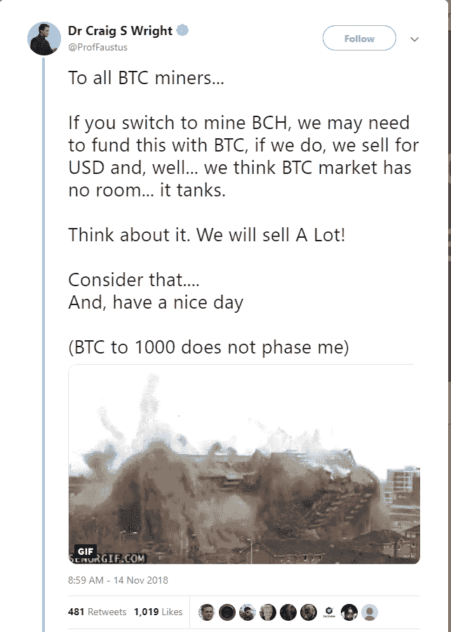

# 2019 年 1 万亿美元比特币的案例

> 原文：<https://medium.com/hackernoon/the-case-for-1-trillion-bitcoin-in-2019-35dabbd06ac>

继 2017 年底的荒谬高点之后，加密在 2018 年初出现了相当大的跌幅，我们在加密市场度过了相对稳定的一年，然后 11 月份发生了。11 月发生了什么？很难找到一个单一的原因，但几乎每种加密货币都绝对失败了，比特币的领域已经超过一年了。在我提出比特币明年将达到 1 万亿美元的理由之前，让我们看看我们是如何走到这一步的。

不过，首先，菲亚特股票市场经历了一些相当大的下跌，可以说这主要与科技股和纸牌屋有关，其中许多股票都是建立在金融基础上的，但也与关于他们滥用收集的数据和压制声音的越来越多的负面新闻有关。几乎在同一时间，一场[比特币现金分叉大战](https://cointelegraph.com/news/bitcoin-cash-hard-fork-battle-who-is-winning-the-hash-war)正在进行，很难忽视这场斗气和一切开始下跌之间的时间。当然，像[这条来自克雷格·赖特的](https://twitter.com/ProfFaustus/status/1062751765601361923)这样的推文肯定没有帮助。我认为这暴露了这些加密货币的感知价值的微妙本质，其中很少一部分实际上被用于投机交易之外的任何事情。

Craig Write tweet about tanking Bitcoin

据[彭博](https://www.bloomberg.com/news/articles/2018-11-20/bitcoin-rigging-criminal-probe-is-said-to-focus-on-tie-to-tether)消息，美国司法部正在调查一项复杂计划中的价格操纵，该计划包括加密交易所 Bitfinex。毫不奇怪，Tether [反驳了](https://www.ccn.com/tether-exec-refutes-bloomberg-reassures-investors-crypto-isnt-manipulated/)这些指控，但迄今为止，对 Tether 声称持有的资金还没有一个真正有信誉的审计。然后是 Mt. Gox“鲸鱼”托管人，他定期进行大量比特币转储，然后压低价格。受托人[声称](https://bitcoinist.com/mt-gox-bitcoin-whale-trustee-wont-sell-btc/)不会再卖了，但是谁知道呢。

与此同时，我潜伏在各种脸书秘密组织中，在 Twitter 上关注他们，你会看到所有 HODL 和 FOMO 的人，他们都在预测底部，底部会是什么样子，什么时候会到达那里，然后下周、明年会达到什么程度，等等。我最喜欢的可能是约翰·迈克菲，他说如果 2020 年的票房没有达到 100 万美元，他会吃掉他的阴茎，而不是最初说的 50 万美元，所以这是一些真正的信心，但这不是我在 1987 年电影《[厨师，小偷，他的妻子&她的情人](https://www.imdb.com/title/tt0097108/?ref_=nv_sr_1)的创伤后想再次看到的。问题是，这些人都没有内部消息，他们都只是猜测，而且有很多内部阴谋正在进行，大多数人都不知道。当克雷格·赖特能够单枪匹马(似乎)导致比特币大幅下跌时，那就太可怕了，而他只是一个玩家。

那么，2019 年我的 1 万亿美元比特币的案例是什么？没什么。我只是说它会，这个说法和你在任何时间点看到的任何其他价格的任何其他论点一样有效。这个故事并不完全是浪费时间，看看你所了解的关于价格的一切。你现在知道的比大多数做预测的人都多。