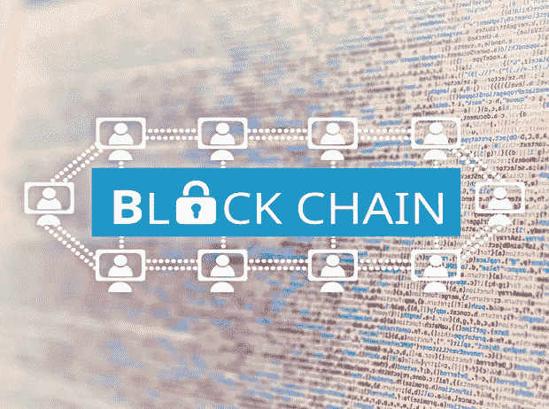

# 通用区块链 ID 的案例

> 原文：<https://medium.com/hackernoon/the-case-for-a-blockchain-universal-id-50571aa65a01>

各国政府已经提出统一身份证的想法有一段时间了，但还没有得出任何结论。拥有通用身份证的理由是，它将增强国家安全，有助于打击恐怖主义，并防止或至少阻止身份盗窃。有人认为，这将使人们的生活更加轻松。

这个概念自然有问题。有些国家，如英国，不相信国民身份证，而在有身份证数据库的国家，如美国，信息保存在一个中央国家数据库中，这可能不像他们应该的那样安全。

举个例子:在 2018 年的前六个月，美国发生了 668 起数据泄露事件，涉及的领域包括银行、商业、教育、政府/军队和医疗保健。这些数据库存在弱点，使它们容易受到网络攻击。而且，随着网络罪犯变得越来越老练，国家身份数据库的安全系统似乎根本无法跟上他们。因此，想象一下，如果有一个统一的 ID 数据库建立在一个中央系统上，网络罪犯会感到多么幸运——这将是他们收到的最大的礼物。

**区块链解决数据泄露问题**

最明显的解决方案是使用[区块链](https://hackernoon.com/tagged/blockchain)技术。通过使用分布式账本，每个人的身份信息可以保存在一个更安全的分散系统中，因为它使用了加密技术。例如，各种各样的身份文档可以存储在区块链的一个地方，我们称之为身份钱包，每个钱包都有自己的加密形式。信息将被分散到分布式账本上，这使得网络罪犯更难获得这些信息。；这肯定会让他们更难进行目前能够进行的大规模身份盗窃攻击，因为他们必须侵入每个人的钱包。

使用区块链还会让美国公民对我们的数据有更多的控制权，因为我们将有能力在一个空间更新数据，并决定我们与某些个人分享哪些数据。

各公司已经在研究身份区块链[技术](https://hackernoon.com/tagged/technology)，然而它仍处于早期阶段，在提交给政府之前必须经过验证。当然，即使这些项目也提出了一些问题，比如谁在开发它，他们将如何将其货币化，以及他们将如何维护它。从法律上讲，一旦信息上传到区块链，谁拥有这些信息也是一个问题；每个人还是政府？

虽然我们还没有完全实现，但我们希望区块链技术将使数据泄露成为过去，尽管我们是否会看到通用 ID 系统的出现完全是另一回事。