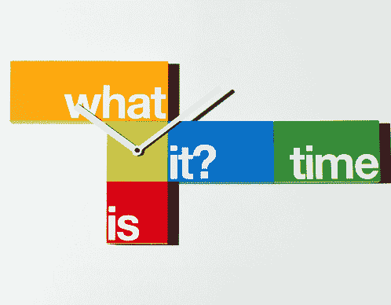

# 结束夏令时的情况

> 原文：<https://medium.com/hackernoon/the-case-to-end-daylight-saving-time-fac67266fc9e>

有人可能会认为新西兰的社会贡献主要包括拥挤的房子乐队乐队和绵羊产品，但我们应该感谢或诅咒现代夏令时(DST)的是[新西兰](http://en.wikipedia.org/wiki/New_Zealand) [昆虫学家](http://en.wikipedia.org/wiki/Entomologist)乔治·弗农·哈德森。本杰明·富兰克林经常被认为是这个想法的提出者，但它是基于他在 1784 年写的一篇讽刺巴黎人在一天中起得晚的文章。1895 年，哈德逊撰写并向哲学协会提交了一篇论文，提议实行 2 小时轮班制。这完全是因为他的工作是“轮班制”，在一年中的某些时候，下班后没有足够的时间收集虫子。他的提议完全是自私的。如果他抽不出时间，他会迫使社会改变。

不久之后，完全独立地，杰出的英国建筑商和户外运动者威廉·威利特在 1905 年注意到有多少伦敦人在美丽的夏日里睡觉，作为一个狂热的高尔夫球手，他也不喜欢在黄昏时打球。威莱特经常被错误地认为是提出 DST 的人。再次，完全自私和控制他人行为的欲望。威利特设法让议会采纳了这一提议，但遭到了拒绝，他继续为此游说，直到 1915 年去世。

直到 1916 年第一次世界大战，DST 才被任何人正式采用，作为节约煤炭的一种方式，但同样，这只是受控制的行为，并没有改变时间。如果提前一个小时开始，也能得到同样的结果。战后，DST 被放弃，只是偶尔被恢复，特别是在二战期间，但直到 20 世纪 70 年代的能源危机[才被广泛采用。](http://en.wikipedia.org/wiki/1970s_energy_crisis)

1973 年，尼克松总统将美国改为全年夏令时，这当然是愚蠢的，每个人都可以早点开始。该法案因导致校车事故显著增加而被废除。不列颠哥伦比亚大学的斯坦利·科伦在 1991 年和 1992 年进行的一项研究表明，在“春季向前”时间改变后的星期一，交通事故增加了 8%。经过几年的争论，终于在 1975 年 4 月的最后一个星期天到 10 月的最后一个星期天确定下来。在那个时候，对计算机时钟进行修改并不是一件小事，这对于刚刚起步的技术部门来说是一个巨大的负担。

在 20 世纪 80 年代中期，体育用品游说团体和相关游说团体能够说服国会将夏令时延长至 4 月的第一个星期天，这使得夏令时在 1986 年从 6 个月增加到 7 个月。计算机现在更加普遍，这种变化有更大的影响和成本，每个人都不得不吃。仅仅是一年换两次钟就是一个巨大的负担。我当时工作的系统需要重启计算机系统来更改时钟，这意味着要确保所有的批处理都已完成，这样你就可以有 20 分钟左右的安静时间在半夜重启系统，这需要一个人坐在那里。

2007 年，作为 2005 年能源政策法案的一部分，夏令时又延长了 4 周，因此美国和加拿大现在一年中几乎有三分之二的时间都在夏令时上。据称，这额外的 4 周将为该国每天节省 0.5%的电力，足以为 100，000 个家庭供电。该法案中有一条规定，如果这些节省没有实现，可以恢复到标准时间。2008 年的一项研究调查了印第安纳州在 2006 年夏令时改变前后的账单数据，显示由于额外的下午降温和早晨照明成本的增加，T2 增加了 1%-4%。

美国交通部在上世纪 70 年代提出的所有公共安全主张，都被国家统计局后来的实证研究打了折扣。执法部门提出的减少犯罪的类似主张也受到了质疑，因为样本集太小(两个城市)，不考虑任何减轻因素。

2018 年 11 月，加州通过了[7 号提案](http://voterguide.sos.ca.gov/quick-reference-guide/7.htm)，废除了 1949 年的夏令时法案，该法案批准加州的时钟与联邦层面的变化保持同步。这是允许加州要么(明智地)像亚利桑那州和夏威夷一样完全取消夏令时，要么(愚蠢地)全年保持夏令时的第一步。如果像加利福尼亚这样大而有影响力的州完全放弃夏令时，你可能会看到美国各地都采用夏令时，这种愚蠢的做法可能会彻底结束。那些认为全年夏令时是个好主意的人，不记得我们以前什么时候做过了。

如前所述，随意改变像时钟这样的东西会给整个社会带来巨大的影响和代价。主要系统可能会因为错误的日期计算而停机。2012 年闰日，由于一个简单的日期数学错误，微软 Azure 出现了[中断](http://www.wired.com/2012/02/leap-day-azure-outage/)。政客和游说者对这些成本和担忧视而不见，并愉快地改变时钟，就好像他们是掌控时间的奥林匹斯山神一样。

归根结底，这是政客们的傲慢，他们似乎认为他们在创造或给你额外的一小时日光，而事实上他们只是在控制每个人的行为。没有节能，恰恰相反。它并没有改善公共安全，也没有实现它的初衷。它确实对公众健康和安全产生了有害的影响。这对孩子在学校的表现有负面影响，因为许多[研究](http://www.washingtonpost.com/news/to-your-health/wp/2014/11/07/sleep-patterns-study-lends-new-support-to-proposals-for-later-school-start-times-for-teens/)显示，晚一点开始上课的孩子在学校表现更好，而夏令时正好相反。调整精密计算机软件系统的巨大隐性成本和危险。现代生活不需要夏令时。与电脑和电视等其他用途相比，我们的照明能源成本微不足道。灵活的工作安排和全球经济下的临时工作已经成为过去。是时候迈向 21 世纪，抛弃这种由傲慢自私的人制定的不合时宜的立法。给你的[参议员](http://www.senate.gov/general/contact_information/senators_cfm.cfm)和[众议员](http://www.house.gov/representatives/)写信，让他们知道你的想法。

资源

[http://www.startschoollater.net/](http://www.startschoollater.net/)

[http://www.standardtime.com/](http://www.standardtime.com/)

[http://www.contactingthecongress.org/](http://www.contactingthecongress.org/)