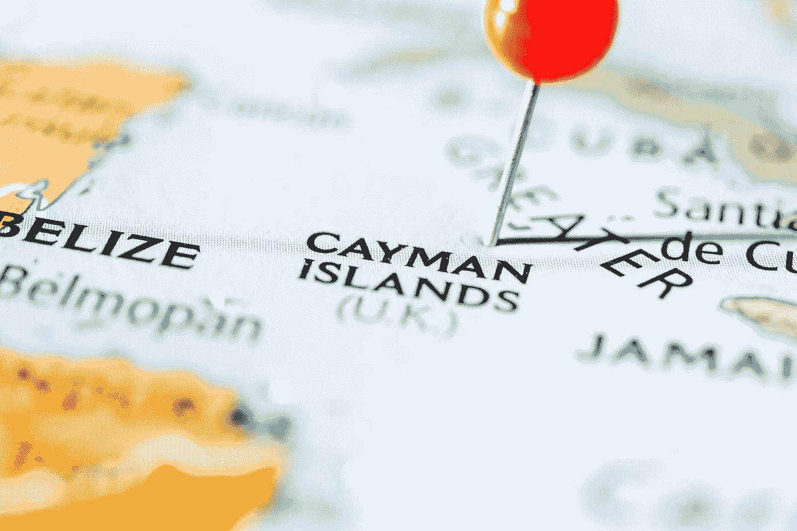
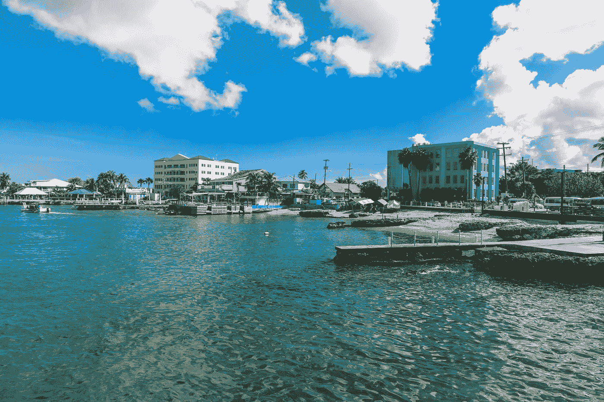

# 开曼群岛:密码初创公司的梦想之地

> 原文：<https://medium.com/hackernoon/the-cayman-islands-the-dream-jurisdiction-for-crypto-startups-448324c0046e>

当 1500 万美元需要被转移去营救大使的女儿时，你正在看一部好的动作片。钱去哪了？开曼群岛，当然…它总是开曼群岛。

即使你没有亲自去过那里，即使你不知道它在地图上的位置，你也一定听说过开曼群岛。

每当邪恶活动涉及离岸银行业务时，这个神秘的群岛就是好莱坞编剧们的首选辖区。而且理由很充分。开曼群岛是世界上开设离岸银行账户最多的地方之一。

尽管这个国家通常与电影中的反派人物联系在一起，但在开曼群岛建立一个组织并不一定是邪恶的。事实上，全球 50 家主要银行中有 47 家在该辖区有某种形式的存在。此外，这些岛屿拥有超过 10，000 家完全受 T2 监管的投资基金，净资产价值超过 3.5 万亿美元。

考虑到这一点，难怪开曼群岛迅速成为吸引主要加密投资者和资产管理公司的磁石。随着[在这里注册的区块链公司筹集了 42 亿美元](https://www.caymancompass.com/2018/08/30/no-time-line-for-cryptocurrency-regulations/)，这个司法管辖区从 ico 那里筹集的资金比世界上任何其他地方都多。

所以，如果你还没有看过开曼群岛，现在是时候了。请继续阅读，了解原因。

# 低税收

首先，有必要强调开曼群岛最著名的地方:零税收制度。或者用他们公关团队的话说，“税收中性”。这意味着对个人或公司收入、资本收益、股息、财富或遗产不征税。

听起来好得难以置信？

嗯，在开曼群岛经营需要一些成本。像大多数国家一样，政府收取贸易和商业许可费，必须每年购买和支付。这些许可证每年的费用约为 1200 美元。

此外，还涉及政府申请费，但即使你把所有这些费用加起来，与许多其他司法管辖区的税收成本相比，总成本也非常低。

低税费对每个企业来说都是好事，但对加密初创公司来说尤其有吸引力，因为加密和菲亚特之间的价格波动，准确计算预期税收是众所周知的复杂。

A view of George Town capital of Grand Cayman, The Cayman Islands

# 商业友好型

虽然开曼群岛长期以来一直是一个极具吸引力的企业注册地，但近年来，当地政府采取了一些重大举措，以使该国不仅仅是一个离岸结构中心。

为了吸引更多的商业实体到它的海岸，政府已经建立了三个经济特区，旨在促进技术，金融和运输方面的商业。

对于加密初创公司，你会在[开曼科技城](https://www.caymanenterprisecity.com/cayman-internet-park)找到你的家，它声称提供一个科技项目可能要求的一切:高速互联网、离岸知识产权保护、离岸托管和支付网关、志同道合的企业家社区，以及没有政府报告或备案要求。

对于任何政府来说，最令人印象深刻的是，根据这一计划，你甚至可以在短短 5 天内获得可延期的 5 年工作或居留签证，这一周转时间在世界其他任何地方都是闻所未闻的。所以如果你想下周把你的基地搬到开曼群岛，你可以。你可以很容易地把你的整个团队带进来。

# 加密友好的

就目前情况来看，开曼群岛对加密的监管立场相当灵活。虽然明确的监管框架尚未建立，但从他们对科技城的实施中可以看出，政府显然对区块链和 crypto 的企业持开放态度。

过去一年，监管机构暗示，他们一直在等待全球建立更大的监管确定性，然后再表明自己的立场。所以现在[证券交易委员会已经发话](https://cryptolawinsider.com/breaking-sec-guidance-on-icos/)，很可能我们很快也会在开曼群岛看到更清晰的监管。

理想情况下，开曼群岛将效仿百慕大等邻国，后者最近建立了 ico 监管框架；巴巴多斯为加密项目建立了一个监管沙箱。

当然，在实际立法出台之前，总会有一些不确定性。然而，考虑到该管辖区的亲商意识形态，它似乎不太可能对加密产生重大分歧。

# 这对密码法律内部人士意味着什么？

对于加密企业家来说，开曼群岛是你最需要关注的司法管辖区之一。

你不仅将拥有发展业务所需的一切，而且没有税收，你将能够在开发项目中进行更多的再投资。而且，当你准备出售你的企业时，你可以不用支付一分钱的资本利得税。这会让你口袋里多出几百万。

这也不仅仅是钱的问题。通过选择开曼群岛作为您的基地，您将能够从世界任何地方招募您的团队。这在美国和其他地方几乎是不可能的。

更少的麻烦，更多的钱和白色沙滩？对于内部人士来说，为什么这是当今顶级的加密中心之一，这并不奇怪。

*原载于 2018 年 12 月 18 日*[*【cryptolawinsider.com】*](https://cryptolawinsider.com/cayman/)*。*