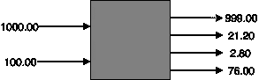
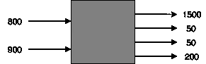
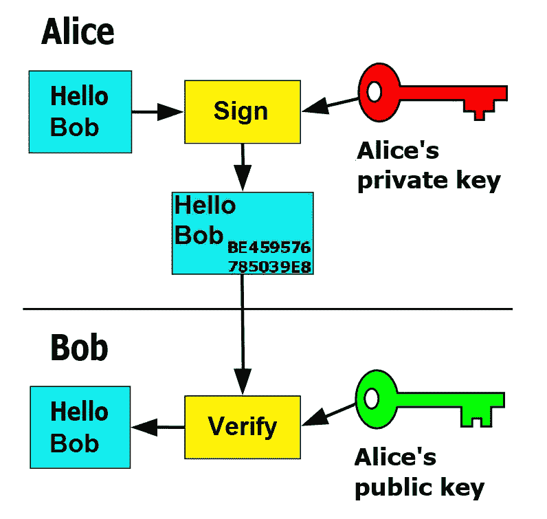
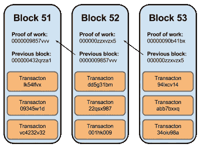

# 介绍:互联网货币

> 原文：<https://medium.com/hackernoon/the-chain-blocks-in-series-93e7505e2bc4>

互联网货币的世界与实物货币的世界没有太大区别。在本帖中，我们将探讨两者的相似之处。引入区块链的概念。

你试过了，你喜欢。该买了。你走向收银台，掏出你的钱包，这时柜台上的人索要 1023 美元。你很快又检查了一遍价格，只是为了确保没有什么奇怪的东西。

> 项目 X: 999.00
> 销售税:21.20
> 其他税:2.80

你打开钱包，拿出两张钞票:一张 1000 美元和一张 100 美元。收银员摆弄着他的钞票，微笑着，他把找零还给你。打印两张收据。他有一个。一个交给你。交易已经发生。

> 金融交易是在买方和卖方之间执行的用于交换资产以进行支付的协议。

## 进入虚拟现实

你试过了，你喜欢。该买了。你悬停在结帐按钮上；点击它，它就会从你的钱包里滑出来。你快速看了一眼你的购物车。上面写着:mƀ. 1600 号为了确保你没有犯错，你最后看一眼。

> 第 x 项:1500.00
> 采矿费:50.00
> 其他费用:50.00

你扫描提供给你的二维码，按下支付并确认。在幕后，它需要您之前收到的两笔交易—一笔是 800mƀ，另一笔是 900 mƀ.结合这两个以前的交易，它创建了一个新的交易:一个 1500mƀ的项目；保持系统运行的矿工的 50mƀ之一；50mƀ中的一个给商店，最后剩余的 200mƀ还给你自己，这样你可以再次使用它。

transaction in physical world

transaction in virtual world

这就是问题的症结所在，你说你想知道。但是正如您所料，在幕后，事情要比这复杂得多。如果你把加密看作一个黑盒，那么它基本上只是交易交换中的输入和输出。

## 盯着黑盒

*问:你怎么知道我的交易是有效的？谁检查它？
问:我把虚拟货币寄到哪里了？
问:虚拟货币在我的钱包里吗？为什么我不能直接修改？
问:如何确保卖方确实收到了资金？
问:别人可以自称是我吗？
问:为什么我需要将我的钱交给矿工？多少钱？问:我们交换的这个东西是什么？只是一些数字？
问:如果我想撤销交易并退货，该怎么办？*

有很多问题。虚拟货币可能会令人困惑。这里有许多活动的部分，在适当的时候，你将确切地了解它们是如何运作的。让我们从基础开始。

## 签名

在物理世界中，这并不是一个闻所未闻的概念。指纹、视网膜扫描、手写签名都是验证一个人身份的各种方式。在虚拟世界里，也差不多。每笔交易都需要签名。当您签署交易时，您实际上表示您同意将这些资金从您的帐户转移到其他人的帐户。但是什么才是真正的签名呢？

这里我们使用一种被称为公钥加密的技术。

Digital signature

**公钥** 这是一个每个人都持有的密钥

**私人钥匙
这是一把只有你持有的钥匙**

消息+私钥=
签名消息

签名消息+公钥=
消息

比特币中使用的公钥加密的精确实现被称为椭圆曲线加密。你可以在这里阅读更多相关信息[。](https://en.wikipedia.org/wiki/Elliptic-curve_cryptography)

一笔交易被记录下来。它是由买方签署的。卖家得到它。他们去哪里了？

## 资金存在哪里？

回到现实世界:在一天结束的时候，收银员把他所有的收据交给他的经理。当他翻阅他的商店积累的现金时，他仔细检查它们。如果一切都凑齐了，他就把这捆现金拿到银行去。银行表示非常感谢，并将钱存入他们的账户，同时注明这笔钱属于经理的账户。从那以后，事情变得非常棘手。小银行把钱给大银行，大银行再把钱给更大的银行。任何玩过扑克的人都可以告诉你。如果你面对的是一个豪赌客，你的胜算会很大。华尔街是豪赌客，传统银行体系充斥着滥用权力的指控。一些阴谋论者甚至声称 Satoshi 与华尔街有很深的联系。我们可能永远也不会知道真相。但我们知道比特币是分散货币的先驱。

在虚拟空间中，透明度很重要。为此，每个人都有一个总账。无论何时，只要有人做交易，交易就会进入总分类账。所有总分类账都已更新，交易已确定。

有人可能会问:全世界的总账到底是怎么更新的？这是一个重要的问题。因为如果恰好有一个来回传递信息的中心体，整个目的就失败了。幸运的是，没有。多亏了点对点技术。顺便说一下，这个账本被称为**区块链**。

让我们概括一下，再深入一点。

一笔交易包括资金进出。资金来自于之前发给你的交易。这些被称为未用产出。一旦你在交易中使用它们，这些先前的交易被认为是失效的，你不能再使用它们。所有成功的交易都列在总分类账中，其中包含了自加密货币诞生以来的所有交易。每天都有成千上万的交易发生。它们中的每一个都需要被检查以确保没有恶意发生。这些验证由矿工完成。矿商一次性处理大量交易。他们把它们放在一起，然后出来一块。这是附在顶部的区块链和警报去每个人。任何人都可以发现矿工是否有报复行为，除非大多数矿工反对这个制度。这就是所谓的 51%攻击。它会导致加密货币系统的崩溃。

我在这里只是触及了表面。留给你的问题比答案还多。为什么矿工需要某种激励来让他们坚持下去？
>为什么会有人想核实矿工在做什么？
>谁调控货币供应？谁解决争端？
>为什么要将交易加载到块上？

目的只是为了激起你对接下来要发生的事情的兴趣。金钱刺激经济。加密货币让虚拟世界的经济成为可能。

*在真正成为互联网货币之前，加密货币还有很长的路要走。基础已经奠定，但前面还有许多挑战。在 twitter 上关注我:@uneeb123 获取最新更新。*