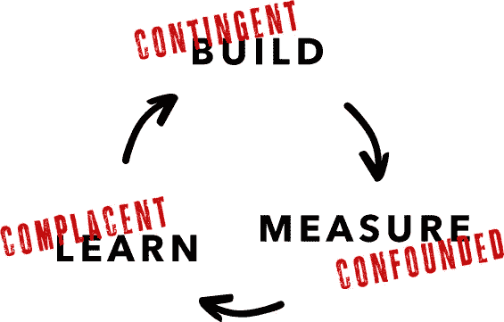

# 产品/数据匹配的挑战

> 原文：<https://medium.com/hackernoon/the-challenge-of-product-data-fit-92543078551b>

## 将**精益启动方法应用于人工智能产品**

M 机器学习和人工智能正在成为越来越多产品的关键组件。一些应用，如图像识别和自然语言理解，几年前似乎遥不可及，但现在正成为主流。

但是，这些强大的工具也带来了新产品开发的挑战。

在不同的公司致力于构建基于机器学习的产品后，我开始注意到一个共同的主题:*数据创造了一个合适的挑战*。

## **什么是体能挑战？**

在人工智能成熟之前，精益创业方法改变了人们思考开发产品的方式。它解决了寻找产品/市场契合度的基本挑战:识别市场需求并制造满足需求的产品。

为什么这么难？因为市场是不确定性的来源。你不知道确切的市场需求是什么，也不知道你的产品是否真的能解决这个问题。

满足需求的能力还有其他不确定性来源。他们每个人都创造了不同的健身挑战。例如，优步就遇到了一个*监管契合度*的挑战，即它的司机应该被归类为雇员还是独立承包商。

## **产品/数据符合度**

在数据产品中——依赖于大量数据或涉及机器学习和人工智能的产品——你会遇到产品/数据拟合的挑战。它源于数据满足产品需求能力的不确定性:

*   机器学习模型做出的预测并不总是正确的。你不知道他们什么时候是对的，什么时候是错的。
*   你无法预先保证一款车型的性能水平。假设你可以承受 10%的错误预测。你可能无法建立一个 90%准确的模型。
*   完全有可能你没有足够的数据或者没有足够的信号，但是你事先并不知道。
*   即使模型在训练数据上表现良好，它在生产中的性能也可能会有很大差异。

因此，当构建一个数据产品时，你至少要同时解决两个不确定性来源:市场和数据。让我们了解产品/数据匹配如何影响寻找产品/市场匹配的过程。

## **精益启动框架和数据产品**

精益创业方法通过经验证的学习来应对 fit 挑战:在一系列旨在测试市场假设的极简实验上快速迭代。

这些迭代沿着构建-测量-学习的循环进行。你从*价值假设*开始，找出衡量它的标准，并设计一个实验来测试它在市场上的表现。然后你*构建*需要什么运行实验，*测量*结果，*通过调整或提炼价值假设来学习*。

在数据产品中，还存在产品/数据匹配问题，这给构建-测量-学习周期中的每一步都增加了挑战和风险:

*   *构建*步骤是*或有*
*   *测量*步骤被*混淆*
*   而最大的风险:学*学*的步骤可能会被*自满*

让我们更详细地理解这一点。

## **特遣队建设**

正如我们刚刚看到的，数据产生了一个拟合问题。这意味着你可能无法建立你需要的模型(不够准确，信号不够等。)

*构建*步骤是非确定性的，或者说*偶然*。

这在传统软件产品中不是问题。构建优秀的软件并不容易。这需要努力。但总的来说，这是一个确定性的过程:工程师知道他们能做什么，不能做什么。

相比之下，数据科学是不确定的:你几乎无法控制最终结果。这也是软件*工科*和数据*理科*区分的原因之一。

## **混杂测量**

这种情况导致*混杂测量*。

你去测量实验结果。它们不是你所希望的。是因为模型不够准确吗？如果有更多的数据和更好的模型，可能会有所改善。还是因为价值假说实际上在市场上不成立？

测量是混乱的，你无法将数据的不确定性与市场的不确定性分开。

你就不能 A/B 测试一下吗？不可以。你可以 A/B 测试两个模型，或者一个模型对一个模型。但是你不能用你想要但没有的模型来 A/B 测试你现有的模型。你不能衡量一个假设的模型。

## **自满的学习**

那么，如何从测量步骤进入学习步骤呢？这里最大的风险是*自满的学习*:你没有认识到混淆的测量，而是把所有的不确定性都归因于数据。然后，您决定价值假设成立，并且模型将随着您收集更多数据而改进。

但事实上，你不是从市场中学习，而是将市场的希望寄托在数据梦想上。

盲目相信人工智能的神是数据产品开发中最大的风险之一。

## **示例:缝合修复**

Stitch Fix 是一项个人造型服务，每月向用户发送几件衣服。会员只为他们保存的物品付费。

在一次采访中，Stitch Fix 创始人兼首席执行官 Katrina Lake 描述了她是如何创办这家公司的。她让朋友们填写个人造型调查，然后出去给他们买衣服。

因此，最有价值球员实际上是作为个人造型师的首席执行官。这种简单的构建-测量-学习循环使她能够验证市场需求和交付模式。

以下是一年后，当公司扩展到个人关系之外时发生的事情:

> “你可能会猜测，我们的观众是沿海的、去科切拉的、早期技术采纳者。但我们的客户是这样的母亲，她们说，“我需要更长的裙摆，因为我在我儿子的幼儿园做志愿者，我想穿一件有趣的夏装，但它需要合适。”我们为她准备了一件露背的 Coachella 连衫裤。"

这里发生了什么？Stitch Fix 有一个*模型*，可以预测会员会保留哪些物品(露背 Coachella 连衣裤)。在这个阶段，它不涉及任何花哨的机器学习，只是对客户群的猜测(“早期技术采纳者”)，但这并不重要。

这种模式惨败，公司不得不冲销大量库存。

所以对于学习这一步，公司去和它的成员谈了谈(“我需要更长的裙摆”)。这一过程也改善了成员(学龄前妈妈)的数据。

想象一下，如果 Stitch Fix 在更好的模型上加倍下注，会发生什么。你可能会认为这是个糟糕的主意。但是有多少次你听到人们在类似这样的情况下说“我们需要使用机器学习/深度学习/ AI”？

这些都是很棒的工具，但是*只有在*它们被用来将产品/数据匹配转化为产品/市场匹配时才有效。有时候，真正的洞察力是避免自满的学习，倾听市场。

## **底线**

数据是不确定性的来源。它产生了产品/数据匹配问题，为精益启动周期中的每一步增加了新的挑战:*应急构建*、*混淆度量、*以及最大的风险*自满学习*。当你加倍押注于花哨的机器学习而不是倾听市场时，就会发生这种情况。

机器学习和人工智能是强有力的工具。但要创造价值，他们必须努力实现产品/市场契合度*和*产品/数据契合度。如何做到这一点？我将在以后的帖子中讨论这个问题。