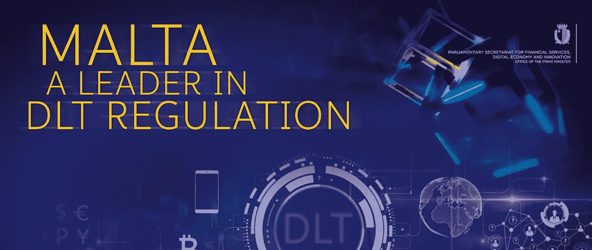

# 监管 ico 的挑战

> 原文：<https://medium.com/hackernoon/the-challenge-of-regulating-icos-a6f98d491dca>

自 2016 年初以来，最初的硬币发行投资超过 88 亿美元。许多公司都在寻找投资区块链技术的方法。他们计划利用这项技术来筹集资金，因为 Telegram 17 亿美元的成功清楚地表明，ICOs 可以用来筹集巨额资金。它正在挑战公开发行的初始路径。然而，为了管理 ICO 的成功，引入一些规则和条例是很重要的。这是马耳他推出的法规。

# 马耳他数字创新管理局法案

很明显，马耳他将很快成立一个新的机构，根据马耳他 ICOs 法规[的功能，管理加密货币和区块链平台的认证。根据马耳他数字创新管理局法案，监管机构将对 ico 进行监督和监管。它还将作为一个咨询机构开展工作，专家将帮助宣传政府颁布的政策，以保护司法机构的声誉。](https://www.csbgroup.com/blockchain-malta/)

根据《TAS 法案》,该委员会有责任对该地区的所有技术服务提供商进行注册和认证。它将作为马耳他的国家主管当局开展工作。

将任命检查员实施包括单一公开声明在内的所有处罚，还将授予当局其他权力。

# 现行证券法

从管理的角度来看，ICO 中的主要问题是:一个令牌代表什么？根据代币的属性以及如何使用代币，代币有可能成为受管理的投机，例如股票、合计投机计划或储备中的单位、电子现金、商店、前景或债券。鉴于硬币的合法分类将依赖于其确切的权限和使用情况，这种潜在工具的概述范围很广，这里有很高的分类水平。

在某种程度上，代币符合受控投机的条件，参与促进、劝诫、管理和另外处理 ICO 的支持者和不同集会的活动可以触发行政授权和广告必要性。

类似的行政和合法调查出现在许多审查中——这远远不仅仅是英国或欧盟的事情。

事实上，即使 ICO 不在融资发生的范围内，支持者和不同的成员也需要考虑在每个潜在购买者的地区推广 ICO 的合法性。

# 虚拟金融资产法(VFA)

根据法律共享的最新定义，将加密货币归类为虚拟金融资产法案(VFA)非常重要。当局有一套共同的规则和条例，既保护消费者，也支持区块链工业和利益相关者的发展。此外，对那些在行业中推出加密货币的人也有一些严格的要求。还有其他服务提供商也将被纳入该法案。有些是。

1.投资组合经理

2.佣金

3.保管人

4.提名服务提供商

5.投资顾问

6.电子钱包提供商

看起来当局正在采取措施确保区块链和加密货币在马耳他得到信任和使用。他们正在努力应用所有的规则和法规，以确保一切都得到真正的管理，并且当涉及到数字货币的信息和资产管理时，消费者不必应对任何类型的威胁。《虚拟金融资产法》将使当局更容易根据法律正确管理所有服务。

# 马耳他金融服务管理局(MFSA)

MFSA 同样建立了一个与货币有关的工具测试，将决定一个项目或行政管理是否属于货币管理法令的范围，或是否受《VFA 法》的保护。尽管尚未成为当局，但 MFSA 强调马耳他的任何担保人必须进行合法评估，并在需要任何当局时通知当局。

根据新标准，任何提供 VFA 或被命名为 VFA 专业合作社的物质都需要通过 VFA 运营商的指导向 MFSA 申请许可。VFA 许可证的无限供应，这些管理员将被允许鼓励虚拟货币相关资源的交易，例如，代币或硬币，或给予 VFA 地区的行政支持。

> 推荐文章-[https://medium . com/@ josephfborg/maltas-proposal-to-comprehensive-regulate-区块链与加密货币相关服务-e5a29333a064](/@josephfborg/maltas-proposal-to-comprehensively-regulate-blockchain-and-cryptocurrency-related-services-e5a29333a064)