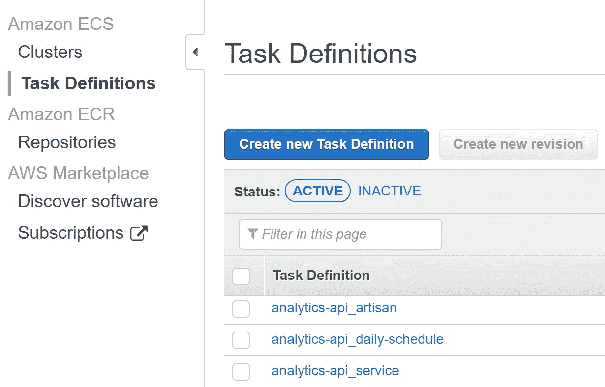

# 在 AWS 上运行 Laravel 的挑战

> 原文：<https://medium.com/hackernoon/the-challenges-of-running-laravel-on-aws-9f4480b46cf6>

在一家企业级 SaaS 与拉韦尔共事两年后，我积累了一些关于琐事以及艰难挑战及其后果的宝贵经验。本文将只是对使用 Laravel 和 AWS 时所面临的挑战进行一些高层次的概述。一些后续文章将深入探讨一些解决方案。

# VPC

在虚拟私有云背后运行一个软件，意味着默认情况下一切都是关闭的。我们需要明确地开放严格必要的服务。在 VPC 上运行 AWS Elastic Container Services(Fargate)上的 Laravel 应用程序会带来一个重要的挑战:您永远不会通过 SSH 访问您的服务器。如果生产中有任何错误不小心漏掉了，就没有终端访问来查看容器内部发生了什么。对于一个习惯于 SSH 访问的团队来说，这似乎是一个很大的挑战，但是当以封闭访问的心态开发一个应用程序时，日志记录和监控得到了应有的关注，以确保当事情变糟时，您拥有尽可能多的信息。

# 无线电数据系统

数据库也在 VPC 防火墙后关闭。理论上，我们可以使用 bastion 主机来授权我们自己访问 RDS，但是就像容器一样，我们尽量把这作为最后的手段。两周前，我们获得了 Laravel Nova 的许可证，试图缓解这个问题。目标是至少让*只读*访问每一个雄辩的模型，永远避免旋转堡垒 EC2 连接到 RDS，看看发生了什么。

# 1 个集装箱= 1 项服务

Laravel 有一个很好的包装**克朗**。只需编写一个每分钟运行一次的 cron，并使用 Laravel 任务调度来运行您的任务。但是，除非您愿意为一个容器 24/7 运行付费，否则这个特性将不再是您的朋友。有人可能会说，Web 服务器容器可以使用 **supervisord** 来启动您的 Web 服务器以及任务调度，但是这开始偏离容器的目的。ECS 与为一个服务且仅一个服务的目的运行容器的概念很好地交互，特别是在定义健康检查时。如果你的容器有两个用途，你如何定义它的健康状态？Supervisord 可能永远不会失败，但您的 web 服务器可能会失败。只有一个任务意味着，如果你的网络服务器出现故障，亚马逊会立即用一个新的容器替换掉。

# 微服务的成本

我使用一个在美国、欧洲和澳大利亚提供的软件解决方案。我们在生产中使用三个 AWS 区域，在开发中使用一个。有一些工作导致有一个额外的帐户专门用于 QA 和潜在客户，这将需要一个新的亚洲地区。换句话说，一个微服务意味着(目前)至少 4 个容器，(很快)6 个容器。为了稳定起见，一些服务总是运行两个容器，而不是一个(仅限于生产)。这使得这个数字达到(目前)7 个集装箱和(很快)10 个集装箱。

除此之外，微服务通常由一个前端应用程序和一个后端应用程序提供支持。数量翻倍了。

# 技工

如前所述，SSH 无法访问生产环境。永远不会。这意味着没有`php artisan migrate`或`php artisan custom:command`。这是一个恼人的挑战，我们过去常常通过公开 API 来应对。想在生产中运行一些东西吗？写一个 API，发布后调用。这是一个可怕的设计，因为我们公开的 API 本来就不是 API。在许多结果中，有一个非常突出:非 http 任务上的 HTTP 上下文。像请求超时或 PHP 配置之类的事情，在 php-cli 和 web 服务器之间应该是不同的。

# 持续部署

我们的大部分 API 只由前端团队使用。这意味着我们对突破性的改变没有那么严格。另一方面，部署一个新的后端容器并不一定意味着一个新的前端容器退出。更有甚者，在部署期间的某个时刻，50%的容器将运行您的软件的先前版本，而另一半将运行较新的版本。突破性的改变对于保持发布的顺利进行变得极其重要。这并不一定意味着维护一个特性或 API 的多个版本。这只是意味着任何版本都应该与正在运行的前一版本兼容。当您确定没有旧版本还在运行时，您可以在一个版本中弃用一些东西，在下一个版本中删除。

# 可扩展性

每个服务在设计时都应该假设可能有多个容器同时运行。更重要的是，为了选择正确的扩展指标，了解服务的瓶颈是什么非常重要。内存使用量迅速增加？在用户开始注意到之前扩大规模。CPU 绑定服务？缩放度量现在是另一个。甚至还有基于 AWS SQS 上的消息数量而扩展的服务。如果有太多的信息需要处理，运行更多的容器。

# 未来跟进

这是我在使用 Laravel 和 AWS 时注意到的对我的开发工作流程影响最大的重要主题的快速高层次概述。我想写一些后续文章来涵盖这些问题的可能解决方案。Laravel 望远镜和 Laravel Nova 是在 VPC 内使用公司软件时不可思议的强大附加功能，最终不用费脑子。更具挑战性的事情，比如旋转一个新的容器来运行一个定制的 Artisan 命令，或者部署一个迁移容器，是一些值得教授的事情。

在 Medium 上关注我，继续关注如何在 AWS 上顺利运行 Laravel 应用程序的技巧和诀窍。