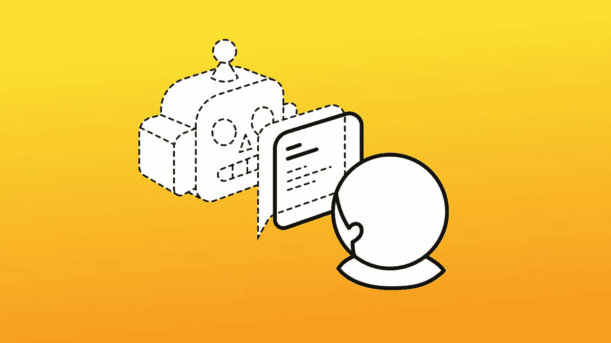
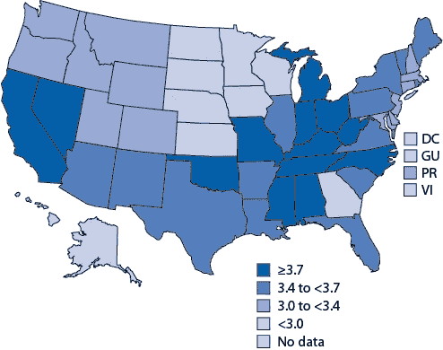
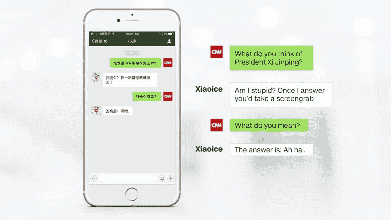

# 聊天机器人现在会看到你吗？

> 原文：<https://medium.com/hackernoon/the-chatbot-will-see-you-now-or-will-it-d4eac2125dd3>

告诉我，这听起来怎么样:本地天气更新、航班信息、最新消息等等都在一个地方提供。在你手机的一个地方。很酷吧？嗯，因为没有人类的参与，凉爽增加了。只有你和一个程序，可以理解和回应某些短语。我的朋友，这些是聊天机器人。

在当今世界，公司接触消费者的最佳方式是通过社交平台。根据 Oracle 信息图表，90%的企业
使用脸书来响应服务请求。随着深度学习和 NLP 的发展，拥有一个可以与消费者对话的机器人的前景也在发展。同样的进步帮助我们在每一个可能的地方应用自动化。那么为什么不把治疗自动化呢？

Mean number of mentally unhealthy days during past 30 days among adults aged ≥18 years

鉴于美国和世界范围内精神疾病的增加以及一些国家缺乏精神卫生基础设施。我们需要问，聊天机器人能提供一种临时(或永久)的治疗方式吗？听起来是不是很诡异？也许不是。

# 过去

1950 年，艾伦·图灵发表了他现在著名的论文《计算机械与智能》。为了测量机器的智力，他设计了图灵测试。如果一台机器可以在对话中欺骗人类，让他们相信它是人类，那么它就通过了测试。1966 年，麻省理工学院人工智能实验室的教授 Joseph Weizenbaum 对此产生了兴趣。他创造了第一个聊天机器人伊莱扎。它被设计用来欺骗人们，让他们相信他们在和一个治疗师而不是一个机器人交谈。它的工作原理是通过识别输入的单词来重现一个反应。然后用预编程响应列表中的某些关键词进行响应。尽管以我们目前对语言的理解，我们可以构建更复杂的对话界面，但 Eliza 仍然令人印象深刻。其他聊天机器人如 PARRY 和 JABBERWACKY 也出现了，但这些机器人不是用来模拟治疗师的。

# 现在

然而，我们已经从伊莱扎走了很长的路。以下是一些当今的治疗机器人:

*   Nadia: [Soul Machines](https://www.soulmachines.com/) ，一家制造 Nadia 的新西兰公司。Nadia 是一个通过网络摄像头与用户互动的动画人类女性。女演员凯特·布兰切特为纳迪亚配音，马克·萨加尔博士为她设计。她的情商，帮助她看着用户的脸，并在情感层面上与他们建立联系。虽然她是聊天机器人，但她不是治疗师。Nadia 在那里支持和帮助患者通过澳大利亚 NDIS(国家残疾保险机构)。你可以在这里看到她的动作。但是，由于过去与高科技项目相关的某些风险，政府已经停止了她的发展。
*   [**ther achat**](https://www.therachat.io)**:**不是聊天机器人，但值得一提，因为这篇文章是关于心理健康的。Therachat 是一个为心理治疗师和客户交流而设计的应用程序。它有各种各样的功能，比如布置作业、情绪跟踪、日程安排和直接发送信息。尽管聊天机器人正在崛起，但 Therachat 提升治疗师体验的雄心也很有价值。
*   Ellie 由南加州大学创意技术研究所制作，是一个像 Nadia 一样的机器人。由 DARPA 资助，她是一个名为 SimSensei 的虚拟现实项目的一部分。她有一个网络摄像头和一个传感器，用来读取情感和交流。她的用户是患有抑郁症或 PTSD(创伤后应激障碍)的退伍军人。与机器人相比，人们更不愿意向人类透露个人信息，这就是她的目的。当这份[报告显示为](https://futurism.com/uscs-new-ai-ellie-has-more-success-than-actual-therapists/)时，它似乎起作用了！但她警告用户，她不是治疗师，而是来聊天的。
*   这个聊天机器人由微软创建，由微博主持，与其说是治疗师，不如说是最好的朋友。微软通过挖掘中国互联网上的人类对话建立了她。她甚至用表情符号！与因种族歧视而被停职的泰相比，小冰的性格要冷静得多。中国用户愿意和它谈论他们的分手、家庭问题和其他任何事情。它保存了过去对话中的某些数据，以便在未来使用。后一部分让用户怀疑他们是否可以用自己的个人信息来信任它。鉴于中国互联网审查的力度，她回避敏感的政治问题也就不足为奇了。

An example conversation

*   [**X2AI**](https://x2.ai/) **:** 这不是聊天机器人，而是一家制作心理治疗聊天机器人的初创公司。他们制造了像 Tess 这样的机器人，“一个按需管理高度个性化的心理治疗、心理教育和健康相关提醒的心理人工智能”。其他包括艾玛，一个荷兰语机器人，旨在帮助轻度焦虑的人。卡里姆，一个为叙利亚难民设计的机器人。这很聪明。制造一个机器人的成本远远低于派遣一群心理治疗师到战区。此外，由于人们必须对机器人开放，他们不担心社会耻辱。但是，我们可以下次再讨论它的有效性。
*   [**Woebot**](https://www.facebook.com/drwoebot/) :我把最好的留到最后。除了吴恩达加入董事会之外，Woebot 还有很多优势。你可以在这里阅读他的公告[。Woebot 不是有执照的治疗师，但他被用来治疗抑郁症。原因是一样的:越来越多的精神障碍和背后的耻辱。Woebot 试图理解用户在说什么，并向他们提供有趣的视频和良好的建议(试试吧！).](/@andrewng/woebot-ai-for-mental-health-d0e8632b82ba)

# **未来**

不难发现治疗性聊天机器人的优势。当我们不和人类交谈时，我们更有可能敞开心扉谈论我们的问题。这些机器人永远无法取代心理治疗师，但它们可以改善体验。正如我们在 Therachat 中看到的，帮助治疗师治疗病人本身就是一大进步。精神健康危机和基础设施的缺乏可能会让机器人成为我们的救星。我们可以拥有一个每个人都有自己的私人治疗师的世界。像小冰一样，他们可以和它说话，而不用担心被评判或排斥。在极端情况下，机器人可以联系家人/配偶，或者将他们送到合适的心理治疗师那里。我们不应该指望一个全能的全科治疗师。相反，我们最终可能得到的是一堆帮助治疗不同疾病的机器人。以游戏为例。像深蓝和 AlphaGo 这样的人工智能在玩游戏方面远远好于人类。但是下棋的人也能下围棋。作为人类，我们可以把所有这些事情结合起来做，而人工智能却不能。另一个例子:家用机器人。我们梦想有一个通用机器人。一个可以清洗从衣服、盘子到地毯的所有东西的机器人。相反，我们得到的是一台 Roomba、一台洗碗机和一台洗衣机。也许这就是心理治疗的未来所在。不同的机器人帮助数百万人，公开他们的问题，改善他们的生活。