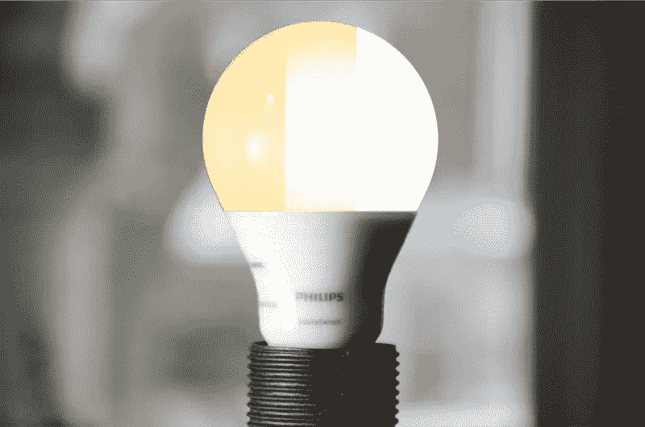

# 在家里获得昼夜节律照明的最便宜的方法

> 原文：<https://medium.com/hackernoon/the-cheapest-way-to-get-circadian-lighting-at-home-6d961dff3f63>

The Philips SceneSwitch has three color settings for night, in-between, and day

昼夜节律照明——改变颜色以促进夜间睡眠和白天能量的照明——[是未来的](https://hackernoon.com/the-future-of-light-c8cf75394725)。有[的重要证据](https://hackernoon.com/whats-so-bad-about-blue-light-b04e13a801df)表明蓝光在白天是必要的，而[在夜晚是不可取的](/@yeutterg/5-hacks-for-the-best-sleep-ever-50cd3079c546)。

但是直到最近，昼夜节律照明还非常昂贵并且难以安装。

也就是在 [SceneSwitch](https://www.usa.philips.com/c-m-li/choose-a-bulb/sceneswitch) 之前。

View my video [on YouTube](https://www.youtube.com/c/gregyeutter?sub_confirmation=1).

飞利浦一直在悄悄地销售一种昼夜节律灯泡，这种灯泡不需要复杂的设置，也不需要调光器。最棒的是，在亚马逊、家得宝、沃尔玛这样的零售商那里，售价在 6 到 12 美元之间。

# 易于设置和使用

安装 SceneSwitch 就像安装任何其他灯泡一样:拧入并打开它。

Changing between SceneSwitch color modes is a simple as flicking a switch off and on again. Image: [Philips](https://www.usa.philips.com/c-m-li/choose-a-bulb/sceneswitch).

开箱后，SceneSwitch 看起来就像一个 60 瓦的白炽灯泡。但是轻按电源开关，你会看到颜色变成充满活力的白天模式。

再次轻触电源，灯泡会变得更暗、更放松。这是夜间模式。

它甚至还记得之前的设置，所以你在半夜打开它时不会被吓一跳。

SceneSwitch 会自动变色吗？它和调光器一起工作吗？可以用不同时区的 Alexa 来控制吗？不，不，不。但是每个灯泡也不需要花费 50 美元。

# 蓝色的阴影

为什么有效？SceneSwitch 有三种颜色模式，不仅看起来不同，而且发出的蓝光量也不同。

Remember prisms from science class?

白天模式看起来很像白天。在白光中有大量的蓝光。白天需要蓝光来刺激生理节奏。

夜间模式非常昏暗，几乎像蜡烛一样。这种模式发出的蓝光相对较少，因此您可以在阅读、看电视和其他夜间活动中使用它，而不必担心[会打扰您的睡眠](/@yeutterg/5-hacks-for-the-best-sleep-ever-50cd3079c546)。

中间模式就是:在中间。它发出的蓝光比夜间模式多，但比白天模式少。这种模式最好在清晨和傍晚使用。

# 你自己试试吧

飞利浦 SceneSwitch 是在家里尝试昼夜节律照明的最简单、最便宜的方法。你可以从零售商那里买到灯泡，比如[亚马逊](https://www.amazon.com/dp/B01LOSEW32/?tag=gregyeutter-20) *、[家得宝](https://goo.gl/MnYiEb)和[沃尔玛](https://goo.gl/XtnmRZ) *。

感谢阅读。如果你喜欢这篇文章，请点击上面的按钮，与你的朋友分享。我也鼓励你订阅我的 YouTube 频道，获取更多的数字健康内容。

*本评论不是由飞利浦赞助的。然而，我可能会从点击代销商链接后的购买中获得一小笔佣金。