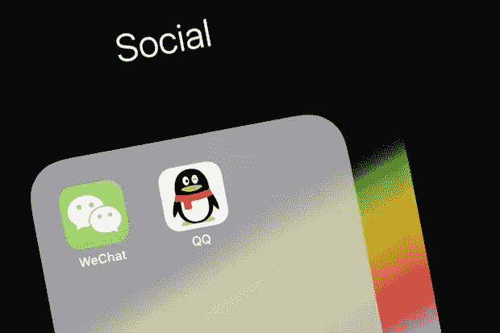
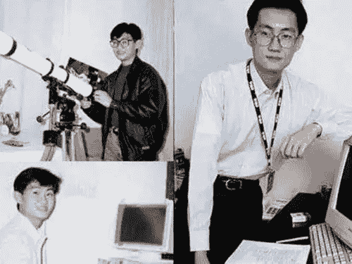
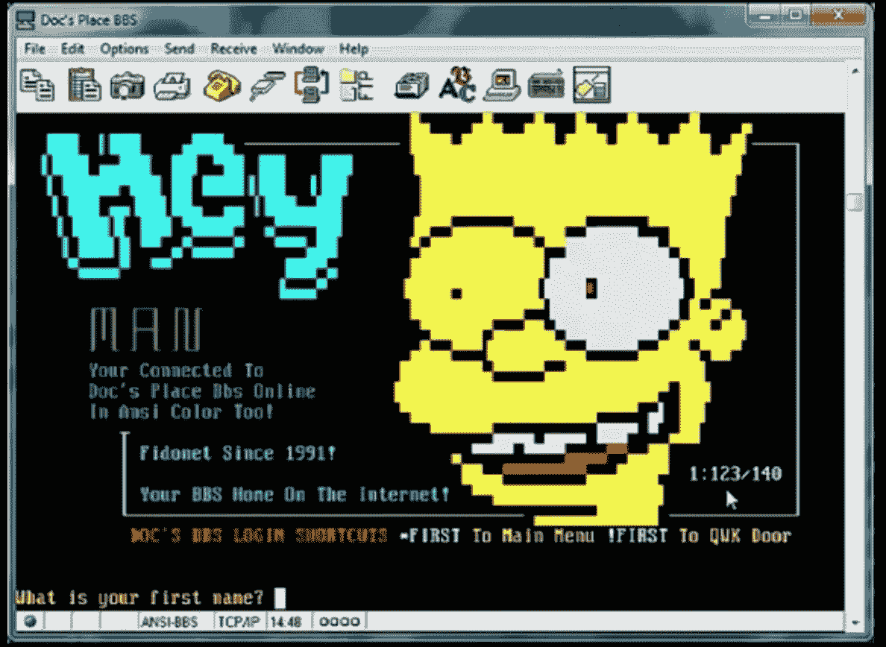
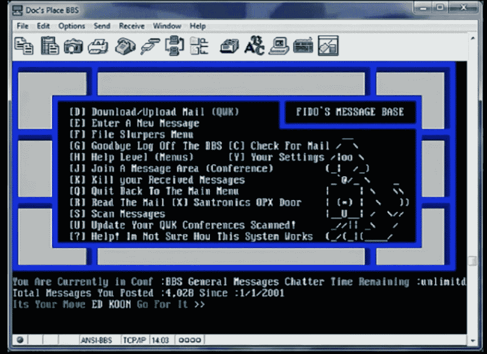
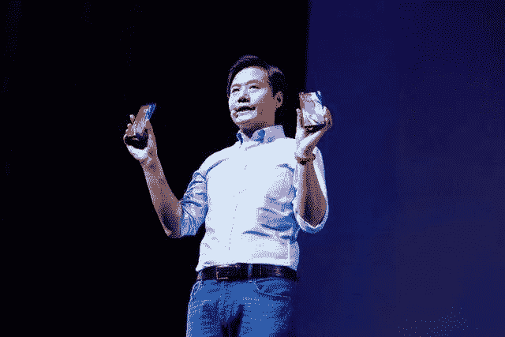
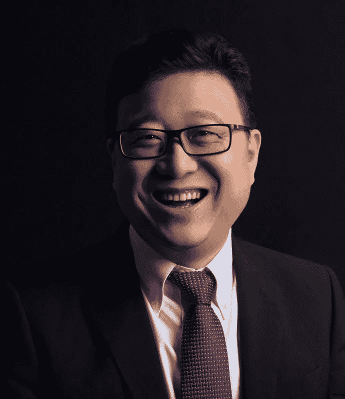
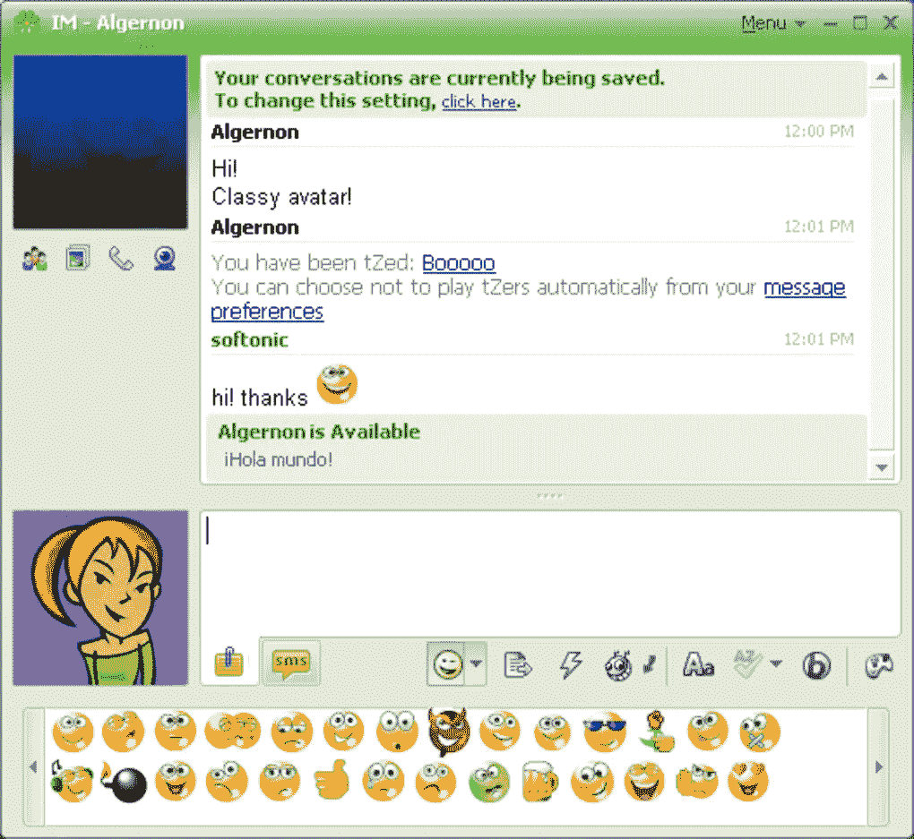
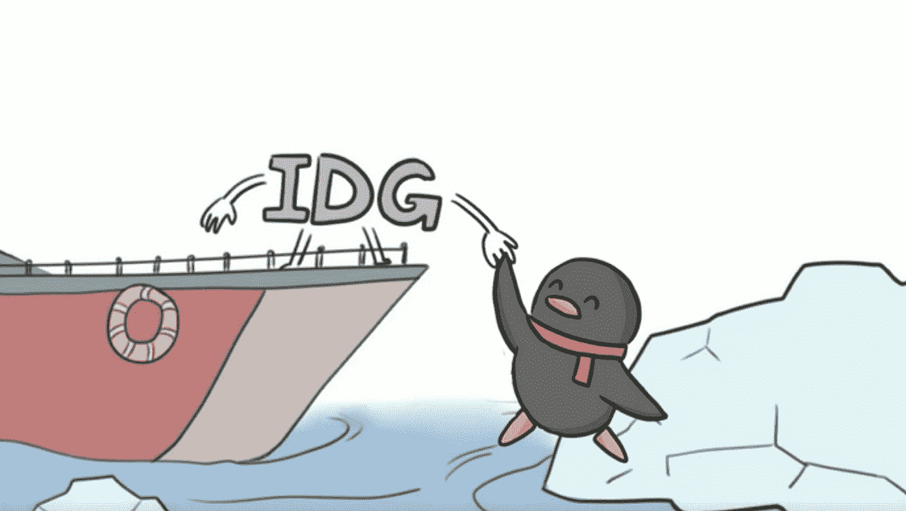
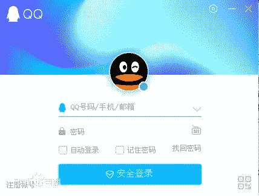
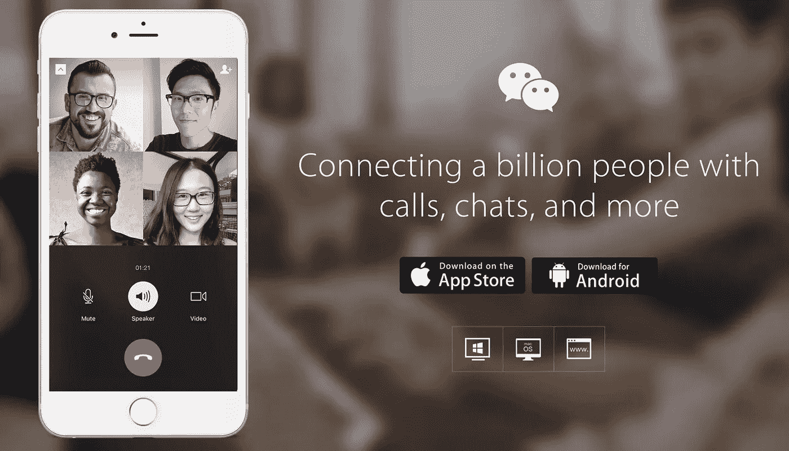

# 中国社交网络

> 原文：<https://medium.com/hackernoon/the-chinese-social-network-bb282204af9c>

## 腾讯和中国互联网公司的起源故事

*Source:* [*Fast Company*](https://www.fastcompany.com/3029119/tencent-the-secretive-chinese-tech-giant-that-can-rival-facebook-a)

腾讯是世界上最大的科技公司之一。据 The Verge 称，它是亚洲最有价值的公司。

腾讯拥有微信，这款“万能应用”拥有近 10 亿用户，其中许多人每天的活跃时间超过 4 小时。 [*彭博商业周刊*](https://www.bloomberg.com/news/features/2017-06-28/tencent-rules-china-the-problem-is-the-rest-of-the-world) 称这比花在脸书、Instagram、Snapchat 和 Twitter 上的平均时间加起来还多。

90 年代末，马(马化腾)和他的四个朋友在深圳创立了腾讯。如果你在中国长大或生活，微信和 QQ 应用程序代表了你的社交媒体、你的青少年时代、你的钱包、你的职业更新、你的购物狂欢和你的点餐体验。

[The Star](https://www.thestar.com.my/tech/tech-news/2018/05/16/tencent-beats-estimates-as-wechat-mobile-games-drive-growth/)

Tencent’s services don’t stop there. Its offerings also include music and video streaming, gaming, and more. In 2016, prominent Chinese author Wu Xiaobo published the bestselling book [*Tencent: 1998–2016*](https://www.amazon.com/Tencent-1998-2016-Survivor-Challenger-Chinese/dp/7308164209/ref=sr_1_3?s=books&ie=UTF8&qid=1542620438&sr=1-3) *(腾讯传),* which offers an intimate view of Tencent’s history while contextualizing the broader internet landscape in China. This post will cover some highlights from the book.

**马化腾早年**

1971 年，中国处于一种社会政治焦虑和脱离世界的状态。这是马花藤出生的那一年——比共产党统治者毛泽东去世早五年。几年后，最高领导人邓小平将推动中国向世界开放经济。

马出生于海南省，13 岁时随家人移居广东省深圳市。深圳今天被称为“世界五金之都”，被称为下一个硅谷。它最初是由邓小平在 70 年代末的“改革开放”政策建立的一个经济特区。

Ma Huateng

1989 年，当马化腾(Pony Ma)申请大学时，中国再次面临政治压力。父母想让孩子离家近一点，所以马的大学选择是深圳大学，尽管他的高考成绩足以进入清华大学等全国顶尖学校。马从小就迷上了天文学，并打算把它作为自己的专业。不幸的是，深圳大学没有这个选项，所以马转而选择了计算机工程。

马在大学里是一个安静、勤奋、成绩优异的学生。马的一位教授指出，他总是在阅读或编写代码。马和他的同伴们会在大学的计算机实验室里举行“黑客大赛”,比赛的目标是编写能使计算机硬盘死锁的程序，这样除了黑客之外，没有人能打开它。马的同学称他为“黑客高手”，经常导致实验室机器无限期关闭。除了是 C 编程语言的爱好者之外，马还喜欢构建图形用户界面(GUI)。过去，大多数计算机运行在没有图形启示的 DOS(磁盘操作系统)上。马将建立类似于视窗用户界面的可视化组件，但这种组件尚未进入中国市场。

大学四年级时，马在当时中国最著名的计算机公司之一黎明实习。正是在这里，这位 22 岁的年轻人建立了他人生中第一个有意义的项目——股票市场分析工具。除了用户界面，马还实现了技术和定量分析工具。马还自学了神经网络，试图建立一个股票价格预测功能。虽然很多人都制作过类似的工具，但还是马的软件中的图形界面引起了他的雇主的注意，随后他以 5 万元人民币()买下了他的工具。这相当于一名大学毕业生三年的工资。

到马大学毕业时，他还没有参加过学生会，也没有竞选过学生组织的领导职位。他只是一个安静、好奇的学生，偶尔喜欢入侵校园里的电脑。毕业后，马加入深圳润迅公司，担任软件工程师。在寻找全职工作时，马向润迅展示了他在黎明实习期间制作的股市分析工具，第二天就收到了一份工作邀请。他的大学好友张志东和许陈一——后来成为腾讯的首席技术官和首席信息官——继续攻读研究生。

在润讯的 5 年职业生涯中，马开发了一系列产品，并担任了管理职务。但在大公司做一名高效的工程师只是马身份的一部分。另一部分是一个雄心勃勃、不屈不挠的建设者，他喜欢和朋友一起销售自己开发的软件。

**在互联网出现之前，有 FidoNet**

1994 年，马对 FidoNet 产生了兴趣。FidoNet 于 1984 年起源于美国，是一个全球性的计算机[网络](https://hackernoon.com/tagged/network)，用于[公告板系统(BBS)](https://en.wikipedia.org/wiki/Bulletin_board_system) 之间的通信。人们可以把 BBS 想象成一个运行文件系统和论坛的计算机网络，人们可以用终端连接到它。信息和文件通过调制解调器发送，调制解调器可以通过电话线传输数据。

1991 年，罗毅在中国成立了第一家 FidoNet 公司，名为 CFido。很快，中国的几个爱好者建立了自己的系统加入网络。马着迷于这样一个事实，即他可以使用调制解调器拨号进入 BBS，在那里他可以找到来自世界各地的人并与他们交流。能够访问不在本地计算机上的东西是不可思议的。马决定建立自己的 FidoNet 集群，成为一名系统运营商。他几乎用光了他卖股票软件赚来的所有钱来购买和安装 4 根电话线和 8 台电脑。

中国和世界上最有影响力的互联网公司的几位创始人在 90 年代末就已经因为对 FidoNet 的共同迷恋而联系在一起了。这是他们成名之前的事了；这几乎就像是中国版的贝宝黑手党。

Source: [v.qq.com](https://v.qq.com/x/page/m051555tovf.html)

1995 年，雷军在北京建立了他的集群，他后来创立了小米，iPhone 在中国市场份额的最大挑战者。

Lei Jun, founder of Xiaomi (Source: Baidu)

1995 年，马云遇到了丁磊，他后来成为网易的创始人，网易是世界上最大的互联网和游戏公司之一。丁也活跃在中国的 FidoNet 社区。作为 FidoNet 深圳集群的系统操作员，马负责问候其他访问该地区的爱好者。同样是一名程序员，丁从大学起就渴望创办一家公司。丁当时刚刚辞掉工作，正在中国南方旅行，希望能结识一些“网上”朋友。他最终加入了位于广州的美国软件公司 Sybase。

Ding Lei, founder of NetEase (Source: [Baidu](https://baike.baidu.com/item/%E4%B8%81%E7%A3%8A/15174))

丁磊一年后离开赛贝斯，加入一家 ISP(互联网服务提供商)公司。在此期间，他了解到互联网领域的新发展。1996 年 7 月，杰克·史密斯推出了第一个基于网络的免费电子邮件服务 Hotmail，一年后被微软收购。丁注意到了电子邮件的革命性潜力，这让他倾其所有创办了网易。丁和他大学时的朋友一起开发了第一个免费的中文电子邮件服务。网易通过向中国电信企业出售服务来赚钱，这使丁成为第一个赚钱的中国互联网企业家。

丁的故事鼓舞了马，他在成为 FidoNet 的系统操作员后并没有取得很大的成就。他记得自己在润迅工作时曾打算开发一个电子邮件系统，但没能找到支持。丁磊的行动和成功向马云展示了互联网领域的风险投资机会。1998 年春天，马在一家咖啡馆对朋友张之洞说:“我们开个公司吧。”

**启动**

马向提出了将互联网与的寻呼机(传呼机)结合起来的想法。寻呼机是一种无线通信设备，允许人们在特定的地理区域内发送文本和语音消息。像步话机的升级一样，寻呼机在 80 年代和 90 年代初被广泛使用。

马的想法是利用互联网在传呼机之间发送电子邮件、新闻等等。张被马的热情所感动，辞去了黎明公司的工作(甚至比马辞去润迅公司的工作还要早)。他们请来自己的朋友陈一丹和许，组成了一个由四名工程师组成的团队。当他们意识到他们都没有销售经验时，他们启用了当时在深圳市电信部门工作的曾李青。

Tencent co-founders Pony Ma, Chen Yidan, Zhang Zhidong (Source: Baidu)

90 年代末，腾讯诞生的时候，更大的互联网世界正在发生什么？在美国，马赛克浏览器(网景)和 Internet Explorer(微软)之间的[【浏览器大战】](https://en.wikipedia.org/wiki/Browser_wars)正在升级。太阳微系统公司发布了 Java 编程语言。史蒂夫·乔布斯在中断一段时间后重返苹果，并推出了 iMac。

麻省理工学院的博士张朝阳回到中国创建了搜狐，一个中国搜索引擎。

在 1998 年和 1999 年，电子商务巨头 JD.com 和 T2 也相继成立。李彦宏离开了纽约州立大学的博士学位，回到中国创办了中国最大的搜索引擎[百度](https://en.wikipedia.org/wiki/Baidu)。

这是中国年轻企业家的“黄金一代”——他们都出生于 70 年代，许多人接受过世界一流的教育，在互联网崛起期间碰巧是勤劳的程序员。他们是第一批获得风险资本和国际投资的群体。李彦宏和张朝阳都在美国获得了高等教育学位，他们见识了硅谷的精华，并在创业初期获得了资金。一旦马云成为《福布斯》一篇报道阿里巴巴受欢迎程度的文章的目标，他也受到了国际关注和资本的追逐。这些年轻人很大程度上受到了他们在美国互联网繁荣时期所见所闻的启发。

在所有中国互联网创业公司中，腾讯是最不引人注目的。它不是一个在线门户网站、搜索引擎或电子商务网站——很难准确定义腾讯做了什么。马的无线寻呼机的想法是基于一个危险的前提，即人们会继续使用寻呼机，这显然没有发生。

ICQ 和即时通讯的黎明

1996 年，三个刚服完兵役的以色列小伙开发了 ICQ(“我找你”)，一个互联网通讯工具。人们可以使用 ICQ 在线聊天和共享文件。1998 年底被 AOL 收购时，这个团队以奇异公司的名义成立，拥有大约 1000 万用户。

[ICQ](https://www.google.com/url?sa=i&source=images&cd=&ved=2ahUKEwjdpr673OHeAhWGHDQIHXrIBcMQjRx6BAgBEAU&url=https%3A%2F%2Ficq.en.softonic.com%2F&psig=AOvVaw3wNP9tU4hHkd4SCZMhJPRb&ust=1542760341050140) interface

ICQ 的中国克隆版是由一家台湾公司在 1998 年开发的。腾讯的马和他的团队也想尝试一下，于是他们开发了 OICQ，其中“O”代表“开放”。

此后，腾讯被拆分为两个产品领域:寻呼软件和 OICQ。腾讯意识到这个由 ICQ 主导的即时通讯市场仍有空间，因为在收购 AOL 后，创始人留在了以色列，而 AOL 正在被针对微软的浏览器战争分散注意力。尽管有中国版的 ICQ，但马意识到它们缺乏战略、品牌和产品市场适应性。因此，腾讯团队专注于使 OICQ 适合 mainland China，专注于性能和功能。他们增加了离线消息(ICQ 不支持)和添加陌生人为联系人等功能。1999 年的一天，团队注意到 OICQ 有 500 个用户。但他们不知道，这个消息应用程序将消耗他们所有的现金。

在美国，劳动力很昂贵，但是设备可以更便宜。在中国，情况正好相反。OICQ 的服务器很难跟上不断增长的用户流量，所以工程师们投入了大量精力来减轻他们服务器的负担。一度，用户数量每 90 天增长 4 倍。该团队已经没有钱购买更多的服务器了。重要的是要记住，因为他们没有收入模式，腾讯团队是做自由职业者的工作来维持公司。当 OICQ 吸收了他们从自由职业中赚来的所有钱时，越来越难找到多份工作。

**濒死时刻**

1999 年，情况开始变得令人绝望。腾讯收到了一个来自美国的厚厚的信封。这是美国在线律师的一封信:他们起诉 OICQ 窃取 ICQ 的知识产权，并要求腾讯停止使用“OICQ.com”和“OICQ.net”域名。马召集了他的共同创始人，他们都知道他们没有资金为此诉诸法庭。自推出 9 个月以来，OICQ 已经达到 100 万用户，但腾讯只有 1 万美元的 CNY 现金。此时，马只有两个选择:要么筹集更多资金，降低成本，要么出售腾讯。

他两种都试过了。但出售腾讯的尝试遭到了反对。潜在的收购者找不到腾讯如何赚钱的答案。有一段时间，为了估算腾讯的估值，收购方甚至将办公室里的电脑、桌椅数量也计算在内。马和他的团队希望以 300 万元的价格出售该公司，但最高出价是 60 万元。因此，创立团队将注意力从销售转移到了借钱上。马的一个借钱给他的朋友说:“如果你真的没钱了，不用担心还回去。我只是不想要你的股票。”销售专家曾李青建议他们寻找风险投资。“这些在老式 IT 部门工作的人看不到未来。我们需要找到一些更疯狂的人——他们不仅会寻找立即盈利的公司，反而会在未来变得巨大。这就是风险投资。”这是马第一次了解风险投资的概念。

当时，中国最著名的风险投资公司是出生于美国的 IDG 资本。曾庆红利用他的人脉安排了一次与 IDG 的会面，并准备了一份 20 页的商业计划。当马和曾轶可会见的王叔时，他们哀叹道:“如果现在不资助我们，腾讯可能会死。但即便你真的给了我们钱，未来仍然不确定。”王问他们对腾讯的未来有什么看法。马回答说:“我不知道。”多年后，王回忆起这一刻:“那时我意识到他是一个非常脚踏实地的领导者，一个可以信赖的人。”

当腾讯的交易传到 IDG 北京办公室的高层时，合伙人问了和其他人一样的问题——“他们将如何赚钱？”在多次被问及公司的收入模式后，马只是说，他只知道这是人们喜欢用的东西，但不知道从谁那里赚钱。最终，IDG 投资腾讯有两个主要原因:首先，OICQ 确实是一个受欢迎的产品，很有吸引力——它是人们喜欢的东西。第二，当最初的 ICQ 出售给 AOL 时，他们看到了它的成功退出，因此认为 OICQ 可能有价值。

腾讯提出 550 万美元的估值。创始人希望保持公司的多数股权，因此他们以 220 万美元的价格收购了公司 40%的股份。另一个潜在投资者是盈科，该基金由亚洲首富李曼·卡申的儿子领导。

当 IDG 和映客同意投资 220 万美元，并各持有公司 20%的股份时，腾讯已经身无分文了。如果融资再晚一点，腾讯不仅会自己死掉，还可能因为即将到来的网络泡沫破裂而死掉。2000 年 4 月，纳斯达克暴跌，世界上最大的互联网公司失去了大部分市值。雅虎的市值从 930 亿美元降至 90 亿美元，亚马逊从 220 亿美元降至 40 亿美元。如果不是马和曾及时发现并说服了，如果不是的王澍下了这个赌注，腾讯可能不会有今天。

腾讯最终被勒令将域名“OICQ.com”和“OICQ.net”归还给 AOL。当一名腾讯员工在公交车上听到一些用户谈论 OICQ 时，他注意到他们称它为“QQ”。“OICQ”这个听起来很可爱的变体成为了该产品的新名字。

QQ’s login page (Source: Baidu)

腾讯从 IDG 筹集的资金将用于提供更多的服务器和支付工资。但是收入的来源仍然是一个没有答案的问题。很快，寻找买家的工作又开始了。腾讯接触了搜狐、雅虎中国和其他几家公司，但都遭到拒绝。在这些绝望的时刻，用户群继续大幅增长。具有讽刺意味的是，QQ 的用户群达到了 1 亿，而中国没有一个人想买腾讯。

一天，几个自称来自南非媒体巨头 Naspers 旗下投资公司 MIH 中国办公室的人走进腾讯在深圳的办公室。这是马和他的团队第一次了解到和 Naspers。

代表 MIH 在中国的王大为有一个习惯，就是每到一个新城市就去网吧。他注意到每个人的桌面上都有一个叫 QQ 的程序，所以他认为这一定是一家强大的互联网公司。每个人的名片上都有他们的 QQ id 号码，这进一步激起了他的好奇心。马向王展示了一些用户增长图，并告诉他每天有 50 万新用户加入。这开启了 MIH 和腾讯之间的投资谈判。MIH 对腾讯的估值为 6000 万美元，并希望成为该公司的最大股东。腾讯团队强烈反对放弃对该公司的多数控制权，但对该公司的估值比前一年高出 11 倍感到欢欣鼓舞。

IDG 也对 MIH 的估值感到兴奋，这意味着他们的投资回报。IDG 让出了他们在腾讯 20%股份中的 12.8%，保留了 7.2%。映客放弃了其持有的全部 20%的腾讯股份。MIH 最终持有腾讯 32.8%的股份，成为仅次于创始人的第二大股东。这是风险投资史上最伟大的交易之一。

**“说真的，你将如何赚钱？”**

腾讯曾多次尝试用 QQ 赚钱，但都没有成功，直到 2002 年推出了一项功能。产品经理徐亮了解到一个韩国网站，sayclub.com，它有一个功能，允许人们用个性化的发型、面部表情、服装等创建头像。这是一项韩国公众喜爱的有偿服务。该网站有 150 万用户，平均每月支付 5 CNY。徐很快雇人将网站从韩语翻译过来，并推动腾讯建立类似的网站。

Sayclub avatars (source: [Violablu.net](http://violablu.net/say-club-boy-dollz/))

在说服腾讯高管后，QQ 迅速推出了自己的头像功能 QQ 秀。人们可以付费获得“q 币”，然后用 q 币在 QQ 市场购买头像组件。所有配件的价格在 0.5 到 1 CNY 之间。为这项服务付费的 QQ 用户可以让他们的头像出现在聊天室里。在 QQ Show 推出的前半年内，该服务拥有约 500 万付费用户，每个人每月贡献约 5 CNY。你可能会说这也是一场文化运动，因为中国人习惯于“沉闷”和集体性的个人表现。突然间，一个人可以通过色彩和直言不讳的真实性来表达自己。

QQ Show (Source: [Baidu](https://baike.baidu.com/item/QQ%E7%A7%80))

为了让 QQ Show 和独家功能更上一层楼，腾讯推出了名为“红钻会员”的 VIP 会员资格。每月支付 10 CNY，付费用户就可以独享每月虚拟礼物，在他们的显示名称旁边收到一个红色钻石图标，并在 QQ marketplace 享受折扣。这让付费会员感觉像是 QQ 皇室成员。这一系列的货币化努力让腾讯每月获得了数千万的收入。

上世纪 90 年代末，微软在中国加倍努力。2001 年，90%的电脑使用 Windows。微软还宣布了在中国进一步扩展 MSN 的战略，这给腾讯带来了巨大的威胁，腾讯认为微软是一个令人生畏的巨人。2004 版 QQ 推出时，没有企业公司的支持。QQ 看起来像是一个休闲聊天应用，而不是一个严肃的交流工具。另一方面，MSN 是办公室的工具。为了反击，腾讯把目光投向了电子邮件。

Hotmail 是现任的，所以腾讯决定收购它在中国最大的竞争对手之一，Foxmail。Foxmail 是由传奇软件工程师张小龙开发的。Foxmail 是一款免费的电子邮件客户端软件，由张于 1996 年创建。它不一定是任何东西的复制品——它甚至出现在 Outlook 之前。当 Foxmail 推出时，它在一年内获得了 400 万中国用户。Foxmail 于 2005 年被腾讯收购，用于构建 QQ 邮箱。

2010 年，一款名为 Kik messenger 的 app 应运而生。它允许用户通过 wifi 或蜂窝数据与电话簿中的人交换免费信息。15 天之内，Kik 就有了 100 万用户。这引起了张小龙的注意，他请求马让他制造一个类似的产品。

Kik Messenger ([digitaltrends.com](https://www.digitaltrends.com/mobile/kik-100-million-users/))

前面提到的另一位企业家雷军(小米创始人)也注意到了 Kik。但他的公司小米的反应令人难以置信地快——在短短 1 个月的发展后，小米推出了米聊，先是在 Android，然后是 iOS。此后不久，腾讯的张团队推出了微信。但他们没有首先在 Android 上推出，而是推出了 iOS 版本。在接下来的几个月里，这两个应用程序相互竞争。米聊加入了语音消息，微信也紧随其后。添加这个功能后，微信的用户从 10–20k 增加到 50–60k。微信继续推出新功能，如“摇一摇看谁在附近”、“发送消息瓶”等。米聊的服务器很难跟上用户的增长，导致一天内多次宕机。导致微信大获全胜的改变游戏规则的功能是“找到附近的人”。这项功能推出后，微信开始每天获得 10 万新用户。

[WeChat English landing page](https://www.wechat.com/en/)

迈克尔杰克逊的音乐粉丝张(音)声称，产品负责人应该是强大的艺术和人文人士。在腾讯的一次演讲中，张表示，产品愿景者拥有广泛的艺术兴趣:艺术、音乐、阅读、摄影、旅行和其他看似“不相关”的体验，使他们能够培养现代品味，并对人类和世界有更广泛的理解。这让我们想起了史蒂夫·乔布斯关于人文科学和科学交叉的观点:

> “我读到过我心目中的英雄之一，宝丽来的埃德温·兰德所说的关于站在人文科学和科学交汇点的人的重要性，我决定这就是我想做的事情。”

2012 年，微信达到 1 亿用户。它拥有社交媒体应用程序历史上最快的用户增长速度——仅用了微信 433 天就达到了这一里程碑。QQ 用了 10 年，脸书用了 5.5 年，Twitter 用了 4 年。

同年，微信推出了“时刻”功能，类似于脸书新闻，用户可以看到朋友的状态更新。

随后，微信推出了用于朋友间和聊天室汇款的“红包”，以及用于企业通过公告和机器人分享更新和与受众互动的公众账户。这一功能改变了中国企业的工作方式。用户现在可以搜索主题或账户(或扫描二维码)来订阅任何公共页面。这也使他们能够在 1:1 的消息传递界面中与品牌、组织和出版物互动。企业用它来广播新产品，并直接与客户互动。

在中国，如果你把钱包忘在家里，没什么大不了的。如果你有手机，微信可以帮你付款、购买磁悬浮列车车票或预订下一个假期。

显然，中国的互联网格局反映了从公告栏系统到移动设备提升世界的全球创造力。90 年代末出生的巨头不仅在中国无处不在，而且有着永不满足的野心，要占领前所未有的市场。我们甚至还没有触及新的进入者，如世界上最有价值的独角兽[字节跳动](https://www.theverge.com/2018/11/30/18107732/bytedance-valuation-tiktok-china-startup)，以及 [Tik Tok](https://www.tiktok.com/) 和[今日头条](https://techcrunch.com/2018/11/17/jinri-toutiao-new-ceo/)的母公司。正如马所言，“虽然今天有很多大型科技公司，但人类仍处于互联网时代的黎明。”