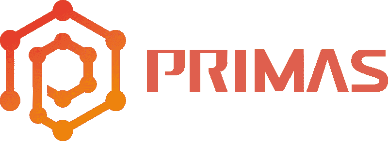
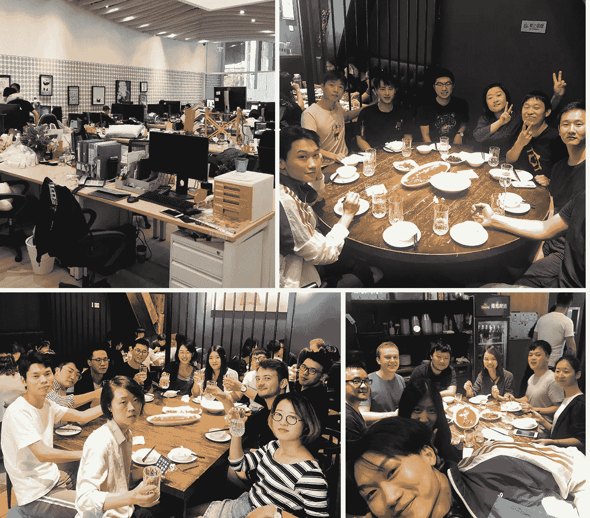
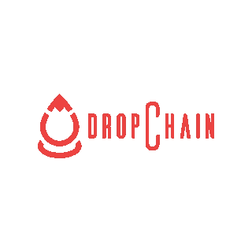
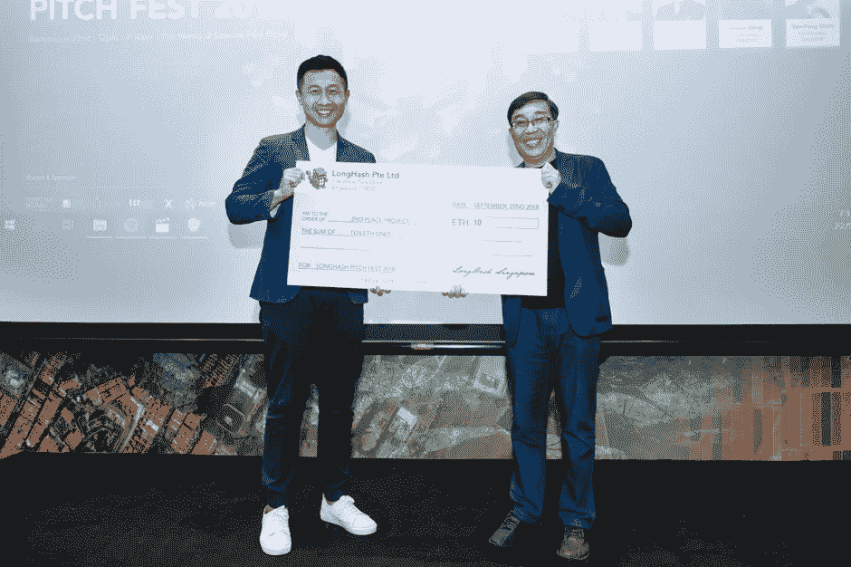
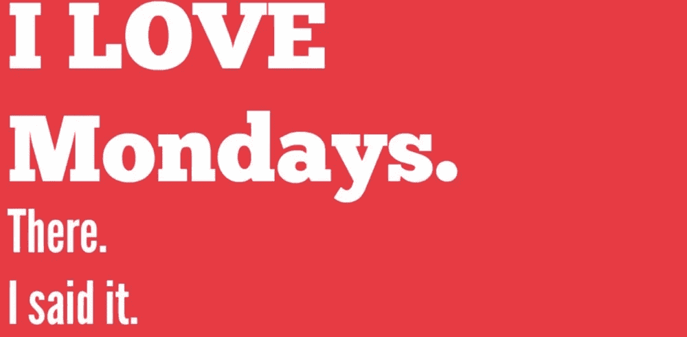

# 引领区块链的城市:上海-第一部分

> 原文：<https://medium.com/hackernoon/the-cities-leading-in-blockchain-shanghai-part-1-2f7b1395d63d>

[Dave Tacon/CNN](https://edition.cnn.com/travel/article/shanghai-future-trip-that-changed-my-life/index.html)

今天，在每一个大都市，你都可以发现一个蓬勃发展的区块链社区。这场复兴运动正在影响每一个主要行业，不仅仅是技术，还包括经济、政治和社会。各个国家、地区和州正在利用这一机会寻找自己的新身份。 [**爱沙尼亚**马尔他](https://cointelegraph.com/news/race-towards-the-first-crypto-country-in-the-world)都在争着成为主要的“区块链国家”，[**波多黎各正在被改造成一个密码天堂**](https://www.abc.net.au/news/2018-07-24/bitcoin-billionaire-brock-pierce-wants-to-transform-puerto-rico/10013026) ，而其他国家像**中国**[**尽管大肆宣传禁令和规定**](https://hackernoon.com/navigating-crypto-regulation-china-fbae88697a21) 却在太空中默默保持着统治地位。

## 这一系列的文章将关注不同的城市和其中的社区。每一个都将突出项目、事件、服务和独特塑造当地景观的人物。最后，我希望这个系列已经从每个社区分享了足够多的信息，这样下次你在镇上时，你就知道该找谁，去哪里玩了。

上海在 2017 年的 ICO 活动中排名第十，但这并不能公平地代表上海在区块链世界的重要性。中国最大的区块链项目之一 [**NEO**](https://neo.org) 就坐落在那里，随之而来的是一连串不间断的创新。凭借强大的人才库、邻近区块链其他主要中心(首尔、香港、新加坡)的地理位置，以及当地政府推动商业发展的举措，上海正在迅速巩固其在区块链的主导地位。

# Primas — **全球首款真正去中心化的应用**

[**Primas**](https://primas.io) 是用于**发布和验证内容**的真实性和所有权的去中心化可信内容协议(DTCP)。Primas 是为高质量的内容制作者创建的，是“一场将质量、可信度和责任带回互联网的运动”。通过使用**专有规则集来检查和存储与图像、文本、音频和视频相关的元数据**，Primas 协议能够确保防止剽窃和盗版。对 WWW 协议的升级对于“带来一个整体上更好更健康的互联网，质量优先于流量”是至关重要的

Primas 首席执行官吴鹏从小就对技术有着浓厚的兴趣，他年轻时花了很多时间阅读西方文学和修理电脑。2013 年，他在联想工作，负责新网络浏览器的产品开发；在这里，他遇到了另一位极客兼大数据专家， **Primas CTO 甘路**。他们的团队一起使用人工智能向用户推送可信的内容，但发现**实际** **内容质量在信息如何在互联网上分发方面发挥了最小的作用**。像**点击诱饵、假新闻和抄袭内容这样的事情产生了不成比例的流量**，从而为平台提供商创造了更多的钱，并使这个系统永久化。在一个日益虚拟的世界里，信誉成了一个日益重要的问题，**两人寻找一个技术解决方案，Primas 诞生了**。

如果说我们都熟悉的网络内容中有一种流行病，那就是假新闻。就在两周前，一堆洪都拉斯人和墨西哥人坐在公共汽车上的照片被用来在 11 月的选举周期前煽动对移民的恐惧。在所有的案例中，**的照片都是从以前的新闻事件**中回收的，很多时候是完全不相关的，并且可以追溯到 2012 年。

 [## 揭穿 5 幅移民大篷车的病毒图片

### 一群前往美国的洪都拉斯人成为社交媒体上错误信息的主题。一群…

www.nytimes.com](https://www.nytimes.com/2018/10/24/world/americas/migrant-caravan-fake-images-news.html) 

“我是互联网的早期使用者，见证了它从一个曾经是创意和信息共享的神奇之地，到现在的状态，一个充斥着(往往是故意的)误导信息和低质量内容的地方，这些内容是由少数几个有私人动机的玩家驱动的”**吴鹏**说。有了 Primas 协议，**假新闻就不那么容易伪造了**，因为网络上使用的每张图片都会被检测到。同样的系统不仅能防止假新闻，而且**还能防止剽窃和盗版。**

Team Primas

今天， **Primas 是为数不多的拥有全功能产品和不断增长的用户群的区块链项目之一**。用户可以 [**下载 iOS 和 Android**](http://primas.io/product) 的应用，并使用它来阅读和发布高质量和完全受保护的内容。**出版商将他们的原创文章、视频和图片上传到网络，可以获得奖励 Primas token(PST)**，而**读者也可以通过评级和与朋友分享**他们喜欢的内容来获得 PST。截至发稿时， [PST 令牌的价值为 0.21 美元](https://coinmarketcap.com/currencies/primas/)，Primas 令牌的**市值为 1100 万美元**。

Primas 也与其他项目共享他们的协议。**作为第 2 层解决方案**，其他区块链可以从连接到 Primas 节点中受益，任何人都可以使用足够的 PST 令牌来操作 Primas 节点。**这有利于整个 Dapp 生态系统**，因为它提供了一个安全可靠的内容网络**，免受审查和盗版**。

与任何内容生态系统一样，获得新用户的采用是增长的最重要组成部分，Primas 已经通过在全球开展**受欢迎的大使计划**开始了这一循环。**你可以在这里** 找到更多关于节目 [**的细节。**](/@Primas_Official/primas-ambassador-program-a297ea0a5dc)

在**[**www . Primas . io**](http://www.primas.io)了解更多关于 Primas 的信息，加入 [**电报**](https://t.me/primas_official) 的对话**

# **drop chain——区块链物流的新成员**

****

**供应链物流是区块链行业重点关注和研究的领域之一。 [**DropChain**](http://dropchainproject.com) 创建了**游戏化供应链追踪系统**，寻求解决“全球供应链系统性缺乏透明度”的问题。**通过激励从农场或工厂到消费者购物车的产品旅程中的不同参与者**，DropChain 将能够收集关于在何时何地发生了什么的数据点。将这些数据与区块链配对将创建一个公众可访问的消耗品分类账，这将能够**保证产品的真实性和完整性。****

**DropChain 团队因其在食品和饮料行业的共同背景以及对食品安全的共同热情而走到了一起。 **DropChain 首席执行官兼创始人 Billy Chan** 和他的团队花了 3 年时间在知名酒类制造商和小企业之间牵线搭桥，逐渐磨练他们的技能和对**中国复杂食品供应网络的理解**。**

**假货也不是小问题，它实际上是一个 400 亿美元的全球问题。*全球范围内都有坏人在无情地用危险的假冒产品损害产品的完整性，其中许多对公众健康有害 2018 年 8 月 10 日，Billy Chan 在宣布与**三亚旅游景点科技加速器** (STATA)达成战略合作伙伴关系时说。而**【6T】美元的全球食品饮料贸易**也多次试图解决，在防止这些假货泛滥方面进展甚微。***

**这也不仅仅是一个健康问题。在这个生态系统中，全球品牌是最常被模仿的，对品牌形象的负面影响需要数年才能消除。有了 DropChain，整个食品&饮料行业将能够**一劳永逸地摆脱这个日益严重的问题**。**

**此外，DropChain 团队打赌，人们会对他们的生态系统数据潜力产生很大兴趣。有大量的信息没有被收集(由于产品过程缺乏透明度)，而这些信息将有助于**做出更好的分销和营销业务决策。****

> **“与酒类行业的几乎任何品牌交谈，他们都能告诉你他们的产品销往哪些国家。然而，对大多数人来说，这就是透明的终点。当前的供应链阻碍了品牌真正了解他们的产品去向。DropChain 目前的形式已经可以告知品牌，他们的产品正在销售到哪个城市、地区、街道，甚至终端零售商，帮助他们获得对当地市场和客户群的高度了解。”—比利·陈**

**如今，DropChain 已经赢得了相当多的关注，在新加坡的**long hash 2018 Pitch Fest**上获得了第二名，最近，他们与 STATA 建立了合作伙伴关系。他们还巩固了与知名食品&饮料公司的合作关系，比如 Brander Urstoff。**

****

****LongHash 2018 Pitch Fest in Singapore****

**DropChain 的下一个重点将是其新的**与** [**Foowala**](http://www.foowala.com) 的整合，后者一直“服务于中国东部的中小型商业社区，提供一站式移动平台，满足他们的食品和酒类采购需求”。Billy Chan 表示，这种品牌重塑和整合将**减少开发时间，并为 DropChain 提供现有的业务关系**。**

**您可以在[**www.dropchainproject.com**](http://www.dropchainproject.com)**了解更多关于 DropChain 项目的信息，并加入 [**电报**](http://t.me/DropChain) 的对话。****

## ****加密星期一——必须参加的加密聚会****

********

****[**神秘星期一**在全球超过 19 个国家](/crypto-oracle/why-we-started-crypto-mondays-8e492d0181f6)举办，但是上海集团的活动是在城里必须参加的**。这位作者在黄金周后的大型“重返工作”活动中亲自找到了他在上海的秘密据点，演讲者有、尹旭和 Chris Cheng。与旧金山或纽约的聚会不同(那里主要是以投资者为中心的人群)，一半的人在区块链项目工作，另一半的人希望更多地了解这个领域。这是**发人深省的讨论和教育重申的完美平衡**有助于在长达一周的加密世界研磨中保持思维新鲜和专注。你可以点击下面的链接报名，给我发消息，或者联系[**@**Michael _ oath](https://twitter.com/michael_oath)了解更多信息。******

** [## 上海神秘星期一

### CryptoMondays 是一个分散的组织，在全球 15 个不同的城市拥有 9000 多名成员…

www.meetup.com](https://www.meetup.com/CryptoMondays-Shanghai/) 

***crypto Monday 是一个分散式组织，在 15 个不同国家的 30 个城市拥有超过 9000 名会员。上海加密星期一将把对加密充满热情的人们聚集在一起，分享他们的观点，建立联系，学习和狂欢。我们会喝酒，我们会笑，我们会学习，我们会开心，同时将 crypto 进一步推向生态系统。***** 

****上海版的第二部分将于下周**推出。知道一个对社区有影响的上海项目吗？即将到来的必须参加的活动或会议？一个每个人都喜欢聊天的人？给我留言，在我下面的社交链接或者我的微信@deanofouska**

****感谢您的阅读，希望您喜欢这篇文章****

***随时在 Linkedin 上加我* [*这里*](https://www.linkedin.com/in/pappasdean) *，关注我 twitter 那里→*[*@ XL dean*](https://twitter.com/XLdean)*，给我发个* [*电报*](https://t.me/bobthegrownup) *。新的文章想法总是被赞赏！***