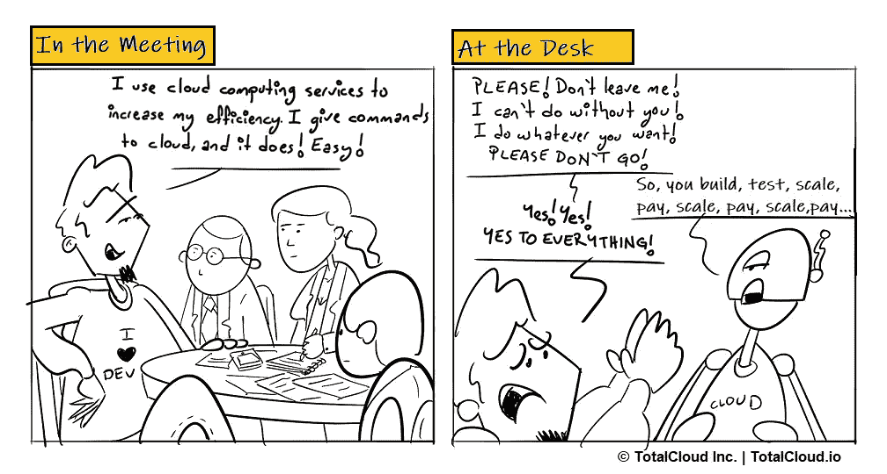

# 云是新常态[漫画]

> 原文：<https://medium.com/hackernoon/the-cloud-is-the-new-normal-cartoon-4a3bbb2520d3>

一名研究人员报告称，价值 1800 亿美元的云服务市场现在的增长速度是云基础设施硬件和软件的三倍。

天啊。我们越来越依赖云提供商环境，日复一日，不是吗？好吧，如果能达到目的，为什么不呢！

> *云是新的常态。*

即使成本螺旋上升，也无处可逃。您对云服务的依赖程度如何？分享你的经历。我们很想听听。

*原载于 2018 年 8 月 2 日*[*blog . total cloud . io*](http://blog.totalcloud.io/cloud-new-normal/)*。*