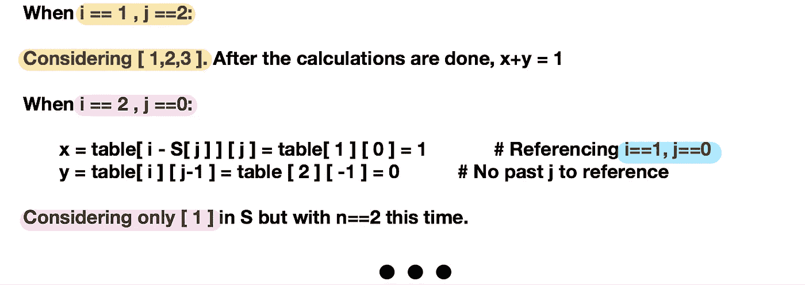

# 硬币兑换问题—已解释

> 原文：<https://medium.com/hackernoon/the-coin-change-problem-explained-ddd035a8f22f>

希望提供一个动态[编程](https://hackernoon.com/tagged/programming)解决这个问题的分步演练。

本文假设读者已经精通递归解决方案。如果有很多问题，我会编辑这篇文章来跟进。或者我可能会回来编辑它。

让我们从看代码开始。我将使用 [Python](https://hackernoon.com/tagged/python) 并分解脚本关键部分发生的事情。这被称为自底向上的方法，因为我们的工作方式是向上索引，而不是递归，递归是通过减少索引直到终止。

该函数接受 S(硬币列表)、m(硬币列表的长度)和 n(我们想要弥补的变化)。在本文中，我们将使用 S=[ 1，2，3 ]和 n = 4 的简单但足够有代表性的情况。

在下面的红框中，我们简单地构造了一个列表列表，长度为 n+1。我们首先将单个列表中的所有值初始化为 0。然后，我们将把表中的第一个列表初始化为全 1。为什么会这样？让我们继续了解为什么。

The function to find the number of combinations.

首先，让我们完全熟悉并理解下图。对于 n = 4 和 S = [ 1，2，3 ]的情况，

我们将使用的变量如下:S 是输入列表，j 是跟踪每个 S 的索引。表中列表的数量初始化为 n + 1，以适应 n=0 的基本情况。为什么它们都是 1？这是为了当 n=0 时程序总是返回 1，类似于这个问题的递归解决方案。

接下来，让我们看看嵌套的 for 循环中发生了什么。

我们将从索引 1 开始遍历表中的每个列表，并且在每次迭代中，我们将遍历 s。这样，我们可以累积计算，并且能够避免重复计算。

通过在嵌套的 for 循环中实现它并增加索引，我们称之为自底向上的方法。

What the nested for loops represent

现在到了棘手的部分(至少对我来说，当我在研究它的时候)。让我们关注嵌套的 for 循环中的两个语句。从 n=1 开始，对表中每个列表的每个元素执行这两条语句。

让我们来看两行代码:

与递归解类似，对于内循环的每次迭代，我们希望获得强制包含 S[ j ]的解并将其存储在 x 中，还希望获得强制排除 S[ j ]的解并将其存储在 y 中。这样，我们将能够引用早期的解以避免重复计算。

为什么每次计算都要包括和排除硬币 S[ j ]?

解释很简单。对于每一枚硬币，只能有两种可能；我们知道，如果硬币(S[ j ])大于 n，那么 x 将返回 0，因为将它包括在内是不可能的。

# **现在，我们从两个问题开始:**

**1。i — S[ j ]的意义是什么？**

S[ j ]之后要引用的前一个 I 的值取自 I。必须包含 S[ j ]。

**2。为什么引用[ j ]？**

我们想引用 S 中的同一个位置，也就是 S[ j ]，只是在不同的 n 处。

**3。为什么用它做表数组的索引？**

参考之前 n 个数组的计算。

# **这两种说法是什么意思:**

1.**第一条语句**

通过强制 S[ j ]，我们从 I 中减去 S[ j ]并参考过去计算的 n，其中 n = I-S[j]。

2.**第二条语句**

参考之前计算的 S[ j ] = S[ j ] — 1，找出所有排除 S[ j ]的解。让我们潜入更深的地方。

# **让我们深入探讨第二个陈述:**

1.**【我】【j-1】的意义是什么？**

引用同一个 n，在 s 的前一个元素中。

2.**为什么让 j < 1 的时候总是返回 0？**

当 j = 0 时，我们不考虑任何 S[ j ]。

**3。在这种情况下，列表 S 必须排序吗？**

不，因为我们在 m 中累积迭代，当 j=m 时，我们只对最后一种情况感兴趣。

**4。用 S[0]和 S[2]而不用 s[1]的情况怎么样？**

我们不需要计算，因为最终我们想知道在遍历硬币数组中的所有硬币后，i==n 有多少个解。

# 现在，让我们开始运行带有测试值的嵌套 for 循环。

Let’s run through the nested for loops.

上述步骤的图示。

我希望这篇文章能够帮助那些试图理解这个问题的人。原谅我，我真的没有花时间在美学上，希望内容能弥补它。

也请参考来自 Geeksforgeeks 网站的动态编程解决方案，通读帖子:

 [## 动态编程| Set 7(硬币兑换)- GeeksforGeeks

### 给定一个值 N，如果我们要兑换 N 美分，并且我们有无限量的 S = { S1，S2，..，Sm}…

www.geeksforgeeks.org](https://www.geeksforgeeks.org/dynamic-programming-set-7-coin-change/)