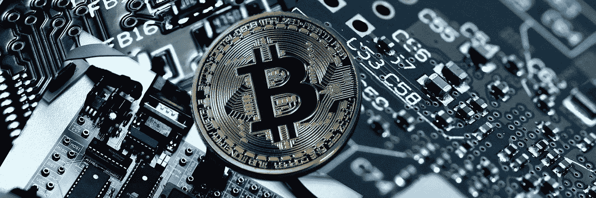

# 证券交易所与区块链的碰撞

> 原文：<https://medium.com/hackernoon/the-collision-of-stock-exchanges-and-blockchain-55d222b87a8>

区块链技术的发明仅仅是作为比特币交易的账本。但是很快就清楚了，它的分散的、不变的、假名的本质可以有效地用于许多行业。区块链技术是过去几年中最具革命性的技术概念之一。已经写了几个出版物，涵盖了分布式账本技术可以用来扰乱不同市场中的变化的各个方面。金融业目前正在经历许多翻天覆地的变化，尤其是金融科技被证明是一个重要的颠覆者。区块链点燃了行业和部门的好奇心，特别是在金融领域。区块链经常被称为“金融服务基础设施的未来”。如果我们谈论区块链技术，很少有批评者存在。但是最近有一群来自世界上不同行业的批评家，他们正在实践分布式账本技术以提高当前系统的效率。

虽然金融部门在过去几年中占据了头条新闻，但其他行业也开始采用这项技术来实现市场民主化。当各行各业的创新者和远见者开始意识到它可以从数字货币中分离出来，并用于变革其他所有行业时，区块链的真正潜力就显现出来了。首先，它的假名性质可以帮助结束身份欺诈。其次，区块链的分散性有助于引入比两个中央系统更快的支付。

# 现行制度

不仅仅是银行在迅速增加对区块链的敞口。世界各地的证券交易所现在都在探索如何最好地利用这项技术，不可避免地作为一种提高成本和效率、降低风险和加强安全的方式。今天，一些最著名的证券交易所正在寻找使用分布式账本技术(DLT)的方法，以便彻底改革传统机制，提出更有效的解决方案。证券交易所的工作和运作涉及非常繁忙和繁琐的程序，这些程序既费时，成本又低，而且可能存在许多风险。多层流程—交易前、交易、交易后和托管，以及证券服务非常复杂。由于区块链具有简化流程的潜在能力，这为其实验提供了一个案例。

股票市场行业的旧模式有许多问题必须尽早解决。以下几点突出了与传统市场体系相关的问题。

*   当前的市场系统有一个集中的分类帐，将所有的数字资产存储在一个位置。如果任何数据损坏，整个数据都会丢失。
*   旧系统的升级通常很繁琐。
*   集中式数据库很昂贵，因为它需要大型机。此外，如果需要的话，许多钱被浪费在修复传统方法上。
*   传统的股票投资方式需要中介。参与者不得不花很多钱在股票投资过程上。
*   传统系统缺乏透明度，一个参与者无法查看其他参与者的决策，导致信息不对称。

使用区块链技术的好处在于，它将大幅削减交易成本，并带来一个无缝高效的系统，参与者将通过一个分散的网络确认交易。一些人暗示，点对点网络也可以由经纪人和交易商组成，而其他人则认为它可能与比特币交易过程非常相似。然而，对于用类似于比特币交易系统的系统取代股票交易所的想法，股市行业专家提出了不同意见。嗯，比特币没有可替代性，这意味着人们可以很容易地识别交易并永远跟踪它们。这可能不适用于股票交易。

**所以简单来说区块链会:**

*   降低成本
*   具有更好的信息安全性。
*   有更快的处理时间
*   有更好的信息收集和研究

# 区块链给股市带来了什么？

区块链可以成为当前碎片化市场体系中兼容性、信任和透明度问题的答案。交易商、经纪人、监管机构和证券交易所等股票市场参与者需要经历一个繁琐的过程(完成交易需要 3+天，主要是由于中介机构的作用、可操作的交易结算和监管过程)。区块链可以通过自动化和去中心化使股票交易所更加优化。它可以帮助降低客户在佣金方面的巨额成本，同时加快快速交易结算的过程。该技术可以在清算和结算中具有可行的用途，同时安全地自动化交易后过程，简化交易的文书工作和证券的合法所有权转移。区块链可以在很大程度上消除对第三方监管机构的需求，因为规则和法规将内置于智能合同中，并在每次交易中强制执行，以便通过作为所有交易监管机构的区块链网络注册交易。

## **交易后事件的自动化**

将区块链和智能合约应用于交易后活动可以消除对中介的需求，减少交易对手和运营风险，同时为更快的贸易结算提供基础设施。金融机构可以在几分钟内而不是几天内结算证券，主要好处是简化实时结算、提高流动性、优化供应链和增加透明度。区块链可以为交易后事件处理提供解决方案，以维护系统中所有参与者共同拥有的单一真实来源。

## **增加公平性和透明度**

如果实施，区块链可以作为每笔交易的在线自动监督系统。基于区块链的交换可以具有跟踪、阻止和报告网络上任何人的非法尝试的内在特性，并且可以提供实现安全策略和标准的健壮平台。由于区块链分类账的设计方式是所有参与者都有完整的交易记录，因此也有投资者的持股记录，它可以带来市场的完全透明和信任。

## 避开中间人

区块链技术的一个关键优势是省去了中间人。实际上，因为区块链上的所有交易都是由社区基于数学概率来验证的，所以对可信中介的要求是不必要的。区块链将允许你拥有一个分散的证券交易所，而不需要经纪公司、清算所或结算流程。

## **更高的流动性**

区块链可以通过自动化减少低效率，这也导致成本降低，从而降低进入壁垒，增加市场基础。对于那些由于成本障碍而无法进入市场的人来说，他们将能够参与进来，最终增加流动性和投资。

## **降低交易成本**

区块链交易更快，因为交易确认是由同行而不是任何中介通过智能合约完成的。随着系统中的中介机构越来越少，与它们相关的成本，如交易记录保存、审计和交易验证也减少了。

## **风险遏制机制**

通过区块链技术，保证金系统和保证金支付可以即时完成，作为资本存放的证券的估值频率可以每天进行，而不是现在普遍的每周进行一次，从而将风险降至最低。

# 挑战

虽然透明度通常对市场来说是一件好事，但在某些情况下，它可能弊大于利。有一些大型对冲基金、共同基金，甚至私人股本公司，会在很长一段时间内逐步卖出大量头寸。允许公众识别此类交易可能会引发一场重大的市场崩盘或反弹，而在正常情况下，这种反弹是由内幕信息推动的。这可能会破坏市场的稳定，因此，如果交易所选择改革传统系统，实施区块链交易所，这将是它们可能面临的最大挑战之一。区块链的实施也带来了维护分散数据库安全标准的风险、法律法规以及对可扩展性的担忧。区块链希望将交易、清算和结算的元素结合起来，但当前的法律和法规将它们分开。

另一个担忧是，使用区块链实施清算系统将引入一种新的费用。在比特币区块链，矿工通过解决优化问题来处理比特币交易，并获得新创造的比特币和希望交易得到处理的比特币用户提供的结算费用。矿商根据提供的费用和问题的难度来确定待清算交易的优先顺序，以便在一个区块中记录交易。如果证券交易所在使用区块链时要求投资者支付交易费用，以使他们的交易得到清算。如果这种情况发生，投资者将不得不相互竞争，以使他们的交易比其他人更快地得到清算。金融市场生态系统目前不确定区块链将在多大程度上兑现其承诺，尤其是在资本市场方面。

**区块链的主要限制有:**

*   复杂性
*   网络规模
*   安全漏洞
*   存储限制
*   不可持续的共识机制

# 以下是一些交易所正在做的事情:

**纳斯达克**一直处于区块链革命的最前沿。在 2015 年之交，纳斯达克推出了使用其纳斯达克 Linq 区块链总账技术成功完成和记录 Chain.com 的私人证券交易——这是纳斯达克 Linq 的第一个客户端。今年 5 月，纳斯达克和花旗宣布了一个集成的支付解决方案，使用分布式账本来记录和传输基于 Chain 的区块链技术的支付指令。

**澳大利亚证券交易所(ASX)** 于 2015 年开始评估清算所电子子登记系统(CHESS)的替代方案。最终，ASX 选择了总部位于美国区块链的创业公司 Digital Asset Holdings，LLC 来开发基于分布式分类账的交易清算和结算解决方案。

日本交易所集团(JPX)和国际商业机器公司(IBM)正致力于测试区块链技术在低交易市场交易中的应用潜力。JPX 正在进行一项概念验证，研究如何利用区块链创建低流动性资产交易的新系统。

**韩国交易所**利用 Blocko 的区块链技术推出了韩国创业市场(KSM ),使创业公司的股票可以在公开市场交易。

**德意志交易所**集团一直在大力投资开发和引进“最先进”的区块链服务。最近的发展包括与流动性联盟合作的跨境证券转让解决方案。德国交易所正在开发几个与区块链技术和 DLT 相关的原型。

印度国家证券交易所**(NSE)进行了一次区块链试验，涉及该国的主要银行——IDFC、Kotak Mahindra、ICICI、IndusInd 和 RBL，以及 HDFC 证券合作进行了一次了解你的客户(KYC)数据试验，测试区块链的技术。**

****莫斯科交易所** (MOEX)通过区块链在国家结算存管( [NSD](https://www.nsd.ru/en/press/pubs/index.php?id36=633473) )成功为债券持有人进行电子投票。**

**作为 PDTL 集团的一部分，伦敦证券交易所参与了利用区块链技术改善交易后空间的方法。**

****卢森堡证券交易所**已经引入了一个支持区块链的安全系统，由指定机制(OAM)正式生成的签名以及文档类型和文档 URL 都存储在区块链总账中。**

****圣地亚哥证券交易所**是探索将区块链技术应用于智利金融业的最新证券交易所之一。由 IBM 和智利的圣地亚哥交易所共同建造。**

**多伦多证券交易所的运营商，总部位于多伦多的 TMX 集团宣布开发了一个基于区块链的原型，为天然气交易所(NGX)提供的新服务“提供动力”。**

# **结论**

**鉴于区块链的分散性和不歧视性，观察到这项技术在世界各地几乎被一致采用显然令人鼓舞。在现阶段，区块链是否会完全接管交易所的股票交易，仍有待观察，特别是考虑到许多区块链项目目前正在试图解决的可扩展性问题。采用它需要解决诸如可伸缩性、通用标准、监管和立法等问题。尽管前方障碍重重，但人们普遍认为，DLT 可以彻底改变全球资本市场的核心基础设施体系，从而提高透明度和效率。**

**在 Linkedin 上与我联系:[https://www.linkedin.com/in/gauravneuer/](https://www.linkedin.com/in/gauravneuer/)**

**来源:https://www.nasdaq.com/、[https://economictimes.indiatimes.com/](https://economictimes.indiatimes.com/)的**