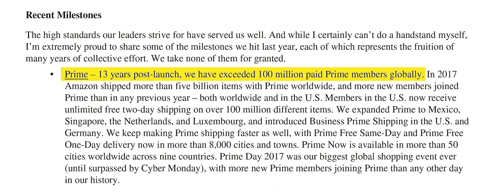
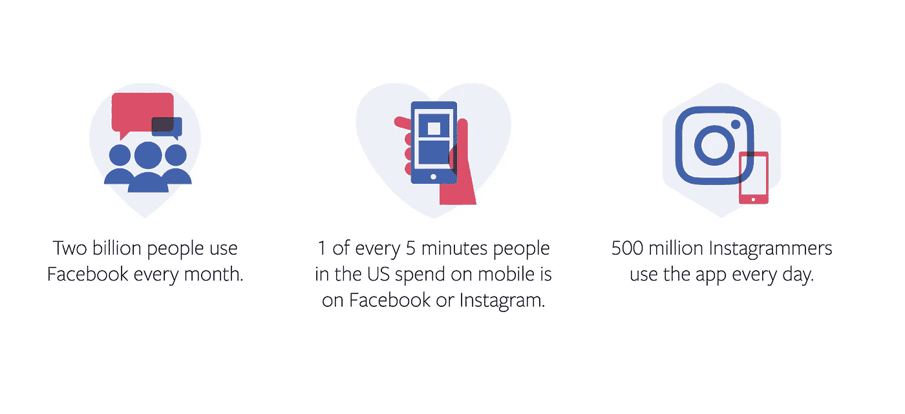

# 即将到来的电子商务大狂欢将使加密和 10 年牛市看起来微不足道

> 原文：<https://medium.com/hackernoon/the-coming-ecommerce-mega-binge-will-make-crypto-and-the-10-year-bull-market-look-like-teensy-tiny-6efc3783209d>

精通技术的数字原住民不会认为电子商务是未来的发展方向。事实上，如果你符合这一描述，你可能会认为今天很大一部分零售是通过电子商务进行的。

你错了。

绝大多数的零售仍然是传统的。虽然趋势正朝着电子商务的方向发展，但我们仍处于现代最大的全球消费变革浪潮的初级阶段。

你可能错过了比特币。但是如果你够聪明，你就能成为下一个大趋势的赢家。这是探索通过开发待售产品和技术在增长环境中创造价值的系列文章的第一篇。

**为了以正确的方式开始这个系列，我想探索是什么改变了我们的购买方式的细节，并用一些可靠的数字来说明这些变化背后的机会。**我将这一巨大的消费者支出转变分解为八个可观察到的趋势。他们一起密谋颠覆天平，支持商品、服务以及介于两者之间的一切的数字买卖。

# 1.美国人的收入比以往任何时候都多

撇开政治不谈，经济现实是，美国人比以往任何时候都拿回家更多的钱。这笔钱更有可能被花掉，而不是存起来。作为世界上最大的消费市场[，美国是最好的起点。](https://en.wikipedia.org/wiki/List_of_largest_consumer_markets)

Local Pay Reports via [Glassdoor](https://www.glassdoor.com/research/local-pay-reports/)

也许你已经感觉到你的工资上涨了，也许你没有。上面的图表显示，如果你从事科技行业，过去几年对你来说是不错的。如果你认同蓬勃发展的科技行业的比喻，这很有道理，同样的事情也适用于教师、消防员和机械师。每个人都在赚更多的钱，反过来也在寻找花钱的方法。

# 2.婴儿潮一代的财富即将超过数万亿

埃森哲报告称，在未来的 30 到 40 年间，仅在美国，就有 30 万亿美元的资产将从婴儿潮一代转移到他们的继承人手中。对于传统上不怎么存钱的一代人来说，这是一大笔钱。

经济衰退对千禧一代造成了双重伤害:首先是在就业市场，其次是错过了历史上最大的牛市。这种令人难以置信的股票上涨让美国房地产市场崩溃时受到冲击的婴儿潮一代受益。事实上，如果这些婴儿潮一代在过去十年中定期储蓄和投资，他们现在的生活会好得多。

Generational Wealth Chart via the [International Monetary Fund](http://www.imf.org/external/pubs/ft/fandd/2017/06/dettling.htm)

千禧一代？没有那么多。这对代际财富积累来说可能是个坏消息。新的钱通常不会被长期持有。但电子商务零售商将从无意义的支出中获得巨大收益，而即将到来的巨额财富转移可能会将可支配遗产转移给那些从未有大量储蓄、习惯于在线购物的人，从而进一步刺激火热的在线零售市场。

# 3.亚马逊的统治地位预示着一个更大的趋势

是的，亚马逊是电子商务繁荣的最大受益者之一。在全球范围内，这是一个正在以极快的速度改变我们购买[产品](https://www.pallinadesigns.com/)和消费媒体的方式的大玩家。语音搜索和联网扬声器等近期趋势可以说是亚马逊一家的功劳，该公司没有显示出放缓创新步伐的迹象。

在 2017 年致股东的一封信中，亚马逊首席执行官杰夫·贝索斯在公司历史上首次承认了 Prime 订户的数量。

Amazon 2017 Letter to Shareholders via [lonelybrand](https://lonelybrand.com)

1 亿 Prime 会员似乎是零售市场的巨大份额。在美国舒适的第一世界泡沫中，家庭拥有 Prime 订阅比没有订阅更常见。但是，如果脱离上下文来看，这些统计数据可能是欺骗性的。**2017 年，美国绝大多数的零售销售仍然是传统方式进行的。与大多数美国人实际购买商品的方式相比，亚马逊的庞大数字只是沧海一粟。**

2017 US Retail Sales Chart via [endive](https://shopendive.com)

那么是什么原因呢？当传统零售业停滞或死亡时，电子商务正处于高速增长模式。但这种增长仍处于起步阶段，即使规模逐年翻倍，与传统的消费者零售相比，其规模仍相对较小。虽然许多人预测电子商务销售将以更线性的方式发展(见下图)，但我认为这充其量是一个保守的预测，最坏的情况是严重的抛售。

Predicted US Ecommerce Retail Sales Chart via [Statista](https://www.statista.com/statistics/272391/us-retail-e-commerce-sales-forecast/)

华尔街似乎同意我的评估，并在各种形式和规模的电子商务业务上下大赌注。当聪明的钱移动时，值得仔细观察。电子商务平台 Shopify (SHOP)是该领域最有趣的增长故事之一，它体现了对未来价值的预测(投机)是如何让投资者陷入疯狂的。

Shopify (SHOP) Stock Price Chart via [Yahoo! Finance](https://finance.yahoo.com/quote/SHOP/chart?p=SHOP#eyJTWSI6W1siU0hPUCIsbnVsbCwwLDBdXSwiVFMiOlsxLCJ3ZWVrIixudWxsLFsiYWxsIiwxLG51bGxdXSwiVVMiOlswLDEsMV0sIkNTIjpbImxpbmUiLCJsaW5lYXIiLDYuNjc2NDcwNTg4MjM1Mjk0LG51bGwsbnVsbCwiIzAwODFmMiJdLCJTVCI6eyJ2b2wgdW5kciI6eyJ0eXBlIjoidm9sIHVuZHIiLCJpbnB1dHMiOnsiaWQiOiJ2b2wgdW5kciIsImRpc3BsYXkiOiJ2b2wgdW5kciJ9LCJvdXRwdXRzIjp7IlVwIFZvbHVtZSI6IiMwMGIwNjEiLCJEb3duIFZvbHVtZSI6IiNGRjMzM0EifSwicGFuZWwiOiJjaGFydCIsInBhcmFtZXRlcnMiOnsid2lkdGhGYWN0b3IiOjAuNDUsImNoYXJ0TmFtZSI6ImNoYXJ0In19fSwidiI6IjAuMS4wIiwibWluIjoxfQ%3D%3D)

就在几年前，在不稳定的美国大选前环境下，人们对这家加拿大公司的公开募股反应冷淡。但不久之后，曲线变成了抛物线，仅一年时间价值就翻了三倍。原因？比以往任何时候都更有利可图的商店开业，以及一系列新的服务产品来帮助支持电子商务市场。

这是一个来自非亚马逊平台的意想不到的发展，表明了数字空间偏好和购买的转变趋势。这就引出了一个问题:**当你不通过大型在线零售商销售时，你能让人们向你购买吗？**

显然，答案是肯定的。这个论点是一个重要的概念，它支撑了我将在接下来的文章中分享的大部分内容，最重要的是，它完全可以通过智能使用数据来证明。

Shopify 也在创新，现在正在向成功的商店提供金融服务产品，通过收取一定比例的销售额来实现贷款担保和偿还。这种模式对需要快速资金来为扩张融资的店主极具吸引力，并且是支持电子商务商店的核心价值主张的方向性指标。稍后会详细介绍。

# 4.传统零售商正以极快的速度转向电子商务模式

沃尔玛和塔吉特是美国最大的两家零售商。他们都在电子商务上下了大赌注，认为这是他们大盒子商业模式的下一步发展。两家公司应对挑战的方式各不相同，但都依赖于店内、提货和当天送达的混合模式来赢得消费者的心和钱包。

这是一个不错的计划，[，并显示出采纳的早期迹象](https://www.forbes.com/sites/andriacheng/2018/08/16/walmarts-ecommerce-tactic-against-amazon-is-paying-off/#676b8c03b74d)。本月，沃尔玛公布了 10 多年来最好的季度可比销售额。沃尔玛实体店的访问量增长了 2.2%，每笔交易的平均顾客支出也有所上升。这种激增归因于所谓的全渠道零售方式，即电子商务与店内购买、提货和营销相结合。

与此同时， [Target 报告称，2018 年第二季度电子商务销售额](https://multichannelmerchant.com/ecommerce/target-reports-ecommerce-growth-41-q2/)增长了 41%。总收入增长了 7%。目前，在线销售额还不到 Target 第二季度 180 亿美元销售额的 5.6%。在亚马逊的带领下，Target 也创造了自己的 7 月销售活动，现在构成了传统上从黑色星期五开始的假期之外的第二大零售消费时间。

沃尔玛和塔吉特对本文很重要，主要是因为它们显示了美国消费者接受新的购物方式的意愿，以及绝对开放的增长竞争环境。显然，如果所有主要零售商都能同时实现巨大增长，电子商务就远非零和游戏。采用更传统的名字也证明了模型的有效性。大型连锁店越是推动电子商务，它对日常消费者来说就越是不可避免的，也越是正常的。

# 5.加密正在作为一种有效的支付方式进入游戏

如果你错过了加密货币的快速上涨，或者在估值顶部附近买入了这一趋势，你并不孤单。但电子商务可能代表着从数字资产中获利的第二次机会，但不是通过对未来价值的投机。

经营一家接受加密货币的在线商店变得越来越受欢迎。例如，电子商务平台 Shopify 现在提供与加密货币支付处理器请求网络等的原生集成。加密货币热潮没有得到主要零售商的回应，这可能对小店主来说是一个机会。

通过接受加密货币作为一种有效的支付形式，店主可以进入一个服务不足的市场。加密货币受到灰色市场监管、税收问题和其他许多阻碍持有者释放储值的弊病的困扰。

Cryptocurrency Market Capitalization as of Publication via [CoinMarketCap](https://coinmarketcap.com/)

市值排名前 10 位的加密货币代表着超过 1500 亿美元的未用数字货币，没有什么值得嘲笑的。通过电子商务释放硬币的价值可能有助于较小的玩家避开与亚马逊和其他数字零售巨头的竞争。

# 6.随着利率上升，消费信贷正在放松

随着利率接近并继续超过自大萧条以来的历史最高水平，消费者最终将看到贷款——包括信用卡和抵押贷款——的放开，这给了他们直接的购买力。

银行借出现金储备并让资金发挥作用的天然动机，将导致限制更少的消费品。

Federal Funds Target Rate Graph via [MoneyCafe](https://www.moneycafe.com/personal-finance/fed-funds-rate/)

与此同时，美元相对于其他货币可能会升值，这意味着美国人的全球购买力在不久的将来可能会大大增强。

更容易获得的贷款加上更便宜的外国商品是消费狂潮的一个因素。如果没有像抵押贷款危机那样的信贷泡沫，这种支出可能会持续相当长一段时间。

# 7.互联设备将我们带入购物矩阵

购买意向是一种复杂的心理。让消费者买东西意味着建议他们需要什么(广告)，然后让完成交易变得非常容易。购买行为越冲动，销售漏斗就需要越圆滑。任何摩擦的迹象都可能让消费者改变主意或开始比价。

像亚马逊的 Alexa 家庭扬声器这样的联网设备的出现为未来的消费习惯指明了方向。

US Smart Speaker Adoption Rate Chart [Voicebot](https://voicebot.ai/)

五年前，没人知道什么是智能音箱，也不知道它们如何融入家庭。现在，五分之一的美国家庭拥有智能音箱。将网上购物体验与语音联系起来可能是迄今为止最轻松的购物方式，在哪怕只有几毫秒的思考时间也很重要的时刻，这种设备可能只是一个开始。

Dash Buttons Image via [Amazon](https://amzn.to/2BViSfE)

亚马逊的 Dash 按钮是轻松购物趋势的又一例证。只需按一下无线按钮，订单就下达了，送货上门，无需额外步骤。物联网承诺了更多的联网设备，但物联网可能已经被家庭购物者而不是精通技术的 20 多岁的年轻人实现了。

# 8.真正的机器学习变得非常好，非常快

人工智能和机器学习是 2018 年最被滥用的两个热门术语。事实上，一个简单的电子表格可以称得上——尽管是在技术上——是一种算法，允许任何人有效地说他们正在提供一种适应消费者使用的定制“智能”体验。

在现实中，人工智能和机器学习正如普通消费者所认为的那样，远没有活跃起来。但是也有一些例外。

[谷歌采用机器学习算法](https://searchengineland.com/faq-all-about-the-new-google-rankbrain-algorithm-234440)来提供有机搜索结果，这凸显了一个正确方向上的重大转变。理论上，随着算法学习人类如何以及为什么搜索，它可以提供更好的体验。由于谷歌得到了广告商的支持，主要指令将随着时间的推移而演变，以最好地适应零售商的交易价值。实际上，谷歌将变成一个巨大的电子商务门户，在这里，你可以找到你甚至不知道自己需要的东西，甚至在你知道自己需要它们之前。

另一个更具商业关联的举措是脸书从人类选择的广告定位转向机器学习。广告客户可以通过[发送广告，脸书称之为“学习阶段”](https://www.facebook.com/business/help/112167992830700)，而不是从家庭收入、城市或教育水平等一系列人口统计数据中进行选择。在学习阶段，点击广告的用户在网上购物体验的每一步都会被跟踪。

Image via [Facebook](https://www.facebook.com/business/products/ads)

脸书逐渐了解什么类型的用户购买，然后开始向其他长相和行为相似的人投放广告。不用人口统计，只用行动。如果做得正确，广告商报告的是一台虚拟的赚钱机器，在这台机器上，每一美元的广告支出都能产生五到十倍的价值。

# 发现机会

水涨船高。我在这篇文章中概述的八个电子商务趋势是进入一个更大的世界的基础，在这个世界中，个人能够直接利用数万亿的消费者支出。我将分享更多关于如何实现这一点以及在未来的添加中开始的步骤。

Nicholas Kinports 是一名企业家和技术专家，他创造的产品和服务符合消费者行为的未来趋势。他还写在[*【lonelybrand.com】*](https://lonelybrand.com)*，* [*可在推特*](https://twitter.com/admaven) *联系。*