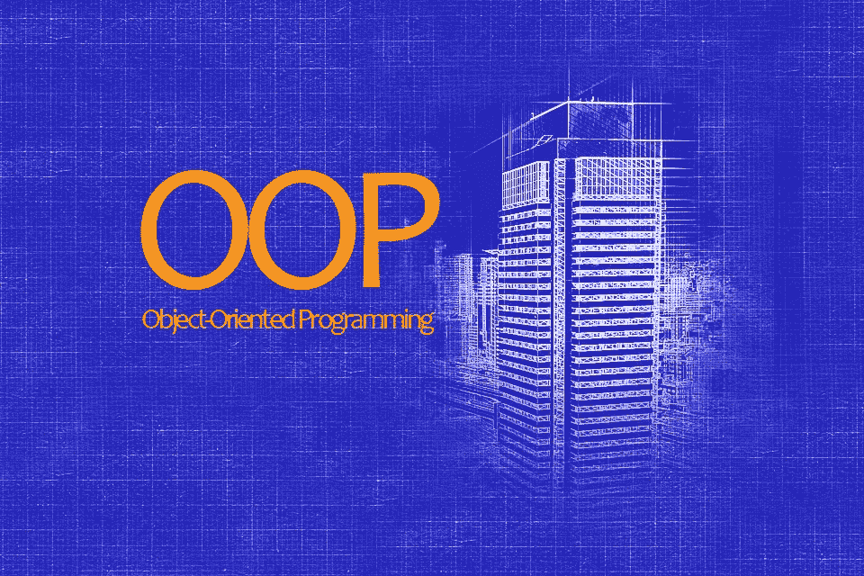
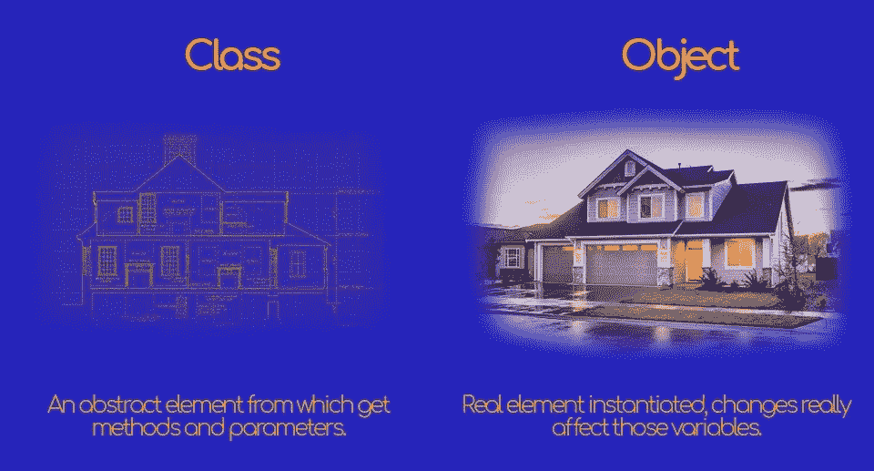
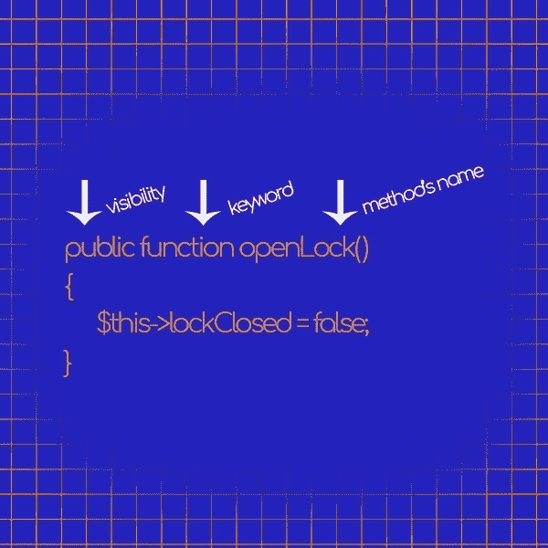

# 面向对象编程完全指南

> 原文：<https://medium.com/hackernoon/the-complete-guide-to-object-oriented-programming-3c3016973f58>



# 介绍

学习面向对象编程是 web 开发人员可以学习的最有价值的技能之一。

例如，有些地方，比如伦敦，竞争如此激烈，以至于你**必须**具备面向对象编程的能力，才能得到一份 [PHP](https://hackernoon.com/tagged/php) 开发人员的工作。

理解并能够应用这些原则是向前迈出的一大步，但在你职业生涯的后期，回报将是巨大的。

更不用说通过学习下面所有这些小技巧，你将编写的代码质量的提高和节省的时间。

和我一起度过你人生中最重要的学习旅程之一。

# 过程和面向对象的区别

如果你看到这篇文章，你可能对学习什么是面向对象编程感兴趣。

为了做到这一点，我们必须后退一步，理解什么是[编程](https://hackernoon.com/tagged/programming)范例，以及它们之间的主要区别。

到目前为止，你可能已经编写了所谓的**过程化编程**。

你在页面的开始写你的 PHP，

将它与您选择的数据库连接，并在同一页面的下面创建要使用的变量，

或者在一个页面中创建所有的 PHP 代码，然后在主页中要求或包含该脚本。

那样工作是好的，

如果您需要构建非常小的东西，这实际上可能是一个好主意，因为这种范式创建的代码比面向对象编程中的代码更少，

但是这种方法有几个问题，从长远来看会暴露出来。

首先，

这样，重用代码的可能性即使不是不可能，也是非常有限的。

如果你需要使用相同的代码块，你需要在其他地方重写它，

如果你需要更新一个功能，你最终将需要编辑所有的块，如果你忘记了一个块，这将导致问题和错误，以后将很难被发现。

更不用说这种方式会使代码变得笨拙，因此，对眼睛来说非常有压力，降低了你的注意力，降低了项目的质量。

对于过程化编程的实践者来说，另一个坏消息是一般的就业和工作前景，

对于不懂面向对象编程的 web 开发人员来说，

老实说，

取决于你住在哪里，如果你不知道和理解 MVC 的基础以及框架如何工作，就不会有工作。

要解决这个问题，请阅读我写的关于 PHP 框架的一系列文章。

另一方面，

OOP 概念解决了这些问题，同时增加了新的特性，为您的项目提供了模块化的结构，使维护现有代码变得非常容易，从而带来了更大的灵活性，

仅仅通过使用对象和类。

# 什么是对象？

您可能已经知道，在 PHP 和大多数编程语言中，每个数据都有自己的类型，

在 PHP 中，类型如下:

*   空
*   布尔运算
*   整数
*   浮点数
*   用线串
*   数组
*   资源
*   复试
*   目标

在本文中，我们将关注列表的最后一种类型:对象。

根据维基百科"*，一个对象指的是一个类的特定实例，其中对象可以是变量、函数和数据结构的组合。*

明白吗？
不尽然。

想象一个像建筑物一样的物体。

**一栋建筑有几个特征**(在编程中它们被称为属性)比如窗户、门、房间、墙壁**并且可以“执行”**，请注意引用，**几个动作**(命名方法)比如天冷时取暖，房客离开时锁门，东西坏了时修理东西。

在 PHP 中，使用 **new** 关键字创建一个对象:

这里有一个例子:

```
$myHome = new Building();
```

现在，变量 **$myHome** 包含了一栋建筑中包含的所有信息。

如果还不清楚，不要担心，

在接下来的章节中，我们将通过大量的例子来探索 OOP 的世界。

这些例子将为你提供一种清晰而舒适的方式来理解这个范例中的概念，并使你准备好自己编写对象、类和关系。

# PHP 中的类

## 什么是课？

我已经简要地提到了什么是对象，对象和类的概念非常相似，这可能会导致相当多的混淆，

所以，

让我们继续建筑的例子。

类和对象都象征着一个建筑，它们都有属性和方法。

那有什么区别呢？

**像蓝图一样描绘一个类**，

在那里，列出了建筑需要的所有属性

建筑将会有窗户，房间，当然正面会有漂亮的颜色，前门会有锁，天热时会有空调系统，天冷时会有壁炉，等等。

**一个物体代替了真实的建筑。**

窗户的实际数量，也许是框架的颜色，房间的确切数量，锁的状态(门关了吗？它开着吗？)等等……



## “类”关键字

您已经看到，为了创建一个对象，您需要使用 **new** 关键字，

但是，新的什么？

需要创建的新元素是类的实例。

在课堂上，你将描述建筑**必须具备的所有特征，例如窗户的数量、颜色、房间数量等。**

我还可以添加我需要建筑“执行”的动作，比如关闭大门的储物柜，打开大门的储物柜，添加窗户，打开空调。

为了创建一个类，你需要使用 PHP 关键字 **class** ，后跟左括号，

在新的一行中添加大括号是一个很好的做法。

然后你需要添加属性，然后是类需要的方法。

以下是方法:

```
class Building{ // building’s properties $numberOfWindows = 10; $colorOfWindows = “red”; $numberOfRooms = 4; $lockClosed = false; // building’s methods /* *  The closeLock() method set the lockClosed property to true *  This means the lock is closed */ function closeLock() { $this->lockClosed = true; } /* *  The openLock() method set the lockClosed property to false *  This means the lock is not closed, thus, it is open */ function openLock() { $this->lockClosed = false; } /* *  The addAWindow() method add a window to the house */ function addAWindow() { return $this->numberOfWindows = $this->numberOfWindows + 1 ; } /* *  The removeaWindow() method remove a window to the house */ function removeAWindow() { return $this->numberOfWindows = $this->numberOfWindows - 1 ; }}$myHome = new Building();
```

在这里，

我的家现在有 10 个红色的窗户，4 个房间，对所有想来看我的人都开放。

## “新”关键字

最后一个示例以命令结束

```
$myHome = new Building();
```

这个 **new** 关键字的作用是从 Building 类中实例化一个新对象，并将其设置在名为 **$myHome** 的变量中，

我现在可以调用 **$myHome** 的属性和方法。

```
$myHome = new Building();echo $myHome->numberOfRooms; // The output will be 4echo $myHome->addAWindow(); // The output will be 11
```

您在上面的代码片段中看到的新元素是箭头**->-**

不要被这个符号吓倒，它只是 PHP 语言的一种语法，用来获取您想要选择的元素。

当你使用一个数组的时候

```
echo $shoppingList[5];
```

两个方括号只是允许开发人员只检索 **$shoppingList** 数组的第六个元素(它不是第五个，因为数组从 0 开始)。

你也可以实例化不同的建筑，这是使用 OOP 而不是过程化的最大好处之一，

**您可以创建不同的对象，即使它们属于同一个类，最终也会有不同的属性；**

```
$myHome = new Building();$myNeighborHome = new Building();echo $myHome->lockClosed; // The output will be falseecho $myNeighborHome ->colorOfWindows; // The output will be “red”
```

考虑到这只是一个最简单的例子，很快您将会看到我们如何实例化具有不同特征的相同类，创建类之间的关系，甚至自动调用方法。

## 类的属性

到目前为止，您应该已经理解了类中的**变量被称为属性**(有时也称为属性或字段)，

它们的定义和普通变量一样，但是在一个类中，你要给它们加上一个 visibility 关键字，你将在下面读到。

在类内部，需要使用**$ this->property name**访问非静态的方法和属性，使用 **self::propertyName** 访问静态方法和属性。

由于属性和方法驻留在两个不同的名称空间中，你可以创建一个同名的属性和方法，它们不会冲突。

```
class Building{ $wifi = 'this is a property'; function wifi() { return 'this is a method'; }}
```

## 类的方法和参数

方法就像函数一样，

我喜欢把它们看作是你的类可以执行的动作。

我们以前已经看到过一些例子

```
…/**  The openLock() method set the lockClosed property to false*  This means the lock is not closed, thus, it is open*/function openLock(){ $this->lockClosed = false;}/* *  The addAWindow() method add a window to the house */function addAWindow(){ return $this->numberOfWindows = $this->numberOfWindows + 1 ;}
```

例如，如果您需要创建 car 类，您可能会有 brake()方法和 throttle()方法，以及 turnLeft()和 turnRight()。

要添加一个方法，你需要 visibility 关键字，后跟你需要创建的方法的名称，加上可能包含或不包含参数的括号，最后是开始和结束方法块的括号。



即使在这种情况下，在新的一行上添加大括号也是一个好习惯。

## $this 和 self::

为了弄清楚**$这个**和**自己::**做什么，我必须解释一下**静态**关键字的意思。

通过声明静态属性和静态方法，无需实例化类就可以访问它们。

我很快会再次讨论这个话题，但我只是想让你知道这是面向对象编程的一个非常强大的特性。

现在，

**$this** 是一个伪变量，当你需要从类内部引用变量时使用。

**$这个**只是对调用对象的引用。

```
class Building{ // building’s properties $numberOfWindows = 10; function addAWindow() { return $this->numberOfWindows = $this->numberOfWindows + 1 ; }}
```

如您所见，**$ this->number of windows**引用了 **$numberOfWindows** 变量，其值从 **AddAWindow()** 方法中获取。

**self::** 基本上做同样的事情，但是它作用于静态属性和方法。

```
class Building{    // building’s properties static $numberOfWindows = 10; function addAWindow() { return self::$numberOfWindows  = self::$numberOfWindows + 1 ; }}
```

[](http://eepurl.com/dIZqjf)

# 结论

可以想象，关于 OOP 还有很多东西需要学习。

我们只是触及了表面，但你今天迈出的这一小步将会引领你走得很远，

我保证！

我将很快出版该指南的第二部分，

敬请关注，

更多关于编程的信息，请访问 [anastasionico.uk](http://anastasionico.uk)