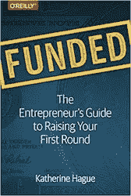

# 不做 ICO，为你的区块链项目筹集 400 万美元或更多资金的完整指南

> 原文：<https://medium.com/hackernoon/the-complete-guide-to-raising-4m-or-more-for-your-blockchain-project-without-doing-an-ico-9de7dba3cf5c>


如果你曾经试图进行首轮融资，你会知道在硅谷之外，投资者有时更愿意押注于有风险的初创企业——这是一项艰巨的任务。

大多数创始人都准备好迎接不可避免的拒绝。

从历史上看，自从 1968 年 [Digital Equipment Corporation 首次从美国研发公司](https://en.wikipedia.org/wiki/History_of_Digital_Equipment_Corporation#Origins)筹集 7 万美元用于科技公司的 kickstart 风险投资以来，有过两次筹集大笔资金的黄金机会:

*   1995 年至 2000 年:“网络泡沫”
*   2017–2018 年:“ICO 泡沫”

这个故事近乎荒谬，讲述了[詹姆斯·阿尔图彻如何筹集并随后损失了 1 亿美元](https://jamesaltucher.com/2011/01/how-i-screwed-yasser-arafat-out-of-2mm-and-lost-100mm-in-the-process/)，首先提出以 1000 万美元的股票和 1000 万美元的现金收购一家随机移动无线公司(在提出收购要约时，他手头没有 1000 万美元的现金)，然后在上市前，利用收购意向书从[亨利·克拉维斯](https://www.investopedia.com/articles/investing/102715/how-henry-kravis-built-private-equity-giant-kkr.asp)、[弗兰克·夸特隆](https://twitter.com/frankquattrone?lang=en)、[萨姆·瓦卡萨尔](http://content.time.com/time/specials/packages/article/0,28804,1903155_1903156_1903172,00.html)等人那里获得资金——这最能说明这种轻率仅仅 与一家科技/互联网公司有牵连，就有可能利用投资者的兴奋来筹集大量资金。

又过了 17 年，另一代企业家才能够利用类似的机会。

对初创公司的早期投资一直受到高度监管——普通散户投资者必须等到初创公司 IPO 后才能参与其中。然而，加密货币提供了一种绕过这些监管的方法，让“普通人”有机会进入底层。

随着比特币价格去年开始飙升，最精明的投资者——他们几年前在以太坊 ICO 建立了头寸——将头寸套现，然后直接投入 ICO 用于其他项目。

如果你拿着一份白皮书，给出一个最模糊的财富承诺——你会发现你的钱箱里装满了 ETH，因为投资者排队投资他们已经赚了 1000 倍的钱。这助长了几十年未见的网络时代风格的融资泡沫。

然而，如果你是这些投资者中的一员——将你新发现的财富投入 ICOs 是显而易见的。例如，在科莫多的 ICO 上投资 100 美元，并持有到当年晚些时候的泡沫顶峰，就能获得 14，000 美元的回报！同样，在 Ark 投资 100 美元，最高时可以净赚 36000 美元。


Courtesy of [https://hackernoon.com/investors-are-making-50-000-returns-on-icos-32432bc741d1](https://hackernoon.com/investors-are-making-50-000-returns-on-icos-32432bc741d1)

可悲的是，一切美好的事物都会结束，在经历了一年令人眩晕的高点后，比特币的巨大威力开始消退。到 1 月份，价格已经投降，每个人都被带回地球:


Courtesy of [https://www.icodata.io/stats/2018](https://www.icodata.io/stats/2018)

随着新年的到来，至少在几个月的时间里，ICO 市场的乐观情绪依然存在，散户投资者相信，经过小幅调整后，他们在过去一年中习以为常的利润将会恢复。

虽然头条新闻自豪地指出 [2018 年是筹集资金的更好的一年](https://www.coindesk.com/6-3-billion-2018-ico-funding-already-outpaced-2017/)一个新的趋势正在出现:ico 每月筹集的资金都在减少，但这一点因他们在进行象征性销售之前首先筹集私人资金而得到缓解。


取而代之的是一个老朋友来拯救我们——现在风投们也开始行动了。

去年，伊恩·巴里纳(Ian Balina)、菲利普·纳恩(Phillip Nunn)和其他担任加密货币顾问的中间人想出了一个简单易行的方法，通过他们的投资在 T2 赚钱。聚集了大量观众后，他们与 ico 达成了交易。作为以折扣价优先获得未锁定代币的交换，他们将带来强大的营销机器。

诀窍是把钱卖给 ICO 的散户投资者，他们将不得不寻找更大的傻瓜来推销他们的袋子。这在 2017 年猖獗的牛市中发挥了漂亮的作用，风投也很快跟进，促成了类似的交易。

随着 2018 年加密货币大熊市的到来，散户投资者面临着加密货币投资组合价值高达 90%的下跌！他们要么没有任何可以扔向市场的法令，要么没有进一步这样做的倾向。

像伊恩·巴里纳这样的顾问也发现自己成为今年许多丑闻的中心，包括一个特别令人尴尬的[插曲](https://bitcoinexchangeguide.com/chromaway-scandal-update-ian-balina-caught-godenzi-fired-and-cto-cashgrab/)，他们交易的程度被暴露在更大的公众面前。

熊市对投资组合的影响，再加上该体系不透明的内部运作现已暴露，意味着目前投资者对 ico 的热情更低了。

这意味着，如果你打算在今年创建并启动一个与区块链相关的项目，并认为 ICO 将是合适的选择，那么是时候重新思考你的整体战略了。

## 这一切都始于一个想法…

首先，现在应该很清楚，去年的兴奋已经消退，匆忙起草白皮书和购买登录页面网站模板是行不通的。


你首先需要一个坚实的想法。如果你的想法包括找到一个现有的企业，并把区块链放在上面(是时候在登塔科因进行必要的挖掘了)，也许值得把这篇文章标上书签，几个月后在你给[你的想法肌肉一些应得的锻炼](https://jamesaltucher.com/2014/05/the-ultimate-guide-for-becoming-an-idea-machine/)后再回来。

然而，假设你已经提出了一个概念[，它真正需要区块链技术](/datadriveninvestor/do-i-really-need-blockchain-4-important-factors-to-consider-57b06e4ffbb6)提供的好处(并且能够处理非常明显的缺点)，并且你已经提出了一套[令人信服的令牌组学，如果你的项目将需要它自己的定制令牌](https://multicoin.capital/2018/02/13/new-models-utility-tokens/)，那么是时候探索如何在熊市中筹集资金了。

如前所述，你不可能根据今年从维基百科上摘抄的一份 50 页的区块链历史文件筹集到数百万美元，但如果你做好以下准备，你将有一半的机会:

*   一份不超过 10 页的推介材料，解释你的概念、机会、你的团队等。要获得灵感，您可以看看我们为卡瓦设计的球场平台:


[https://slips.ams3.digitaloceanspaces.com/deck.pdf](https://slips.ams3.digitaloceanspaces.com/deck.pdf)

*   你的电梯间推介，一个 30 秒的介绍，当被问到你是做什么的时候，你团队的每个成员都应该能够充满激情和雄辩地传达。
*   一个简短的视频或类似的演示——投资者是大忙人，讨厌阅读成堆的文本(不像你！)所以你需要用清晰的视觉展示来吸引他们的注意力，这样他们就能“领会”你正在创造的东西。再次看看我们的视频，这是一个很好的例子:

> 大多数风投喜欢演示…我们从演示中学到了更多，尤其是我们对所玩产品的情感兴趣，这是任何文件都无法传达的。每一个演示都给了我们一个机会，让我们可以直接与企业家交流他们对当前和未来产品的想法，我们清楚地了解到企业家对他们所做工作的热情和激情。

上面这段话摘自杰森·门德尔森和布拉德·菲尔德的著名著作: ***风险交易:比你的律师和风险资本家更聪明。*** 如果你还没有听说过这本书，这是一本了解投资者和风险资本家如何运作的权威参考书，值得放在你的书架上。

**做一个概念验证！**

不言而喻，你应该致力于一个概念的证明，向投资者展示同样的原因，孟德尔森和费尔德雄辩地陈述了上述。在熊市中，拥有一个工作原型将使你从你的竞争对手和数以千计的其他争夺注意力的应用中脱颖而出。

构建概念验证并不需要很昂贵。它的边缘可能会有点粗糙，当然应该是你最终愿景的缩小版。如今有无数的工具来模拟界面，你可以雇用廉价的设计师和开发人员——例如，为什么不在 Reddit 上检查/r/jobs 4 比特币，并支持加密货币生态系统？

**不要写白皮书了！**

我们在年初写了一篇简单的文章，发现这是一项花费巨大却收效甚微的努力。很少有人阅读这份文件，毫无疑问，你的项目会在开发过程中不断发展，很快这份文件就会过时。例如，我们文档中的两个团队成员在论文起草后几周就离开了我们！

*对于任何一个半体面的企业家来说，上述所有这些都应该是显而易见的，所以请继续阅读下一部分，在下一部分中，我们将讨论如何在实现上述所有目标的同时生存下去。*

# 你的第一站:孵化器、加速器和补助金

所以，让我们面对现实吧——只有两种方式(除非你坐拥可观的储蓄，或者你去年在 ICOs 上获得了 50，000 倍的回报)来资助你的概念验证的开发。

你可以全职工作，耗尽你的积蓄。或者你可以做两份工作——白天工作支付账单，然后晚上为你在区块链的创业公司工作。

另一个选择是获得资助或加入孵化或加速器项目。去年筹集了大量资金的现有区块链公司只是渴望让 dApps 和其他项目在其平台上开店。

毫无疑问，加密货币市场的下一轮牛市将是这些平台的涓滴经济学的结果，这些平台为像你这样的创新项目提供资金，然后刺激加密货币的采用，并为该领域带来新的资金。

同样，许多公司存在，以帮助弥合初创公司和筹集第一轮 A 轮资金之间的差距，这些“加速器”或“孵化器”也开始关注加密货币初创公司。


# 苍天

他们是谁？expense**是以太坊第一个稳定的分支之一，因此为 dApp 开发者提供了一个熟悉的环境。**

**作为一个分支，以太坊目前的大部分基础设施(例如 MyEtherWallet、GEXP 和 Mist Wallet)也适用于 expense，而且在 expense 上部署智能合约要便宜得多。EXP 令牌可在 Bittrex 和许多较小的交易所获得。**

**如果你正在考虑在以太坊上发布你的最终产品，那么把它转换成 Expanse 应该不难。**

****他们的提议:**expense 提供一笔极其灵活的赠款，金额在 5000 美元到 50000 美元之间。与许多其他项目不同，他们的提议没有太多附加条件——他们不会试图侵占你的知识产权，也不会要求任何权益。**

**除了基本的资金使用报告和坚持项目开始时商定的里程碑之外，对你如何使用你的资助没有什么限制或义务。当然，他们希望你在他们的平台上发布一个 ICO，或者在你的最终产品中以某种方式使用网络。**

****如何联系:**你可以在[https://expanse.tech/expgrants/](https://expanse.tech/expgrants/)填写申请表**

****如何给人留下深刻印象:**与 Expanse 的首席运营官联系，**玛西娅·丹采森** ( [推特](https://twitter.com/danzeisenm)， [linkedin](https://www.linkedin.com/in/marciadanzeisen/) )让她大吃一惊，这样你的资助申请就会得到她的亲自赞助。或者试着在推特上引起首席执行官克里斯多佛·弗兰科的注意。**

****

# **以太坊经典实验室**

**他们是谁？2016 年以太坊上著名的道项目被黑。攻击者利用智能合同中的一个错误将资金抽到一个子 DAO 中，离开以太坊项目不到一个月的时间来想出一个解决方案，以便在黑客永远离开之前收回资金。**

**有人提出了一个软 fork，但是当发现它支持 DoS 向量时，这个提议很快就被否决了。随着时间的推移，他们决定做出有争议的选择，硬分叉，以收回资金。这个决定导致了以太坊经典的诞生。**

**以太坊经典实验室是一个由 DCG 和李杰明的 HCM 富士康资助的孵化器项目。**

****他们的提议:** ETCLabs 刚刚完成了一个试点项目，实验室将在 1 月份永久启动，每批为大约 12 家初创公司提供在旧金山或新加坡工作 3 个月的孵化项目机会。他们提供办公场所、10 万至 50 万英镑的资金(8%至 10%的股权)以及与查尔斯·霍斯金森(IOHK)和伊戈尔·阿尔塔莫诺夫(ETCDev)等人接触/交往的机会**

****联系方式:** 在:[https://www.etclabs.org/](https://www.etclabs.org/)填写申请表**

**如何给人留下深刻印象:如果你住在旧金山附近，你可以加入他们的每周聚会([https://www.meetup.com/etclabs/](https://www.meetup.com/etclabs/))和炫酷节目总监[伊莉莎白·库卡](https://twitter.com/venture_this)或者加入他们的电报小组:[https://t.me/etclabs](https://t.me/etclabs)在那里兴风作浪。**

****

# ****万实验室****

****他们是谁？** WanChain 旨在提供与其他区块链的跨链兼容性。以太坊是第一个(考虑到 WanChain 是从以太坊分叉出来的，这很容易)。其他 ERC20 链也在考虑之中，一些人甚至建议比特币作为他们将在今年年底与之建立桥梁的链之一。**

**他们的杀手锏功能是进行私人交易的能力，这是通过环签名和每次交易的新地址来实现的。WanChain 是首批在智能合同中添加隐私功能的区块链之一。**

**万链是[区块链互操作联盟](https://cryptobriefing.com/ontology-ont-takes-flight-interoperability-rumors/)的创始成员，另外还有 ICON (ICX)和 Aion (AION)。**

**他们去年实际上筹集了 3700 万美元，ICO 价格为 0.34 美元，但当硬币达到 9.92 美元时，任何涉足 ICO 的人都获得了 2817%的丰厚回报！可悲的是，它现在的交易价格是 1.02 美元，但至少很明显，他们并不缺钱！**

**他们的提议:WanChain 为初创企业的早期阶段提供商业、法律和技术建议以及融资。他们没有详细说明报价的确切财务细节，但他们确实表示，特殊项目将由他们自己的基金资助，并将提供风险资本介绍。**

****联系方式:** 在:[https://wanchain.org/wanlabs](https://wanchain.org/wanlabs)填写申请表**

**如何给人留下深刻印象:给人留下深刻印象的人是[奥利弗·伯奇](https://www.linkedin.com/in/oliver-birch-08ba8a44/)，他负责万查恩实验室的审查程序。你可以在推特上找到他:[https://twitter.com/machinayz](https://twitter.com/machinayz)**

****

# **波片**

****他们是谁？** Waves 是一个源自俄罗斯的平台，旨在帮助人们创建代币。在分歧导致他们脱离之前，创始人实际上在 NXT 平台上工作。他们没有分叉 NXT，而是从头开始造波。**

**Waves 与上面的平台不同，它不是基于以太坊，而是有一个租赁的利益证明(LPoS)共识机制。Waves 有常规的完整节点，区块链交互和交易确认依赖于这些节点。运行一个完整的节点需要 10，000 个波(波的总供应量为 100，000，000)。轻节点依赖于这些完整节点。可以将您的令牌出租给完整节点或公共挖掘池。**

**Waves 在币安、Bittrex 和其他较小的交易所都有。他们也有自己的分散交易所(DEX ),在这里你可以列出你在 Waves 上创造的任何代币，并允许它与 Waves 进行交易。**

**对于一个被指定帮助其他人推出代币的区块链来说，启动加速器/孵化器服务(WavesLabs)是这个项目的自然步骤。**

****他们的提议:**除了巨额融资 **(** WavesLab 提供高达 30 万英镑的资金)，他们还提供技术和法律支持。包括样本文件和咨询熟悉 ICO 法律的律师。他们还提供强有力的公关/营销支持(带你进入 ICO 跟踪网站，并介绍有影响力的人和顾问)。**

****联系方式:** 填写申请表，网址:[https://docs . Google . com/forms/d/e/1 faipqlse 2 yt 40 yupzkaajxajsglkxpvzyzjp 6 _ 0 caer 7 zvmpo-8u 0ng/view form](https://docs.google.com/forms/d/e/1FAIpQLSe2Yt40yUPZkAaXajSGLKxPVzYzJP6_0caER7ZvVMpO-8U0ng/viewform)**

****如何打动:**wave blasts 有一个[推特](https://twitter.com/waveslabs)账号和一个[电报](https://t.me/waveslabchat)群。但是如果你想更进一步，Inga Shkurina 是 Waves 的社区经理，你可以在 Twitter 上找到她([https://twitter.com/Ingulkin](https://twitter.com/Ingulkin))。或者，你可能会引起公关经理谢尔盖·马斯连尼科夫的注意。**

****

# **NEM 社区基金**

****他们是谁？** NEM 是另一个几乎从 NXT 分叉出来的项目，在日本非常受欢迎。**

**它使用“重要性证明”共识机制——NEM 网络中的每个节点都有一个“重要性”分数，该分数决定了它可以挖掘新“XEM”令牌的频率。重要性分数是通过“下注”硬币来建立的——当你将硬币放入钱包时，它们是“未下注”的，但随着时间的推移，它们会开始计入你的分数。需要 10，000 个 XEM 才有资格得分。**

**此外，还会对网络进行定期扫描——处理最多事务的节点也会被赋予额外的权重，从而赋予它们更高的重要性。**

**NEM 社区基金由 3 亿 XEM 组成，是在 NEM 的涅墨西斯区块期间分配的。**

****他们的提议:**您只需获得 NEM 社区基金委员会的批准，就可以获得高达 4 万美元的资助。额外的资助额度(40-150k 和 150-800k)是可用的，但需要各利益相关方的进一步支持。**

****联系方式:** 在:[https://nem.io/community-fund/](https://nem.io/community-fund/)填写申请表。*请注意他们目前正在重组，社区基金暂停*。**

****如何给人留下深刻印象:** NEM 的社区基金已经暂停，同时他们创建了一个名为 NEM 风险投资的新组织，其功能更像一个传统的孵化器。根据最近的一个论坛帖子，大卫·肖和伊恩·威尔森将会领导这个新项目，如果你想参与他们的试点项目，你可能要开始和他们套近乎了。**

## **其他孵化器、加速器和服务可能在这一阶段有所帮助:**

****助推。VC**([https://www . boost . VC](https://www.boost.vc)):**

**Iconiq 实验室(【https://iconiqlab.com】T2):**

**链家资本 ICO 联合投资([https://www.catena-capital.com/programs-and-fund](https://www.catena-capital.com/programs-and-fund))**

****https://ventures.coinbase.com/比特币基地****

# **提升:接近风险投资和风险投资礼仪**

**因此，让我们假设您一直以线性方式遵循本文中的计划。你发现了一个伟大的想法，你创造了一个坚实的摊位甲板和电梯摊位。你与孵化器/赠款项目取得了联系，并获得了一些种子资金，以进行概念验证。**

**请记住，从风投那里获得资金至少需要 6-8 个月的时间，所以你可能希望在开发概念证明的同时开始接触他们(这可能需要 2-3 个月才能完成)。**

## ****一般准备****

**在与一些投资者接触后，你会意识到他们中的大多数会问你同样的问题，所以保留一份“常见问题”清单，并预先计划好你的回答，这样当风投在电话中/通过电子邮件向你抛出一个熟悉的问题时，你就有所准备了。**

**要记住的一点是，你需要知道你愿意交易你公司的多少股份，交易价格是多少。除非你知道这一点，否则大多数风投不会感兴趣，但由于这是你第一次融资，你可能还不知道要什么！一种策略是根本不提估值，只提该领域的竞争对手的估值/融资情况，让风投发起谈判。**

## ****VC 的结构****

**有必要了解风投是如何构建的，这样你就可以避免在错误的人身上浪费太多时间。你想尽快找到一个能做决定的人。下面列出了你会遇到的不同类型的人:**

**分析师处于阶梯的最底层。他们进行研究，研究像你这样的公司(和你的竞争对手)。他们不能做决定，但如果你设法吸引他们，你也许能让他们介绍给能做决定的人。他们的主要任务是寻找交易。你会在会议上找到他们，如果你试图做一个冷淡的介绍，他们可能是你第一个交谈的人。**

**不要浪费过多的时间与分析师交谈——你可能会被视为帮助他们进行研究的廉价信息来源，他们会毫不犹豫地试图以考虑投资你为借口从你那里获取信息。**

****助理**是阶梯上的下一级，与他们的分析师不同，助理肯定会有金融背景，会更多地参与融资过程。要知道有些公司会有初级或高级助理。虽然合伙人不能为你的业务开绿灯，但他们绝对是把你介绍给愿意的人的更好的选择，你也可以和他们进行更有成效的交谈。**

****负责人**是下一级，与分析师和助理不同，他们在投资方面确实有决策能力！一旦你有了一个支持你的委托人，他们将成为你整个过程的联系人。你应该明白，负责人正朝着成为“合伙人”的目标努力，并拥有很大的权力——尽管他们的权力范围有限——例如，他们不会决定公司的战略。**

****合伙人**是风投公司中最资深的人。除了对投资决策(普通合伙人)和公司的日常运营(管理合伙人)有发言权之外，他们还有责任为公司筹集资金。他们通常也会将自己的部分资金投资到风险投资中。**

## ****寻找销售线索——联系谁****

**现在你已经了解了敌人，是时候考虑你要联系谁以及如何联系了。如果你不在区块链经营，你可能会寻找一个像 [Crunchbase](https://www.crunchbase.com) 或 [Venture Deal](http://www.venturedeal.com/) 这样的网站来开始这个过程。**

**然而，有一个巧妙的技巧可供你使用。你可能还记得，在这篇文章的前面，我们提到了今年的区块链项目在做 ICO 之前是如何筹集资金的。**

**大多数 ICO 网站遵循相同的传统模板布局，因此大多数网站会将他们的“合作伙伴”列为网站上的徽标:**

********

**所以你所需要的是一个列出即将到来的 ico 的网站列表，你可以在 ICODrops.com、Coinschedule.com、CoinGecko.com 等地找到选择。ICOBench.com 甚至允许你按类别/行业/利基来过滤 ico，以便更容易地放大与你相似的项目。**

**你可以在这里找到 ICO 列表网站的综合列表:[https://hacker noon . com/top-100-free-payed-ICO-listing-sites-35970 f 7d 5 ee 1](https://hackernoon.com/top-100-free-paid-ico-listing-sites-35970f7d5ee1)**

**这个想法是收集一份积极投资区块链领域的风险投资公司名单。您需要研究以下信息**

*   **他们的基地在哪里**
*   **他们最后一次投资是什么时候——如果超过 6 个月，他们可能已经没有钱了，或者正在筹集资金——不要去管他们！**
*   **他们投资什么样的公司(他们的投资组合)，是否与你的相似**
*   **关键人员列表(查看前面的角色，了解您在寻找什么样的人)。**

**你会发现 **Crunchbase** 有助于找出他们最近一次投资的信息，你会发现 **LinkedIn** 是寻找风投关键人物的好工具。**

**一旦你有了自己的清单，你就需要看看你是否认识可以热情介绍的人。介绍风投最糟糕的方式是给他们发一封冷冰冰的邮件或打一个电话。他们希望看到你能努力工作并与他人建立关系。如果你能找到一个不仅得到他们资助，而且还能给他们带来丰厚回报的人，那么在风险投资家的眼里，这种介绍就值两倍的钱。**

**再说一遍，因为你是在区块链空间中操作的，所以这样做稍微容易一点。你希望列出一份区块链公司的名单，以便找到他们的投资者？你现在可以重新利用你的研究，开始联系创始人，看看你是否能见到他们。和其他联系人一样，你会希望帮助他们获得推荐/介绍，尽管如果你有礼貌和热情，大多数人都会很乐意帮忙。**

****

**Keep on top of your research, a Trello board is a brilliant way to organise and manage your pipeline.**

**为了帮助你一路走来，这里有一个公司列表，我们建议你开始研究:**

****

**[http://www.draper.vc/](http://www.draper.vc/)**

****Draper Associates** 是一家位于硅谷的早期风险投资公司。**

****

**[https://www.usv.com/](https://www.usv.com/)**

**Union Square Ventures 是一家总部位于纽约的风险投资公司，在加密方面加倍努力。他们是“肥胖协议”博文的作者:[http://www.usv.com/blog/fat-protocols](http://www.usv.com/blog/fat-protocols)**

****

**[https://jumpcap.com/](https://jumpcap.com/)**

**Jump Capital 是一家总部位于芝加哥的风险投资公司，专门从事技术和软件投资。他们投资了很多加密货币基础设施公司。**

****

**[https://www.sequoiacap.com/](https://www.sequoiacap.com/)**

****红杉资本**是一家加州风投公司，被认为是区块链领域最大的投资者之一(投资了币安、火币、罗宾汉、兰花实验室等等)。**

****

**[https://a16zcrypto.com/](https://a16zcrypto.com/)**

**a16z crypto 是 Andreessen Horowitz 的一个分支，这是一个 3 亿美元的风险基金，最近成立，投资于加密公司和协议。**

# **为战斗做好准备:在你开始这段旅程时，跟谁走，读什么**

**不言而喻，与某些人建立关系会让你的旅程稍微轻松一点。**

**当你试图提高对你的项目的认识时，你会发现我们在下面创建的**精选数据库**会非常有帮助。**

**您会注意到，我们的电子表格旨在让您登记您的进度并跟进联系人。但是我们建议将它们移植到如上所述的五列 Trello 板上，因为我们从个人经验中发现，电子表格不是管理流程的好选择，我们不在乎投入时间或金钱来选择定制的 CRM。**

****

****一般加密货币影响者:**影响者营销是推广项目的一种强有力的方式，有许多“顾问”的存在只是为了向不负责任的观众推广付费机会。这样做很容易出错——与其联系这些有影响力的人并提供一些你的代币，你可能会考虑在 Twitter 上与他们接触，建立长期关系，看看他们是否愿意合作。记住，这些人会收到大量邀请，所以要小心行事:**

**[https://docs . Google . com/spreadsheets/d/1 hdnh 66 tjm 9 yo 7 octkzvhec 62 firawyzvgmzryaa 2 MTK/edit？usp =共享](https://docs.google.com/spreadsheets/d/1HDNH66tjm9yO7OcTkZvhec62FIrawyZVGMzRYAA2Mtk/edit?usp=sharing)**

****

****顶级加密博客和期刊:**公关过程的一部分包括接触博客和期刊，看看他们是否愿意报道你的项目。虽然这些出版物很多都是收费的，但是如果你能为公众制作出很好的副本(这并不是公开地给你的项目发垃圾邮件)，你可能会得到一些优秀的免费新闻:**

**[https://docs . Google . com/spreadsheets/d/1 czxbvkdczqkecesxbikjvgfxgpeau 4v 4 bdcib 50 DTY/edit？usp =分享](https://docs.google.com/spreadsheets/d/1czxbvKDczQKEcEsxBIkKjVGFXGPEaU4V4BDCIB50DTY/edit?usp=sharing)**

****

****顶级加密 YouTube:**你可能想试着让自己成为 YouTube 上的一个固定角色，为你的项目宣传造势。试图在节目中宣传你的项目会遇到阻力，但如果你能找到一个好的角度或有趣的内容，你会更幸运:**

**[https://docs . Google . com/spreadsheets/d/1 l1y 3 _ j6RP _ 6 _ o 3 kndwoc 5 kub 43 qug 7 kcylqe 9 ru 68g/edit？usp =共享](https://docs.google.com/spreadsheets/d/1L1y3_j6RP_6_o3knDwMoC5kuB43qug7KCylqE9rU68g/edit?usp=sharing)**

**最后，正如比尔·盖茨的名言——阅读一本书可以让你一口气吞下一个人一生的知识。因此，考虑到这一点，我们建议翻阅以下内容:**

****

**[https://www.amazon.com/Venture-Deals-Smarter-Lawyer-Capitalist/dp/1118443616](https://www.amazon.com/Venture-Deals-Smarter-Lawyer-Capitalist/dp/1118443616)**

****风险交易:比你的律师和风险投资家更聪明** *布拉德·菲尔德和杰森·门德尔森***

**让你了解风险资本家如何思考的内部运作，是你接触任何风险资本家之前的必读之作。**

****

**[https://www.amazon.com/Funded-Entrepreneurs-Guide-Raising-First/dp/1491940263](https://www.amazon.com/Funded-Entrepreneurs-Guide-Raising-First/dp/1491940263)**

****资助:企业家第一轮融资指南** *凯瑟琳·黑格***

**这为第一次创业的创业者提供了更多的具体方法，并为你的第一轮融资提供了很多实用的建议。**

****

**[https://www.amazon.com/Art-Startup-Fundraising-Negotiating-Entrepreneurs/dp/1119191831](https://www.amazon.com/Art-Startup-Fundraising-Negotiating-Entrepreneurs/dp/1119191831)**

****创业筹款的艺术** *亚历杭德罗·克雷马德斯***

****

**[https://www.amazon.com/ENTREPRENEURIAL-BIBLE-VENTURE-CAPITAL-Secrets/dp/0071830359/](https://www.amazon.com/ENTREPRENEURIAL-BIBLE-VENTURE-CAPITAL-Secrets/dp/0071830359/)**

**针对首次创业者，这可能有点居高临下，但有丰富的信息和筹资过程的内幕。**

****风险投资的创业圣经:创业游戏中领导者的内幕** *安德鲁·罗曼斯***

**风险交易是这本书的一个更连贯的版本。你还需要通过曲折的前几章来获得真正的黄金。值得快速浏览一下。**

# **最后的想法**

**我们希望这篇文章对你有用，并且它至少给你一个为你自己的项目寻找资金的跳板。尽管最近 ICO 市场降温，但对于有创业精神的人来说，这仍然是筹集资金和向市场推出令人兴奋的新项目的大好时机。**

```
**Version History** We will update this footnote when this article changes to reflect new sources and information!**21 Oct 2018:** First edition of this article was published.
```