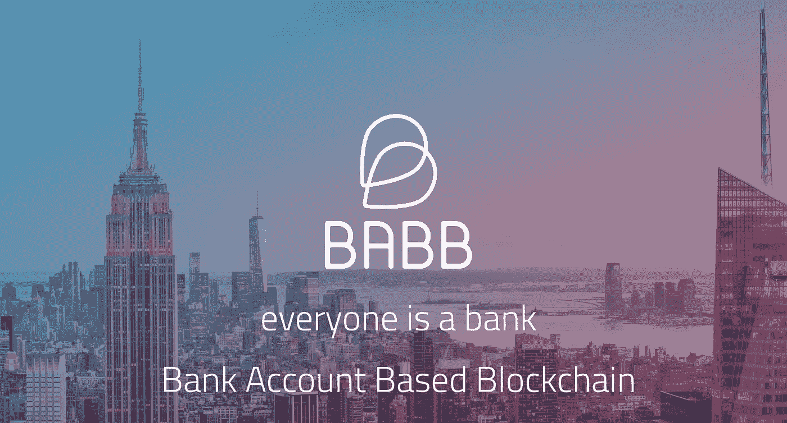

# Q1 2018 国际奥林匹克运动会完整指南

> 原文：<https://medium.com/hackernoon/the-complete-guide-to-upcoming-icos-q1-2018-56d0de4763a1>


> 记住下面的评论只是我们的观点！如果我们伤害了你的感情，破坏了你最喜欢的项目和/或你只是想抗议我们，请通过 [twitter](https://twitter.com/orphanblocks) 联系我们！

```
**Did we miss an ICO?** Respond below and if we get enough requests, we might do a special supplement to this guide in the coming days.
```

**我们看了一眼本季度最热门的 ICOs】，这些 ico 由 [Ian Balina](https://www.youtube.com/user/Diaryofamademan) 、 [OhHeyMatty](https://www.youtube.com/channel/UC3p3s3WJkEG56W275gGbQlw) 、 [IcoBench](https://icobench.com/icos) 、 [IcoDrops](https://icodrops.com/category/upcoming-ico/) 等评论，并通过我们的常规流程对它们进行处理，然后将结果总结成您在下面看到的完整指南。**

不像我们的[更深入的硬币评论](/@orphanblocks/fomo-watch-pascal-coin-a245d07c0c3b)，这个名单上的项目数量意味着我们试图更简洁一点。可以把它看作是你自己对这些项目进行研究的发射台。

本月晚些时候，我们将发布最终的加密货币基础清单。过程*我们用自己*来决定是否会投资一个项目。

为了给你一个快速筛选和提取这些项目的方法，你可以使用我们在下面设计的评级系统:

**我们的评级系统**

```
 1 = Blatant scam. Avoid at all costs!
 2 = Avoid this as well, too many red flags.
 3 = A terrible project but with some glimmer of hope.
 4 = Not recommended, unless you have spare change.
 5 = We like the concept, don't have complete faith in the project.
 6 = Perhaps good as a short term hold until it hits an exchange.
 7 = A good buy, but some concerns.
 8 = Strongly consider investing in this.
 9 = Potentially great, but we have some reservations.
10 = Sell the wife and kids, this is a home banker!
```

不言而喻，我们的审查只能在提供信息的基础上进行，而不能被理解为任何形式的财务建议。

所以，废话少说，没有任何进一步的麻烦，让我们介绍项目！


# 医疗链(7)

**什么事？** MedicalChain 采用区块链技术存储患者健康记录。该平台基于三项技术:

*   [Linux 基金会的 HyperLedger Fabric](https://www.hyperledger.org/projects/fabric) ，一个封闭的区块链，有分享机密信息的渠道。
*   ERC20 令牌的以太坊
*   [思域](https://www.civic.com/)进行身份管理

患者可以批准医生、医院、实验室、药剂师和健康保险公司访问他们的数据。

该项目旨在构建以下内容:

*   一个应用程序，允许患者授予/拒绝访问权限，并设置可以查询和写入其记录的内容的权限。
*   一个“远程医疗”应用程序，允许病人使用网络摄像头接口，利用他们的健康记录进行在线咨询。
*   市场允许在研究中共享患者的健康记录，并以令牌的形式对此进行补偿。
*   一个应用程序开发平台，允许第三方开发者在 MedicalChain 上构建。

**令牌有什么用？** med token 是为平台供电的 ERC20 令牌。它的实用程序包括:

*   患者使用代币支付远程医疗咨询费用。
*   由制药和其他研究机构购买，支付给在健康数据市场上分享其详细信息的患者。
*   未来与保险提供商的整合。
*   第三方开发者应用的未来用途。

**我们的结论是什么？** 这是一个实力雄厚的医疗保健 ICO 团队。虽然我们找不到它，但是已经有了一个 alpha 版本！他们声称正在开发 UI，此时进行演示将对他们的 ICO 大有裨益。

更重要的是，这似乎是区块链技术的正确使用，而不是对一个可能独立存在的项目的额外点缀。

我们仍然有一些问题，例如:

*   医生是否会有使用平台的动机。
*   他们是否能真正影响医疗保健专业人员输入准确的医疗数据。
*   他们是否能够驾驭受到严格监管的医疗行业。

但是这里仍然有足够的积极因素让我们建议支持这个项目。

**网址:**[https://medicalchain.com/en/](https://medicalchain.com/en/)
**白皮书:**[https://medicalchain.com/Medicalchain-Whitepaper-EN.pdf](https://medicalchain.com/Medicalchain-Whitepaper-EN.pdf)


# 学分(6-7)

**什么事？与列表中的一些项目不同，这是一项全新的区块链技术，而不仅仅是一个象征。它有自己的内部货币“CS”。在现阶段将它们命名为 Eos-lite 并不是一个不公平的比较。这个基于俄罗斯的开发团队希望建立一个类似的系统，具有高交易速度、低交易费用和运行智能合同的虚拟机，但没有 EOS 提出的高昂 ICO 价格。**

**令牌有什么用？** 这确实不适用，因为信用(CS)是区块链的内部货币。

**我们的裁决是什么？可以肯定地说，我们对那些试图改造/重塑区块链的项目的评价，比那些试图以某种笨拙的方式把区块链硬塞进项目的 DApp 人的平均水平要高一点。**

当然，学分有一个更宏伟的愿景，这是我们喜欢的。但是，如果你想重新发明 Eos 和以太坊规模的东西，你会期望团队中有人是“明星玩家”——也就是说，他们应该有建造大型东西的良好经验。

在缺少这样一个明星球员的情况下，我们会从一个有声望的项目/顾问那里寻找支持，在这里又一次信用不足。因为他们还没有产品，我们需要一些可信度的证据。没有这些外在的信号，他们能创造出伟大的东西吗？当然啦！但是为了支持他们，我们必须相信他们的话和信念。

随着销售持续到 2 月中旬，我们可能会在晚些时候对信用进行更深入的审查，并深入了解他们的专利共识算法。

**网址:**[https://credits.com/en/](https://credits.com/en/)
白皮书:[https://credits . com/Content/Docs/technical white creditseng . pdf](https://credits.com/Content/Docs/TechnicalWhitePaperCREDITSEng.pdf)


# 英雄令牌(4)

**什么事？这家总部位于菲律宾的公司声称，其使命与我们在本榜单后面要讨论的另一家 ICO(Babb)相似，那就是帮助没有银行账户的人——尽管 Hero Token 只专注于东南亚市场。但是他们的实际前提似乎和 Babb 有点不同。**

该公司自 2015 年以来一直在运营一家完全在线的典当行。他们的业务在这方面是成功的，尽管与竞争对手相比他们很小，但他们有一个简单的移动应用程序，并提供比其他典当行更便宜的贷款利率。

不幸的是，白皮书和他们提出的概念没有任何有趣的区块链智慧或任何有助于他们帮助无银行账户者的使命。这似乎是一个相当简单的投资和发展现有基础设施的策略。如果东南亚真的有颠覆性的服务(区块链或其他地方)来帮助这些没有银行账户的人，他们的典当行核心业务会发现自己被边缘化了！

我们真的不能进一步解释这个概念，因为就像前面提到的，区块链在这个项目的白皮书中被虚假地使用了！

**令牌有什么用？** 

*   持有它们会给你带来回报(利息),据说是收入的 20%。
*   公司可以用一定比例的利润回购代币。

可以肯定地说，我们并没有因为这里缺乏关注而欣喜若狂。如果你想在你的产品中加入一个时髦的词，你应该努力证明令牌的实用性。

我们的裁决是什么？
子公司(PawnHero)获得多项大奖。他们从菲律宾最大的物流公司之一的首席执行官和阿里巴巴等公司获得了种子资金。他们有一个已经运行了两年的工作产品(即使看起来几千人的客户群似乎有点低！).

我们想在谈到负面消息之前先把所有的好消息都说出来。我们真的不明白这家公司为什么需要使用区块链。对于一个着手区块链开发项目的公司来说，这个团队缺少真正的区块链开发人员。他们不是彻头彻尾的骗局，他们很可能有良好的动机(该公司被命名为 Hero，因为他们想成为那些面临艰难时期的“好人”)。但是由于这些原因，我们不能真的建议你支持这个项目。

**网址:**[https://herotoken.io/](https://herotoken.io/)
**白皮书:**[https://S3-AP-southeast-1 . amazonaws . com/Hero token/Hero+white paper _ 111617 . pdf](https://s3-ap-southeast-1.amazonaws.com/herotoken/Hero+Whitepaper_111617.pdf)


# 块状网格(5)

**什么事？** BlockMesh 是一家位于毛里求斯的公司，成立于 2015 年。他们是一个网状网络提供者——在这个网络中，信息从一个设备发送到另一个设备(每个设备都是一个中继器),直到它到达预定的接收者。

只要用户能够下载和运行 BlockMesh 提供的智能手机应用程序，就可以通过蓝牙和 wifi 连接完全免费地传递数据，而不是使用昂贵的蜂窝数据。

在网状网络不太强大的地区，使用蜂窝数据，用户通过其设备传输的每 MB 数据都会获得网状令牌(Mesh)。

通过推出这一 ICO，现有盈利业务将得到以下活动的补充:

*   **MeshDev:** 我们看过的每个 ICO 都承诺提供第三方开发者平台，BlockMesh 也不例外。他们打算创建一个，允许开发者在 BlockMesh 平台上构建应用程序。在这种情况下，开发者可以为他们的用户获得免费的数据传输。
*   **Mesh Ex:** 用户可以安装 Wi Fi 路由器，并通过 Mesh 令牌为通过其路由器传输的数据付费。一种扩展网状网络范围的方法。
*   **网状广告:**基于地理位置/人口统计的广告网络，向用户发送营销消息；)

此外，BlockMesh 将被用作支付平台，钱包软件将充满聊天、离线支付等功能。

**令牌有什么用？** 遗憾的是，创始人在白皮书中详述了令牌经济学，错过了一个相当明显的机会，但我们可以推断出令牌的一些使用案例。

最明显的用途是奖励操作 Mesh Ex 路由器或允许数据在其设备上传输的用户。实际的网格收入来自于希望访问互联网的客户，他们可以使用网格代币进行支付。

广告商也将能够使用网格令牌向目标人口统计和地理位置内的客户做广告。

代币持有者还被承诺在一年内空投三次，如果他们在此期间持有代币的话。

**我们的结论是什么？这不是一个可怕的想法，这是区块链技术的一种新颖的应用，在回顾了 HeroToken 的概念后，这非常令人耳目一新。但是我们遇到两个项目[已经存在](http://altheamesh.com/)并且做一些[非常相似的事情](https://smartmesh.io/)。**

我们发现，我们必须确定他们的商业模式是如何运作的，这很烦人。人们很容易陷入“为无银行账户者提供银行服务”或“帮助穷人”这样的口号，但这并不意味着项目有权在如何赚钱的问题上含糊其辞。一个关键的商业活动将是 WI-Fi 路由器的开发，关于这些将如何生产、营销等等的信息很少。

2018 年后的路线图也很少，因此我们不得不开始求助于浅层指标来确定他们可能做得有多好。例如，我们查看了他们的社区建设工作，这是一个很好的指标，表明该团队在销售和营销方面有多好，但感觉他们没有参与或吸引人们的注意力。

出于这个原因，我们没有给这个项目一个热情的评级，并鼓励你继续阅读，在这个页面上可以找到更好的项目。

**网址:**[https://www.blockmesh.io/](https://www.blockmesh.io/)
**白皮书:**[https://www . block mesh . io/WP-content/uploads/2017/12/block mesh-White _ Paper-1 . pdf](https://www.blockmesh.io/wp-content/uploads/2017/12/BlockMesh-White_Paper-1.pdf)


# 节拍器(2)

**什么事？** Bloq 的 Metronome 试图通过允许你将 MTN 令牌从一个区块链切换到另一个，来解决每种加密货币在其自己的区块链上运行的问题。

节拍器的一些主要区别特征:

*   它将由智能合约而非创始人“自主”管理。
*   代币没有固定的供应
*   如前所述，您可以选择符合您要求的区块链，并更换您的 MTN 代币。

白皮书还提到了一些好处，如快速 15-30 秒支付结算、批量支付和定期支付。显然，这些必须是离线解决方案，因为底层平台可能会阻碍 MTN 承诺的一些功能。

很难在没有几段关于创始人的强制性段落的情况下评论这个项目，Metronome 是两位人物的创意，大多数阅读这篇评论的人可能都很熟悉——Jeff Garzik 和 Gavin Andresen，他们都是前比特币核心开发者。

可以肯定地说，目前他们在加密货币领域的名声不太好，前者与流产的 Segwit2x 项目有关，后者在与克雷格·赖特向世界证明他是中本聪的失败尝试有关后一直保持低调。

Metronome 还有一个相当有趣和不寻常的令牌发行方法。将创建的令牌数量没有限制。这是一个反向荷兰式拍卖，最初 1000 万供应中的 800 万将以高价格提供，然后价格会下降。另外 200 万是留给创始人的。

正如我们提到的，代币的数量没有上限，因此在 800 万的供应量用完之后，每天还会再铸造 2880 MTN(或相当于 2%/年的年利率，以较大者为准)。

**代币有什么用？** 它是一种货币，而不仅仅是一种需要某种形式效用的代币的 DApp。虽然 Metronome 承诺独立于区块链平台，但它将作为 ERC20 令牌在以太坊网络上推出，尽管后来的 QTUM、以太坊经典以及当然还有通过根茎的比特币支持都是承诺的。

我们的裁决是什么？当一个项目试图通过降低发行的吸引力来阻止投机者、投机者和其他投资者购买他们的股票时，很明显这不是一个好机会。即使从技术上来说，在这个阶段，只有这些人会考虑购买一个没有活跃用户的项目！

该项目的最大的 USP，区块链之间的切换还没有实现。由于以太坊是他们将支持的第一个平台，我们可以推断他们将发布一系列智能合约。这些尚未公开和审计，所以如果你有足够的勇气投资 ICO，你将完全基于支持该项目的全明星团队和顾问的实力和声誉来这样做。

正如我们之前提到的——他们吹嘘的一些功能将受到平台的限制。白皮书(*cough* user manual)并没有深入探讨他们将如何实现跨区块链交换的技术细节，所以在这个阶段你必须相信他们的话。路线图同样不可靠。

最后，虽然对一本薄薄的技术白皮书进行推测并不容易，但也许原子交换可以感受到 Metronome 正在寻找的用例？

我们还建议您通过以下链接查看 Ana De Sousa 对该项目的精彩拆解，了解您不应投资该项目的更多原因:

[](/@anadesousa/metronome-ico-analysis-all-the-juice-is-in-the-backstory-f2673a0676c) [## 节拍器 ICO 分析:果汁在背景故事里

### 免责声明:我不是一个有执照的财务顾问，这篇评论不是投资建议。这是为了…

medium.com](/@anadesousa/metronome-ico-analysis-all-the-juice-is-in-the-backstory-f2673a0676c) 

**网站:**[https://metronome.io/](https://metronome.io/)
**白皮书:**[https://metronome . io/pdf/metronome owners manual 01 . 21 . 2018 . pdf](https://metronome.io/pdf/MetronomeOwnersManual01.21.2018.pdf)


# 数据钱包(6–7)

**什么事？** 数据经纪人不道德地获取用户数据是一个棘手的话题。即使你对拥有一个脸书个人资料不感兴趣，你的影子个人资料也是根据使用它的朋友创建的。你发送给 GMail 用户的每一封电子邮件都会被存储起来，数据经纪人会据此创建一份详尽的营销资料(在大多数情况下是不准确的),并出售给希望向你推销的公司。

DataWallet 希望利用区块链来颠覆这种状况。用户可以选择将自己的数据出售给代币，然后组织可以选择低质量、不道德的收集数据或从 DataWallet 市场购买。

该项目包括:

*   一个应用程序，允许用户选择应用程序应该收集哪些数据，以及向哪些组织提供这些数据。
*   允许开发者在数据钱包平台上创建应用的 API。

这是该公司的“第二次尝试”，DataWallet 应用程序已经存在于苹果商店中。这个 ICO 背后的想法是从头开始重新设计应用程序，并将区块链/智能合约注入到这个想法中。

**令牌有什么用？** 这是一个相当简单的模型，过于复杂的白皮书定义了系统中的两个角色；“数据提供者”和“数据请求者”。

*   数据提供商出售数据可以获得 DXT 代币。
*   数据请求者向提供者支付 DXT 令牌以访问他们的数据。如果更多的公司使用这个平台，他们将需要从交易所获得代币，你知道我们将走向何方…没有什么革命性的。

白皮书没有提及令牌的任何补充用途，例如如何在第三方开发平台中使用。

**我们的结论是什么？** 我们喜欢这个概念，我们认为用户应该对自己的数据负责。但 DXT 的目标是筹集 3000 万美元，并反过来占领数据经纪市场的大部分。目前，公司依靠经纪人汇总并向他们提供数据。他们会像 DXT 提倡的那样对数据代理采取零敲碎打的方式吗？我们对此表示怀疑…

我们认为白皮书如我们提到的那样过于详细，但是当他们深入到关于 UML 图等的极端细节时，除了提到几个版本(1.0，2.0 等)的粗制滥造的附录之外，绝对没有关于路线图的信息，除此之外没有任何承诺！

蒂姆·德雷珀是这个项目的大赞助人。你可以把他们在这个领域工作的事实看作是积极的或消极的！要么是他们尝试过这个概念，但已经失败了，要么是一个强大的团队已经研究这个概念有一段时间了。

不管怎样，如果你有多余的零钱，就在这上面投点钱。这将是一个体面的翻转，因为没有明显的危险信号。长期持有是否有好处还有待观察。

**网址:**[https://tokensale.datawallet.com/](https://tokensale.datawallet.com/)
**白皮书:**[https://assets . data wallet . io/token sale/data wallet _ white paper . pdf](https://assets.datawallet.io/tokensale/datawallet_whitepaper.pdf)


# NEX /霓虹灯交易所(9)

**什么事？** NEX 是近地天体平台上最受期待的 ico 之一。正如下面在 Omega One 评论中解释的那样，2018 年最大的趋势之一将是分散交易所数量的增长。

比特币基地一直是加密货币行业的重要组成部分。该交易所为生态系统带来了成千上万的新用户，但只有几个像比特币基地这样的菲亚特入口也存在一系列问题。

一些相当恼人但微不足道的问题:

*   用户对比特币基地提供什么样的硬币几乎没有发言权。
*   用户无法决定分叉发生时会发生什么。例如，比特币基地在 12 月底之前一直持有比特币现金分叉币！
*   ……当然，当你考虑到比特币基地等交易所如何汇集用户资金时，还会有安全问题。

这还没有触及更棘手的可疑活动的问题:[https://medium . com/@ bitfineexed/meet-Picasso-the-painter-on-gdax-c 478 ff 8 f 50 e 5](/@bitfinexed/meet-picasso-the-painter-on-gdax-c478ff8f50e5)

另一方面，存在像 EtherDelta 这样的对等交换，其中任何数量的配对都是可能的，并且资金被安全地保存在智能合约中。缺点是流动性低，缺乏限价单等更复杂的交易选项，但更重要的是，在链上执行这些交易受到以太坊等平台的限制。太慢了，跟不上大批量的订单。这就是 NEX 介入的地方。

*   NEX 将处理订单匹配投标的接收(链外)和最终的链上结算。
*   NEX 还允许 NEO 上的第三方智能合同发送和接收资产
*   最后，NEX 将开发一个 Chrome 扩展来存储交易所外的货币，正如创始人之一所描述的那样，这是 NEON wallet 和 Metamask 的结合。

**令牌有什么用？** NEX 令牌为霓虹交易所供电。将发行 5000 万枚代币，2500 万枚将在大拍卖期间发售。

NEX 代币的持有人可以用代币来换取交易和支付服务收取的部分费用。这是一个类似于币安的 BNB 和库科恩的 KCS 代币的模型。

**我们的结论是什么？** 很明显，我们认为你真的应该支持这个项目！

NEX 有一个惊人的团队致力于该产品。创始人都是锡安城(一个在近地天体平台上工作的开源开发者团体)的前创始成员。作为开发者之一，Ethan 也是 Neon 钱包的创造者，并且是 Y-Combinator 的校友。顾问包括达和埃里克张，Neo 理事会创始人谁提供了一个光滑的完成这个项目。

该项目的一个令人困惑的方面是缺乏营销。我们试图找到一些关于 NEX 钱包的信息，它应该是在 ICO 开始之前发布的。我们跟踪到他们的子 reddit [r/NeonExchange](https://www.reddit.com/r/NeonExchange) 的链接被关闭。关于 NEX 的讨论被转移到了官方网站上的 NEO sub reddit。没有电报，也没有懈怠的社区。中型博客只有一个条目。对于一个将成为近地天体生态系统的基石和如此重要的一部分的项目来说，这让我们有点挠头！

有什么明显的负面吗？他们还没有发布一个原型，这将立即把他们排除在伊恩·巴里纳的投资清单之外，但我们对这个概念更有信心。除了他们将出售 5000 万份中的 2500 万份之外，没有关于象征性出售的细节。也许他们会揭露一些让我们以后退缩的事情。

路线图显示，NEO/GAS 和 NEX 交易对将立即可用，但其他货币(ETH，BTC)要么计划在 2018 年底推出，要么在后者的情况下根本不宣布。他们*将*不得不与今年推出的一些 DEX 竞争，这些公司可能会稍微扩大它们的产品范围。但是，即使 NEX 只是专注于近地天体生态系统，也有可能成为大赢家。

【https://neonexchange.org/】网站: [白皮书:](https://neonexchange.org/)[https://neonexchange.org/pdfs/whitepaper_v1.1.pdf](https://neonexchange.org/pdfs/whitepaper_v1.1.pdf)


# 柯达硬币

**什么事？** Koda kone 平台允许令牌持有者在柯达的区块链平台上上传图像和管理其图像的权利。有计划集成人工智能图像识别软件来监控平台中注册的图像。

KodakCoin 似乎是提供技术的 WENN Digital Inc .和提供品牌的 Kodak 之间的合作关系。我们发现这篇[文章](https://www.marketwatch.com/story/heres-more-on-kodakcoin-the-planned-ico-that-sent-kodaks-stock-surging-2018-01-18)对这种关系的本质以及你为何对支持该项目持谨慎态度很有意思。

**令牌有什么用？Kodakcoin 网站上没有大量的细节。从谷歌搜索时收集的零碎信息，你可以拼凑出令牌将基于以太坊平台，并用于在该平台上注册图像。也许他们会收取订阅费来处理许可后的流程。老实说，在现阶段，我们不知道！**

**我们的裁决是什么？** 你可以在 Kodakcoin 网站报名了解更多详情。当然，尽管 ICO 将于 1 月 31 日发布，但还没有发布白皮书。你可以申请一份“简装报纸”，但是我们已经尝试过了，还没有收到任何东西。<叹息>

下面的链接也很有趣:

[](https://davidgerard.co.uk/blockchain/2018/01/10/kodaks-ico-for-a-stock-photo-site-that-doesnt-exist-yet-but-the-stock-price/) [## 柯达的 ICO，用于一个尚不存在的库存照片网站。但是股价！

### 第 1 部分:KodakCoin 宣布，股价火箭第 2 部分:KodakCoin 的限制，KashMiner 骗局第 3 部分:KodakCoin…

davidgerard.co.uk](https://davidgerard.co.uk/blockchain/2018/01/10/kodaks-ico-for-a-stock-photo-site-that-doesnt-exist-yet-but-the-stock-price/) [](https://davidgerard.co.uk/blockchain/2018/01/10/kodak-pt-2-photographers-cant-sell-kodakcoin-and-the-kodak-kashminer-is-a-bitcoin-mining-scam/) [## 柯达 pt 2:摄影师不能卖 KodakCoin，柯达 KashMiner 是比特币云矿…

### 第 1 部分:KodakCoin 宣布，股价火箭第 2 部分:KodakCoin 的限制，KashMiner 骗局第 3 部分:KodakCoin…

davidgerard.co.uk](https://davidgerard.co.uk/blockchain/2018/01/10/kodak-pt-2-photographers-cant-sell-kodakcoin-and-the-kodak-kashminer-is-a-bitcoin-mining-scam/) 

**网址:**
**白皮书**:不可用，请在网站上注册“简装纸”。


# 欧米茄一号(7–8)

**什么事？** 加密货币市场尚未成熟，流动性和安全性是个大问题。Omega One 试图通过聚合交易所来解决这个问题。目前，交易者的选择有限——他们可以使用流动性高但安全性差的集中交易所(资金存放在集合账户中)，或者使用像 Etherdelta 这样的链上/点对点解决方案，这种解决方案更安全，但流动性低。

Omega One 的解决方案是整合交易所，他们将大订单分割成较小的块，并在交易所之间分发。他们还使用一种称为“资产负债表中介”的程序，允许交易员保管自己的资金。

在这一阶段，ICO 将资助支持 ERC20 代币的开发，但他们计划在晚些时候集成其他硬币。

**令牌有什么用？** 欧米茄代币(OMT)的主要用途是支付交易费用。这是一个标准的 ERC20 令牌。如果您的 OMT 余额很高，您将获得优惠的流动性待遇和费用折扣。会员资格的一些好处将包括交易执行的优先权，当然，较低的流动性旨在吸引机构投资者。

我们的裁决是什么？这个项目背后的团队令人印象深刻。首席技术官被认为发明了一种在传统外汇交易平台上的交易所分割订单的方法——所以至少我们知道，就技术实现而言，他们已经在那里，做了那件事，并有了 t 恤！

我们可能对他们的“资产负债表中介”设施有些担忧——他们将需要大量资金来支付所有交易所的所有未平仓订单。另一个小问题是营销也不是他们的强项。社交媒体和电报的参与度相当低。但一个更重要的担忧是 3 亿美元的市值，它提供的回报非常少。

这是一个真正的项目，由一家声誉卓著的公司 Consensys 提供支持。一个新颖的想法，一个很可能使市场成熟的想法。有几个问题，但我们愿意冒我们的帽子的风险，建议你挤进这一个！

另外，这个项目还有我们读过的最好的白皮书之一！
p . p . s . ICO 延期了，可能会在 2008 年 Q2 举行

**网址:**[https://omega.one/](https://omega.one/)
**白皮书:**[https://omega . one/static/media/white-eng-1 . 24 . 48 b 42747 . pdf](https://omega.one/static/media/whitepaper-eng-1.24.48b42747.pdf)


# 参考文献(6)

**什么事？** Referum 最初是为游戏行业推出的，它允许游戏开发者向*有影响力的人*支付费用，以播放他们的游戏和玩家执行的特定操作。作为一名玩家，你可以执行一些操作，比如写评论来获得代币，并使用你获得/购买的代币从开发者那里获得游戏。

简而言之，他们认为影响者/口碑营销胜过一切，并且该平台似乎通过将游戏与开发者直接联系起来而避开了中间人。

就其覆盖范围而言，他们声称已经有 15 万用户在使用该平台。史诗游戏形式的令人印象深刻的合作伙伴关系，谁赞助了基于 Twitch 的游戏 Refereum 是一个主要的优势。同时，白皮书中还提到了 Twitch 和 Unity(Refereum 集成的两个平台)的好评。

**令牌有什么用？** 在 Refereum.com 平台上，RFR 令牌目前有三种使用情形:

*   普通大众可以使用 refereum.com 网站购买游戏
*   游戏开发者可以在 refereum.com 上使用 RFR 代币来展示他们的游戏
*   数字商品卖家可以付费列出他们的产品。

我们的结论是什么？我们不得不承认，一个承诺帮助人们通过玩和看电子游戏获得报酬的 ICO 让我们有点开心。事实上，这可以被评为稍微高一点。他们有一个简洁的概念，其中有一个内置的病毒组件(补偿玩家)，应该有助于创造牵引力。

影响者营销是成功的，在 Instagram 等其他平台上也非常奏效。因此，与 Twitch 和 Unity 的合作是一个好消息，团队有一个工作演示的事实非常有希望。令牌模型也有意义。这个团队由许多有游戏行业经验的人组成(Zynga、脸书、Twitch 等)。

一个相当模糊的路线图是一个小问题，但我们肯定认为这是一个很好的 ICO，至少对短期来说，甚至可能是一个很好的长期持有。

**网址:**【https://token.refereum.com/】
**白皮书:**[https://token.refereum.com/RefereumWhitepaper.pdf](https://token.refereum.com/RefereumWhitepaper.pdf)


# 围棋网(4)

**什么事？** 是以太坊的“闪电网”。实质上，在两个参与者之间创建了一个状态通道。这需要一个链上事务来创建通道。此后，通道中的参与者可以在链外进行无限次交易，并最终在链上结算。

你可能想知道这是不是已经被 [Raiden](https://raiden.network/) 覆盖了，但是根据 Go Network 的开发者，Raiden 是用 Python 构建的，适合桌面，而 Go Network 则把移动放在第一位。

正如上面提到的，这个团队在 ETHWaterloo 赢得了由 Vitalik Buterin，Joseph Lubin 和其他人主持的黑客马拉松。他们来自游戏开发背景，白皮书/网站混淆性地提到了这一点，我们认为他们可能正在转向。

发现了一些令人不安的问题，总结如下:[https://github.com/ico-check/ico-check/issues/12](https://github.com/ico-check/ico-check/issues/12)

**令牌有什么用？** 拿到的代币可以用以太币或者法币购买。很明显它是用来做离线支付的。由于代币的供应是固定的，随着链外支付的增加，代币的价值应该增加。

Go Network 尚未公布任何有关令牌何时会发生什么情况(即，在支付后是否会返回 Go Network)以及它们是否会从系统中被烧毁/删除的细节。

我们的裁决是什么？
我们觉得你应该给这个一个怀念。以太坊的首个移动扩展解决方案赢得了 Vitalik 亲自主持的 Hackaton。听起来很棒，但其他 ICO 审查人员所做的尽职调查发现了大量令人担忧的危险信号，此外，我们在他们的 [Github](https://github.com/gonetwork-project) 账户上没有看到任何活动，电报渠道中的沟通不畅表明这是一个 ICO 转向。

**网址:**【https://gonetwork.co/】
**白皮书:**[https://gonetwork.co/GoNetwork_WhitePaper.pdf](https://gonetwork.co/GoNetwork_WhitePaper.pdf)【目前不可用】


# 全球监测系统协议(7)

**什么事？这是亚马逊 Mechanical Turk 平台的一个去中心化版本，该服务允许你列出需要人工干预的小任务。这些类型的“按需劳动力”平台有助于找到廉价劳动力来帮助训练人工智能系统。几周前，我们在[更详细地](/@orphanblocks/a-quick-look-at-gems-protocol-54e7709abb16)报道了这个项目。**

**令牌有什么用？** Gems 不仅仅想取代 MTurk，它还想成为构建任何涉及可验证工作的平台的工具。因此，当其他 DApps 构建在 Gems 协议之上时，也可能有令牌的进一步用例。

目前，该系统由 ***请求者*** (提出工作请求的人) ***矿工*** (工人)和 ***审核者*** (审核所执行工作的人)组成。

*工作人员*为了保证工作的可靠性，在木桩上打上一个记号(或一小部分记号)。*请求者*可以选择需要多少验证(如果有的话)。*验证者*也下注较少的金额。

当然*请求者*也需要 Gem 令牌，他们将令牌(工作的报酬)放入一个托管类型的系统，以向矿工和验证者证明项目的资金存在。

我们的裁决是什么？
正如我们在[之前的评论](/@orphanblocks/a-quick-look-at-gems-protocol-54e7709abb16)中已经提到的，我们认为 Gems 协议有一些优点。有一个依赖这种平台的全球劳动力，但他们只有一个主要选择(MTurk ),尽管他们的竞争对手是一只 800 磅的巨大大猩猩，亚马逊[并没有真正对他们的产品表现出太多的爱](https://www.wired.com/story/amazons-turker-crowd-has-had-enough/)——所以这是更灵活的宝石利用的机会！

创始人也很有声望，顾问在加密货币领域有丰富的经验。该项目引起了 Vitalik 的注意，甚至还有一个有限的概念证明。

**网址:**【https://gems.org/】
**白皮书:**[https://gems.org/whitepaper.pdf](https://gems.org/whitepaper.pdf)


# 蜜蜂标志(6)

**什么事？** 是 AirBNB 的去中心化版本。除了构建前端门户以允许主机与客人共享他们的家园，他们还在以太坊的基础上构建了第二层协议。

这三个“协议”(*支付*、*仲裁*和*信誉*)将为他们自己的应用提供动力，并允许非智能合约开发者在其平台上构建 DApps。

**令牌有什么用？您可能会认为令牌的两个主要用户是“主人”和“客人”。Bee Token 还有“仲裁者”的概念，仲裁者是用来解决纠纷的。**

*   主人应该收到 Bee 令牌来支付他们的财产。资金保存在预订时创建的合同中。
*   游客购买并使用蜜蜂代币进行预订
*   仲裁人通过解决争端获得 Bee 代币，如前所述，他们需要使用代币来加入仲裁网络。
*   第三方开发者也可以在 Bee Token 平台上构建 DApps，假定使用 Token 作为支付系统的一部分，并为使用仲裁和信誉协议支付汽油费。

**我们的裁决是什么？该项目试图筹集 1500 万美元，他们热衷于强调他们团队的资质(例如，“前优步”、“前谷歌”、“前脸书”等)。我们认为这主要是因为这个项目没有太多实质内容。**

他们有一个[竞争对手](https://cryptobnb.io/)，可悲的是，它似乎为一个较小的项目筹集了相同数量的资金，所以如果你真的相信这个领域，你应该选择 Bee Token。尽管可以通过阅读 Bee Token 团队的这篇[贬损文章](/@thebeetoken/the-differences-between-the-bee-token-and-cryptobnb-18a4e6b99b16)来突出两者之间的差异来自娱自乐。

我们认为他们可能已经在区块链建立了 AirBNB 克隆功能的概念验证(其中一个将于 1 月初发布！)才要了这么多钱...但 Quantstamp 的理查德马(Richard Ma)的出现，以及由前脸书/谷歌/优步员工组成的团队，肯定会吸引投资者，因此，或许人们会把这种项目视为一上市就可以购买并转手的项目。

**网址:**[https://www.beetoken.com](https://www.beetoken.com/)
白皮书:[https://S3-us-west-2 . Amazon AWS . com/beenest-public/white paper/bee _ white paper _ v3 . pdf](https://s3-us-west-2.amazonaws.com/beenest-public/whitepaper/bee_whitepaper_v3.pdf)


# 兰花议定书(8)

**什么事？** 提供匿名、无监控的互联网接入。Orchid 通过共享剩余带宽的节点随机路由流量来实现这一点。这方面的示例用例包括希望绕过限制(防火墙)的中国用户。

该令牌是一个标准的 ERC20 令牌，兰花将创建一个点对点的方式，人们希望未经审查的互联网接入支付使用令牌的带宽提供商。

**令牌有什么用？** 嗯这个比较简单。带宽消费者将购买令牌，以便向共享其带宽的节点付费。

看起来代币的另一个用途是资助这个项目的研发。在这一点上，该团队不确定该系统是否有效，因此在 ICO 期间筹集的资金可以用于开发一种完全不受审查和匿名的服务。

我们的裁决是什么？一个令人印象深刻的支持者名单已经资助了兰花协议，包括红杉、安德森·霍洛维茨、区块链资本等。他们已经通过这些资助者筹集了 470 万美元。这个团队令人印象深刻。我们认为他们肩负着崇高的使命，显然需要解决他们的问题。兰花几个月前在一家科技新闻聚合网站(Y-Combinator)上首次进入我们的视线，因此它们与我们迄今为止评论过的大多数 ico 有着不同的谱系。尽管有一些保留意见，我们认为这可能是一个值得支持的好项目。

**网址:**[https://orchidprotocol.com/](https://orchidprotocol.com/)
**白皮书:**[https://orchidprotocol.com/whitepaper.pdf](https://orchidprotocol.com/whitepaper.pdf)


# 特拉多韦(9)

**什么事？Tradove 认为，对于买家和卖家来说，没有一个真正的 B2B 平台。LinkedIn 是最接近的，但他们认为买家有其他原因(不仅仅是因为商业原因而被联系)，并认为信任存在巨大问题。**

他们已经运行了五年，并且已经有了一个可用的产品。ICO 用于开发项目的下一阶段，具体来说

*   认证用户，添加背书和证明人
*   使用人工智能来匹配买家和卖家
*   目标产品和服务广告
*   使用令牌(BBCoin)进行可信的国际交易。

**令牌有什么用？** 在 Tradove 平台上，给双方(买卖双方)基本的访问权限。买家可以额外免费访问系统，而卖家需要为某些额外功能支付 BBCoin 费用，例如:

*   直接向买家支付现金，向他们推销产品和服务。
*   通过 Tradove 向买家宣传他们的产品和服务。

在稍后的阶段，Tradove 希望开放他们的营销平台，买家将实际收到他们关注的令牌。他们可以将这笔钱存入自己的公司账户，用来推销自己。

当然也有使用 BBCoin 作为平台上买家和卖家之间安全可信的国际支付系统。

**我们的结论是什么？** 与列表中的一些 ico 不同，Tradove 有一个工作产品。超过 10 万家公司在他们的平台上注册。他们在五年时间里筹集了 400 万美元来建立这个平台，并与雀巢、宝洁、福特等公司建立了合作伙伴关系。他们的顾问是摩根士丹利、美国银行等银行的前首席执行官和首席财务官，还有一位退休的美国国会议员！

至于概念本身，我们对人工智能的用法(大多数项目似乎把它作为他们更大的区块链流行语服务的装饰)做了个鬼脸。而是一个连接买家和卖家的平台，这些买家和卖家来自一家已经在同一领域建立了配对网站的公司；这似乎是一个很好的概念，值得投资！

**网址:**[https://bbcoin.tradove.com](https://bbcoin.tradove.com)
**白皮书:**[https://bbcoin . TraDove . com/doc/TraDove % 20 global % 20 B2B % 20 token % 20 offing % 20 white % 20 paper . pdf](https://bbcoin.tradove.com/doc/TraDove%20Global%20B2B%20Token%20Offering%20White%20Paper.pdf)


# 专业技能(6)

**什么事？这是一个类似于 Skype 的视频聊天平台，但它是专家和寻求问题答案的人之间的桥梁。专家可以通过设定每分钟的费率来对他们在平台上的时间进行收费。ERC20 令牌(EXY)用于即时支付。**

提议的路线图包括用于执行调用的跨平台应用程序(因此他们将构建桌面和移动应用程序)。有一个后端应用程序建议专家创建他们的个人资料，设置他们的费率和可用性。

然而，Experty 并不打算为他们的专家创建一个目录(即，您将共享打开界面的链接，以便在您自己的网络内开始通话)。

**令牌有什么用？** 如你所料，人们将会使用 EXY 令牌支付所有与专家的通话费用。

除此之外，路线图还包括一些通过标记令牌实现的高级功能。

*   付费群组电话会议(暂定于明年举行),可能对主持网络研讨会的人有用。
*   如前所述，这为专家不完全兑现任何收到的代币提供了理由。
*   对话录音，这可能对各方都有用，尤其是对希望外包付费客户支持的公司。

**我们的结论是什么？** 我们喜欢复习基本面上的 ico。因为我们发现我们的预测在极度看涨的市场条件下并不有效，所以我们增加了我们的排名系统，以便人们可以区分真正的游戏规则改变者和可能不会赢得我们批准但仍然是有利可图的投资的项目。

那么我们对专业技能的最终想法是什么？我们认为这是一个好项目，但从技术角度来看，这不是一个雄心勃勃的项目，他们想要筹集的 900 万美元(以今天的 ETH 价格计算)对于这样复杂的项目来说似乎有点过高。

因此，我们认为外部信号是积极的，但我们不会认为这是长期持有。

**网址:**[https://experty . io](https://experty.io) **白皮书:**[https://docsend.com/view/nhaz6bq](https://docsend.com/view/nhaz6bq)


# 通电(5)

**什么事？这个基于新加坡的平台目前有一项帮助企业从供应商那里购买电力的服务。这是一种典型的中间人服务，可以整理报价，帮助找到最优惠的价格。自成立以来，他们已经管理了 500 万美元的交易。**

ICO 被用于创建以下产品和服务:

*   将当前的报价市场升级为分散的市场，允许消费者为零售商或直接从其他同行处购买(与区块链集成)。
*   不仅可以从大型供应商那里购买电力，还可以从小型屋顶太阳能/风力涡轮机供应商那里购买电力，称为“协同”
*   基于区块链的支付/钱包系统
*   一种物联网智能设备，用于测量上述太阳能电池板的发电量，称为“PowerPad”。

令牌有什么用？
能源供应商(零售商和小规模生产商)将使用 ELEC 代币进行支付，以便在市场上列出他们的产品。然而，所有支付给零售商或通过协同作用支付给小规模生产商的月度账单都将在菲亚特支付。

消费者获得忠诚奖励，这些奖励在 ELEC 支付。交易费用也在 ELEC 支付。

我们的裁决是什么？
大多数人会把“亚洲”和 Omise/OmiseGo 创始人长谷和俊的出现视为积极的信号。除此之外，还有一项现有的有利可图的业务，区块链的概念被固定在上面，这看起来是一项合理的投资。

然而，Electrify 为该项目设定了 3000 万美元的硬性上限，这可能是基于去年 Power Ledger 筹集的金额。如果你投资了那个项目，你可能会考虑这个。我们正在通过，但是白皮书中没有足够的信息让我们相信这是一个巨大的机会。

**网址:**https://electrify . Asia
**白皮书:**[https://electrify.asia/whitepaper](https://electrify.asia/whitepaper)



# 巴布(7-8 岁)

**什么事？** Babb 希望为全球没有银行账户的人提供英国银行账户和银行服务(银行账户、贷款、筹款等)。

该公司总部设在伦敦，已经在 FCA 注册。他们花了一年时间为提案中使用的关键技术注册专利(使用面部和声音识别生物识别技术和预付费 NFC 智能卡开设银行账户)。

即将推出的 ICO 将用于开发服务:

*   申请英国银行牌照，后来又申请欧盟银行牌照。
*   与央行合作推出 CBDCs(央行数字货币)。
*   辅币化法定货币
*   推出 NFC / QR 码支付智能卡
*   一个移动应用程序，管理购买 BAX 令牌和处理您的帐户的过程。

值得注意的一件有趣的事情是，他们有一个 KYC 的社交形式，一个完全通过审查的成员被允许提名其他没有完整文件(护照，身份)的人开设一个账户。

**令牌有什么用？** 

此外，在 Babb 上运行的银行和其他第三方服务也将能够使用令牌进行专门的操作，如支付许可费(在平台上运行的成本)、筹集资金和访问用户的身份信息。

后者也奖励用户(一小部分费用归用户)。

我们的裁决是什么？
我们认为这是一个雄心勃勃的项目。我们渴望发现他们将如何向全世界提供英国银行账户，我们的第一想法是这只是一个简单的移动应用程序和区块链层。显然，这个提议是一个更高层次的概念。这个项目的总部设在 [Level39](https://www.level39.co/) 孵化器，已经筹集了高达 100 万美元的种子资金来充实这个概念。

显然存在法律和监管方面的问题。你可能还想知道他们在与央行合作推出数字货币方面会有多成功，而且他们还没有获得银行牌照。但是我们被说服了，建议在这个项目上下注。

**网址:**[https://getbabb.com/](https://getbabb.com/)
**白皮书:**[https://getbabb.com/babb-whitepaper.pdf](https://getbabb.com/babb-whitepaper.pdf)


# 迪达(2)

**什么事？** 亚马逊网络服务(AWS)的去中心化版本。AWS 提供数百种基于云的服务，而迪达专注于 11 种专业服务，包括数据库存储、机器学习、认证、内容分发和实时数据传输。

迪达陷入了争议，然而，据报道，白皮书的部分内容[抄袭了 SONM](https://www.reddit.com/r/DADI/comments/7oeg4q/dadi_has_plagiarized_parts_of_sonm_whitepaper_why/) 的内容，而这正是迪达[对](/@daditech/community-update-c3df86acb1e0)的回应。这导致了进一步的审查，所谓的与 Rai Blocks 的合作关系被 XRB[驳斥。最后，一些使用迪达理工大学](https://twitter.com/troyretzer/status/949481378151886848?s=09)[的网站被发现是用 AWS 而不是](https://www.reddit.com/r/DADI/comments/7o95qo/due_diligence/)构建的！

令牌有什么用？
在迪达生态系统中，有向网络提供 CPU 能力的 ***矿工*** 和对使用迪达网络服务收费的 ***消费者*** 。

矿工又分为三种类型:

*   ***星际之门*** 和 ***网关***——它们提供带宽并充当 DNS 服务以路由到主机。
*   ***主机***——提供计算资源的人。迪达的 web 服务运行在宿主环境的容器中。

**我们的裁决是什么？几周前，我们实际上认为迪达是一个有希望的候选人，尽管我们的一位技术顾问担心挖掘系统可能容易受到 sybil 类型的攻击，不诚实的节点能够计算出延迟时间，在此时间内他们可以对请求提供不正确的结果。可悲的是，我们从来没有进一步调查，因为迪达受到了一系列不良公共关系的打击，正如我们上面详述的那样。**

你可以阅读迪达对 SONM 剽窃声明的回应，以了解这个项目的独特之处，但鉴于目前危险信号的数量，我们建议等待这个项目结束。

**网址:**[https://dadi.cloud/en](https://dadi.cloud/en)
**白皮书:**[https://dadi.cloud/whitepaper-pdf](https://dadi.cloud/whitepaper-pdf)


我们一直在为我们的 YouTube 节目寻找新的嘉宾，所以如果你有兴趣申请一个位置，请与 orphanblocks@gmail.com 联系。

在推特上关注我们:[https://twitter.com/orphanblocks](https://twitter.com/orphanblocks)