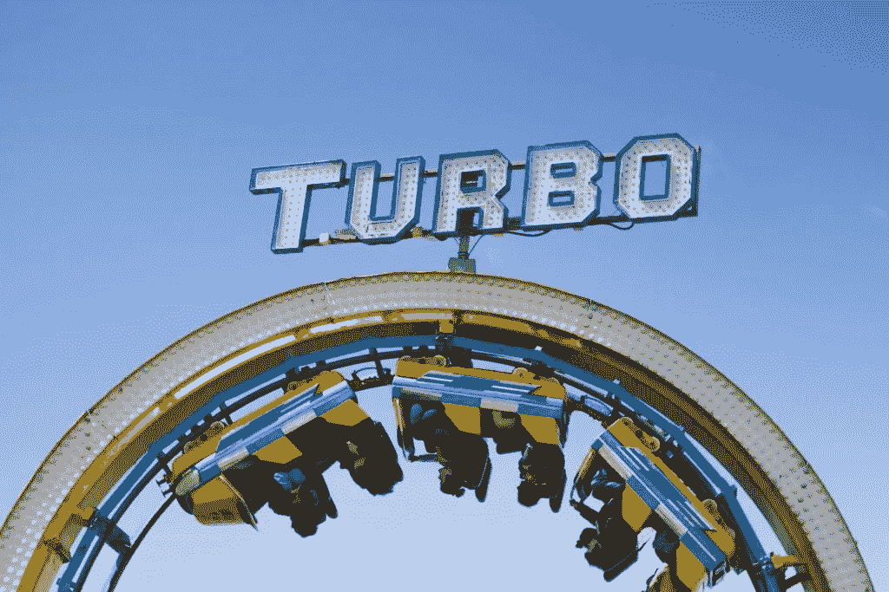
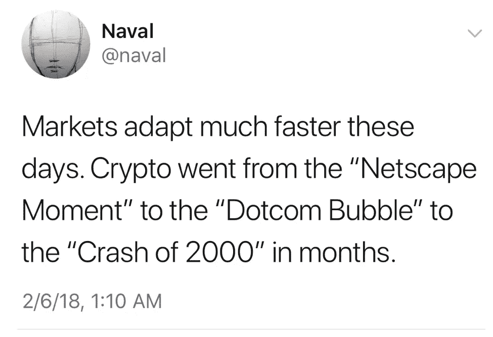

# 炒作周期的压缩

> 原文：<https://medium.com/hackernoon/the-compression-of-the-hype-cycle-6ab8e5a3827b>

我花了很多时间思考炒作周期，跨行业([大数据/人工智能](http://mattturck.com/bigdata2017/)、[物联网](http://mattturck.com/iot2018/))和生态系统([纽约客](http://mattturck.com/the-nyc-tech-ecosystem-catching-up-to-the-hype/))。

无论你使用卡洛塔·佩雷斯的暴涨周期(见[这篇](http://avc.com/2015/02/the-carlota-perez-framework/)伟大的弗雷德·威尔逊邮报)还是[高德纳的版本，炒作周期传达了一个基本思想，即技术市场不会线性发展，而是在被广泛采用之前经历繁荣和萧条的阶段。](https://www.gartner.com/technology/research/methodologies/hype-cycle.jsp)

炒作周期对投资者(和创始人)来说是一个很好的框架，因为在正确的时间进入市场既关键又非常困难。

在其他条件相同的情况下，你会希望在崩盘后投资，在“部署周期”(Perez)或“启蒙斜坡”(Gartner)的早期，那时竞争相对有限，但市场显示出实际采用的早期迹象。当然，说起来容易做起来难，因为这正是事情看起来最不确定的时候。相比之下，在崩盘前投资，事后看来可能很愚蠢，但当时感觉好多了，因为人们得到了很多外部认可(压力、加价)。

最近，炒作周期变得更加难以破译和“时间”正确。它们的速度要快得多，繁荣和萧条之间的时间从几年缩短到仅仅几个月。它们也更明显，有更尖锐的尖峰，感觉就像瞬间的泡沫。一旦一个类别显示出有希望的早期迹象，创立活动就会急剧加速，投资者的资金就会非常迅速地流入。仅仅过了几个月，每一个对这个领域感兴趣的投资者都“下注”了。类别很快变冷，每个人都转向下一个闪亮的物体。偶尔，你会看到一个类别经历一系列的小炒作周期，快速起伏。

如果你想想过去几年是什么让风投(和创始人)感到兴奋，所有的周期都非常短。点播、网贷、食品、消费者物联网、虚拟现实、无人机、机器人、增强现实:它们一度风靡一时。快进到今天，通常很难让这些领域的公司获得融资。深度学习、垂直农业和自动驾驶汽车很可能是下一个目标。

至于目前业界的宠儿 crypto，它似乎已经经历了几次繁荣和萧条(真正的信徒会说，这只是更广泛的炒作周期的一部分)。Naval Ravikant 在最近的这条推文中很好地捕捉到了(加密货币和潜在的区块链生态系统)最新波动的速度:

炒作周期缩短的原因不难理解。我们生活在一个超级互联的世界里，全球各地的每个人都在实时阅读相同的新闻和社交信息。之前的创新浪潮(社交网络、移动)已经消退，投资者急于寻找下一个大事件。这个系统资金充裕，拥有数十亿美元的早期基金和数十亿美元的后期基金，采用“造王者”策略。这在很大程度上与过去几年(如果不是过去几周)非常有利的低利率宏观环境和长牛市周期有关。

从创始人的角度来看，炒作周期的压缩增强了在周期的繁荣阶段尽可能多地筹集资金的诱惑，部分原因是泡沫破裂可能会很快到来。以更高的估值筹集更多的资金肯定会让你面临[后资金陷阱](http://continuations.com/post/111956362215/beware-the-post-money-trap)，但如果你认为这是针对市场快速降温的“保险”，这可能是企业家的理性行为。

从投资者的角度来看，更短的周期压缩了一个人可以“逆势而为”的窗口。一个好的剧本应该包括在太明显之前很早(但不要太早)出现在某个地方；挑选一些早期赢家，与创始人携手合作，在增长和保存现金之间找到恰当的平衡；随着太多快速跟风资金涌入这个领域，降低了新的投资速度；等待不可避免的破产；然后在崩溃后的早期缓慢但果断地重新接合。不容易！

从系统的角度来看，快速的繁荣和萧条可能不是长期技术进步的最佳环境。由于当前许多新兴领域都包含“深度技术”成分，市场发展的速度与真正建立一家伟大公司所需的时间之间存在着严重的不对称。

由[夏洛特·科内比尔](https://unsplash.com/photos/L9VXW4A9QZM?utm_source=unsplash&utm_medium=referral&utm_content=creditCopyText)在 [Unsplash](https://unsplash.com/search/photos/rollercoaster?utm_source=unsplash&utm_medium=referral&utm_content=creditCopyText) 上拍摄的照片